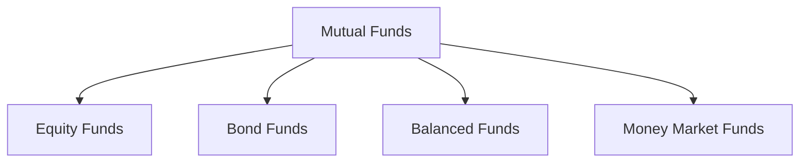

## 17.5 Overview of Mutual Funds

Mutual funds are a cornerstone of modern investment strategies, offering a way for individuals to pool their capital and gain access to a diversified portfolio of assets. This section provides a comprehensive overview of mutual funds, detailing their structure, management, and the variety of options available to investors, particularly within the Canadian context.

### What Are Mutual Funds?

At their core, mutual funds are investment vehicles that aggregate funds from multiple investors to purchase a diversified portfolio of securities. This pooling of resources allows individual investors to benefit from economies of scale, professional management, and diversification, which might otherwise be difficult to achieve independently.

#### Purpose of Mutual Funds

The primary purpose of mutual funds is to provide investors with access to a diversified portfolio, thereby spreading risk across various asset classes. By investing in a mutual fund, individuals can own a small piece of a large portfolio, which may include stocks, bonds, money market instruments, or other securities. This diversification helps mitigate the risk associated with investing in a single security.

### How Mutual Funds Generate Returns

Mutual funds generate returns for their investors through three main avenues:

1. **Dividends**: Mutual funds may earn dividends from the stocks they hold. These dividends are typically distributed to the fund's shareholders, providing a source of income.

2. **Interest**: Funds that invest in bonds or other fixed-income securities earn interest, which is also distributed to investors.

3. **Capital Gains**: When a mutual fund sells securities that have increased in value, it realizes a capital gain. These gains are distributed to investors, usually at the end of the fiscal year.

#### Example: Canadian Dividend Fund

Consider a Canadian dividend fund that invests primarily in high-dividend-paying stocks from companies like RBC or TD Bank. Investors in this fund receive regular dividend payments, which can be reinvested or taken as income, depending on their investment strategy.

### Role of Professional Money Managers

Professional money managers play a crucial role in the operation of mutual funds. These managers are responsible for making investment decisions, selecting securities, and adjusting the portfolio to align with the fund's objectives. Their expertise and experience are vital in navigating market conditions and optimizing returns for investors.

#### Case Study: Active vs. Passive Management

A notable example is the difference between actively managed funds and passively managed index funds. Active managers, such as those at a Canadian equity fund, seek to outperform the market by selecting stocks they believe will perform well. In contrast, passive managers aim to replicate the performance of a specific index, such as the S&P/TSX Composite Index, by holding the same securities in the same proportions.

### Variety of Mutual Funds

Mutual funds come in various types, each designed to meet different investment objectives and risk tolerances. Some common types include:

- **Equity Funds**: Focus on stocks and aim for capital growth.
- **Bond Funds**: Invest in fixed-income securities, providing regular interest income.
- **Balanced Funds**: Combine stocks and bonds to offer a mix of growth and income.
- **Money Market Funds**: Invest in short-term, low-risk securities, suitable for conservative investors.

#### Diagram: Types of Mutual Funds

### Canadian Financial Regulations and Resources

In Canada, mutual funds are regulated by the Canadian Investment Regulatory Organization (CIRO) and provincial securities commissions. These bodies ensure that funds operate transparently and in the best interest of investors.

#### Resources for Further Exploration

- **Investment Funds Institute of Canada (IFIC)**: Provides comprehensive resources and data on mutual funds in Canada. Visit [www.ific.ca](https://www.ific.ca) for more information.
- **Books**: "Winning the Loser's Game" by Charles D. Ellis offers insights into investment strategies and the role of mutual funds.

### Glossary

- **Capital Gains**: The profit realized from the sale of assets or investments.
- **Dividend**: A distribution of a portion of a company's earnings to its shareholders.

### Best Practices and Common Pitfalls

Investors should consider their financial goals, risk tolerance, and investment horizon when selecting mutual funds. It's essential to review the fund's prospectus, understand the fees involved, and assess the track record of the fund manager.

#### Common Challenges

- **Market Volatility**: Mutual fund values can fluctuate with market conditions, impacting returns.
- **Fees and Expenses**: Management fees and other expenses can erode returns over time.

### Conclusion

Mutual funds offer a versatile and accessible way for investors to participate in the financial markets. By understanding their structure, management, and the variety of options available, investors can make informed decisions that align with their financial objectives.

### **Ready to Test Your Knowledge?**

**Practice 10 Essential CSC Exam Questions to Master Your Certification**



### What is the primary purpose of mutual funds?

- [x] To provide investors with access to a diversified portfolio
- [ ] To guarantee high returns
- [ ] To invest solely in government bonds
- [ ] To eliminate all investment risks

> **Explanation:** Mutual funds aim to provide diversification, spreading risk across various asset classes.

### How do mutual funds generate returns?

- [x] Through dividends, interest, and capital gains
- [ ] By issuing new shares
- [ ] By reducing management fees
- [ ] By investing only in real estate

> **Explanation:** Mutual funds earn returns from dividends, interest, and capital gains from their investments.

### Who manages mutual funds?

- [x] Professional money managers
- [ ] Individual investors
- [ ] Government officials
- [ ] Stockbrokers

> **Explanation:** Professional money managers are responsible for making investment decisions and managing the fund's portfolio.

### What type of mutual fund focuses on stocks and aims for capital growth?

- [x] Equity Funds
- [ ] Bond Funds
- [ ] Balanced Funds
- [ ] Money Market Funds

> **Explanation:** Equity funds primarily invest in stocks with the goal of capital appreciation.

### Which regulatory body oversees mutual funds in Canada?

- [x] Canadian Investment Regulatory Organization (CIRO)
- [ ] Federal Reserve
- [ ] European Central Bank
- [ ] World Bank

> **Explanation:** CIRO, along with provincial securities commissions, regulates mutual funds in Canada.

### What is a capital gain?

- [x] The profit realized from the sale of assets or investments
- [ ] A type of mutual fund
- [ ] A fixed-income security
- [ ] A management fee

> **Explanation:** Capital gains are profits from selling assets at a higher price than the purchase price.

### What is a dividend?

- [x] A distribution of a portion of a company's earnings to its shareholders
- [ ] A type of bond
- [ ] An investment strategy
- [ ] A mutual fund fee

> **Explanation:** Dividends are payments made to shareholders from a company's earnings.

### What is the main difference between active and passive fund management?

- [x] Active managers seek to outperform the market, while passive managers replicate an index
- [ ] Active managers invest in bonds, while passive managers invest in stocks
- [ ] Active managers charge no fees, while passive managers do
- [ ] Active managers are government-appointed, while passive managers are not

> **Explanation:** Active managers aim to outperform market indices, whereas passive managers track them.

### What type of mutual fund is suitable for conservative investors seeking low-risk investments?

- [x] Money Market Funds
- [ ] Equity Funds
- [ ] Bond Funds
- [ ] Balanced Funds

> **Explanation:** Money market funds invest in short-term, low-risk securities, making them suitable for conservative investors.

### True or False: Mutual funds can only invest in Canadian securities.

- [ ] True
- [x] False

> **Explanation:** Mutual funds can invest in a wide range of securities, including international assets, depending on their investment mandate.


