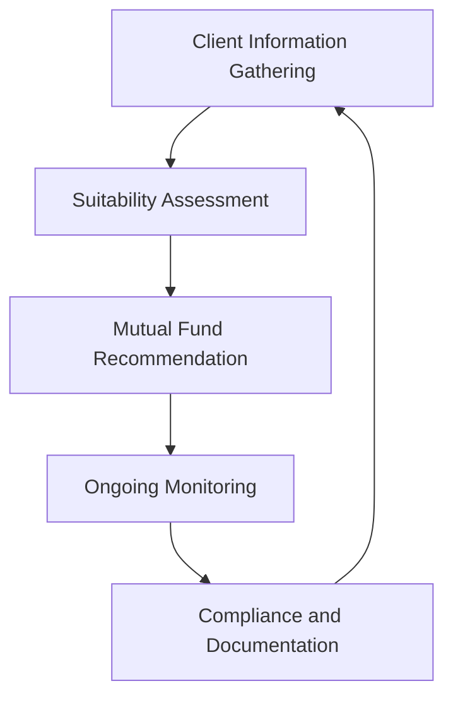

## 17.7.1 Know Your Client Rule and Suitability

In the realm of Canadian financial services, the Know Your Client (KYC) rule and suitability assessment are foundational principles that ensure investors receive advice and products that align with their financial circumstances and goals. This section delves into the intricacies of implementing KYC procedures, assessing suitability, and maintaining compliance, particularly in the context of mutual funds.

### Implementing KYC Procedures

The KYC rule is a regulatory requirement that mandates financial advisors and institutions to gather comprehensive information about their clients. This process is crucial for tailoring investment recommendations that align with the client's unique financial profile.

#### Information Gathering

The first step in the KYC process involves collecting essential client information. This includes:

- **Age:** Understanding the client's age helps in determining the appropriate investment horizon and risk tolerance.
- **Income and Net Worth:** These financial metrics provide insight into the client's ability to invest and bear potential losses.
- **Investment Objectives:** Identifying whether the client aims for capital preservation, income generation, or growth is vital.
- **Risk Tolerance:** Assessing how much risk the client is willing to take is crucial for recommending suitable investment products.
- **Investment Horizon:** Knowing the time frame for the investment helps in selecting appropriate mutual funds.

Additionally, it is important to identify all individuals with a financial interest or trading authority in the client’s account to ensure comprehensive oversight.

#### Suitability Assessment

Once the necessary information is gathered, the next step is to analyze mutual fund options based on the client's investment profile. This involves:

- **Matching Risk Tolerance:** Ensuring that the mutual funds recommended align with the client's risk appetite.
- **Aligning with Financial Goals:** The selected funds should support the client's financial objectives, whether they are short-term or long-term.
- **Avoiding Mismatches:** Refrain from recommending funds that do not fit the client's suitability criteria, as this could lead to financial losses and regulatory issues.

#### Ongoing Monitoring

The KYC process is not a one-time activity but requires regular updates to reflect any changes in the client's circumstances or investment objectives. Key aspects include:

- **Updating Information:** Regularly review and update the client's KYC information, especially after significant life events like a job change or retirement.
- **Reassessing Suitability:** Conduct a fresh suitability assessment whenever there are changes in income, financial status, or risk tolerance.

#### Compliance and Documentation

Maintaining detailed records of all KYC information, suitability assessments, and mutual fund recommendations is crucial for compliance. This involves:

- **Accurate Documentation:** Ensure that all records are precise, up-to-date, and easily accessible for regulatory inspections.
- **Internal Compliance Checks:** Implement checks to verify the accuracy and completeness of KYC data.

### Guidelines for Effective KYC Implementation

To enhance the effectiveness of the KYC process, consider the following guidelines:

- **Standardized Tools:** Use standardized questionnaires and assessment tools to gather and evaluate client information consistently.
- **Client Education:** Educate clients on the importance of providing accurate and complete information to ensure suitable investment recommendations.
- **Internal Audits:** Conduct regular internal audits to ensure compliance with KYC requirements and to identify areas for improvement.

### Practical Example: Case Study of a Canadian Investor

Consider a Canadian investor, Jane, who is 45 years old with a stable income and a moderate risk tolerance. Her primary financial objective is to save for retirement, which she plans to begin in 20 years. Jane's financial advisor gathers her KYC information and recommends a balanced mutual fund that aligns with her risk tolerance and investment horizon.

Over the years, Jane's circumstances change as she receives a significant inheritance, altering her net worth and risk tolerance. Her advisor updates her KYC information and reassesses her suitability, recommending a more aggressive growth fund to capitalize on her increased financial capacity and willingness to take on more risk.

### Visualizing the KYC Process

Below is a diagram illustrating the KYC process flow:

### Glossary

- **Investment Horizon:** The length of time an investor expects to hold an investment before needing to access the funds.
- **Risk Tolerance:** The degree of variability in investment returns that an investor is willing to withstand.
- **Financial Objectives:** The specific financial goals an investor aims to achieve through their investments, such as retirement, education funding, or wealth accumulation.

### Best Practices and Common Challenges

**Best Practices:**

- Regularly update client information to reflect changes in financial status or objectives.
- Use technology to streamline the KYC process and ensure data accuracy.
- Foster open communication with clients to better understand their evolving needs.

**Common Challenges:**

- Keeping up with regulatory changes and ensuring compliance.
- Managing large volumes of client data while maintaining accuracy and confidentiality.
- Educating clients on the importance of accurate information for suitable investment recommendations.

### Conclusion

The Know Your Client rule and suitability assessment are critical components of responsible financial advising in Canada. By implementing robust KYC procedures, financial advisors can ensure that their clients receive investment recommendations that are tailored to their unique financial profiles. This not only enhances client satisfaction but also ensures compliance with regulatory standards.

## Quiz Time!



### What is the primary purpose of the Know Your Client (KYC) rule?

- [x] To gather comprehensive client information for tailored investment recommendations
- [ ] To ensure clients invest in high-risk mutual funds
- [ ] To maximize the financial advisor's commission
- [ ] To limit the client's investment options

> **Explanation:** The KYC rule is designed to collect detailed client information to provide investment recommendations that align with their financial circumstances and goals.

### Which of the following is NOT typically included in the KYC information gathering process?

- [ ] Age
- [ ] Income
- [ ] Investment objectives
- [x] Favorite color

> **Explanation:** The KYC process focuses on financial and personal information relevant to investment decisions, not personal preferences like favorite color.

### What should a financial advisor do if a client's financial circumstances change significantly?

- [x] Update the KYC information and reassess suitability
- [ ] Ignore the changes and continue with the current investment plan
- [ ] Recommend high-risk investments immediately
- [ ] Close the client's account

> **Explanation:** Significant changes in a client's financial circumstances require updating KYC information and reassessing the suitability of current investments.

### Why is ongoing monitoring important in the KYC process?

- [x] To ensure investment recommendations remain suitable over time
- [ ] To increase the number of transactions
- [ ] To reduce the advisor's workload
- [ ] To comply with international regulations

> **Explanation:** Ongoing monitoring ensures that investment recommendations continue to align with the client's evolving financial situation and objectives.

### What is the role of compliance and documentation in the KYC process?

- [x] To maintain accurate records for regulatory inspections
- [ ] To increase paperwork for clients
- [ ] To reduce the advisor's liability
- [ ] To limit client investment choices

> **Explanation:** Compliance and documentation are crucial for maintaining accurate records that can be reviewed during regulatory inspections.

### Which tool can help standardize the KYC process?

- [x] Standardized questionnaires
- [ ] Personal interviews only
- [ ] Randomized surveys
- [ ] Verbal agreements

> **Explanation:** Standardized questionnaires help ensure consistency and completeness in gathering client information.

### What is a common challenge in implementing KYC procedures?

- [x] Managing large volumes of client data
- [ ] Finding clients willing to invest
- [ ] Reducing client investment options
- [ ] Increasing advisor commissions

> **Explanation:** Managing large volumes of client data while ensuring accuracy and confidentiality is a common challenge in the KYC process.

### How can technology assist in the KYC process?

- [x] By streamlining data collection and ensuring accuracy
- [ ] By eliminating the need for client interaction
- [ ] By increasing the complexity of the process
- [ ] By reducing the need for compliance checks

> **Explanation:** Technology can streamline the KYC process, making data collection more efficient and accurate.

### What should be done if a mutual fund recommendation no longer aligns with a client's risk tolerance?

- [x] Reassess the suitability and recommend a more appropriate fund
- [ ] Continue with the current recommendation
- [ ] Close the client's account
- [ ] Ignore the misalignment

> **Explanation:** If a mutual fund no longer aligns with a client's risk tolerance, the advisor should reassess suitability and recommend a more appropriate fund.

### True or False: The KYC process is a one-time requirement.

- [ ] True
- [x] False

> **Explanation:** The KYC process is ongoing and requires regular updates to reflect changes in the client's financial situation and objectives.


