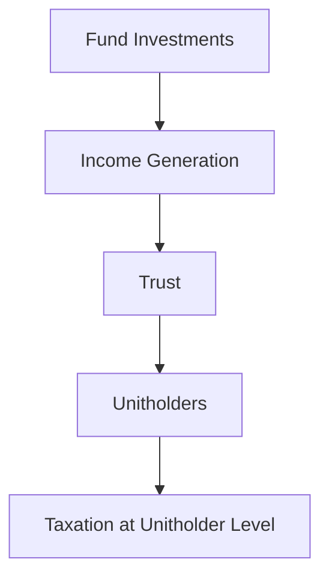

## 17.6 Mutual Fund Structures: Trusts vs. Corporations

Mutual funds in Canada are structured primarily as either unincorporated open-end trusts or corporations. Each structure offers distinct advantages and challenges, particularly in terms of taxation and income distribution. Understanding these differences is crucial for financial professionals and investors seeking to optimize their investment strategies within the Canadian market.

### Unincorporated Open-End Trusts

Unincorporated open-end trusts are a prevalent structure for mutual funds in Canada. This structure allows for the direct flow of income to unitholders, effectively bypassing taxation at the fund level. This tax-efficient mechanism is a significant advantage for investors seeking to maximize their returns.

#### Income Flow and Taxation

In an unincorporated open-end trust, the income generated by the fund's investments is distributed directly to the unitholders. This distribution can include interest, dividends, and capital gains. Since the income is passed through to the unitholders, the trust itself does not pay taxes on this income. Instead, the unitholders are responsible for reporting and paying taxes on their share of the income, according to their individual tax situations.

This structure is particularly beneficial for investors in higher tax brackets, as it allows them to potentially defer taxes or benefit from lower capital gains tax rates. The Income Tax Act (Canada) governs these tax implications, ensuring compliance and providing a framework for distribution.

#### Components of a Trust Deed

The trust deed is a critical document in the structure of an unincorporated open-end trust. It outlines the terms, objectives, and management structure of the trust. Key components include:

- **Investment Objectives:** Clearly defined goals that guide the fund's investment strategy.
- **Investment Policies and Restrictions:** Guidelines and limitations on the types of investments the fund can make.
- **Roles of the Manager, Distributor, and Custodian:** The manager oversees the fund's operations, the distributor handles the sale of units, and the custodian safeguards the fund's assets.

These components ensure that the fund operates within its defined parameters, providing transparency and protection for investors.

### Corporations

Mutual funds structured as corporations offer a different approach to taxation and income distribution. While less common than trusts, corporate mutual funds provide unique benefits, particularly in achieving a virtually tax-free status through dividend distributions.

#### Taxation and Distribution

Corporate mutual funds can distribute dividends equivalent to their net income, effectively reducing their taxable income to zero. This is achieved by paying out dividends to shareholders, who then report and pay taxes on these dividends at their personal tax rates. This structure can be advantageous for investors in lower tax brackets or those seeking dividend income.

Unlike trusts, corporate mutual funds may retain some earnings for reinvestment, potentially leading to capital appreciation. This flexibility can be appealing for investors looking for growth opportunities alongside income.

#### Differences Compared to Trusts

The primary differences between corporate mutual funds and trusts lie in their taxation and distribution mechanisms. While trusts pass income directly to unitholders, corporations distribute dividends, which may be subject to different tax treatments. Additionally, corporations have the ability to retain earnings, offering potential for reinvestment and growth.

### Glossary

- **Unincorporated Open-End Trust:** A mutual fund structure where units are continuously issued and redeemed at Net Asset Value Per Share (NAVPS), and income is passed through to unitholders.
- **Trust Deed:** A legal document that outlines the terms, objectives, and management structure of a trust.

### Practical Examples and Case Studies

To illustrate these concepts, consider the investment strategies of major Canadian banks like RBC and TD. These institutions often offer mutual funds structured as trusts, providing tax-efficient income streams to their clients. By analyzing the asset allocation and distribution policies of these funds, investors can gain insights into optimizing their own portfolios.

For instance, a Canadian pension fund might choose a trust structure to maximize after-tax returns for its beneficiaries. By leveraging the pass-through taxation benefits, the fund can enhance its income distribution strategy, aligning with its long-term investment objectives.

### Diagrams and Visual Aids

To further clarify these structures, consider the following diagram illustrating the flow of income in an unincorporated open-end trust:

This diagram highlights the direct flow of income from the fund's investments to the unitholders, bypassing taxation at the fund level.

### Best Practices and Common Pitfalls

When choosing between a trust and a corporate structure, investors should consider their individual tax situations and investment goals. Trusts offer tax-efficient income distribution, while corporations provide flexibility in earnings retention and dividend distribution.

Common pitfalls include misunderstanding the tax implications of each structure and failing to align the fund's objectives with the investor's financial goals. By carefully evaluating these factors, investors can make informed decisions that enhance their portfolio's performance.

### References and Additional Resources

For further exploration of mutual fund structures and their tax implications, consider the following resources:

- **Income Tax Act (Canada):** [Government of Canada - Income Tax Act](https://laws-lois.justice.gc.ca/eng/acts/I-3.3/)
- **Canadian Securities Administrators (CSA):** [CSA Website](https://www.securities-administrators.ca/)
- **Books and Articles:**
  - "The Canadian Securities Course" by the Canadian Securities Institute
  - "Mutual Funds in Canada: Structure and Regulation" by John Doe

### Conclusion

Understanding the differences between unincorporated open-end trusts and corporations is essential for financial professionals and investors navigating the Canadian mutual fund landscape. By leveraging the unique benefits of each structure, investors can optimize their portfolios, enhance tax efficiency, and achieve their financial objectives.

### **Ready to Test Your Knowledge?**

**Practice 10 Essential CSC Exam Questions to Master Your Certification**



### Which of the following is a key advantage of unincorporated open-end trusts?

- [x] Income flows directly to unitholders, avoiding taxation at the fund level.
- [ ] The fund can retain earnings for reinvestment.
- [ ] Dividends are distributed to shareholders.
- [ ] The fund is structured as a corporation.

> **Explanation:** Unincorporated open-end trusts allow income to flow directly to unitholders, avoiding taxation at the fund level, which is a significant advantage.

### What is the primary document that outlines the terms and objectives of a trust?

- [x] Trust Deed
- [ ] Articles of Incorporation
- [ ] Investment Policy Statement
- [ ] Shareholder Agreement

> **Explanation:** The trust deed is the primary document that outlines the terms, objectives, and management structure of a trust.

### How do corporate mutual funds achieve a virtually tax-free status?

- [x] By distributing dividends equivalent to net income
- [ ] By retaining all earnings
- [ ] By investing solely in tax-exempt securities
- [ ] By being structured as a trust

> **Explanation:** Corporate mutual funds can achieve a virtually tax-free status by distributing dividends equivalent to their net income, reducing taxable income to zero.

### What is a key difference between trusts and corporations in mutual fund structures?

- [x] Trusts pass income directly to unitholders, while corporations distribute dividends.
- [ ] Corporations pass income directly to unitholders, while trusts distribute dividends.
- [ ] Trusts can retain earnings, while corporations cannot.
- [ ] Corporations are always tax-exempt, while trusts are not.

> **Explanation:** Trusts pass income directly to unitholders, while corporations distribute dividends, which is a key difference in their structures.

### Which of the following is NOT a component of a trust deed?

- [ ] Investment Objectives
- [ ] Investment Policies and Restrictions
- [ ] Roles of the Manager, Distributor, and Custodian
- [x] Articles of Incorporation

> **Explanation:** Articles of Incorporation are not a component of a trust deed; they are related to corporate structures.

### What is the role of the custodian in a trust structure?

- [x] To safeguard the fund's assets
- [ ] To manage the fund's investments
- [ ] To distribute dividends to shareholders
- [ ] To outline the investment objectives

> **Explanation:** The custodian's role in a trust structure is to safeguard the fund's assets.

### In which structure are units continuously issued and redeemed at NAVPS?

- [x] Unincorporated Open-End Trust
- [ ] Corporate Mutual Fund
- [ ] Closed-End Fund
- [ ] Exchange-Traded Fund

> **Explanation:** In an unincorporated open-end trust, units are continuously issued and redeemed at Net Asset Value Per Share (NAVPS).

### What is a potential benefit of retaining earnings in a corporate mutual fund?

- [x] Potential for capital appreciation
- [ ] Immediate tax savings for unitholders
- [ ] Guaranteed dividend payments
- [ ] Avoidance of all taxes

> **Explanation:** Retaining earnings in a corporate mutual fund can lead to potential capital appreciation, offering growth opportunities.

### Which Canadian regulation governs the tax implications of mutual fund distributions?

- [x] Income Tax Act (Canada)
- [ ] Securities Act (Canada)
- [ ] Investment Funds Act (Canada)
- [ ] Financial Institutions Act (Canada)

> **Explanation:** The Income Tax Act (Canada) governs the tax implications of mutual fund distributions.

### True or False: Corporate mutual funds can retain some earnings for reinvestment.

- [x] True
- [ ] False

> **Explanation:** True. Corporate mutual funds have the flexibility to retain some earnings for reinvestment, unlike trusts.


