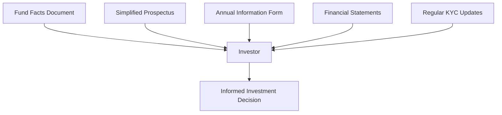

## 17.8 Mutual Fund Documentation and Disclosure

In the realm of Canadian mutual funds, documentation and disclosure are pivotal to ensuring transparency, compliance, and informed decision-making by investors. This section delves into the essential elements of mutual fund documentation, the circumstances necessitating updates to Know Your Client (KYC) information, and best practices for maintaining regulatory compliance.

### Key Components of Mutual Fund Documentation

Mutual fund documentation serves as the cornerstone for investor education and regulatory compliance. The primary documents include the Fund Facts Document, Simplified Prospectus, Annual Information Form (AIF), and Financial Statements. Each plays a unique role in providing investors with the necessary information to make informed investment decisions.

#### Fund Facts Document

The Fund Facts Document is a concise, two-page summary that provides key information about a mutual fund. It is designed to be easily understandable and accessible to investors. The document includes:

- **Investment Objectives:** A clear statement of what the fund aims to achieve.
- **Risk Assessment:** An evaluation of the potential risks associated with the fund.
- **Performance Data:** Historical performance metrics to give investors an idea of past returns.
- **Fees and Expenses:** A breakdown of the costs associated with investing in the fund.

The Fund Facts Document is crucial for initial investor engagement and must be provided to investors before or at the point of sale.

#### Simplified Prospectus

The Simplified Prospectus offers a more detailed overview of the mutual fund than the Fund Facts Document. It includes comprehensive information about the fund's investment strategies, risks, and management. Key elements include:

- **Detailed Investment Strategies:** An in-depth look at how the fund plans to achieve its objectives.
- **Comprehensive Risk Factors:** A thorough analysis of the risks involved.
- **Management and Governance:** Information about the fund's management team and governance structure.

Investors can request the Simplified Prospectus for a deeper understanding of the fund's operations and strategies.

#### Annual Information Form (AIF)

The AIF provides detailed information about the mutual fund's operations, holdings, and management. It is a critical document for investors seeking an in-depth understanding of the fund's structure and performance. The AIF includes:

- **Operational Details:** Insights into the fund's day-to-day operations.
- **Portfolio Holdings:** A detailed list of the fund's investments.
- **Management Information:** Background on the fund's management team and their experience.

#### Financial Statements

Financial Statements offer audited or unaudited financial data about the mutual fund's performance and holdings. They include:

- **Balance Sheet:** A snapshot of the fund's financial position.
- **Income Statement:** Details of the fund's income and expenses.
- **Cash Flow Statement:** Information on the fund's cash inflows and outflows.

These statements are essential for investors to assess the financial health and performance of the fund.

### Circumstances Requiring KYC Updates

Keeping KYC information current is vital for ensuring that investment recommendations remain suitable for the client. Updates are required under several circumstances:

#### Material Changes in Client Circumstances

Significant changes in a client's financial situation, investment goals, or risk tolerance necessitate updating KYC information. Examples include:

- **Change in Employment Status:** Such as a job loss or promotion.
- **Alteration in Financial Goals:** Adjustments in retirement plans or savings objectives.
- **Shift in Risk Appetite:** Changes in the client's willingness to take on investment risk.

#### Regular Reviews

Periodic reviews, typically conducted annually, are essential to ensure the ongoing suitability of mutual fund holdings with client profiles. These reviews help identify any changes in the client's situation that might affect their investment strategy.

#### Event-Driven Updates

Life events such as marriage, divorce, inheritance, or significant changes in income require immediate updates to KYC information. These events can have a substantial impact on a client's financial situation and investment needs.

### Best Practices and Guidelines

To ensure compliance and maintain investor trust, it is crucial to adhere to best practices in mutual fund documentation and disclosure:

- **Clarity and Accessibility:** Ensure all client disclosure documents are provided in a clear, understandable format and comply with regulatory standards.
- **Regular Updates:** Regularly review and update disclosure documents to reflect any changes in mutual fund regulations or fund strategies.
- **Client Education:** Instruct clients on the importance of maintaining up-to-date KYC information to ensure suitable investment recommendations.

### Glossary

- **Fund Facts Document:** A concise document outlining the key features, objectives, and risks of a mutual fund.
- **Simplified Prospectus:** A detailed mutual fund document that provides comprehensive information about the fund, available upon investor request.
- **Annual Information Form (AIF):** A detailed disclosure document providing in-depth information about a mutual fund’s operations, holdings, and management.
- **Probate Period:** The legal process through which a deceased person’s will is validated and their estate is administered.

### Practical Example: Canadian Pension Fund Strategy

Consider a Canadian pension fund that invests in mutual funds as part of its diversified portfolio. The fund manager must ensure that all documentation, including the Fund Facts Document and Simplified Prospectus, is up-to-date and accurately reflects the fund's strategies and risks. Regular KYC updates are conducted to align the pension fund's investment strategy with its long-term objectives and risk tolerance.

### Diagram: Mutual Fund Documentation Flow

Below is a diagram illustrating the flow of mutual fund documentation and disclosure:

### Conclusion

Understanding mutual fund documentation and disclosure is crucial for both investors and financial professionals. By ensuring that all documents are accurate, accessible, and compliant with regulations, and by maintaining up-to-date KYC information, investors can make informed decisions that align with their financial goals.

## Quiz Time!



### Which document provides a concise summary of a mutual fund's key features?

- [x] Fund Facts Document
- [ ] Simplified Prospectus
- [ ] Annual Information Form
- [ ] Financial Statements

> **Explanation:** The Fund Facts Document is a concise, two-page summary that provides key information about a mutual fund.

### What is the purpose of the Simplified Prospectus?

- [x] To provide comprehensive information about the mutual fund
- [ ] To offer a brief summary of the fund's objectives
- [ ] To list the fund's financial statements
- [ ] To update KYC information

> **Explanation:** The Simplified Prospectus offers a detailed overview of the mutual fund, including its investment strategies, risks, and management.

### When should KYC information be updated?

- [x] When there are material changes in client circumstances
- [x] During regular reviews
- [x] After significant life events
- [ ] Only when requested by the client

> **Explanation:** KYC information should be updated when there are material changes in client circumstances, during regular reviews, and after significant life events.

### What does the Annual Information Form (AIF) contain?

- [x] Detailed information about the mutual fund's operations, holdings, and management
- [ ] A summary of the fund's key features
- [ ] A list of the fund's financial statements
- [ ] Only the fund's risk assessment

> **Explanation:** The AIF provides detailed information about the mutual fund's operations, holdings, and management.

### Why is it important to provide disclosure documents in a clear format?

- [x] To ensure investors understand the information
- [x] To comply with regulatory standards
- [ ] To reduce printing costs
- [ ] To limit the amount of information shared

> **Explanation:** Providing disclosure documents in a clear format ensures investors understand the information and complies with regulatory standards.

### What is the primary focus of financial statements in mutual fund documentation?

- [x] To provide audited or unaudited financial data about the fund's performance
- [ ] To summarize the fund's objectives
- [ ] To list the fund's management team
- [ ] To update KYC information

> **Explanation:** Financial statements provide audited or unaudited financial data about the mutual fund's performance and holdings.

### What should be done if a client experiences a significant change in income?

- [x] Update the client's KYC information
- [ ] Provide a new Fund Facts Document
- [ ] Issue a new Simplified Prospectus
- [ ] No action is necessary

> **Explanation:** A significant change in income requires updating the client's KYC information to ensure investment suitability.

### What is the role of regular reviews in KYC updates?

- [x] To ensure ongoing suitability of mutual fund holdings with client profiles
- [ ] To reduce the number of documents provided to clients
- [ ] To increase the fund's performance
- [ ] To limit client interactions

> **Explanation:** Regular reviews ensure the ongoing suitability of mutual fund holdings with client profiles.

### What is included in the Fund Facts Document?

- [x] Investment objectives, risk assessment, performance data, and fees
- [ ] Detailed investment strategies and management information
- [ ] A list of the fund's financial statements
- [ ] Only the fund's risk assessment

> **Explanation:** The Fund Facts Document includes investment objectives, risk assessment, performance data, and fees.

### True or False: The Simplified Prospectus is only available upon investor request.

- [x] True
- [ ] False

> **Explanation:** The Simplified Prospectus is available upon investor request for those seeking more detailed information about the mutual fund.


