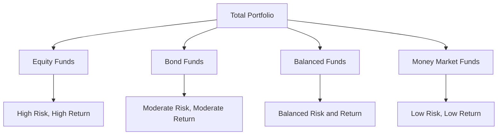

## 18.1.1 Money Market Funds

Money market funds are a cornerstone of conservative investment strategies, particularly valued for their stability and liquidity. In this section, we will delve into the characteristics of money market funds, compare them with other mutual fund types, and explore their strategic uses within Canadian investment portfolios.

### Understanding Money Market Funds

Money market funds are mutual funds that invest in short-term, high-quality debt securities. These securities include Treasury bills, commercial paper, and certificates of deposit. The primary objective of money market funds is to provide investors with a safe place to invest easily accessible cash-equivalent assets while earning a modest return.

#### Key Features of Money Market Funds

1. **Investment Composition:**
   - Money market funds primarily invest in short-term debt instruments. These include:
     - **Treasury Bills (T-Bills):** Government-issued securities with maturities of one year or less.
     - **Commercial Paper:** Short-term, unsecured promissory notes issued by corporations.
     - **Certificates of Deposit (CDs):** Time deposits offered by banks with fixed interest rates and maturity dates.

2. **Risk and Return:**
   - Money market funds are considered the least risky type of mutual fund. This is due to their investment in highly liquid and low-credit-risk securities.
   - Returns are modest, reflecting the low-risk profile. Investors typically receive returns in the form of interest income.

3. **Liquidity:**
   - These funds offer high liquidity, allowing investors to access their funds quickly without significant price fluctuations. This makes them an ideal choice for investors seeking capital preservation and quick access to cash.

4. **Regulatory Requirements:**
   - In Canada, money market funds must maintain a minimum of 95% of their net assets in cash or cash-equivalent securities. This regulatory requirement ensures stability and liquidity, aligning with the fund's conservative investment strategy.

5. **Tax Implications:**
   - Distributions from money market funds are typically taxed as interest income. Investors should consider the tax implications when incorporating these funds into their portfolios.

### Comparing Money Market Funds with Other Mutual Fund Types

To better understand the unique position of money market funds, it is essential to compare them with other mutual fund types:

- **Equity Funds:**
  - **Risk and Return:** Equity funds invest in stocks and are subject to market volatility. They offer higher potential returns but come with increased risk compared to money market funds.
  - **Liquidity:** While generally liquid, equity funds can experience significant price fluctuations, impacting the ease of accessing funds without loss.

- **Bond Funds:**
  - **Risk and Return:** Bond funds invest in fixed-income securities and offer moderate risk and return profiles. They are less volatile than equity funds but more so than money market funds.
  - **Liquidity:** Bond funds are relatively liquid but can be affected by interest rate changes, impacting their value.

- **Balanced Funds:**
  - **Risk and Return:** Balanced funds invest in a mix of equities and fixed-income securities, providing a balanced risk-return profile.
  - **Liquidity:** These funds offer moderate liquidity, with potential fluctuations based on market conditions.

### Strategic Uses of Money Market Funds

Money market funds play a crucial role in investment portfolios, particularly for Canadian investors seeking stability and liquidity. Here are some strategic uses:

1. **Cash Management:**
   - Money market funds are ideal for managing cash reserves, providing a safe and liquid option for holding funds that may be needed in the short term.

2. **Capital Preservation:**
   - Investors looking to preserve capital while earning a modest return can benefit from the low-risk nature of money market funds.

3. **Diversification:**
   - Including money market funds in a diversified portfolio can help reduce overall risk, balancing higher-risk investments like equities.

4. **Emergency Funds:**
   - Due to their liquidity, money market funds are suitable for emergency funds, allowing quick access to cash when needed.

### Practical Example: Canadian Pension Fund Strategy

Consider a Canadian pension fund that aims to maintain liquidity while managing risk. By allocating a portion of its assets to money market funds, the pension fund can ensure it has readily available cash to meet short-term obligations, such as pension payouts, without sacrificing capital preservation.

### Diagram: Asset Allocation in a Diversified Portfolio

Below is a diagram illustrating how money market funds fit into a diversified investment portfolio:

### Best Practices and Common Pitfalls

- **Best Practices:**
  - Educate clients on the role of money market funds in providing liquidity and preserving capital.
  - Regularly review the fund's holdings to ensure compliance with regulatory requirements and alignment with investment goals.

- **Common Pitfalls:**
  - Over-reliance on money market funds can lead to missed opportunities for higher returns available through other investment vehicles.
  - Failing to consider tax implications can impact the net return on investment.

### Encouraging Continuous Learning

To further explore the role of money market funds and other investment strategies, consider the following resources:

- **Books:**
  - "The Intelligent Investor" by Benjamin Graham
  - "Common Sense on Mutual Funds" by John C. Bogle

- **Online Courses:**
  - Canadian Securities Institute (CSI) offers courses on mutual funds and investment strategies.

- **Regulatory Resources:**
  - Canadian Investment Regulatory Organization (CIRO) provides guidelines and updates on mutual fund regulations.

### Conclusion

Money market funds are a valuable tool for investors seeking liquidity and capital preservation. By understanding their features, risks, and strategic uses, investors can make informed decisions that align with their financial goals. As you continue to explore the world of mutual funds, consider how money market funds can enhance your investment strategy, particularly within the Canadian financial landscape.

## Quiz Time!



### Which of the following is a primary characteristic of money market funds?

- [x] They invest in short-term, high-quality debt securities.
- [ ] They focus on long-term growth through equities.
- [ ] They primarily invest in real estate.
- [ ] They are known for high-risk, high-return profiles.

> **Explanation:** Money market funds invest in short-term, high-quality debt securities, making them low-risk investments.

### What is the typical tax treatment for distributions from money market funds?

- [x] Taxed as interest income.
- [ ] Taxed as capital gains.
- [ ] Taxed as dividend income.
- [ ] Tax-free.

> **Explanation:** Distributions from money market funds are typically taxed as interest income.

### How do money market funds compare to equity funds in terms of risk?

- [x] Money market funds are less risky than equity funds.
- [ ] Money market funds are riskier than equity funds.
- [ ] Both have the same level of risk.
- [ ] Money market funds have no risk.

> **Explanation:** Money market funds are less risky than equity funds due to their investment in short-term, high-quality debt securities.

### What is a common use of money market funds in a portfolio?

- [x] Managing cash reserves.
- [ ] Speculating on currency fluctuations.
- [ ] Investing in emerging markets.
- [ ] Hedging against inflation.

> **Explanation:** Money market funds are commonly used for managing cash reserves due to their liquidity and stability.

### What percentage of net assets must Canadian money market funds maintain in cash or cash-equivalent securities?

- [x] 95%
- [ ] 50%
- [ ] 75%
- [ ] 100%

> **Explanation:** Canadian money market funds must maintain at least 95% of their net assets in cash or cash-equivalent securities.

### Which of the following is NOT a typical investment for money market funds?

- [ ] Treasury Bills
- [ ] Commercial Paper
- [ ] Certificates of Deposit
- [x] Corporate Bonds

> **Explanation:** Money market funds typically invest in short-term, high-quality debt securities like Treasury Bills, Commercial Paper, and Certificates of Deposit, not long-term corporate bonds.

### What is the primary goal of money market funds?

- [x] Capital preservation and liquidity.
- [ ] High capital appreciation.
- [ ] Long-term growth.
- [ ] Speculative gains.

> **Explanation:** The primary goal of money market funds is capital preservation and liquidity.

### Which of the following best describes the liquidity of money market funds?

- [x] High liquidity with minimal price fluctuations.
- [ ] Low liquidity with significant price fluctuations.
- [ ] Moderate liquidity with moderate price fluctuations.
- [ ] No liquidity.

> **Explanation:** Money market funds offer high liquidity with minimal price fluctuations, making them ideal for short-term cash management.

### What type of securities do money market funds primarily invest in?

- [x] Short-term, high-quality debt securities.
- [ ] Long-term government bonds.
- [ ] High-yield corporate bonds.
- [ ] Equity securities.

> **Explanation:** Money market funds primarily invest in short-term, high-quality debt securities.

### True or False: Money market funds are suitable for investors seeking high-risk, high-return investments.

- [ ] True
- [x] False

> **Explanation:** Money market funds are not suitable for high-risk, high-return investments; they are designed for low-risk, stable returns.


