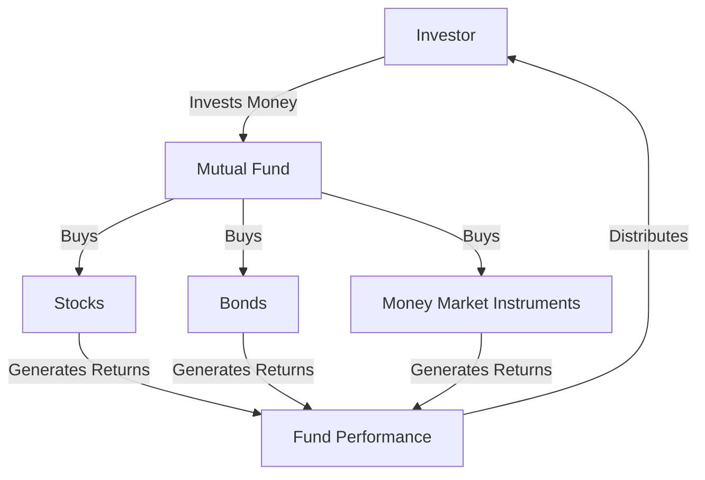

## Overview of Chapter 18

Mutual funds are a cornerstone of modern investment portfolios, offering a versatile and accessible means for individuals to participate in the financial markets. Chapter 18 delves into the intricacies of mutual funds, examining their types, features, and the strategic considerations involved in their management. This overview will guide you through the essential concepts, providing a solid foundation for understanding mutual funds within the Canadian financial landscape.

### Introduction to Mutual Funds

A mutual fund is an investment vehicle that pools money from multiple investors to purchase a diversified portfolio of securities. This collective investment approach allows individual investors to access a broad range of assets, including stocks, bonds, and money market instruments, with the benefits of professional management and economies of scale.

#### Features and Risk Characteristics

Mutual funds come with distinct features and risk profiles, influenced by their investment objectives and asset allocations. Key characteristics include:

- **Diversification:** By investing in a variety of securities, mutual funds reduce the risk associated with individual investments.
- **Liquidity:** Mutual funds offer liquidity, allowing investors to redeem shares at the fund's Net Asset Value (NAV) on any business day.
- **Professional Management:** Fund managers make investment decisions based on research and market analysis, aiming to achieve the fund's objectives.

However, mutual funds also carry risks, such as market risk, interest rate risk, and credit risk, which can impact their performance.

### Types of Mutual Funds

Mutual funds can be categorized based on their investment focus and management style. Common types include:

- **Equity Funds:** Invest primarily in stocks, aiming for capital appreciation.
- **Fixed-Income Funds:** Focus on bonds and other debt instruments, providing regular income.
- **Balanced Funds:** Combine stocks and bonds to balance risk and return.
- **Index Funds:** Track a specific benchmark index, offering low-cost exposure to market segments.
- **Money Market Funds:** Invest in short-term, high-quality debt securities, emphasizing capital preservation and liquidity.

### Mutual Fund Management Styles and Strategies

Mutual fund management can be broadly classified into active and passive strategies:

- **Active Management:** Fund managers actively select securities to outperform a benchmark index. This approach involves research, market timing, and frequent trading.
- **Passive Management:** Also known as indexing, this strategy aims to replicate the performance of a benchmark index, minimizing trading and management costs.

### Key Theories Underpinning Mutual Fund Management

Several financial theories guide mutual fund management, including:

- **Modern Portfolio Theory (MPT):** Proposes that diversification can optimize a portfolio's risk-return profile.
- **Efficient Market Hypothesis (EMH):** Suggests that markets are efficient, and it is difficult to consistently outperform the market through active management.
- **Capital Asset Pricing Model (CAPM):** Describes the relationship between systematic risk and expected return, helping in asset pricing and portfolio selection.

### Making Appropriate Recommendations

When recommending mutual funds, consider factors such as the investor's risk tolerance, investment goals, and time horizon. Key considerations include:

- **Price Calculation:** Mutual fund shares are priced based on their NAV, calculated by dividing the total value of the fund's assets by the number of outstanding shares.
- **Withdrawal Plans:** Systematic withdrawal plans allow investors to receive regular payments from their mutual fund investments, tailored to their financial needs.

### Tax Consequences of Mutual Fund Redemptions

Redeeming mutual fund shares can trigger tax consequences, particularly capital gains tax. In Canada, capital gains are taxed at a lower rate than ordinary income, but investors should be mindful of the timing and amount of redemptions to optimize their tax liabilities.

### Measuring Mutual Fund Performance

Assessing mutual fund performance involves comparing returns against benchmarks and peer groups. Key metrics include:

- **Total Return:** Measures the overall gain or loss of an investment, including dividends and capital gains.
- **Alpha and Beta:** Alpha indicates a fund's performance relative to its benchmark, while beta measures its volatility compared to the market.
- **Sharpe Ratio:** Evaluates risk-adjusted returns, helping investors understand the reward per unit of risk.

### Practical Examples and Case Studies

Consider a Canadian investor evaluating mutual funds offered by major banks like RBC or TD. By analyzing the funds' historical performance, management fees, and alignment with personal financial goals, the investor can make informed decisions. For instance, a risk-averse investor might choose a balanced fund with a strong track record of stable returns, while a growth-oriented investor might opt for an equity fund with higher potential returns.

### Diagrams and Visual Aids

To enhance understanding, let's visualize the mutual fund investment process:

### Best Practices and Common Challenges

- **Best Practices:** Regularly review mutual fund holdings, diversify across asset classes, and consider tax-efficient investment strategies.
- **Common Challenges:** High management fees, underperformance relative to benchmarks, and tax implications of frequent trading.

### Resources for Further Exploration

- **Canadian Securities Administrators (CSA):** [Visit CSA](https://www.securities-administrators.ca/)
- **Book:** *The Bogleheads' Guide to Investing* by Taylor Larimore, Mel Lindauer, and Michael LeBoeuf
- **Online Course:** [Introduction to Portfolio Management](https://www.coursera.org/learn/portfolio-management)

### Conclusion

Understanding mutual funds' types, features, and management strategies is crucial for making informed investment decisions. By considering risk characteristics, tax implications, and performance metrics, investors can align their mutual fund choices with their financial goals. This chapter equips you with the knowledge to navigate the mutual fund landscape effectively, leveraging Canadian financial instruments and regulations.

### **Ready to Test Your Knowledge?**

**Practice 10 Essential CSC Exam Questions to Master Your Certification**



### What is a mutual fund?

- [x] An investment vehicle made up of a pool of funds collected from many investors for investing in securities.
- [ ] A type of savings account with a fixed interest rate.
- [ ] A government bond issued to finance public projects.
- [ ] A private equity fund focused on real estate investments.

> **Explanation:** A mutual fund is an investment vehicle that pools money from multiple investors to invest in a diversified portfolio of securities.

### Which of the following is a feature of mutual funds?

- [x] Diversification
- [ ] Guaranteed returns
- [ ] Fixed interest rates
- [ ] No risk

> **Explanation:** Mutual funds offer diversification by investing in a variety of securities, reducing the risk associated with individual investments.

### What is the primary goal of active management in mutual funds?

- [x] To outperform a benchmark index
- [ ] To replicate the performance of a benchmark index
- [ ] To minimize trading costs
- [ ] To invest only in government bonds

> **Explanation:** Active management involves selecting securities to outperform a benchmark index through research and market analysis.

### What does the Net Asset Value (NAV) represent?

- [x] The value per share of a mutual fund on a specific date or time
- [ ] The total assets of a mutual fund
- [ ] The annual management fee of a mutual fund
- [ ] The dividend yield of a mutual fund

> **Explanation:** NAV is the value per share of a mutual fund, calculated by dividing the total value of the fund's assets by the number of outstanding shares.

### Which theory suggests that markets are efficient and difficult to outperform consistently?

- [x] Efficient Market Hypothesis (EMH)
- [ ] Modern Portfolio Theory (MPT)
- [ ] Capital Asset Pricing Model (CAPM)
- [ ] Behavioral Finance Theory

> **Explanation:** The Efficient Market Hypothesis (EMH) suggests that markets are efficient, making it challenging to consistently outperform them through active management.

### What is a common tax consequence of redeeming mutual fund shares?

- [x] Capital gains tax
- [ ] Sales tax
- [ ] Property tax
- [ ] Income tax

> **Explanation:** Redeeming mutual fund shares can trigger capital gains tax, which is taxed at a lower rate than ordinary income in Canada.

### How is mutual fund performance typically assessed?

- [x] By comparing returns against benchmarks and peer groups
- [ ] By evaluating the fund manager's personal investment history
- [ ] By analyzing the fund's marketing materials
- [ ] By reviewing the fund's annual shareholder meetings

> **Explanation:** Mutual fund performance is assessed by comparing returns against benchmarks and peer groups, using metrics like total return and Sharpe ratio.

### What is the primary focus of money market funds?

- [x] Capital preservation and liquidity
- [ ] Long-term capital appreciation
- [ ] High-risk, high-reward investments
- [ ] Investing in real estate

> **Explanation:** Money market funds focus on capital preservation and liquidity by investing in short-term, high-quality debt securities.

### Which of the following is a benefit of passive management?

- [x] Lower management costs
- [ ] Higher potential returns than active management
- [ ] Guaranteed outperformance of the market
- [ ] Exclusive investment in emerging markets

> **Explanation:** Passive management, or indexing, typically involves lower management costs due to minimal trading and management activities.

### True or False: Mutual funds can only invest in stocks.

- [ ] True
- [x] False

> **Explanation:** Mutual funds can invest in a variety of securities, including stocks, bonds, and money market instruments, depending on their investment objectives.


