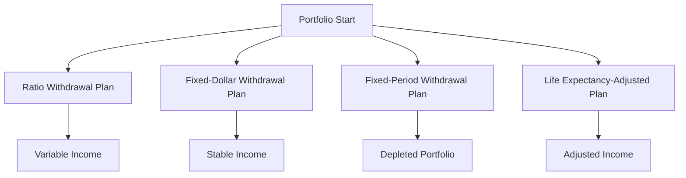

## 18.10.1 Types of Withdrawal Plans

In the realm of mutual fund investments, withdrawal plans play a crucial role in ensuring that investors can access their funds in a manner that aligns with their financial goals and retirement needs. Understanding the different types of withdrawal plans is essential for making informed decisions that balance income needs with the sustainability of the investment portfolio. This section delves into the various withdrawal plan types, highlighting their features, benefits, and potential risks.

### Ratio Withdrawal Plan

**Feature:** The Ratio Withdrawal Plan involves withdrawing a fixed percentage of the portfolio's value each year. Commonly, this percentage ranges from 4% to 10%, depending on the investor's income needs and risk tolerance.

**Benefit:** This plan offers flexibility, as the income amount adjusts in response to the portfolio's performance. During periods of strong market growth, the withdrawal amount increases, potentially providing higher income.

**Risk:** A significant risk associated with this plan is the potential for rapid portfolio depletion, especially during market downturns. High withdrawal rates can exacerbate this risk, leading to a diminished portfolio value over time.

**Example:** Consider a Canadian investor with a $500,000 portfolio who opts for a 5% ratio withdrawal plan. In a year where the portfolio grows to $550,000, the withdrawal amount would be $27,500. However, if the portfolio value drops to $450,000, the withdrawal would decrease to $22,500, reflecting the portfolio's performance.

### Fixed-Dollar Withdrawal Plan

**Feature:** This plan involves withdrawing a specific dollar amount at regular intervals, such as monthly, quarterly, or annually. For instance, an investor might choose to withdraw $10,000 annually.

**Benefit:** The Fixed-Dollar Withdrawal Plan provides predictable and stable income, which is beneficial for budgeting and financial planning. This stability can be particularly advantageous for retirees who rely on consistent income streams.

**Risk:** The primary risk is that fixed withdrawals can significantly deplete the portfolio during periods of low growth or market downturns, potentially reducing future income potential.

**Example:** A retiree with a $400,000 portfolio decides to withdraw $20,000 annually. If the portfolio experiences low growth or losses, the fixed withdrawals could lead to a faster depletion of the investment, impacting long-term financial security.

### Fixed-Period Withdrawal Plan

**Feature:** This plan distributes a set amount of principal over a defined period. For example, an investor might plan to withdraw $100,000 over five years.

**Benefit:** The Fixed-Period Withdrawal Plan ensures that the portfolio is fully exhausted by the end of the planned schedule, aligning with specific financial needs or goals, such as funding a child's education or a planned retirement.

**Risk:** This plan offers limited flexibility to adjust withdrawals based on changing income needs or market conditions, which can be a drawback if circumstances change unexpectedly.

**Example:** An investor with a $200,000 portfolio plans to withdraw $40,000 annually over five years. This structured approach ensures the portfolio is depleted by the end of the period, but it lacks flexibility for unforeseen expenses or changes in financial circumstances.

### Life Expectancy-Adjusted Withdrawal Plan

**Feature:** This plan adjusts withdrawal amounts based on the investor's changing life expectancy, aiming to tailor income to last throughout the investor's lifespan.

**Benefit:** By aligning withdrawals with life expectancy, this plan helps ensure that funds last throughout retirement, providing a sustainable income stream.

**Risk:** The plan requires regular updates and adjustments, which can complicate management and forecasting. It also relies on accurate life expectancy estimates, which can be uncertain.

**Example:** A 65-year-old retiree with a $300,000 portfolio might start with a withdrawal rate based on a 20-year life expectancy. As the retiree ages, the withdrawal rate is adjusted to reflect the updated life expectancy, ensuring the portfolio lasts as long as needed.

### Guidelines for Choosing a Withdrawal Plan

When recommending a withdrawal plan, it's essential to analyze the client's financial goals and income needs. Consider the following guidelines:

- **Assess Financial Goals:** Understand the client's long-term financial objectives, such as retirement income, legacy planning, or funding specific expenses.
- **Evaluate Income Needs:** Determine the client's required income level and how it aligns with their risk tolerance and portfolio performance.
- **Discuss Pros and Cons:** Highlight the advantages and disadvantages of each withdrawal strategy, emphasizing the importance of aligning plans with long-term financial sustainability.
- **Use Visual Aids:** Employ charts and graphs to illustrate how each withdrawal plan affects the portfolio over time, aiding clients in visualizing potential outcomes.

### Visualizing Withdrawal Plans

To better understand the impact of different withdrawal plans, consider the following diagram illustrating the cash flow and portfolio balance over time for each plan type:

### Glossary

- **Ratio Withdrawal Plan:** A withdrawal strategy where a fixed percentage of the portfolio is withdrawn each year.
- **Fixed-Dollar Withdrawal Plan:** A withdrawal strategy where a set dollar amount is withdrawn at regular intervals.
- **Fixed-Period Withdrawal Plan:** A withdrawal strategy that distributes a predetermined amount of principal over a specific period.
- **Life Expectancy-Adjusted Withdrawal Plan:** A withdrawal strategy that adjusts the amounts withdrawn based on the investor’s estimated lifespan.

### Conclusion

Selecting the right withdrawal plan is a critical component of effective financial planning, particularly for retirees and those relying on investment income. By understanding the features, benefits, and risks of each plan type, investors can make informed decisions that align with their financial goals and ensure long-term sustainability. Encouraging clients to consider their unique circumstances and future needs will help them choose the most appropriate withdrawal strategy.

## Quiz Time!



### Which withdrawal plan involves withdrawing a fixed percentage of the portfolio's value each year?

- [x] Ratio Withdrawal Plan
- [ ] Fixed-Dollar Withdrawal Plan
- [ ] Fixed-Period Withdrawal Plan
- [ ] Life Expectancy-Adjusted Withdrawal Plan

> **Explanation:** The Ratio Withdrawal Plan involves withdrawing a fixed percentage of the portfolio's value each year, allowing income to adjust based on portfolio performance.

### What is a primary benefit of the Fixed-Dollar Withdrawal Plan?

- [ ] Flexibility in withdrawal amounts
- [x] Predictable and stable income
- [ ] Adjustments based on life expectancy
- [ ] Ensures portfolio depletion by a set date

> **Explanation:** The Fixed-Dollar Withdrawal Plan provides predictable and stable income, which aids in budgeting and financial planning.

### Which withdrawal plan distributes a set amount of principal over a defined period?

- [ ] Ratio Withdrawal Plan
- [ ] Fixed-Dollar Withdrawal Plan
- [x] Fixed-Period Withdrawal Plan
- [ ] Life Expectancy-Adjusted Withdrawal Plan

> **Explanation:** The Fixed-Period Withdrawal Plan distributes a predetermined amount of principal over a specific period, ensuring the portfolio is exhausted by the end of the schedule.

### What is a key risk associated with the Life Expectancy-Adjusted Withdrawal Plan?

- [ ] Lack of income stability
- [ ] High withdrawal rates
- [x] Requires regular updates and adjustments
- [ ] Limited flexibility

> **Explanation:** The Life Expectancy-Adjusted Withdrawal Plan requires regular updates and adjustments, which can complicate management and forecasting.

### Which withdrawal plan is most suitable for ensuring funds last throughout retirement?

- [ ] Ratio Withdrawal Plan
- [ ] Fixed-Dollar Withdrawal Plan
- [ ] Fixed-Period Withdrawal Plan
- [x] Life Expectancy-Adjusted Withdrawal Plan

> **Explanation:** The Life Expectancy-Adjusted Withdrawal Plan tailors income to the investor's lifespan, helping to ensure funds last throughout retirement.

### What is a potential drawback of the Fixed-Period Withdrawal Plan?

- [ ] High withdrawal rates
- [ ] Requires life expectancy estimates
- [x] Limited flexibility to adjust withdrawals
- [ ] Unpredictable income

> **Explanation:** The Fixed-Period Withdrawal Plan offers limited flexibility to adjust withdrawals based on changing income needs or market conditions.

### How does the Ratio Withdrawal Plan respond to portfolio performance?

- [x] Adjusts income based on portfolio value
- [ ] Provides stable income regardless of performance
- [ ] Ensures portfolio depletion by a set date
- [ ] Adjusts based on life expectancy

> **Explanation:** The Ratio Withdrawal Plan adjusts income based on the portfolio's performance, increasing or decreasing the withdrawal amount accordingly.

### Which withdrawal plan provides the most predictable income stream?

- [ ] Ratio Withdrawal Plan
- [x] Fixed-Dollar Withdrawal Plan
- [ ] Fixed-Period Withdrawal Plan
- [ ] Life Expectancy-Adjusted Withdrawal Plan

> **Explanation:** The Fixed-Dollar Withdrawal Plan provides the most predictable income stream, as it involves withdrawing a set dollar amount at regular intervals.

### What is a common withdrawal percentage range for the Ratio Withdrawal Plan?

- [ ] 1-3%
- [x] 4-10%
- [ ] 11-15%
- [ ] 16-20%

> **Explanation:** The common withdrawal percentage range for the Ratio Withdrawal Plan is 4-10%, depending on the investor's income needs and risk tolerance.

### True or False: The Fixed-Dollar Withdrawal Plan adjusts withdrawal amounts based on the investor's life expectancy.

- [ ] True
- [x] False

> **Explanation:** False. The Fixed-Dollar Withdrawal Plan involves withdrawing a specific dollar amount at regular intervals, without adjustments based on life expectancy.


