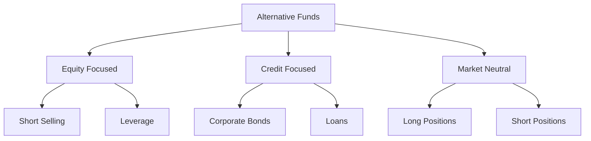

## 18.10 Alternative Funds

Alternative funds have emerged as a dynamic component of the investment landscape, offering strategies that diverge from traditional investment vehicles. These funds employ sophisticated techniques such as short selling, leverage, and derivatives to achieve their investment objectives. In this section, we will delve into the intricacies of alternative funds, explore their subcategories, and discuss the strategies they employ, including speculative and hedging approaches.

### Understanding Alternative Funds

Alternative funds are investment vehicles that utilize non-traditional strategies to generate returns. Unlike conventional mutual funds, which typically invest in stocks, bonds, and cash, alternative funds may engage in short selling, leverage, and derivatives trading. These strategies can offer diversification benefits and the potential for enhanced returns, but they also come with increased risk and complexity.

#### Key Strategies Employed by Alternative Funds

1. **Short Selling:** This involves selling securities that the investor does not currently own, with the intention of buying them back at a lower price. Short selling can be used to profit from declining markets or to hedge against potential losses in a portfolio.

2. **Leverage:** By borrowing funds to increase the size of an investment, leverage can amplify both gains and losses. It allows investors to gain greater exposure to an asset than they could with their own capital alone.

3. **Derivatives:** These financial instruments derive their value from an underlying asset, such as stocks, bonds, or commodities. Derivatives can be used for hedging, speculation, or to gain exposure to specific market segments.

### Subcategories of Alternative Funds

Alternative funds can be categorized based on their primary investment focus and strategy. Here are some common subcategories:

#### 1. Alternative Equity Focused Funds

These funds primarily invest in equities but employ alternative strategies such as short selling and leverage to enhance returns. They may also use derivatives to manage risk or gain exposure to specific sectors.

#### 2. Alternative Credit Focused Funds

These funds focus on credit instruments, including corporate bonds, loans, and structured products. They may use leverage and derivatives to enhance returns or manage interest rate risk.

#### 3. Market Neutral Funds

Market neutral funds aim to eliminate market risk by taking offsetting long and short positions. This strategy seeks to generate returns regardless of market direction, focusing on security selection rather than market movements.

### Speculative vs. Hedging Strategies

Alternative funds can employ both speculative and hedging strategies, each serving different investment objectives:

- **Speculative Strategies:** These aim to generate high returns by taking on significant risk. Speculative strategies may involve aggressive use of leverage, short selling, and derivatives to capitalize on market movements.

- **Hedging Strategies:** These are designed to reduce risk and protect against adverse market conditions. Hedging strategies may involve using derivatives to offset potential losses in a portfolio or to stabilize returns.

### Practical Examples and Case Studies

To illustrate the application of alternative fund strategies, consider the following examples:

#### Example 1: Canadian Pension Fund

A Canadian pension fund may use alternative equity focused funds to enhance returns while maintaining a diversified portfolio. By employing short selling and leverage, the fund can capitalize on market inefficiencies and generate alpha.

#### Example 2: Major Canadian Bank

A major Canadian bank, such as RBC or TD, might utilize market neutral funds to manage risk in its proprietary trading operations. By taking offsetting long and short positions, the bank can reduce exposure to market volatility while focusing on security selection.

### Best Practices and Common Pitfalls

When investing in alternative funds, consider the following best practices and potential challenges:

- **Due Diligence:** Conduct thorough research on the fund's strategies, management team, and historical performance. Understand the risks associated with leverage and derivatives.

- **Risk Management:** Be aware of the increased risk and complexity associated with alternative funds. Ensure that the fund's strategies align with your risk tolerance and investment objectives.

- **Regulatory Compliance:** Familiarize yourself with Canadian regulations governing alternative funds, including disclosure requirements and investor protections.

### Resources for Further Exploration

To deepen your understanding of alternative funds, consider exploring the following resources:

- Article: [What Are Alternative Funds?](https://www.investopedia.com/terms/a/alternativefund.asp)
- Book: *Alternative Investments: CAIA Level I* by Donald R. Chambers

### Glossary

- **Short Selling:** Selling securities not currently owned, with the hope of buying them back at a lower price.
- **Market Neutral:** Investment strategies designed to eliminate some form of market risk by taking offsetting positions.

### Conclusion

Alternative funds offer a diverse range of strategies that can enhance portfolio returns and provide diversification benefits. By understanding the various subcategories and strategies employed by these funds, investors can make informed decisions that align with their financial goals and risk tolerance. As the investment landscape continues to evolve, alternative funds will remain a valuable tool for sophisticated investors seeking to navigate complex markets.

### **Ready to Test Your Knowledge?**

**Practice 10 Essential CSC Exam Questions to Master Your Certification**



### What is a primary characteristic of alternative funds?

- [x] They employ non-traditional investment strategies.
- [ ] They only invest in government bonds.
- [ ] They are exclusively for retail investors.
- [ ] They guarantee returns.

> **Explanation:** Alternative funds use non-traditional strategies like short selling and leverage, unlike conventional funds.

### Which strategy involves selling securities not currently owned?

- [x] Short Selling
- [ ] Leverage
- [ ] Derivatives
- [ ] Long Position

> **Explanation:** Short selling involves selling securities not owned, intending to repurchase them at a lower price.

### What is a market neutral strategy designed to do?

- [x] Eliminate market risk by taking offsetting positions.
- [ ] Maximize exposure to market trends.
- [ ] Focus solely on equity investments.
- [ ] Guarantee positive returns.

> **Explanation:** Market neutral strategies aim to eliminate market risk by balancing long and short positions.

### Which type of fund primarily invests in credit instruments?

- [ ] Alternative Equity Focused
- [x] Alternative Credit Focused
- [ ] Market Neutral
- [ ] Hedge Fund

> **Explanation:** Alternative credit focused funds invest in credit instruments like bonds and loans.

### What is a speculative strategy's primary goal?

- [x] Generate high returns by taking on significant risk.
- [ ] Minimize risk and stabilize returns.
- [ ] Focus on long-term growth.
- [ ] Preserve capital.

> **Explanation:** Speculative strategies aim for high returns by accepting higher risk levels.

### Which Canadian financial institution might use market neutral funds for risk management?

- [x] RBC
- [ ] Canadian Tire
- [ ] Loblaws
- [ ] Air Canada

> **Explanation:** Major banks like RBC might use market neutral funds to manage trading risks.

### What should investors conduct before investing in alternative funds?

- [x] Due Diligence
- [ ] Impulse Buying
- [ ] Emotional Decision Making
- [ ] Blind Trust

> **Explanation:** Due diligence involves researching the fund's strategies, management, and performance.

### What is a key risk associated with alternative funds?

- [x] Increased complexity and risk
- [ ] Guaranteed losses
- [ ] Lack of diversification
- [ ] No regulatory oversight

> **Explanation:** Alternative funds often involve complex strategies that carry higher risks.

### Which resource can provide further insights into alternative funds?

- [x] *Alternative Investments: CAIA Level I* by Donald R. Chambers
- [ ] A cookbook
- [ ] A travel guide
- [ ] A novel

> **Explanation:** The book by Donald R. Chambers offers in-depth insights into alternative investments.

### True or False: Alternative funds are only suitable for beginner investors.

- [ ] True
- [x] False

> **Explanation:** Alternative funds are generally more suitable for sophisticated investors due to their complexity and risk.


