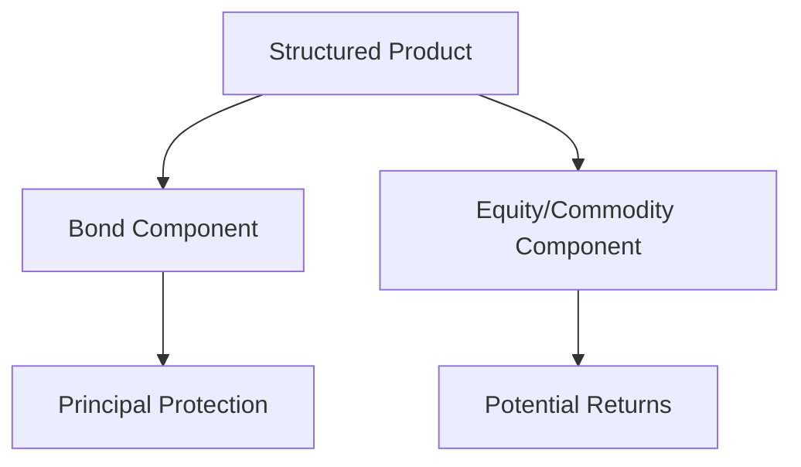

## 18.12 Structured Products

Structured products are sophisticated financial instruments designed to meet specific investment objectives by combining traditional securities with derivatives. These products are integral to the mutual fund framework and offer unique benefits and risks, making them a compelling option for certain investors. This section delves into the structure, benefits, risks, and regulatory framework of structured products, providing a comprehensive understanding for finance professionals and students.

### Understanding Structured Products

#### Definition

Structured products are pre-packaged investment strategies that blend traditional securities, such as bonds, with derivatives to achieve specific investment goals. These products are engineered to provide tailored risk-return profiles, offering investors a way to access customized investment solutions that may not be available through conventional investment vehicles.

#### Components

Structured products typically consist of two main components:

1. **Bond Component:** This part of the structured product is designed to provide principal protection. By investing in high-quality bonds, the product ensures that a portion of the investor's capital is safeguarded, even if the market experiences downturns.

2. **Equity or Commodity Component:** This component is linked to the performance of equities, commodities, or other assets. It offers the potential for enhanced returns, leveraging the power of derivatives to amplify gains based on the performance of the underlying assets.

### Benefits of Structured Products

Structured products offer several advantages that make them attractive to certain investors:

#### Tailored Risk-Return Profiles

One of the primary benefits of structured products is their ability to be customized to meet specific investor needs. Whether an investor is seeking downside protection, enhanced income opportunities, or exposure to a particular asset class, structured products can be designed to align with these objectives.

#### Downside Protection

Many structured products offer a level of principal protection, ensuring that the investor's initial capital is preserved up to a certain point. This feature reduces the investment risk, making structured products appealing to risk-averse investors.

#### Enhanced Yield Opportunities

Structured products can provide the potential for higher returns through leveraged or derivative-based strategies. By linking returns to the performance of equities, commodities, or other assets, these products can offer attractive yield opportunities compared to traditional investments.

### Risks of Structured Products

Despite their benefits, structured products also come with inherent risks that investors must consider:

#### Complexity

The use of derivatives and leverage in structured products can make them difficult to understand. Investors need to have a solid grasp of the underlying mechanics to fully appreciate the potential outcomes and risks associated with these products.

#### Limited Liquidity

Structured products may have restricted trading windows or limited secondary market activity, making them harder to sell before maturity. This lack of liquidity can pose challenges for investors who may need to access their funds unexpectedly.

#### Higher Fees

The derivative components of structured products often come with additional costs, which can erode returns. Investors should be aware of these fees and consider their impact on the overall investment performance.

#### Counterparty Risk

Structured products often involve agreements with financial institutions, making them dependent on the issuer's creditworthiness. If the issuer faces financial difficulties, the investor may be exposed to counterparty risk.

### Regulatory Framework

Structured products must adhere to a stringent regulatory framework to ensure investor protection and market integrity:

#### Compliance

Structured products are subject to securities regulations, including disclosure requirements and suitability standards. These regulations are designed to ensure that investors receive adequate information and that the products are appropriate for their financial goals and risk tolerance.

#### Disclosure

Clear and comprehensive disclosure is mandatory for structured products. This includes a detailed explanation of the product's structure, underlying assets, risks, and fees. Investors must be fully informed to make educated investment decisions.

#### Registration

Structured products must be registered with the appropriate provincial securities commissions in Canada. This registration process ensures that the products meet regulatory standards and are suitable for distribution to the public.

### Guidelines for Financial Professionals

To effectively manage structured products, financial professionals should adhere to the following guidelines:

- **Ensure Comprehensive Disclosure:** Provide clients with clear and detailed information about the complexities and risks associated with structured products.
- **Conduct Thorough Suitability Assessments:** Evaluate whether structured products align with the client's financial goals and risk tolerance before recommending them.
- **Stay Informed About Regulatory Changes:** Keep abreast of any changes in regulations and industry standards related to structured products to ensure compliance and best practices.

### Glossary

- **Structured Product:** An investment instrument that combines traditional securities with derivatives to achieve specific investment outcomes.
- **Derivative:** A financial contract whose value is based on the performance of an underlying asset, such as options, futures, or swaps.
- **Principal Protection:** A feature that ensures the return of the initial investment amount, regardless of the performance of the underlying assets.

### Practical Example: Canadian Pension Fund Strategy

Consider a Canadian pension fund looking to enhance its portfolio's yield while maintaining a conservative risk profile. The fund could invest in a structured product that combines a bond component for principal protection with an equity-linked component tied to the performance of the S&P/TSX Composite Index. This strategy allows the fund to benefit from potential equity market gains while safeguarding its capital.

### Diagram: Structured Product Components

Below is a diagram illustrating the components of a structured product:

### Conclusion

Structured products offer a unique blend of traditional securities and derivatives, providing tailored investment solutions for specific investor needs. While they present opportunities for enhanced returns and downside protection, they also come with complexities and risks that require careful consideration. By understanding the structure, benefits, risks, and regulatory framework of structured products, investors and financial professionals can make informed decisions and effectively incorporate these instruments into their investment strategies.

## Quiz Time!



### What are structured products?

- [x] Pre-packaged investment strategies combining traditional securities with derivatives
- [ ] Investment funds solely composed of equities
- [ ] Bonds issued by government institutions
- [ ] Mutual funds with fixed interest rates

> **Explanation:** Structured products are pre-packaged investment strategies that combine traditional securities with derivatives to achieve specific investment objectives.

### Which component of a structured product provides principal protection?

- [x] Bond Component
- [ ] Equity Component
- [ ] Commodity Component
- [ ] Derivative Component

> **Explanation:** The bond component of a structured product is designed to provide principal protection.

### What is a primary benefit of structured products?

- [x] Tailored risk-return profiles
- [ ] Guaranteed high returns
- [ ] No associated fees
- [ ] Unlimited liquidity

> **Explanation:** Structured products offer tailored risk-return profiles, allowing them to be customized to meet specific investor needs.

### What is a risk associated with structured products?

- [x] Complexity
- [ ] Guaranteed losses
- [ ] No regulatory oversight
- [ ] Fixed returns

> **Explanation:** The complexity of structured products, due to the use of derivatives and leverage, is a significant risk.

### What is required for structured products under Canadian regulations?

- [x] Registration with provincial securities commissions
- [ ] No disclosure requirements
- [ ] Guaranteed returns
- [ ] Unlimited trading windows

> **Explanation:** Structured products must be registered with the appropriate provincial securities commissions in Canada.

### What is a derivative?

- [x] A financial contract whose value is based on an underlying asset
- [ ] A type of bond
- [ ] A mutual fund with fixed interest rates
- [ ] A government security

> **Explanation:** A derivative is a financial contract whose value is based on the performance of an underlying asset, such as options, futures, or swaps.

### What is a potential downside of structured products?

- [x] Limited liquidity
- [ ] No associated fees
- [ ] Guaranteed high returns
- [ ] Unlimited trading windows

> **Explanation:** Structured products may have limited liquidity, making them harder to sell before maturity.

### What should financial professionals do before recommending structured products?

- [x] Conduct thorough suitability assessments
- [ ] Guarantee returns to clients
- [ ] Avoid discussing risks
- [ ] Ensure no fees are involved

> **Explanation:** Financial professionals should conduct thorough suitability assessments to determine if structured products align with the client’s financial goals and risk tolerance.

### What does principal protection ensure?

- [x] Return of the initial investment amount
- [ ] Guaranteed high returns
- [ ] No associated risks
- [ ] Unlimited liquidity

> **Explanation:** Principal protection ensures the return of the initial investment amount, regardless of the performance of the underlying assets.

### True or False: Structured products are always easy to understand.

- [ ] True
- [x] False

> **Explanation:** Structured products can be complex due to the use of derivatives and leverage, making them difficult to understand.


