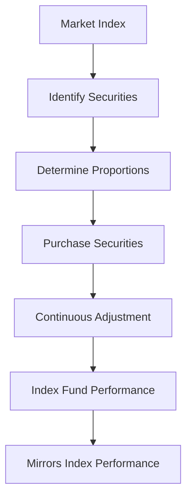

## 18.11 Index Funds

Index funds have become a cornerstone of modern investment strategies, offering a straightforward and cost-effective way to participate in the financial markets. This section delves into the mechanics, benefits, and practical applications of index funds, particularly within the Canadian financial landscape.

### Understanding Index Funds

**Definition and Objective**

An index fund is a type of mutual fund designed to replicate the performance of a specific market index. The primary objective of an index fund is to mirror the returns of the index it tracks, such as the S&P/TSX Composite Index or the FTSE Canada Universe Bond Index. By doing so, index funds provide investors with broad market exposure, diversification, and the potential for long-term growth.

### How Index Funds Achieve Replication

Index funds achieve replication by purchasing securities in the same proportions as the underlying index. This process involves:

1. **Selection of Securities**: The fund manager identifies the securities that comprise the index.
2. **Proportional Investment**: The fund invests in these securities in the same weightings as they appear in the index.
3. **Continuous Adjustment**: As the index composition changes due to market fluctuations or rebalancing, the fund adjusts its holdings to maintain alignment.

#### Example: Replicating the S&P/TSX Composite Index

Consider a hypothetical index fund aiming to replicate the S&P/TSX Composite Index, which includes a diverse range of Canadian equities. The fund would invest in each company within the index, such as Royal Bank of Canada (RBC) and Toronto-Dominion Bank (TD), in the same proportion as their market capitalization within the index. This ensures that the fund's performance closely tracks the index.

### Benefits of Index Funds

Index funds offer several advantages that make them appealing to a wide range of investors:

1. **Low Management Fees**: Due to their passive investment strategy, index funds typically have lower management fees compared to actively managed funds. This cost efficiency can significantly enhance net returns over time.

2. **Diversification**: By investing in a broad array of securities, index funds provide diversification, reducing the risk associated with individual stock volatility.

3. **Simplicity and Transparency**: Index funds offer a straightforward investment approach, with clear objectives and transparent holdings.

4. **Consistent Performance**: While not guaranteed, index funds often deliver consistent performance that closely matches the index, providing a reliable benchmark for investors.

### Practical Financial Examples

#### Case Study: Canadian Pension Funds

Canadian pension funds, such as the Canada Pension Plan Investment Board (CPPIB), often utilize index funds as part of their investment strategy to achieve broad market exposure and cost efficiency. By incorporating index funds, these institutions can manage large portfolios with reduced risk and administrative overhead.

#### Real-World Scenario: Individual Investor

Consider an individual investor looking to build a retirement portfolio. By allocating a portion of their Registered Retirement Savings Plan (RRSP) to an index fund tracking the FTSE Canada Universe Bond Index, they can gain exposure to a diversified set of Canadian bonds, balancing their equity investments and enhancing portfolio stability.

### Challenges and Considerations

While index funds offer numerous benefits, investors should be aware of potential challenges:

- **Tracking Error**: The difference between the fund's performance and the index it tracks, known as tracking error, can occur due to fees, taxes, and other factors.
- **Market Risk**: Index funds are subject to market risk, meaning they will rise and fall with the overall market.
- **Limited Flexibility**: Unlike actively managed funds, index funds do not have the flexibility to adjust holdings based on market conditions or economic forecasts.

### Best Practices for Investing in Index Funds

1. **Understand the Index**: Before investing, ensure you understand the index the fund tracks, including its composition and historical performance.
2. **Consider Costs**: Evaluate the fund's expense ratio and any additional fees that may impact returns.
3. **Diversify Across Indices**: To further mitigate risk, consider diversifying investments across multiple index funds covering different asset classes and geographic regions.

### Visualizing Index Fund Replication

Below is a simplified diagram illustrating how an index fund replicates a market index:

### Glossary

- **Index Fund**: A mutual fund designed to replicate the performance of a specific index.
- **NAVPS**: Net Asset Value per Share, representing the per-share value of a mutual fund.

### Resources for Further Exploration

- **Article**: [Understanding Index Funds](https://www.investopedia.com/terms/i/indexfund.asp)
- **Online Tool**: [Morningstar Index Fund Screener](https://www.morningstar.ca/ca/screener/index.aspx)

### Encouragement for Application

Investors are encouraged to explore index funds as a component of their investment strategy, leveraging their benefits for long-term financial growth. By understanding the principles and practices outlined in this section, you can make informed decisions that align with your financial goals and risk tolerance.

### **Ready to Test Your Knowledge?**

**Practice 10 Essential CSC Exam Questions to Master Your Certification**



### What is the primary objective of an index fund?

- [x] To replicate the performance of a specific market index
- [ ] To outperform the market through active management
- [ ] To invest exclusively in Canadian equities
- [ ] To minimize tax liabilities

> **Explanation:** The primary objective of an index fund is to replicate the performance of a specific market index, providing investors with broad market exposure.

### How do index funds achieve replication?

- [x] By purchasing securities in the same proportions as the index
- [ ] By selecting high-performing stocks within the index
- [ ] By actively trading securities to maximize returns
- [ ] By investing in a single asset class

> **Explanation:** Index funds achieve replication by purchasing securities in the same proportions as the index, ensuring their performance closely tracks the index.

### What is a common benefit of index funds?

- [x] Low management fees
- [ ] High volatility
- [ ] Limited diversification
- [ ] Frequent trading

> **Explanation:** Index funds typically have low management fees due to their passive investment strategy, which enhances net returns over time.

### Which index might a Canadian index fund track?

- [x] S&P/TSX Composite Index
- [ ] Dow Jones Industrial Average
- [ ] Nikkei 225
- [ ] FTSE 100

> **Explanation:** A Canadian index fund might track the S&P/TSX Composite Index, which includes a diverse range of Canadian equities.

### What is tracking error?

- [x] The difference between the fund's performance and the index it tracks
- [ ] The error in calculating the fund's NAVPS
- [ ] The deviation from the fund's investment strategy
- [ ] The discrepancy in the fund's asset allocation

> **Explanation:** Tracking error is the difference between the fund's performance and the index it tracks, which can occur due to fees, taxes, and other factors.

### What is NAVPS?

- [x] Net Asset Value per Share
- [ ] Net Annual Value per Share
- [ ] Net Asset Volume per Share
- [ ] Net Average Value per Share

> **Explanation:** NAVPS stands for Net Asset Value per Share, representing the per-share value of a mutual fund.

### Which of the following is a challenge associated with index funds?

- [x] Market risk
- [ ] High management fees
- [ ] Lack of diversification
- [ ] Frequent trading

> **Explanation:** Index funds are subject to market risk, meaning they will rise and fall with the overall market.

### What should investors consider when investing in index funds?

- [x] The fund's expense ratio
- [ ] The fund's ability to outperform the market
- [ ] The fund's trading volume
- [ ] The fund's historical dividend yield

> **Explanation:** Investors should consider the fund's expense ratio, as it impacts net returns.

### Why might an individual investor choose an index fund?

- [x] For broad market exposure and diversification
- [ ] For high-frequency trading opportunities
- [ ] For guaranteed returns
- [ ] For exclusive access to private equity

> **Explanation:** An individual investor might choose an index fund for broad market exposure and diversification, reducing the risk associated with individual stock volatility.

### True or False: Index funds are actively managed to outperform the market.

- [ ] True
- [x] False

> **Explanation:** False. Index funds are passively managed to replicate the performance of a specific market index, not to outperform the market.


