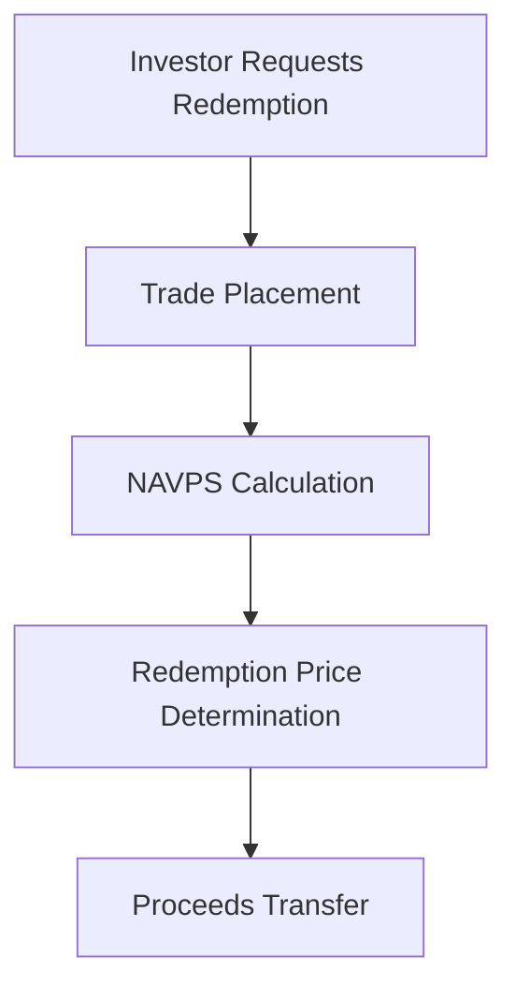

## 18.14 Redemption of Mutual Fund Units or Shares

Mutual funds offer investors a convenient way to participate in a diversified portfolio of assets. One of the fundamental features of mutual funds is the right of redemption, which allows investors to sell their shares back to the fund. This section will delve into the process of redeeming mutual fund units or shares, the steps involved, and the key concepts that underpin this essential feature.

### Understanding the Right of Redemption

The right of redemption is a cornerstone of mutual fund investing. It provides investors with the flexibility to liquidate their holdings and access their capital when needed. This feature distinguishes mutual funds from other investment vehicles, such as stocks, where the sale depends on market conditions and the presence of a willing buyer.

### The Redemption Process

Redeeming mutual fund units or shares involves several key steps, each crucial to ensuring a smooth transaction. Let's explore these steps in detail:

#### 1. Client Request

The redemption process begins with the investor's decision to sell their mutual fund shares. This decision can be influenced by various factors, such as changes in financial goals, market conditions, or the need for liquidity. The investor must communicate their intention to redeem shares to their financial advisor or directly to the mutual fund company.

#### 2. Trade Placement

Once the redemption request is received, the next step is trade placement. The financial advisor or mutual fund company will initiate the sale of the specified number of shares. This step involves verifying the investor's account details and ensuring that the request complies with any applicable fund policies or restrictions.

#### 3. NAVPS Calculation

The Net Asset Value Per Share (NAVPS) is a critical component in determining the redemption price. The NAVPS is calculated at the end of each trading day by dividing the total value of the fund's assets, minus liabilities, by the number of outstanding shares. The redemption price is typically the NAVPS at the close of the business day on which the redemption request is processed.

#### 4. Proceeds Transfer

After the redemption price is determined, the proceeds from the sale are transferred to the investor. This transfer can be made via electronic funds transfer (EFT) to the investor's bank account or by issuing a cheque. The time frame for receiving the proceeds can vary depending on the mutual fund company's policies and the method of transfer chosen.

### Key Concepts and Glossary

Understanding the terminology associated with mutual fund redemptions is essential for investors. Here are some key terms:

- **Redemption Price:** The price at which a mutual fund repurchases shares from an investor, typically based on the NAVPS.
- **Instantaneous Redemption:** Immediate buyback of mutual fund shares upon investor request, subject to fund policies and market conditions.

### Practical Example: Redemption in Action

Consider an investor, Jane, who holds units in a Canadian equity mutual fund managed by RBC. Jane decides to redeem her shares to finance a new home purchase. She contacts her financial advisor on a Monday morning to initiate the redemption process. The advisor places the trade, and the NAVPS is calculated at the close of business on Monday. By Wednesday, the proceeds are transferred to Jane's bank account via EFT, allowing her to proceed with her home purchase.

### Best Practices and Common Pitfalls

When redeeming mutual fund shares, investors should consider the following best practices:

- **Timing:** Be aware of the cut-off times for redemption requests to ensure the desired NAVPS is applied.
- **Tax Implications:** Understand the tax consequences of redeeming mutual fund shares, particularly in registered accounts like RRSPs and TFSAs.
- **Fund Policies:** Review the mutual fund's prospectus for any redemption fees or restrictions that may apply.

Common pitfalls include failing to account for potential market fluctuations that could affect the NAVPS and overlooking the impact of redemption on long-term investment goals.

### Resources for Further Exploration

For those interested in learning more about mutual fund redemptions, consider the following resources:

- Article: [How to Redeem Mutual Fund Shares](https://www.investopedia.com/articles/mutualfund/08/redemption.asp)
- Book: *The Mutual Fund Book* by Joseph H. Thompson and David M. Katz

These resources provide additional insights into the mechanics of mutual fund redemptions and offer strategies for optimizing investment outcomes.

### Conclusion

The redemption of mutual fund units or shares is a fundamental process that provides investors with liquidity and flexibility. By understanding the steps involved and the key concepts, investors can make informed decisions that align with their financial goals. As you continue to explore the world of mutual funds, consider how the right of redemption can be leveraged to enhance your investment strategy.

### **Ready to Test Your Knowledge?**

**Practice 10 Essential CSC Exam Questions to Master Your Certification**



### What is the first step in the mutual fund redemption process?

- [x] Client request
- [ ] NAVPS calculation
- [ ] Trade placement
- [ ] Proceeds transfer

> **Explanation:** The redemption process begins with the investor's decision to sell their mutual fund shares, known as the client request.

### What does NAVPS stand for?

- [x] Net Asset Value Per Share
- [ ] Net Annual Value Per Share
- [ ] New Asset Value Per Share
- [ ] Nominal Asset Value Per Share

> **Explanation:** NAVPS stands for Net Asset Value Per Share, which is crucial in determining the redemption price.

### Which of the following is a key feature of mutual funds?

- [x] Right of redemption
- [ ] Fixed interest rate
- [ ] Guaranteed returns
- [ ] No management fees

> **Explanation:** The right of redemption is a fundamental feature of mutual funds, allowing investors to sell their shares back to the fund.

### What is the redemption price based on?

- [x] NAVPS
- [ ] Market price
- [ ] Purchase price
- [ ] Dividend yield

> **Explanation:** The redemption price is typically based on the Net Asset Value Per Share (NAVPS) at the close of the business day on which the redemption request is processed.

### What is the purpose of trade placement in the redemption process?

- [x] To initiate the sale of the specified number of shares
- [ ] To calculate the NAVPS
- [ ] To transfer proceeds to the investor
- [ ] To determine the redemption price

> **Explanation:** Trade placement involves initiating the sale of the specified number of shares after receiving the redemption request.

### Which of the following is a common pitfall when redeeming mutual fund shares?

- [x] Overlooking the impact of redemption on long-term investment goals
- [ ] Understanding tax implications
- [ ] Reviewing fund policies
- [ ] Timing the redemption request

> **Explanation:** A common pitfall is overlooking how redemption can affect long-term investment goals.

### What is the typical time frame for receiving proceeds after a redemption request?

- [x] It varies depending on the mutual fund company's policies
- [ ] Always within 24 hours
- [ ] Always within 48 hours
- [ ] Always within 72 hours

> **Explanation:** The time frame for receiving proceeds can vary depending on the mutual fund company's policies and the method of transfer chosen.

### What should investors consider regarding tax implications when redeeming mutual fund shares?

- [x] The tax consequences, particularly in registered accounts like RRSPs and TFSAs
- [ ] The immediate tax refund
- [ ] The tax-free status of all redemptions
- [ ] The tax implications are irrelevant

> **Explanation:** Investors should understand the tax consequences of redeeming mutual fund shares, especially in registered accounts like RRSPs and TFSAs.

### What is an example of a practical scenario for mutual fund redemption?

- [x] An investor redeeming shares to finance a home purchase
- [ ] An investor buying additional shares
- [ ] An investor holding shares indefinitely
- [ ] An investor transferring shares to another account

> **Explanation:** A practical scenario is an investor redeeming shares to finance a home purchase, as illustrated in the example of Jane.

### True or False: The redemption process is the same for all mutual funds.

- [ ] True
- [x] False

> **Explanation:** The redemption process can vary depending on the mutual fund company's policies and the specific terms outlined in the fund's prospectus.


