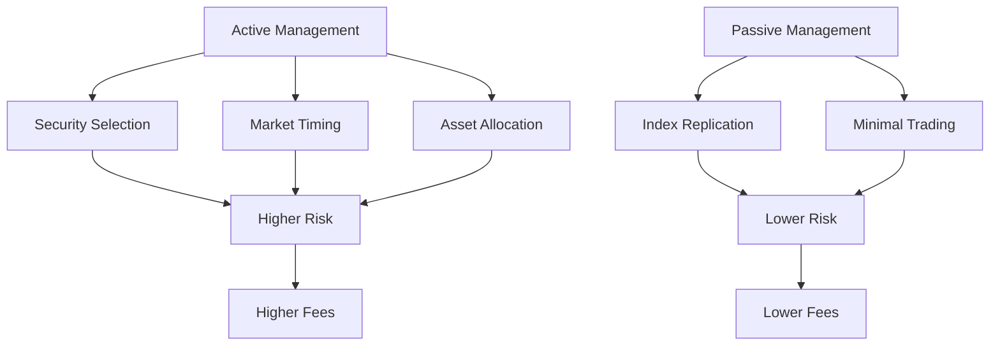

## 18.2.1 Active vs. Passive Management

In the realm of mutual funds, understanding the distinction between active and passive management is crucial for making informed investment decisions. Each style offers unique strategies, risk profiles, and fee structures, catering to different investor needs and market conditions. This section delves into the intricacies of both management styles, providing insights into their applications and implications within the Canadian financial landscape.

### Active Management

Active management is a hands-on approach where fund managers aim to outperform a benchmark index through strategic decisions. This involves selecting individual securities, timing the market, and making tactical asset allocation choices.

#### Strategy

Active managers employ a variety of strategies to achieve superior returns. These include:

- **Security Selection:** Choosing stocks or bonds that are expected to perform better than the market average.
- **Market Timing:** Making buy or sell decisions based on predictions of future market movements.
- **Asset Allocation:** Adjusting the proportions of different asset classes in a portfolio to capitalize on market opportunities.

Active management is particularly beneficial in less efficient markets where information asymmetry exists, allowing skilled managers to exploit market inefficiencies.

#### Risk

The active approach inherently carries higher risk due to:

- **Concentrated Positions:** Managers may take significant positions in fewer securities, increasing exposure to individual asset volatility.
- **Frequent Trading:** Active trading can lead to higher transaction costs and potential tax implications, impacting net returns.

Despite these risks, active management can offer substantial rewards if executed successfully, particularly in volatile or niche markets.

#### Fees

Active management typically incurs higher fees, including:

- **Management Fees:** Compensation for the expertise and efforts of fund managers.
- **Performance Fees:** Additional charges based on the fund's performance relative to its benchmark.

The Management Expense Ratio (MER) for actively managed funds is generally higher, reflecting the intensive research and trading activities involved.

### Passive Management

Passive management, in contrast, aims to mirror the performance of a benchmark index by holding the same or similar securities in identical proportions.

#### Strategy

The passive approach is characterized by:

- **Index Replication:** Constructing a portfolio that closely follows a specific index, such as the S&P/TSX Composite Index.
- **Minimal Trading:** Reducing turnover and transaction costs by maintaining a stable portfolio composition.

This strategy is well-suited for efficient markets where securities are fairly priced, making it challenging to consistently outperform the index.

#### Risk

Passive management offers a lower risk profile due to:

- **Diversification:** Broad exposure to an entire index reduces the impact of individual security volatility.
- **Avoidance of Market Timing:** Eliminating the risks associated with predicting market movements.

While passive funds may underperform in rapidly changing markets, they provide stable returns aligned with the overall market performance.

#### Fees

The cost structure of passive management is more favorable, featuring:

- **Lower Management Fees:** Reflecting the reduced need for active decision-making and trading.
- **Lower MERs:** Resulting from the streamlined management process and economies of scale.

These cost advantages make passive funds an attractive option for cost-conscious investors seeking market-matching returns.

### Suitability and Scenarios

Choosing between active and passive management depends on various factors, including investor preferences, market conditions, and financial goals.

#### Client Preferences

- **Cost Sensitivity:** Passive management is ideal for investors prioritizing low fees and predictable returns.
- **Risk Tolerance:** Active management suits those willing to accept higher risk for the potential of superior returns.
- **Market Outperformance:** Investors aiming to beat the market may prefer active management, especially in less efficient markets.

#### Market Conditions

- **Inefficient Markets:** Active management can add value by exploiting mispriced securities and market anomalies.
- **Efficient Markets:** Passive management is more appropriate where securities are accurately priced, minimizing the likelihood of consistent outperformance.

### Practical Examples and Case Studies

#### Canadian Pension Funds

Canadian pension funds often employ a mix of active and passive strategies to balance risk and return. For instance, the Canada Pension Plan Investment Board (CPPIB) uses active management for private equity and real estate investments, while relying on passive strategies for public equities.

#### Major Canadian Banks

Banks like RBC and TD offer both actively managed mutual funds and passively managed index funds, catering to diverse investor needs. Analyzing their fund offerings can provide insights into the practical application of these management styles.

### Diagrams and Visual Aids

Below is a diagram illustrating the differences between active and passive management strategies:

### Best Practices and Challenges

#### Best Practices

- **Diversification:** Regardless of management style, maintaining a diversified portfolio is essential for risk management.
- **Regular Review:** Periodically assess fund performance and alignment with financial goals.
- **Cost-Benefit Analysis:** Weigh the potential benefits of active management against its higher costs.

#### Common Pitfalls

- **Overconfidence in Active Management:** Avoid assuming that past performance guarantees future success.
- **Neglecting Fees:** Consider the impact of fees on long-term returns, especially in actively managed funds.

### Conclusion

Understanding the nuances of active and passive management is vital for making informed investment decisions. By considering client preferences, market conditions, and financial goals, investors can choose the management style that best aligns with their needs. Whether seeking to outperform the market or achieve stable, cost-effective returns, both active and passive management offer valuable tools for building a robust investment portfolio.

## Quiz Time!



### Which of the following strategies is commonly associated with active management?

- [x] Security selection
- [ ] Index replication
- [ ] Minimal trading
- [ ] Diversification

> **Explanation:** Active management involves selecting individual securities to outperform the market, unlike passive management, which focuses on index replication.

### What is a key characteristic of passive management?

- [ ] Higher risk
- [x] Lower fees
- [ ] Market timing
- [ ] Concentrated positions

> **Explanation:** Passive management typically incurs lower fees due to minimal trading and a less intensive management process.

### In which market condition is active management likely to add value?

- [x] Inefficient markets
- [ ] Efficient markets
- [ ] Stable markets
- [ ] Volatile markets

> **Explanation:** Active management can exploit inefficiencies in less efficient markets to achieve superior returns.

### What is the primary goal of passive management?

- [ ] Outperform the market
- [x] Replicate a benchmark index
- [ ] Minimize risk
- [ ] Maximize diversification

> **Explanation:** Passive management seeks to replicate the performance of a benchmark index by holding similar securities.

### Which of the following is a potential disadvantage of active management?

- [x] Higher fees
- [ ] Lower risk
- [ ] Minimal trading
- [ ] Index replication

> **Explanation:** Active management typically involves higher fees due to the intensive research and trading activities required.

### What is the Management Expense Ratio (MER)?

- [x] The total annual fees and operating expenses of a mutual fund, expressed as a percentage of its average net assets.
- [ ] The percentage of a fund's assets allocated to management fees.
- [ ] The ratio of active to passive management fees.
- [ ] The benchmark index performance relative to fund expenses.

> **Explanation:** The MER represents the total annual fees and operating expenses of a mutual fund, expressed as a percentage of its average net assets.

### Which management style is more suitable for cost-conscious investors?

- [ ] Active management
- [x] Passive management
- [ ] Both equally
- [ ] Neither

> **Explanation:** Passive management is more suitable for cost-conscious investors due to its lower fees and expenses.

### What is a common risk associated with active management?

- [x] Concentrated positions
- [ ] Diversification
- [ ] Minimal trading
- [ ] Index replication

> **Explanation:** Active management often involves concentrated positions, increasing exposure to individual asset volatility.

### Which management style typically involves higher transaction costs?

- [x] Active management
- [ ] Passive management
- [ ] Both equally
- [ ] Neither

> **Explanation:** Active management involves frequent trading, leading to higher transaction costs compared to passive management.

### True or False: Passive management aims to outperform the market.

- [ ] True
- [x] False

> **Explanation:** Passive management aims to replicate the performance of a benchmark index, not to outperform the market.


