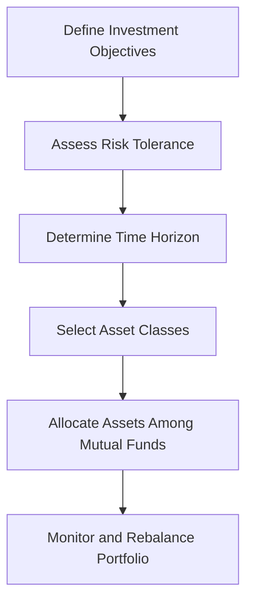

## 18.1 Introduction

In the dynamic world of finance, mutual funds stand out as a versatile and accessible investment vehicle for both novice and seasoned investors. Understanding the different types of mutual funds and their features is crucial for making informed investment recommendations. This knowledge not only empowers financial advisors to tailor investment strategies to individual client needs but also enhances the investor's ability to achieve their financial goals.

### The Importance of Understanding Mutual Funds

Mutual funds pool money from multiple investors to purchase a diversified portfolio of stocks, bonds, or other securities. This diversification helps mitigate risk and provides investors with access to a broad range of asset classes that might be difficult to achieve individually. For financial advisors, understanding the nuances of various mutual fund types is essential for crafting investment strategies that align with clients' financial objectives.

### Key Factors in Selecting Mutual Funds

When selecting mutual funds for clients, several key factors must be considered:

1. **Investment Objectives:** Clearly defining the client's financial goals is the first step. Whether the objective is capital appreciation, income generation, or capital preservation, the choice of mutual funds should align with these goals.

2. **Risk Tolerance:** Understanding a client's risk tolerance is crucial. Risk tolerance refers to the degree of variability in investment returns that an investor is willing to withstand. It is influenced by factors such as age, income, financial goals, and personal comfort with market fluctuations.

3. **Time Horizon:** The investment time horizon is the period over which the client expects to achieve their financial goals. A longer time horizon may allow for more aggressive investments, while a shorter horizon might necessitate a more conservative approach.

### Systematic Withdrawal Plans and Retirement Planning

Systematic Withdrawal Plans (SWPs) are an essential feature of mutual funds, particularly in the context of retirement planning. SWPs allow investors to withdraw a fixed amount of money at regular intervals, providing a steady income stream during retirement. This strategy helps retirees manage their cash flow and maintain their lifestyle without depleting their investment principal too quickly.

### Glossary

- **Risk Tolerance:** The degree of variability in investment returns that an investor is willing to withstand. It is a critical factor in determining the appropriate asset allocation and investment strategy for a client.

- **Asset Allocation:** The process of dividing investments among different asset categories, such as stocks, bonds, and cash. Asset allocation is a key determinant of a portfolio's risk and return characteristics.

### Practical Example: Canadian Pension Funds

Consider the investment strategy of a Canadian pension fund, which typically involves a diversified portfolio of mutual funds. These funds are selected based on the pension fund's long-term objectives, risk tolerance, and the need to provide stable returns for retirees. By understanding the types and features of mutual funds, pension fund managers can optimize asset allocation to meet these goals.

### Diagram: Asset Allocation Process

Below is a simplified diagram illustrating the asset allocation process for a mutual fund portfolio:

### Best Practices and Common Pitfalls

**Best Practices:**

- Conduct thorough research on mutual fund performance, fees, and management.
- Regularly review and adjust the portfolio to align with changing financial goals and market conditions.
- Educate clients about the benefits and risks associated with different types of mutual funds.

**Common Pitfalls:**

- Overlooking the impact of fees on long-term returns.
- Failing to diversify adequately, leading to increased portfolio risk.
- Ignoring changes in a client's financial situation or market conditions.

### Resources for Further Exploration

To deepen your understanding of mutual funds and enhance your investment strategies, consider exploring the following resources:

- Article: [How to Choose a Mutual Fund](https://www.investopedia.com/articles/mutualfund/07/mf_choosemf.asp)
- Book: *Mutual Funds For Dummies* by Eric Tyson

These resources provide valuable insights into mutual fund selection, performance evaluation, and strategic investment planning.

### Conclusion

Understanding the types and features of mutual funds is essential for making informed investment decisions. By considering factors such as investment objectives, risk tolerance, and time horizon, financial advisors can tailor strategies that align with clients' needs. Systematic Withdrawal Plans further enhance retirement planning by providing a reliable income stream. As you continue to explore the world of mutual funds, remember to apply these principles to optimize your investment strategies and achieve financial success.

### **Ready to Test Your Knowledge?**

**Practice 10 Essential CSC Exam Questions to Master Your Certification**



### What is a key factor to consider when selecting mutual funds for clients?

- [x] Investment objectives
- [ ] Historical stock prices
- [ ] Currency exchange rates
- [ ] Real estate trends

> **Explanation:** Investment objectives are crucial in selecting mutual funds as they guide the alignment of the fund's goals with the client's financial goals.

### What does risk tolerance refer to?

- [x] The degree of variability in investment returns an investor is willing to withstand
- [ ] The amount of money an investor is willing to invest
- [ ] The number of mutual funds an investor holds
- [ ] The investor's age

> **Explanation:** Risk tolerance is about how much fluctuation in returns an investor can handle, influencing their investment choices.

### What is the purpose of a Systematic Withdrawal Plan (SWP)?

- [x] To provide a steady income stream during retirement
- [ ] To increase investment returns
- [ ] To diversify a portfolio
- [ ] To minimize taxes

> **Explanation:** SWPs are designed to offer regular income, making them ideal for retirees needing consistent cash flow.

### What is asset allocation?

- [x] The process of dividing investments among different asset categories
- [ ] The selection of individual stocks
- [ ] The calculation of investment returns
- [ ] The analysis of market trends

> **Explanation:** Asset allocation involves distributing investments across various asset classes to balance risk and return.

### Which of the following is a common pitfall in mutual fund investment?

- [x] Overlooking the impact of fees on long-term returns
- [ ] Investing in a diversified portfolio
- [ ] Regularly reviewing the portfolio
- [ ] Educating clients about risks

> **Explanation:** Ignoring fees can significantly reduce returns over time, making it a common mistake.

### What is the first step in the asset allocation process?

- [x] Define investment objectives
- [ ] Assess risk tolerance
- [ ] Select asset classes
- [ ] Monitor the portfolio

> **Explanation:** Defining investment objectives sets the foundation for the entire asset allocation process.

### How can financial advisors tailor investment strategies for clients?

- [x] By considering investment objectives, risk tolerance, and time horizon
- [ ] By focusing solely on past performance
- [ ] By investing in the most popular funds
- [ ] By ignoring market conditions

> **Explanation:** Tailoring strategies requires a comprehensive understanding of the client's goals, risk appetite, and investment timeline.

### What role do mutual funds play in a diversified portfolio?

- [x] They provide access to a broad range of asset classes
- [ ] They focus solely on high-risk investments
- [ ] They guarantee fixed returns
- [ ] They are limited to domestic markets

> **Explanation:** Mutual funds offer diversification by investing in various asset classes, reducing overall portfolio risk.

### Why is it important to regularly review and adjust a mutual fund portfolio?

- [x] To align with changing financial goals and market conditions
- [ ] To increase the number of funds in the portfolio
- [ ] To avoid paying taxes
- [ ] To maintain a static investment strategy

> **Explanation:** Regular reviews ensure the portfolio remains aligned with the investor's evolving goals and market dynamics.

### True or False: Systematic Withdrawal Plans are only beneficial for young investors.

- [ ] True
- [x] False

> **Explanation:** SWPs are particularly beneficial for retirees, providing a steady income stream during retirement.


