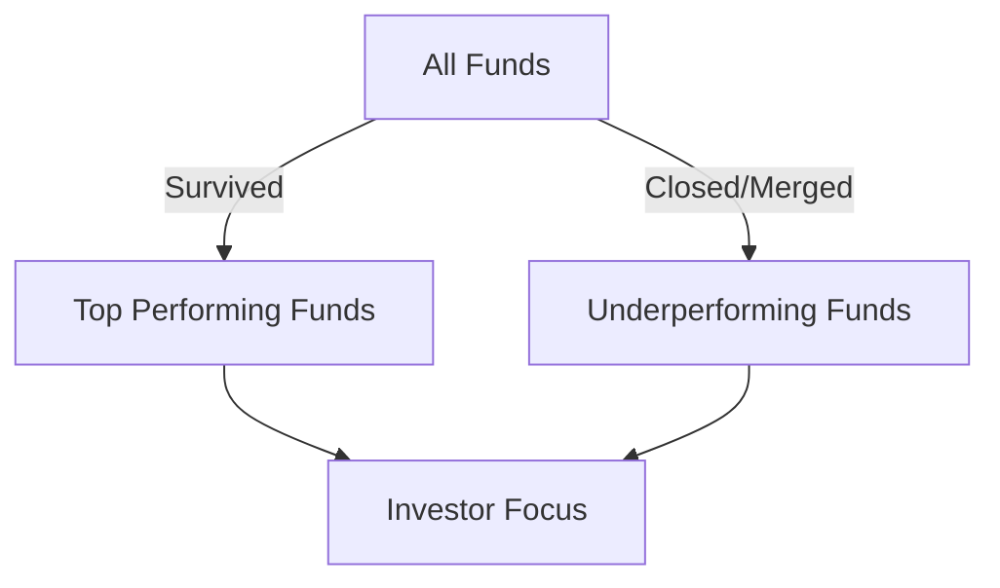

## 18.19 Pitfalls to Avoid in Judging Mutual Fund Performance

Evaluating mutual fund performance is a critical skill for any investor or financial professional. However, it is fraught with potential pitfalls that can lead to misguided investment decisions. This section explores common mistakes in assessing mutual fund performance and provides guidance on how to avoid them.

### Common Mistakes in Evaluating Mutual Fund Performance

#### 1. Overreliance on Past Performance

One of the most common errors investors make is placing too much emphasis on a mutual fund's past performance. While historical returns can provide some insight into how a fund has managed market conditions, they do not guarantee future results. The financial markets are dynamic, influenced by a myriad of factors including economic shifts, regulatory changes, and geopolitical events. 

**Example:** Consider a Canadian equity fund that outperformed its benchmark over the past five years. This performance might have been driven by a specific sector boom, such as technology. If the sector's growth slows or reverses, the fund's future performance may not mirror its past success.

#### 2. Ignoring Managerial Changes

The performance of a mutual fund is often closely tied to the expertise and strategy of its management team. Changes in key personnel can significantly impact a fund's strategy and performance. Investors should be vigilant about any managerial changes and understand the new team's investment philosophy and track record.

**Case Study:** A well-known Canadian mutual fund experienced a decline in performance after its star manager left for another firm. The new manager adopted a more conservative investment approach, which did not align with the aggressive growth strategy that had previously driven the fund's success.

#### 3. Survivorship Bias

Survivorship bias occurs when investors focus on funds that have survived over time, ignoring those that have closed or merged due to poor performance. This bias can lead to an overly optimistic view of the mutual fund industry's performance.

**Illustration:** Suppose an investor reviews a list of top-performing funds over the last decade. Many underperforming funds may have been closed or merged, skewing the perception of overall fund performance. 

### Importance of Matching Fund Types and Investment Objectives

Investors must ensure that the mutual funds they select align with their investment objectives and risk tolerance. Different funds have varying goals, such as capital appreciation, income generation, or capital preservation. Comparing funds with different objectives can lead to misleading conclusions.

**Example:** Comparing a high-growth equity fund with a bond fund focused on capital preservation is inappropriate. Each fund serves different investor needs and operates under different risk parameters.

### Best Practices for Evaluating Mutual Fund Performance

1. **Diversify Evaluation Metrics:** Use a combination of performance metrics, such as alpha, beta, Sharpe ratio, and standard deviation, to gain a comprehensive view of a fund's risk-adjusted performance.

2. **Consider the Economic Environment:** Analyze how a fund's performance correlates with economic cycles and market conditions. This can provide insights into how the fund might perform under similar future conditions.

3. **Review Fund Expenses:** High management fees and other expenses can erode returns. Compare the expense ratios of similar funds to ensure you are not overpaying for management.

4. **Monitor Fund Holdings:** Regularly review the fund's holdings to ensure they align with your investment strategy and risk tolerance.

5. **Stay Informed About Regulatory Changes:** Keep abreast of changes in Canadian financial regulations that might impact mutual fund operations and performance.

### Glossary

- **Survivorship Bias:** The logical error of concentrating on the funds that have survived while ignoring those that have failed.
- **Capital Preservation:** The objective of safeguarding the investor's capital with minimal risk.

### Resources for Further Exploration

- **Article:** [Common Mistakes in Mutual Fund Analysis](https://www.investopedia.com/articles/mutualfund/09/mistakes-mutual-funds.asp)
- **Book:** *Common Pitfalls in Mutual Fund Investing* by John C. Bogle

### Conclusion

Understanding the pitfalls in judging mutual fund performance is crucial for making informed investment decisions. By avoiding common mistakes such as overreliance on past performance, ignoring managerial changes, and succumbing to survivorship bias, investors can better align their mutual fund selections with their financial goals. Continuous learning and staying informed about market and regulatory changes will further enhance investment strategies.

### **Ready to Test Your Knowledge?**

**Practice 10 Essential CSC Exam Questions to Master Your Certification**



### What is a common mistake when evaluating mutual fund performance?

- [x] Overreliance on past performance
- [ ] Considering only the fund's name
- [ ] Ignoring fund size
- [ ] Focusing solely on the fund's inception date

> **Explanation:** Overreliance on past performance is a common mistake because past results do not guarantee future success.

### Why is it important to consider managerial changes in a mutual fund?

- [x] Because changes can significantly impact the fund's strategy and performance
- [ ] Because it affects the fund's name
- [ ] Because it changes the fund's expense ratio
- [ ] Because it alters the fund's inception date

> **Explanation:** Managerial changes can lead to shifts in investment strategy and impact the fund's performance.

### What does survivorship bias refer to?

- [x] Focusing on surviving funds while ignoring those that have failed
- [ ] Concentrating on funds with the highest returns
- [ ] Only considering funds with low fees
- [ ] Ignoring funds with high volatility

> **Explanation:** Survivorship bias involves concentrating on funds that have survived, potentially skewing performance perceptions.

### Why should investors match fund types with investment objectives?

- [x] To ensure alignment with their financial goals and risk tolerance
- [ ] To increase the fund's expense ratio
- [ ] To change the fund's inception date
- [ ] To alter the fund's name

> **Explanation:** Matching fund types with investment objectives ensures that the fund aligns with the investor's goals and risk tolerance.

### Which of the following is NOT a recommended practice when evaluating mutual fund performance?

- [ ] Diversify evaluation metrics
- [ ] Consider the economic environment
- [ ] Review fund expenses
- [x] Focus solely on the fund's past performance

> **Explanation:** Focusing solely on past performance is not recommended as it does not guarantee future results.

### What is the primary goal of capital preservation?

- [x] Safeguarding the investor's capital with minimal risk
- [ ] Maximizing returns at all costs
- [ ] Achieving the highest possible growth
- [ ] Increasing fund expenses

> **Explanation:** Capital preservation aims to protect the investor's capital with minimal risk.

### How can high management fees impact mutual fund returns?

- [x] They can erode returns
- [ ] They increase returns
- [ ] They have no impact on returns
- [ ] They only affect the fund's name

> **Explanation:** High management fees can erode returns by reducing the net gains from the fund.

### What should investors monitor to ensure alignment with their investment strategy?

- [x] Fund holdings
- [ ] Fund name
- [ ] Fund inception date
- [ ] Fund size

> **Explanation:** Monitoring fund holdings ensures they align with the investor's strategy and risk tolerance.

### Why is it important to stay informed about regulatory changes?

- [x] They can impact mutual fund operations and performance
- [ ] They change the fund's name
- [ ] They alter the fund's inception date
- [ ] They increase the fund's expense ratio

> **Explanation:** Regulatory changes can affect how mutual funds operate and perform, impacting investor decisions.

### True or False: Past performance is a reliable indicator of future mutual fund success.

- [ ] True
- [x] False

> **Explanation:** Past performance is not a reliable indicator of future success due to the dynamic nature of financial markets.


