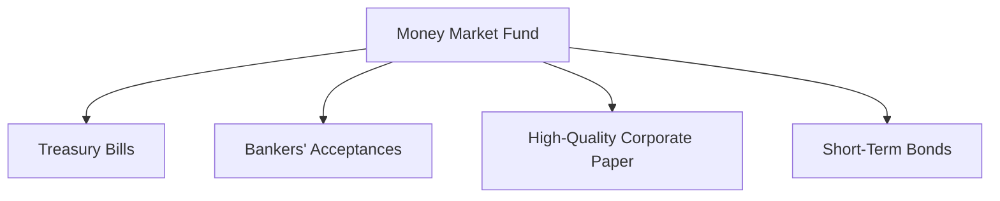

## 18.3 Money Market Funds

Money market funds are a type of mutual fund that invests in short-term, high-quality debt securities. These funds are designed to offer investors a safe place to invest easily accessible, cash-equivalent assets. They are particularly appealing to investors seeking liquidity, income, and principal safety. In this section, we will delve into the characteristics of money market funds, the types of securities they hold, and their compliance with Canadian regulations.

### Definition and Characteristics of Money Market Funds

Money market funds are mutual funds that aim to provide investors with a stable and low-risk investment option. They invest in short-term, high-quality debt instruments, which typically have maturities of less than one year. The primary characteristics of money market funds include:

- **Liquidity:** Money market funds are highly liquid, allowing investors to quickly access their funds when needed. This makes them an ideal choice for managing short-term cash needs.
- **Income:** These funds generate income through interest payments on the securities they hold. Although the returns are generally lower than those of other mutual funds, they are relatively stable.
- **Principal Safety:** Money market funds prioritize the preservation of capital, making them a safe investment option for risk-averse investors.

### Types of Securities Held

Money market funds invest in a variety of short-term, high-quality debt securities. These include:

- **Treasury Bills (T-Bills):** Short-term government securities with maturities of one year or less. T-Bills are considered one of the safest investments due to the backing of the Canadian government.
- **Bankers’ Acceptances:** Short-term debt instruments issued by a company and guaranteed by a bank. They are commonly used in international trade and are considered low-risk.
- **High-Quality Corporate Paper:** Short-term unsecured promissory notes issued by corporations with high credit ratings. These instruments offer slightly higher yields than government securities.
- **Short-Term Bonds:** Bonds with maturities of less than one year. These can include government, municipal, or corporate bonds, depending on the fund's investment strategy.

### Importance of Liquidity, Income, and Principal Safety

Money market funds play a crucial role in a diversified investment portfolio by providing liquidity, income, and principal safety. Here’s why these factors are important:

- **Liquidity:** Investors can quickly convert their investments into cash without significant loss of value, which is essential for meeting unexpected expenses or taking advantage of investment opportunities.
- **Income:** Although the income generated by money market funds is modest, it provides a steady stream of cash flow, which can be reinvested or used to cover living expenses.
- **Principal Safety:** By investing in high-quality, short-term securities, money market funds minimize the risk of capital loss, making them a secure option for conservative investors.

### Compliance with National Instrument 81-102

In Canada, money market funds must comply with National Instrument 81-102, which governs mutual funds. This regulation ensures that money market funds adhere to specific asset allocation and investment restrictions to protect investors. Key compliance aspects include:

- **Asset Allocation:** Money market funds must invest primarily in high-quality, short-term debt securities. This ensures the fund maintains liquidity and minimizes risk.
- **Diversification:** Funds must diversify their holdings to reduce exposure to any single issuer, thereby mitigating credit risk.
- **Valuation:** The Net Asset Value per Share (NAVPS) must be calculated daily to reflect the current market value of the fund's assets.

### Practical Examples and Case Studies

To illustrate the application of money market funds, consider the following examples:

- **Canadian Pension Funds:** Many Canadian pension funds allocate a portion of their assets to money market funds to maintain liquidity and meet short-term obligations.
- **Major Canadian Banks:** Banks like RBC and TD offer money market funds to clients seeking low-risk investment options. These funds are often used as a cash management tool within larger investment portfolios.

### Diagrams and Visual Aids

Below is a diagram illustrating the typical asset allocation within a money market fund:

### Best Practices and Common Pitfalls

When investing in money market funds, consider the following best practices and potential challenges:

- **Best Practices:**
  - Regularly review the fund's holdings and performance to ensure alignment with your investment goals.
  - Consider the fund's expense ratio, as high fees can erode returns.
  - Use money market funds as part of a diversified portfolio to balance risk and return.

- **Common Pitfalls:**
  - Over-reliance on money market funds can lead to missed opportunities for higher returns in other asset classes.
  - Failing to monitor interest rate changes, which can impact the fund's yield.

### Resources for Further Exploration

For those interested in learning more about money market funds, consider the following resources:

- Article: [Understanding Money Market Funds](https://www.investopedia.com/terms/m/moneymarketfund.asp)
- Book: *Understanding Treasury Bills* by Dynamo Books

### Glossary

- **Treasury Bills:** Short-term government securities with maturities of one year or less.
- **NAVPS:** Net Asset Value per Share, representing the per-share value of a mutual fund's assets minus liabilities.

### Summary

Money market funds are a vital component of a well-rounded investment strategy, offering liquidity, income, and principal safety. By understanding the types of securities held, compliance requirements, and best practices, investors can effectively incorporate money market funds into their portfolios. As with any investment, continuous monitoring and evaluation are key to achieving financial goals.

### **Ready to Test Your Knowledge?**

**Practice 10 Essential CSC Exam Questions to Master Your Certification**



### What is the primary characteristic of money market funds?

- [x] Liquidity
- [ ] High returns
- [ ] Long-term growth
- [ ] High risk

> **Explanation:** Money market funds are known for their liquidity, allowing investors to access their funds quickly.

### Which of the following securities is NOT typically held in a money market fund?

- [ ] Treasury Bills
- [ ] Bankers’ Acceptances
- [ ] High-Quality Corporate Paper
- [x] Long-term Bonds

> **Explanation:** Money market funds invest in short-term securities, not long-term bonds.

### What is the main regulatory framework governing money market funds in Canada?

- [x] National Instrument 81-102
- [ ] National Instrument 81-101
- [ ] National Instrument 81-103
- [ ] National Instrument 81-104

> **Explanation:** National Instrument 81-102 governs mutual funds, including money market funds, in Canada.

### What does NAVPS stand for?

- [x] Net Asset Value per Share
- [ ] Net Annual Value per Share
- [ ] Net Asset Value per Stock
- [ ] Net Annual Value per Stock

> **Explanation:** NAVPS stands for Net Asset Value per Share, indicating the per-share value of a mutual fund's assets minus liabilities.

### Why are Treasury Bills considered safe investments?

- [x] They are backed by the government.
- [ ] They have high yields.
- [ ] They are long-term investments.
- [ ] They are issued by corporations.

> **Explanation:** Treasury Bills are backed by the government, making them a safe investment.

### Which factor is NOT a primary focus of money market funds?

- [ ] Liquidity
- [ ] Income
- [ ] Principal Safety
- [x] High Growth

> **Explanation:** Money market funds focus on liquidity, income, and principal safety, not high growth.

### What is a common use of money market funds by Canadian pension funds?

- [x] Maintaining liquidity
- [ ] Achieving high returns
- [ ] Long-term growth
- [ ] Speculative investments

> **Explanation:** Canadian pension funds use money market funds to maintain liquidity and meet short-term obligations.

### What is a potential pitfall of over-relying on money market funds?

- [x] Missed opportunities for higher returns
- [ ] Increased risk
- [ ] High volatility
- [ ] Lack of liquidity

> **Explanation:** Over-relying on money market funds can lead to missed opportunities for higher returns in other asset classes.

### Which of the following is a best practice when investing in money market funds?

- [x] Regularly review the fund's holdings and performance.
- [ ] Invest all assets in money market funds.
- [ ] Ignore interest rate changes.
- [ ] Focus solely on the fund's yield.

> **Explanation:** Regularly reviewing the fund's holdings and performance ensures alignment with investment goals.

### True or False: Money market funds are suitable for speculative investments.

- [ ] True
- [x] False

> **Explanation:** Money market funds are not suitable for speculative investments; they focus on liquidity, income, and principal safety.


