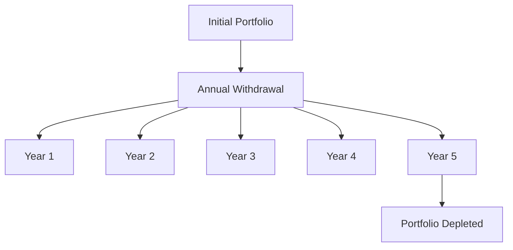

## 18.5 Withdrawal Plans

In the realm of mutual fund investments, withdrawal plans play a crucial role in providing investors with regular income streams, particularly during retirement. Understanding the different types of withdrawal plans and their respective features, benefits, and risks is essential for tailoring a strategy that aligns with an investor's financial goals, risk tolerance, and time horizon. This section delves into the various withdrawal strategies available to mutual fund investors, offering insights into how each can be effectively utilized.

### Types of Withdrawal Plans

#### Ratio Withdrawal Plan

The Ratio Withdrawal Plan involves withdrawing a fixed percentage of the portfolio's value annually. This approach offers flexibility, as the income amount varies with the portfolio's performance. For example, if an investor withdraws 4% annually, the withdrawal amount will increase if the portfolio grows and decrease if it shrinks.

**Benefits:**
- Flexibility to adjust with market conditions.
- Potential for increased income during bull markets.

**Risks:**
- Income variability can be challenging for budgeting.
- Potential for reduced income during market downturns.

**Example:**
Consider a portfolio valued at $500,000. With a 4% withdrawal rate, the investor would withdraw $20,000 in the first year. If the portfolio grows to $550,000, the next year's withdrawal would be $22,000. Conversely, if the portfolio decreases to $450,000, the withdrawal would be $18,000.

#### Fixed-Dollar Withdrawal Plan

The Fixed-Dollar Withdrawal Plan involves withdrawing a predetermined dollar amount at regular intervals, providing stable income regardless of portfolio size. This plan is ideal for investors who prioritize consistent cash flow.

**Benefits:**
- Predictable and stable income stream.
- Simplifies budgeting and financial planning.

**Risks:**
- Risk of depleting the portfolio if withdrawals exceed returns.
- Inflation may erode purchasing power over time.

**Example:**
An investor decides to withdraw $25,000 annually from a $500,000 portfolio. This fixed amount remains constant, providing stability but requiring careful monitoring to ensure the portfolio's longevity.

#### Fixed-Period Withdrawal Plan

The Fixed-Period Withdrawal Plan involves withdrawing a set amount over a specified period, ensuring all funds are exhausted by the end of the schedule. This plan is suitable for investors with a clear time horizon, such as funding a child's education or a planned retirement duration.

**Benefits:**
- Provides a clear end date for fund depletion.
- Useful for specific financial goals with defined timelines.

**Risks:**
- Risk of outliving the funds if the period is underestimated.
- Potential for insufficient income if market conditions are unfavorable.

**Example:**
An investor with a $300,000 portfolio plans to withdraw $30,000 annually over ten years. This ensures the portfolio is depleted by the end of the period, aligning with the investor's financial goals.

#### Life Expectancy-Adjusted Withdrawal Plan

The Life Expectancy-Adjusted Withdrawal Plan adjusts withdrawal amounts based on the investor’s changing life expectancy, ensuring funds last throughout the investor’s lifetime. This dynamic approach considers longevity risk and adjusts withdrawals accordingly.

**Benefits:**
- Tailored to individual life expectancy, reducing longevity risk.
- Adjusts to changing circumstances and financial needs.

**Risks:**
- Requires accurate life expectancy estimates.
- Potential for reduced income if life expectancy is underestimated.

**Example:**
An investor with a $400,000 portfolio and a life expectancy of 20 years might start with a withdrawal of $20,000 annually. As life expectancy decreases, the withdrawal amount may increase to ensure funds last throughout the investor's lifetime.

### Assessing Suitability of Withdrawal Plans

When selecting a withdrawal plan, consider the following factors:

- **Income Needs:** Determine the level of income required to maintain the desired lifestyle.
- **Time Horizon:** Consider the duration over which withdrawals will be needed.
- **Risk Tolerance:** Assess the investor's comfort with income variability and potential portfolio depletion.

### Potential Risks and Mitigation Strategies

Each withdrawal strategy carries inherent risks, such as depleting the portfolio too quickly or facing higher taxes. To mitigate these risks:

- **Diversify Investments:** Ensure the portfolio is well-diversified to withstand market volatility.
- **Monitor Withdrawals:** Regularly review withdrawal amounts and adjust as necessary.
- **Consider Tax Implications:** Be aware of the tax impact of withdrawals, especially from registered accounts like RRSPs.

### Practical Examples and Case Studies

#### Case Study: Canadian Pension Fund

A Canadian pension fund employs a Ratio Withdrawal Plan, withdrawing 3% annually to provide retirees with income while preserving the fund's capital. This strategy allows the fund to adjust withdrawals based on market performance, ensuring sustainability.

#### Case Study: RBC Investor

An RBC investor opts for a Fixed-Dollar Withdrawal Plan, withdrawing $30,000 annually from a $600,000 portfolio. This provides stable income, but the investor must monitor the portfolio to prevent depletion.

### Diagrams and Visual Aids

Below is a diagram illustrating the flow of funds in a Fixed-Period Withdrawal Plan:

### Best Practices and Common Pitfalls

- **Best Practices:**
  - Regularly review and adjust withdrawal plans to align with changing financial goals and market conditions.
  - Maintain a diversified portfolio to mitigate risks.

- **Common Pitfalls:**
  - Failing to adjust withdrawals during market downturns.
  - Underestimating life expectancy, leading to premature fund depletion.

### Conclusion

Withdrawal plans are a vital component of financial planning, particularly for retirees seeking regular income from mutual funds. By understanding the features, benefits, and risks of each strategy, investors can make informed decisions that align with their financial goals and risk tolerance. Regular monitoring and adjustments are crucial to ensuring the sustainability of withdrawal plans over time.

## Quiz Time!



### Which withdrawal plan involves withdrawing a fixed percentage of the portfolio's value annually?

- [x] Ratio Withdrawal Plan
- [ ] Fixed-Dollar Withdrawal Plan
- [ ] Fixed-Period Withdrawal Plan
- [ ] Life Expectancy-Adjusted Withdrawal Plan

> **Explanation:** The Ratio Withdrawal Plan involves withdrawing a fixed percentage of the portfolio's value annually, allowing for flexibility based on market performance.

### What is a key benefit of the Fixed-Dollar Withdrawal Plan?

- [x] Provides stable and predictable income
- [ ] Adjusts withdrawals based on life expectancy
- [ ] Ensures funds are exhausted by a specific date
- [ ] Varies income based on market conditions

> **Explanation:** The Fixed-Dollar Withdrawal Plan provides stable and predictable income by withdrawing a predetermined dollar amount at regular intervals.

### Which withdrawal plan is most suitable for an investor with a clear time horizon?

- [ ] Ratio Withdrawal Plan
- [ ] Fixed-Dollar Withdrawal Plan
- [x] Fixed-Period Withdrawal Plan
- [ ] Life Expectancy-Adjusted Withdrawal Plan

> **Explanation:** The Fixed-Period Withdrawal Plan is suitable for investors with a clear time horizon, as it involves withdrawing a set amount over a specified period.

### What is a potential risk of the Life Expectancy-Adjusted Withdrawal Plan?

- [x] Requires accurate life expectancy estimates
- [ ] Provides stable income regardless of portfolio size
- [ ] Ensures funds are exhausted by a specific date
- [ ] Varies income based on market conditions

> **Explanation:** The Life Expectancy-Adjusted Withdrawal Plan requires accurate life expectancy estimates to ensure funds last throughout the investor's lifetime.

### Which withdrawal plan is ideal for investors who prioritize consistent cash flow?

- [ ] Ratio Withdrawal Plan
- [x] Fixed-Dollar Withdrawal Plan
- [ ] Fixed-Period Withdrawal Plan
- [ ] Life Expectancy-Adjusted Withdrawal Plan

> **Explanation:** The Fixed-Dollar Withdrawal Plan is ideal for investors who prioritize consistent cash flow, as it provides a stable income stream.

### What is a common pitfall of withdrawal plans?

- [x] Failing to adjust withdrawals during market downturns
- [ ] Providing stable and predictable income
- [ ] Adjusting withdrawals based on life expectancy
- [ ] Ensuring funds are exhausted by a specific date

> **Explanation:** A common pitfall of withdrawal plans is failing to adjust withdrawals during market downturns, which can lead to premature portfolio depletion.

### How can investors mitigate the risk of depleting their portfolio too quickly?

- [x] Diversify investments
- [ ] Withdraw more than the portfolio's returns
- [ ] Ignore tax implications
- [ ] Maintain a single asset class

> **Explanation:** Diversifying investments can help mitigate the risk of depleting the portfolio too quickly by reducing exposure to market volatility.

### What is a benefit of the Ratio Withdrawal Plan during bull markets?

- [x] Potential for increased income
- [ ] Provides stable income regardless of portfolio size
- [ ] Ensures funds are exhausted by a specific date
- [ ] Adjusts withdrawals based on life expectancy

> **Explanation:** During bull markets, the Ratio Withdrawal Plan can lead to increased income as the portfolio's value grows.

### Which withdrawal plan adjusts withdrawal amounts based on the investor's changing life expectancy?

- [ ] Ratio Withdrawal Plan
- [ ] Fixed-Dollar Withdrawal Plan
- [ ] Fixed-Period Withdrawal Plan
- [x] Life Expectancy-Adjusted Withdrawal Plan

> **Explanation:** The Life Expectancy-Adjusted Withdrawal Plan adjusts withdrawal amounts based on the investor's changing life expectancy.

### True or False: The Fixed-Period Withdrawal Plan ensures all funds are exhausted by the end of the schedule.

- [x] True
- [ ] False

> **Explanation:** True. The Fixed-Period Withdrawal Plan involves withdrawing a set amount over a specified period, ensuring all funds are exhausted by the end of the schedule.


