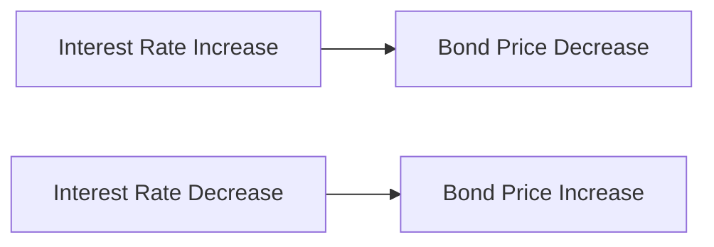

## 18.4 Fixed-Income Funds

Fixed-income funds are a cornerstone of many investment portfolios, offering a blend of stability and income generation. These funds primarily invest in bonds or other debt securities, providing investors with regular interest payments and the potential for capital appreciation. In this section, we will delve into the purpose and investment strategies of fixed-income funds, explore their various subcategories, and discuss the key risks associated with these investments.

### Purpose and Investment Strategy of Fixed-Income Funds

The primary purpose of fixed-income funds is to provide investors with a steady stream of income, typically through interest payments, while preserving capital. These funds are particularly attractive to conservative investors seeking lower volatility compared to equity investments. Fixed-income funds can also serve as a diversification tool within a broader investment portfolio, helping to mitigate risk.

Investment strategies for fixed-income funds vary based on the fund's objectives and the types of securities it holds. Common strategies include:

- **Interest Rate Management:** Adjusting the fund's duration to manage sensitivity to interest rate changes.
- **Credit Quality Assessment:** Selecting bonds with varying credit ratings to balance risk and return.
- **Sector Allocation:** Diversifying across different sectors, such as government, corporate, and municipal bonds, to optimize returns.
- **Geographic Diversification:** Investing in bonds from different countries to capitalize on global interest rate trends and economic conditions.

### Subcategories of Fixed-Income Funds

Fixed-income funds can be categorized into several subtypes, each with distinct characteristics and investment focuses. Below, we explore the main subcategories relevant to Canadian investors:

#### Canadian Short-Term Fixed-Income Funds

These funds invest in short-term debt securities, typically with maturities of less than five years. They are less sensitive to interest rate changes, making them suitable for investors seeking stability and liquidity. Canadian short-term fixed-income funds often include government and high-quality corporate bonds.

#### Canadian Long-Term Fixed-Income Funds

Long-term fixed-income funds focus on bonds with maturities exceeding ten years. While they offer higher yields compared to short-term funds, they are more sensitive to interest rate fluctuations. These funds are ideal for investors with a longer investment horizon who can tolerate higher volatility.

#### Canadian Inflation-Protected Fixed-Income Funds

These funds invest in inflation-linked bonds, such as Real Return Bonds (RRBs), which adjust their principal and interest payments based on inflation rates. They provide a hedge against inflation, preserving purchasing power over time. Canadian inflation-protected funds are suitable for investors concerned about rising inflation eroding their returns.

#### Global Fixed-Income Funds

Global fixed-income funds invest in bonds from various countries, offering exposure to international interest rate environments and economic conditions. These funds can enhance diversification and potentially increase returns by tapping into global opportunities. However, they also introduce currency risk, which investors must consider.

#### High-Yield Fixed-Income Funds

High-yield funds invest in bonds with lower credit ratings, often referred to as "junk bonds." These bonds offer higher yields to compensate for increased credit risk. High-yield funds are suitable for investors seeking higher income and willing to accept greater risk. They require careful credit analysis to manage default risk effectively.

### Key Risks of Fixed-Income Funds

Investing in fixed-income funds involves several risks that investors must understand and manage. The two primary risks are interest rate risk and credit risk.

#### Interest Rate Risk

Interest rate risk refers to the potential for bond prices to decline as interest rates rise. This risk is more pronounced in long-term bonds, as they have a longer duration and are more sensitive to rate changes. Investors can manage interest rate risk by diversifying across different maturities and adjusting the fund's duration based on interest rate forecasts.

#### Credit Risk

Credit risk, also known as default risk, is the possibility that a bond issuer will fail to make interest or principal payments. This risk is higher in bonds with lower credit ratings. Investors can mitigate credit risk by diversifying across issuers and sectors and conducting thorough credit analysis to assess the financial health of bond issuers.

### Practical Examples and Case Studies

To illustrate the application of fixed-income fund strategies, consider the following examples:

- **Canadian Pension Fund Strategy:** A Canadian pension fund might allocate a portion of its portfolio to Canadian long-term fixed-income funds to match its long-term liabilities, while using short-term funds for liquidity needs.
- **RBC's Global Bond Fund:** RBC's Global Bond Fund may invest in a mix of government and corporate bonds from developed and emerging markets, balancing currency exposure with hedging strategies to manage currency risk.

### Diagrams and Visual Aids

Below is a diagram illustrating the relationship between interest rate changes and bond prices:

This diagram highlights the inverse relationship between interest rates and bond prices, a fundamental concept in fixed-income investing.

### Best Practices and Common Pitfalls

**Best Practices:**

- **Diversification:** Spread investments across different maturities, sectors, and geographic regions to manage risk.
- **Duration Management:** Adjust the fund's duration based on interest rate forecasts to minimize interest rate risk.
- **Credit Analysis:** Conduct thorough credit assessments to select high-quality bonds and manage default risk.

**Common Pitfalls:**

- **Ignoring Interest Rate Trends:** Failing to consider interest rate forecasts can lead to unexpected losses.
- **Overconcentration in High-Yield Bonds:** Excessive exposure to high-yield bonds can increase portfolio risk.

### Resources for Further Exploration

To deepen your understanding of fixed-income funds, consider exploring the following resources:

- Article: [Fixed-Income Funds Explained](https://www.investopedia.com/terms/f/fixedincmounfund.asp)
- Online Course: [Bond Fundamentals](https://www.coursera.org/learn/bonds)

### Glossary

- **Interest Rate Risk:** The risk that changes in interest rates will affect the value of a bond.
- **Credit Risk:** The risk that a bond issuer will default on its obligations.

### Conclusion

Fixed-income funds offer a valuable investment option for those seeking income and stability. By understanding the various subcategories and associated risks, investors can make informed decisions to align their portfolios with their financial goals. As you continue to explore the world of fixed-income investing, remember to apply best practices and remain vigilant to market changes.

### **Ready to Test Your Knowledge?**

**Practice 10 Essential CSC Exam Questions to Master Your Certification**



### What is the primary purpose of fixed-income funds?

- [x] To provide a steady stream of income and preserve capital
- [ ] To achieve high capital appreciation
- [ ] To invest in high-risk equities
- [ ] To speculate on currency fluctuations

> **Explanation:** Fixed-income funds aim to provide regular income through interest payments and preserve capital, making them suitable for conservative investors.

### Which subcategory of fixed-income funds is least sensitive to interest rate changes?

- [ ] Canadian Long-Term Fixed-Income Funds
- [x] Canadian Short-Term Fixed-Income Funds
- [ ] High-Yield Fixed-Income Funds
- [ ] Global Fixed-Income Funds

> **Explanation:** Canadian short-term fixed-income funds invest in short-term debt securities, which are less sensitive to interest rate changes compared to long-term bonds.

### What type of bonds do Canadian inflation-protected fixed-income funds invest in?

- [ ] High-yield bonds
- [x] Inflation-linked bonds
- [ ] Convertible bonds
- [ ] Zero-coupon bonds

> **Explanation:** Canadian inflation-protected fixed-income funds invest in inflation-linked bonds, such as Real Return Bonds, which adjust for inflation.

### What is a key risk associated with high-yield fixed-income funds?

- [ ] Currency risk
- [ ] Inflation risk
- [x] Credit risk
- [ ] Liquidity risk

> **Explanation:** High-yield fixed-income funds invest in lower-rated bonds, which carry a higher credit risk or default risk.

### How can investors manage interest rate risk in fixed-income funds?

- [x] By diversifying across different maturities
- [ ] By investing only in high-yield bonds
- [x] By adjusting the fund's duration based on interest rate forecasts
- [ ] By focusing solely on Canadian bonds

> **Explanation:** Investors can manage interest rate risk by diversifying maturities and adjusting the fund's duration to align with interest rate expectations.

### What is the relationship between interest rates and bond prices?

- [x] Inverse relationship
- [ ] Direct relationship
- [ ] No relationship
- [ ] Exponential relationship

> **Explanation:** There is an inverse relationship between interest rates and bond prices; when interest rates rise, bond prices typically fall.

### Which type of fixed-income fund offers exposure to international interest rate environments?

- [ ] Canadian Short-Term Fixed-Income Funds
- [ ] Canadian Long-Term Fixed-Income Funds
- [x] Global Fixed-Income Funds
- [ ] High-Yield Fixed-Income Funds

> **Explanation:** Global fixed-income funds invest in bonds from various countries, providing exposure to international interest rate environments.

### What is credit risk?

- [x] The risk that a bond issuer will default on its obligations
- [ ] The risk of interest rates rising
- [ ] The risk of inflation eroding returns
- [ ] The risk of currency fluctuations

> **Explanation:** Credit risk is the risk that a bond issuer will fail to make interest or principal payments, leading to potential losses for investors.

### Which of the following is a best practice for managing fixed-income fund investments?

- [x] Diversifying across different maturities and sectors
- [ ] Concentrating investments in high-yield bonds
- [ ] Ignoring interest rate trends
- [ ] Focusing solely on domestic bonds

> **Explanation:** Diversifying across maturities and sectors helps manage risk and optimize returns in fixed-income fund investments.

### True or False: Fixed-income funds are suitable for investors seeking high-risk, high-return investments.

- [ ] True
- [x] False

> **Explanation:** Fixed-income funds are generally suitable for conservative investors seeking stable income and capital preservation, not high-risk, high-return investments.


