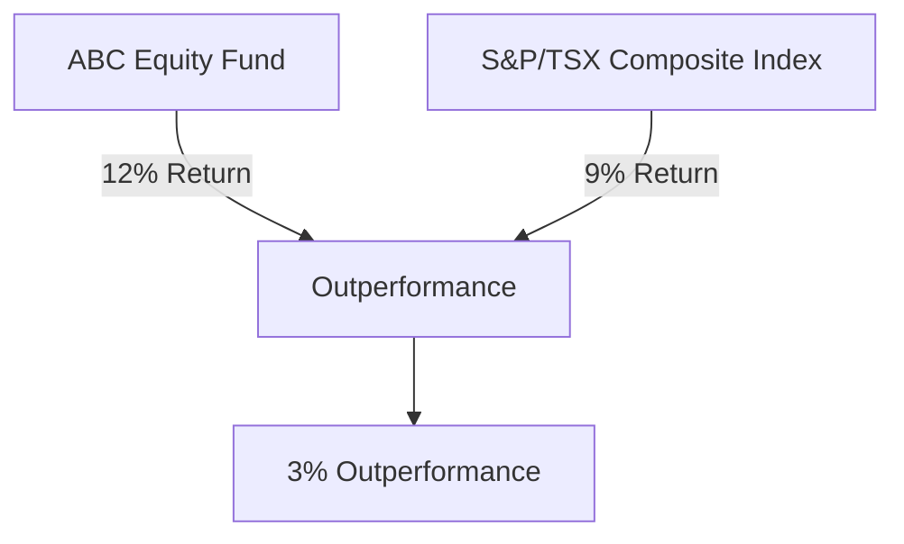
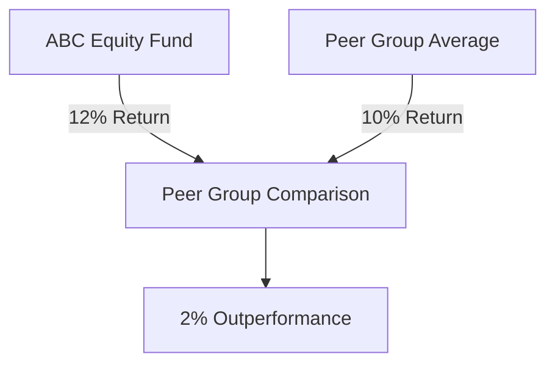

## 18.7.1 Comparative Performance Analysis

In the realm of mutual fund investment, understanding how a fund performs relative to benchmarks and peers is crucial for making informed decisions. Comparative performance analysis serves as a vital tool for investors, providing insights into the effectiveness of fund management and the potential for future returns. This section delves into the methodologies and interpretations of comparative performance analysis, using practical examples and guidelines to enhance your understanding.

### Benchmark Comparison

Benchmarking is a fundamental method of evaluating a mutual fund's performance. It involves comparing the fund's returns against a relevant index, which serves as a standard or point of reference. This comparison helps investors assess whether the fund manager is adding value through active management.

#### Example: ABC Equity Fund vs. S&P/TSX Composite Index

Consider the ABC Equity Fund, which has returned 12% over the past year. The S&P/TSX Composite Index, a common benchmark for Canadian equity funds, returned 9% over the same period. 

**Analysis:** The ABC Equity Fund outperformed its benchmark by 3%. This outperformance suggests that the fund manager's strategies were effective in generating higher returns than the market average.

### Peer Group Comparison

Peer group comparison involves evaluating a fund's performance against similar funds. This method provides context by showing how a fund stacks up against its competitors.

#### Example: ABC Equity Fund vs. Peer Group

The peer group average return is 10%, while the ABC Equity Fund returned 12%.

**Analysis:** The ABC Equity Fund outperformed its peer group by 2%. This indicates that the fund is performing better than its competitors, which may be due to superior management or investment strategies.

### Interpretation of Results

Interpreting the results of comparative performance analysis is crucial for making informed investment decisions. Here are some key considerations:

- **Outperformance:** Indicates effective fund management and successful investment strategies. It suggests that the fund manager is adept at selecting securities and timing the market.
  
- **Underperformance:** May suggest inefficiencies, higher fees, or suboptimal investment decisions by the fund manager. Persistent underperformance could be a red flag for investors.

### Guidelines for Investors

To maximize the benefits of comparative performance analysis, consider the following guidelines:

1. **Regular Review:** Encourage clients to regularly review performance reports. Staying informed about how their funds compare to benchmarks and peers is essential for proactive investment management.

2. **Identify Top Performers:** Use comparative performance analysis to identify top-performing funds. This can help investors allocate resources to funds with a proven track record of success.

3. **Avoid Underperformers:** Conversely, avoid funds that consistently underperform their benchmarks or peer groups. This can prevent potential losses and improve overall portfolio performance.

4. **Focus on Long-Term Trends:** Advise clients to consider long-term performance trends rather than short-term fluctuations. Long-term trends provide a more accurate picture of a fund's potential.

### Glossary

- **Outperformance:** When a mutual fund achieves higher returns than its benchmark or peer group.
- **Underperformance:** When a mutual fund achieves lower returns than its benchmark or peer group.
- **Performance Trend:** The general direction in which a mutual fund’s performance is moving over time.

### Practical Example: Canadian Pension Funds

Consider a Canadian pension fund that invests in a diversified portfolio of equities and bonds. By comparing its performance against the S&P/TSX Composite Index and a peer group of similar pension funds, the fund managers can assess their investment strategies' effectiveness. If the fund consistently outperforms both the benchmark and its peers, it may indicate strong management and strategic asset allocation.

### Conclusion

Comparative performance analysis is a powerful tool for evaluating mutual fund performance. By understanding how a fund performs relative to benchmarks and peers, investors can make more informed decisions, optimize their portfolios, and achieve their financial goals. Remember to focus on long-term trends, regularly review performance reports, and use these insights to guide your investment strategies.

## Quiz Time!



### What is the primary purpose of benchmark comparison in mutual fund analysis?

- [x] To assess whether the fund manager is adding value through active management
- [ ] To determine the fund's risk level
- [ ] To evaluate the fund's liquidity
- [ ] To calculate the fund's expense ratio

> **Explanation:** Benchmark comparison helps investors assess whether the fund manager is adding value through active management by comparing the fund's returns against a relevant index.

### In the example provided, by how much did the ABC Equity Fund outperform the S&P/TSX Composite Index?

- [x] 3%
- [ ] 2%
- [ ] 5%
- [ ] 1%

> **Explanation:** The ABC Equity Fund returned 12%, while the S&P/TSX Composite Index returned 9%, resulting in a 3% outperformance.

### What does peer group comparison involve?

- [x] Evaluating a fund's performance against similar funds
- [ ] Comparing a fund's performance to a single index
- [ ] Analyzing a fund's historical performance
- [ ] Assessing a fund's risk-adjusted returns

> **Explanation:** Peer group comparison involves evaluating a fund's performance against similar funds to provide context and show how it stacks up against competitors.

### What might persistent underperformance of a mutual fund indicate?

- [x] Inefficiencies, higher fees, or suboptimal investment decisions
- [ ] Strong management and strategic asset allocation
- [ ] High liquidity and low risk
- [ ] Excellent market timing

> **Explanation:** Persistent underperformance may suggest inefficiencies, higher fees, or suboptimal investment decisions by the fund manager.

### Why is it important to focus on long-term performance trends?

- [x] They provide a more accurate picture of a fund's potential
- [ ] They reflect short-term market fluctuations
- [ ] They determine the fund's expense ratio
- [ ] They indicate the fund's liquidity

> **Explanation:** Long-term performance trends provide a more accurate picture of a fund's potential, as they smooth out short-term fluctuations and reveal the fund's true performance trajectory.

### What is outperformance in the context of mutual funds?

- [x] When a mutual fund achieves higher returns than its benchmark or peer group
- [ ] When a mutual fund achieves lower returns than its benchmark or peer group
- [ ] When a mutual fund has a high expense ratio
- [ ] When a mutual fund is highly liquid

> **Explanation:** Outperformance occurs when a mutual fund achieves higher returns than its benchmark or peer group, indicating effective management and successful strategies.

### How can investors use comparative performance analysis?

- [x] To identify top-performing funds and avoid underperforming ones
- [ ] To determine the fund's liquidity
- [ ] To calculate the fund's expense ratio
- [ ] To assess the fund's risk level

> **Explanation:** Investors can use comparative performance analysis to identify top-performing funds and avoid underperforming ones, optimizing their portfolios for better returns.

### What is the benefit of regular performance report reviews?

- [x] Staying informed about how funds compare to benchmarks and peers
- [ ] Determining the fund's liquidity
- [ ] Calculating the fund's expense ratio
- [ ] Assessing the fund's risk level

> **Explanation:** Regular performance report reviews help investors stay informed about how their funds compare to benchmarks and peers, enabling proactive investment management.

### What does a performance trend indicate?

- [x] The general direction in which a mutual fund’s performance is moving over time
- [ ] The fund's liquidity
- [ ] The fund's expense ratio
- [ ] The fund's risk level

> **Explanation:** A performance trend indicates the general direction in which a mutual fund’s performance is moving over time, helping investors understand its potential trajectory.

### True or False: Comparative performance analysis is only useful for short-term investment decisions.

- [ ] True
- [x] False

> **Explanation:** Comparative performance analysis is valuable for both short-term and long-term investment decisions, but focusing on long-term trends provides a more accurate picture of a fund's potential.


