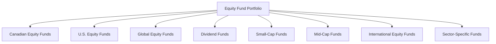

## 18.6 Equity Funds

Equity funds, a cornerstone of many investment portfolios, are mutual funds that primarily invest in stocks. Their primary investment objective is long-term capital growth, making them an attractive option for investors seeking to build wealth over time. This section delves into the various types of equity funds, their associated risks, and strategies for leveraging these funds within the Canadian financial landscape.

### Understanding Equity Funds

Equity funds pool money from multiple investors to purchase a diversified portfolio of stocks. By investing in equity funds, individuals gain access to a broad array of equities, which can help mitigate risk through diversification. The primary goal of equity funds is to achieve capital appreciation, although some may also provide income through dividends.

### Subcategories of Equity Funds

Equity funds can be categorized into several subtypes, each with distinct characteristics and investment focuses:

#### 1. Canadian Equity Funds

These funds invest predominantly in Canadian stocks. They provide exposure to the Canadian economy and are ideal for investors who wish to capitalize on domestic growth opportunities. Canadian equity funds often include blue-chip stocks, which are large, well-established companies known for their stability and reliability.

#### 2. U.S. and Global Equity Funds

- **U.S. Equity Funds:** Focus on American companies, offering exposure to the world's largest economy. These funds can be an excellent way to diversify beyond Canadian borders.
  
- **Global Equity Funds:** Invest in stocks from around the world, providing broad international exposure. They allow investors to benefit from growth in various regions and sectors, reducing reliance on any single market.

#### 3. Dividend Funds

Dividend funds concentrate on stocks that pay regular dividends. These funds are appealing to investors seeking a combination of income and growth. Dividend-paying stocks are often seen as more stable, providing a cushion during market downturns.

#### 4. Small-Cap and Mid-Cap Funds

- **Small-Cap Funds:** Target smaller companies with high growth potential. While these stocks can offer significant returns, they also come with higher volatility.
  
- **Mid-Cap Funds:** Invest in medium-sized companies, offering a balance between the growth potential of small-cap stocks and the stability of large-cap stocks.

#### 5. International and Sector-Specific Funds

- **International Equity Funds:** Focus on non-North American markets, providing exposure to emerging and developed economies outside Canada and the U.S.
  
- **Sector-Specific Funds:** Concentrate on specific industries, such as healthcare or precious metals. These funds allow investors to capitalize on trends within particular sectors but may carry higher risk due to lack of diversification.

### Market Risk and Volatility

Equity funds are subject to market risk, which is the potential for investment losses due to fluctuations in the stock market. Factors such as economic conditions, interest rates, and geopolitical events can impact stock prices, leading to volatility. While equity funds offer the potential for high returns, investors must be prepared for periods of market downturns.

#### Managing Risk

Investors can manage risk by diversifying their equity fund holdings across different subcategories and geographic regions. Additionally, understanding one's risk tolerance and investment horizon is crucial for aligning equity fund investments with financial goals.

### Practical Examples and Case Studies

To illustrate the application of equity funds, consider the following examples:

- **Canadian Pension Funds:** Many Canadian pension funds, such as the Canada Pension Plan Investment Board (CPPIB), allocate a significant portion of their portfolios to equity funds. By diversifying across Canadian, U.S., and global equities, they aim to achieve long-term growth while managing risk.

- **Major Canadian Banks:** Institutions like RBC and TD offer a variety of equity funds tailored to different investor needs. For instance, RBC's Canadian Dividend Fund focuses on dividend-paying stocks, appealing to investors seeking income and growth.

### Step-by-Step Guidance for Investing in Equity Funds

1. **Assess Your Financial Goals:** Determine your investment objectives, risk tolerance, and time horizon.
   
2. **Research Fund Options:** Explore different types of equity funds, considering factors such as geographic focus, sector exposure, and management style.

3. **Diversify Your Portfolio:** Allocate investments across various equity fund subcategories to spread risk.

4. **Monitor Performance:** Regularly review your equity fund holdings to ensure they align with your financial goals and market conditions.

5. **Adjust as Needed:** Be prepared to rebalance your portfolio in response to changes in your financial situation or market dynamics.

### Diagrams and Visual Aids

To enhance understanding, consider the following diagram illustrating the diversification of an equity fund portfolio:

### Best Practices and Common Pitfalls

- **Best Practices:** Regularly review and adjust your equity fund portfolio to align with changing market conditions and personal financial goals. Stay informed about economic trends and sector developments.

- **Common Pitfalls:** Avoid over-concentration in a single sector or geographic region, which can increase risk. Be wary of chasing past performance without considering future potential.

### Glossary

- **Blue Chip Stocks:** Large, well-established, and financially sound companies.
- **Dividend Fund:** An equity fund that focuses on stocks that pay regular dividends.

### Resources for Further Exploration

- **Article:** [Types of Equity Funds](https://www.investopedia.com/articles/mutualfund/08/equityfunds.asp)
- **Book:** *Equity Asset Valuation* by Jerald E. Pinto

### Conclusion

Equity funds offer a dynamic and potentially rewarding investment avenue for those seeking long-term capital growth. By understanding the various types of equity funds and their associated risks, investors can make informed decisions that align with their financial objectives. As you explore equity funds, consider how they fit within your broader investment strategy and remain vigilant in managing risk through diversification and ongoing portfolio assessment.

### **Ready to Test Your Knowledge?**

**Practice 10 Essential CSC Exam Questions to Master Your Certification**



### What is the primary investment objective of equity funds?

- [x] Long-term capital growth
- [ ] Short-term income generation
- [ ] Preservation of capital
- [ ] Tax efficiency

> **Explanation:** Equity funds primarily aim for long-term capital growth by investing in stocks.

### Which type of equity fund focuses on stocks that pay regular dividends?

- [ ] Small-Cap Funds
- [x] Dividend Funds
- [ ] Sector-Specific Funds
- [ ] International Equity Funds

> **Explanation:** Dividend funds focus on stocks that pay regular dividends, providing income and growth.

### What is a characteristic of small-cap funds?

- [x] High growth potential
- [ ] Low volatility
- [ ] Focus on large companies
- [ ] Primarily invest in bonds

> **Explanation:** Small-cap funds target smaller companies with high growth potential but higher volatility.

### Which equity fund provides exposure to non-North American markets?

- [ ] Canadian Equity Funds
- [ ] U.S. Equity Funds
- [x] International Equity Funds
- [ ] Dividend Funds

> **Explanation:** International equity funds focus on markets outside North America.

### What is a common risk associated with equity funds?

- [x] Market risk
- [ ] Currency risk
- [ ] Credit risk
- [ ] Liquidity risk

> **Explanation:** Equity funds are subject to market risk due to stock price fluctuations.

### Which Canadian institution is known for allocating a significant portion of its portfolio to equity funds?

- [ ] Bank of Canada
- [x] Canada Pension Plan Investment Board (CPPIB)
- [ ] Canadian Imperial Bank of Commerce (CIBC)
- [ ] Toronto Stock Exchange (TSX)

> **Explanation:** CPPIB allocates a significant portion of its portfolio to equity funds for growth.

### What is a blue chip stock?

- [x] A large, well-established, and financially sound company
- [ ] A small, high-growth company
- [ ] A company with high debt levels
- [ ] A newly listed company

> **Explanation:** Blue chip stocks are large, well-established, and financially sound companies.

### Which fund type is likely to have higher volatility?

- [ ] Dividend Funds
- [ ] Canadian Equity Funds
- [x] Small-Cap Funds
- [ ] Global Equity Funds

> **Explanation:** Small-cap funds are likely to have higher volatility due to investing in smaller companies.

### What is a benefit of global equity funds?

- [x] Broad international exposure
- [ ] Focus on a single sector
- [ ] Limited geographic diversification
- [ ] Low growth potential

> **Explanation:** Global equity funds provide broad international exposure, reducing reliance on a single market.

### True or False: Sector-specific funds are highly diversified.

- [ ] True
- [x] False

> **Explanation:** Sector-specific funds focus on particular industries, which may limit diversification.


