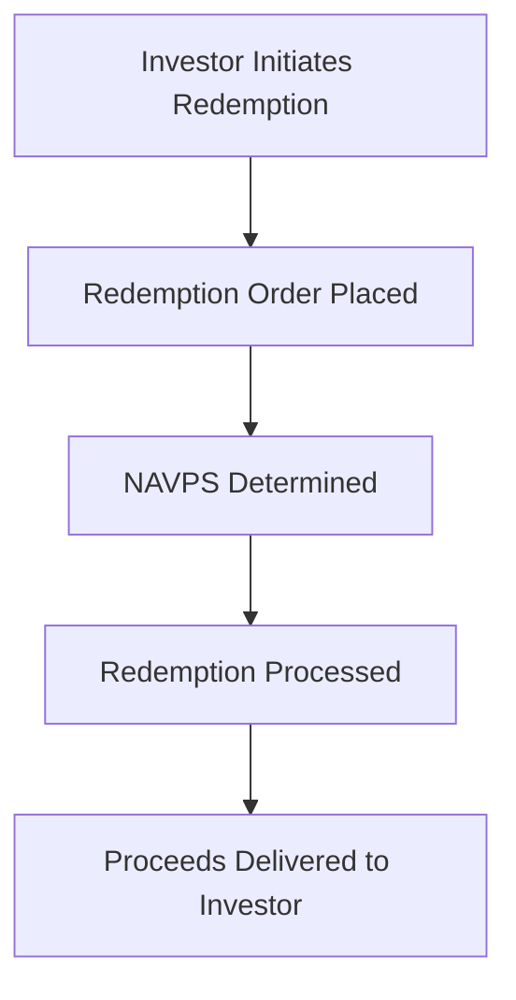

## 18.8.1 Redemption Process and Tax Implications

In the world of mutual funds, understanding the redemption process and its tax implications is crucial for investors aiming to maximize their returns while remaining compliant with Canadian tax laws. This section delves into the step-by-step redemption process and the associated tax consequences, providing practical examples and guidelines to help you navigate these financial waters effectively.

### Understanding the Redemption Process

The redemption process for mutual funds involves several key steps that investors must follow to successfully sell their units or shares. Here's a detailed breakdown:

#### Step-by-Step Redemption

1. **Request Realization:**
   - The first step in the redemption process is for the investor to contact their mutual fund distributor or platform to initiate a redemption request. This can typically be done online, over the phone, or in person, depending on the service provider.

2. **Redemption Order Placement:**
   - Once the request is made, the redemption order is placed with the mutual fund company. The order is processed based on the Net Asset Value per Share (NAVPS) at the close of the valuation day. It's important to note that the NAVPS can fluctuate daily based on market conditions.

3. **Proceeds Delivery:**
   - After the redemption order is processed, the investor receives the redemption proceeds. This usually occurs within two business days, although the exact timeframe can vary depending on the mutual fund company and the investor's financial institution.

### Tax Consequences of Redemption

When redeeming mutual fund units or shares, investors must be aware of the tax implications, particularly concerning capital gains and distributions. Understanding these can help in effective tax planning and optimizing investment returns.

#### Tax on Capital Gains

Capital gains arise when the redemption price of mutual fund units exceeds the original purchase price. In Canada, only 50% of capital gains are taxable, which can significantly impact an investor's tax liability.

**Example:**

- **Initial Investment:** $10,000 at a NAVPS of $10, resulting in 1,000 units.
- **Distribution:** $1 per unit reinvested, increasing the total to 1,095.24 units.
- **Redemption Price:** $15 per unit.
- **Redemption Proceeds:** \\(1,095.24 \times \$15 = \$16,428.60\\).
- **Capital Gain:** \\( \$16,428.60 - \$10,000 = \$6,428.60 \\).
- **Taxable Capital Gain:** \\( 50\% \times \$6,428.60 = \$3,214.30 \\).

This example illustrates how the reinvestment of distributions can increase the number of units and subsequently the redemption proceeds, affecting the capital gain calculation.

#### Tax on Distributions

Distributions from mutual funds can take various forms, each with different tax treatments:

- **Dividends:** If the mutual fund invests in Canadian corporations, dividends received are taxed at the investor's marginal rate but are eligible for dividend tax credits, which can reduce the overall tax burden.

- **Interest Income:** Any interest income distributed by the mutual fund is fully taxable at the investor's marginal tax rate. This is important to consider when evaluating the after-tax return of a mutual fund investment.

### Guidelines for Investors

To effectively manage the tax impact of mutual fund redemptions, consider the following guidelines:

- **Detailed Explanations and Examples:** Ensure you understand how different types of income from mutual funds are taxed. Use examples like the one provided to calculate potential tax liabilities.

- **Consult Tax Professionals:** Given the complexity of tax laws and individual circumstances, consulting a tax professional can provide personalized advice and strategies for tax-efficient investing.

### Glossary of Key Terms

- **Redemption Order:** An instruction to sell mutual fund shares and receive the current NAVPS minus any applicable fees.
- **Capital Gain:** The profit made from selling mutual fund shares at a price higher than the purchase price.
- **Marginal Tax Rate:** The tax rate applied to the last dollar of income earned, used to calculate taxes on investment income.

### Visualizing the Redemption Process

To further clarify the redemption process, consider the following diagram illustrating the flow from request to proceeds delivery:

This diagram provides a visual representation of the steps involved in redeeming mutual fund units, helping to solidify your understanding of the process.

### Best Practices and Common Pitfalls

- **Best Practices:**
  - Regularly review your investment portfolio to assess the timing of redemptions, considering both market conditions and personal financial goals.
  - Keep detailed records of all transactions, including purchase prices and reinvested distributions, to accurately calculate capital gains.

- **Common Pitfalls:**
  - Failing to account for reinvested distributions can lead to incorrect capital gain calculations.
  - Ignoring the tax implications of distributions can result in unexpected tax liabilities.

### Conclusion

Understanding the redemption process and its tax implications is essential for any investor in mutual funds. By following the outlined steps and considering the tax consequences, you can make informed decisions that align with your financial goals and optimize your investment returns. Always remember to consult with financial and tax professionals to tailor strategies to your specific situation.

## Quiz Time!



### What is the first step in the mutual fund redemption process?

- [x] Request Realization
- [ ] Redemption Order Placement
- [ ] Proceeds Delivery
- [ ] NAVPS Calculation

> **Explanation:** The first step is for the investor to contact the mutual fund distributor or platform to initiate a redemption request.

### How is the redemption order processed?

- [ ] Based on the opening NAVPS of the day
- [x] Based on the NAVPS at the close of the valuation day
- [ ] Based on the average NAVPS of the week
- [ ] Based on the NAVPS at the start of the month

> **Explanation:** The redemption order is processed based on the NAVPS at the close of the valuation day.

### What percentage of capital gains is taxable in Canada?

- [ ] 100%
- [ ] 75%
- [x] 50%
- [ ] 25%

> **Explanation:** In Canada, only 50% of capital gains are taxable.

### Which type of income from mutual funds is eligible for dividend tax credits?

- [ ] Interest Income
- [x] Dividends from Canadian corporations
- [ ] Foreign Dividends
- [ ] Capital Gains

> **Explanation:** Dividends from Canadian corporations are eligible for dividend tax credits.

### What is the tax treatment for interest income from mutual funds?

- [ ] Taxed at a reduced rate
- [ ] Not taxable
- [x] Fully taxable at the investor’s marginal rate
- [ ] Taxed at a flat rate

> **Explanation:** Interest income is fully taxable at the investor’s marginal tax rate.

### What should investors do to manage the tax impact of mutual fund redemptions?

- [x] Consult tax professionals
- [ ] Ignore tax implications
- [ ] Only consider capital gains
- [ ] Avoid reinvesting distributions

> **Explanation:** Consulting tax professionals can provide personalized advice and strategies for tax-efficient investing.

### What is a common pitfall when calculating capital gains on mutual fund redemptions?

- [ ] Overestimating NAVPS
- [x] Failing to account for reinvested distributions
- [ ] Ignoring redemption fees
- [ ] Miscalculating the number of units

> **Explanation:** Failing to account for reinvested distributions can lead to incorrect capital gain calculations.

### How soon are redemption proceeds typically delivered to the investor?

- [ ] Within one business day
- [x] Within two business days
- [ ] Within a week
- [ ] Immediately

> **Explanation:** Redemption proceeds are usually delivered within two business days.

### What is the role of the NAVPS in the redemption process?

- [x] It determines the value of the redemption proceeds
- [ ] It sets the redemption fees
- [ ] It calculates the number of units
- [ ] It is irrelevant to the redemption process

> **Explanation:** The NAVPS determines the value of the redemption proceeds.

### True or False: All distributions from mutual funds are taxed at the same rate.

- [ ] True
- [x] False

> **Explanation:** Different types of distributions (e.g., dividends, interest) are taxed differently.




