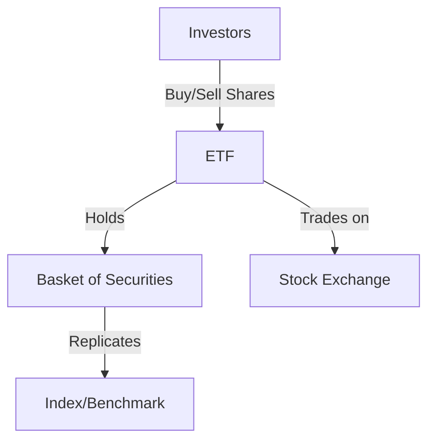

## Overview of Chapter 19: Exchange-Traded Funds

Exchange-Traded Funds (ETFs) have become a cornerstone of modern investment portfolios, offering a blend of flexibility, diversification, and cost-effectiveness. This chapter delves into the intricacies of ETFs, focusing on their regulation, structure, taxation, and strategic use in investment portfolios. We will also compare ETFs with mutual funds, highlighting their unique features and potential advantages.

### Understanding ETFs: Regulation and Structure

ETFs are investment funds traded on stock exchanges, similar to stocks. They hold a diversified portfolio of assets such as stocks, bonds, or commodities and typically aim to replicate the performance of a specific index. In Canada, ETFs are subject to regulation by bodies such as the Canadian Securities Administrators (CSA) and the Investment Industry Regulatory Organization of Canada (IIROC).

#### Regulatory Framework

- **Canadian Securities Administrators (CSA):** The CSA oversees securities regulation in Canada, ensuring that ETFs comply with national standards for transparency and investor protection. [Learn more](https://www.securities-administrators.ca)
- **Investment Industry Regulatory Organization of Canada (IIROC):** IIROC regulates investment dealers and trading activity in Canadian debt and equity markets, providing a framework for the fair and efficient operation of ETFs. [Learn more](https://www.iiroc.ca)

#### Structure of ETFs

ETFs are structured to offer liquidity and transparency. They are open-ended funds, meaning they can issue and redeem shares continuously. This structure allows for efficient price discovery and trading throughout the day, unlike mutual funds, which are priced at the end of the trading day.

### Taxation of ETFs

ETFs offer tax efficiency, primarily due to their unique structure that allows for in-kind exchanges. This process minimizes capital gains distributions, as securities can be exchanged without triggering taxable events. Investors should be aware of the tax implications of dividends and capital gains, which are subject to Canadian tax laws.

### Key Features and Risks of ETFs

ETFs provide several advantages, including low costs, diversification, and flexibility. However, they also come with risks that investors must consider.

#### Key Features

- **Low Management Expense Ratio (MER):** ETFs typically have lower MERs compared to mutual funds, making them a cost-effective investment option.
- **Diversification:** By holding a basket of securities, ETFs offer instant diversification, reducing unsystematic risk.
- **Liquidity:** ETFs can be bought and sold throughout the trading day, providing investors with flexibility and ease of access.

#### Risks

- **Tracking Error:** The performance of an ETF may deviate from its benchmark index due to factors such as fees and market impact. Understanding tracking error is crucial for evaluating an ETF's effectiveness.
- **Market Risk:** Like all investments, ETFs are subject to market risk, which can affect their value based on broader economic conditions.

### Types of ETFs

ETFs come in various forms, each catering to different investment strategies and objectives.

- **Index ETFs:** Track a specific index, such as the S&P/TSX Composite Index, providing broad market exposure.
- **Sector and Industry ETFs:** Focus on specific sectors, such as technology or healthcare, allowing targeted investment.
- **Bond ETFs:** Invest in fixed-income securities, offering income and diversification benefits.
- **Commodity ETFs:** Provide exposure to commodities like gold or oil, often used for hedging against inflation.

### Investment Strategies Involving ETFs

ETFs can be employed in numerous investment strategies, from passive index tracking to active sector rotation.

#### Passive Investing

Many investors use ETFs for passive investing, aiming to replicate the performance of a market index. This strategy involves holding a diversified portfolio of ETFs to achieve market returns with minimal management.

#### Active Strategies

- **Sector Rotation:** Investors can use sector ETFs to capitalize on economic cycles, rotating investments into sectors expected to outperform.
- **Tactical Asset Allocation:** ETFs allow for dynamic asset allocation, adjusting portfolio weights based on market conditions and forecasts.

### Comparing ETFs and Mutual Funds

While both ETFs and mutual funds offer diversification, they differ in several key aspects.

- **Trading Flexibility:** ETFs trade like stocks, offering intraday liquidity, whereas mutual funds are priced once daily.
- **Cost Structure:** ETFs generally have lower MERs, making them more cost-effective for long-term investors.
- **Tax Efficiency:** ETFs' in-kind exchange mechanism provides a tax advantage over mutual funds, which may distribute capital gains more frequently.

### Practical Examples and Case Studies

Consider a Canadian investor looking to diversify their portfolio with ETFs. They might choose a mix of index ETFs for broad market exposure, bond ETFs for income, and sector ETFs to capitalize on specific economic trends. By analyzing the MERs, tracking errors, and historical performance, the investor can construct a balanced portfolio aligned with their risk tolerance and investment goals.

### Diagrams and Visual Aids

Below is a diagram illustrating the structure of an ETF and its relationship with investors and the market.

### Best Practices and Common Pitfalls

- **Best Practices:** Regularly review ETF holdings, understand the underlying assets, and monitor tracking errors.
- **Common Pitfalls:** Avoid over-concentration in specific sectors or markets and be wary of high MERs that can erode returns.

### Additional Resources

For further exploration, consider the following resources:

- **Books:**
  - *"The Intelligent Investor"* by Benjamin Graham
  - *"A Random Walk Down Wall Street"* by Burton G. Malkiel
- **Online Courses:**
  - **Coursera:** [Investment Management](https://www.coursera.org/specializations/investment-management)
  - **edX:** [Portfolio and Risk Management](https://www.edx.org/course/portfolio-and-risk-management)
- **Open-Source Tools:**
  - **Portfolio Visualizer:** [www.portfoliovisualizer.com](https://www.portfoliovisualizer.com)

### Conclusion

ETFs offer a versatile and efficient way to invest in a wide range of asset classes. By understanding their structure, regulation, and strategic applications, investors can effectively incorporate ETFs into their portfolios to achieve their financial objectives.

### **Ready to Test Your Knowledge?**

**Practice 10 Essential CSC Exam Questions to Master Your Certification**



### What is an Exchange-Traded Fund (ETF)?

- [x] A type of investment fund traded on stock exchanges, holding assets like stocks, commodities, or bonds, and typically tracking an index.
- [ ] A savings account with a fixed interest rate.
- [ ] A government bond issued to finance public projects.
- [ ] A type of insurance policy for investment protection.

> **Explanation:** An ETF is an investment fund traded on stock exchanges, holding a diversified portfolio of assets and typically tracking an index.

### Which regulatory body oversees ETFs in Canada?

- [x] Canadian Securities Administrators (CSA)
- [ ] Federal Reserve
- [ ] Securities and Exchange Commission (SEC)
- [ ] World Bank

> **Explanation:** The Canadian Securities Administrators (CSA) is responsible for overseeing securities regulation, including ETFs, in Canada.

### What is the primary advantage of in-kind exchanges in ETFs?

- [x] Minimizing tracking error and tax impacts
- [ ] Increasing the fund's liquidity
- [ ] Enhancing the fund's performance
- [ ] Reducing the fund's management fees

> **Explanation:** In-kind exchanges allow ETF units to be exchanged for underlying securities without using cash, minimizing tracking error and tax impacts.

### What is a tracking error in the context of ETFs?

- [x] The difference between the performance of an ETF and its benchmark index
- [ ] The error in calculating the ETF's net asset value
- [ ] The discrepancy between the ETF's market price and its intrinsic value
- [ ] The variance in the ETF's dividend distributions

> **Explanation:** Tracking error refers to the difference between the performance of an ETF and its benchmark index, often due to fees and market impact.

### Which type of ETF would you choose for exposure to the technology sector?

- [x] Sector and Industry ETF
- [ ] Bond ETF
- [ ] Commodity ETF
- [ ] Index ETF

> **Explanation:** Sector and Industry ETFs focus on specific sectors, such as technology, allowing targeted investment.

### What is a common investment strategy involving ETFs?

- [x] Passive investing
- [ ] Day trading
- [ ] Short selling
- [ ] Currency hedging

> **Explanation:** Passive investing involves using ETFs to replicate the performance of a market index, aiming for market returns with minimal management.

### How do ETFs differ from mutual funds in terms of trading?

- [x] ETFs trade like stocks, offering intraday liquidity
- [ ] ETFs are priced once daily
- [ ] ETFs have higher management fees
- [ ] ETFs require a minimum investment amount

> **Explanation:** ETFs trade like stocks, allowing investors to buy and sell shares throughout the trading day, unlike mutual funds, which are priced once daily.

### What is the Management Expense Ratio (MER)?

- [x] The annual fee charged by ETFs for management and operational costs, expressed as a percentage of assets
- [ ] The interest rate charged on a loan
- [ ] The commission fee for trading stocks
- [ ] The tax rate applied to investment income

> **Explanation:** The Management Expense Ratio (MER) is the annual fee charged by ETFs for management and operational costs, expressed as a percentage of assets.

### Which of the following is a risk associated with ETFs?

- [x] Market risk
- [ ] Guaranteed returns
- [ ] Fixed interest rates
- [ ] Inflation protection

> **Explanation:** Like all investments, ETFs are subject to market risk, which can affect their value based on broader economic conditions.

### True or False: ETFs generally have higher management fees than mutual funds.

- [ ] True
- [x] False

> **Explanation:** ETFs typically have lower management fees compared to mutual funds, making them a cost-effective investment option.


