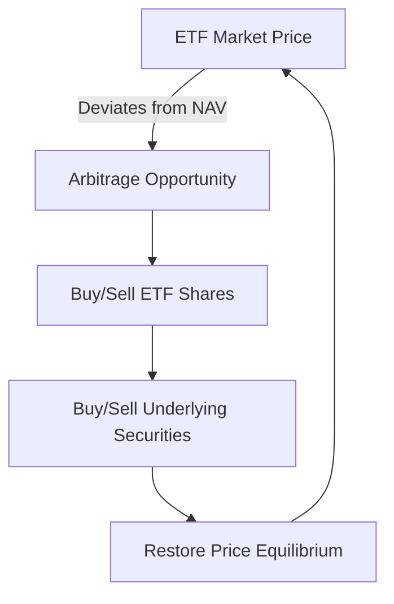

## 19.9 Tradability, Liquidity, and Continuous Price Discovery

Exchange-Traded Funds (ETFs) have revolutionized the investment landscape by combining the benefits of mutual funds with the flexibility of stock trading. In this section, we delve into the intricacies of ETF tradability, liquidity, and continuous price discovery, with a particular focus on the Canadian financial market.

### Tradability of ETFs

ETFs are unique in that they can be traded on stock exchanges throughout the trading day, much like individual stocks. This intraday tradability offers investors the flexibility to react to market movements in real-time, unlike mutual funds, which are priced only at the end of the trading day.

#### Key Features of ETF Tradability:

- **Real-Time Pricing:** ETFs are priced continuously throughout the trading day, allowing investors to buy or sell at prevailing market prices.
- **Market Orders and Limit Orders:** Investors can use various order types, such as market orders for immediate execution or limit orders to specify a desired price.
- **Access to Diverse Asset Classes:** ETFs provide exposure to a wide range of asset classes, including equities, bonds, commodities, and international markets.

### Liquidity and the Role of Underlying Securities

The liquidity of an ETF is closely tied to the liquidity of its underlying securities. Liquidity refers to the ease with which an asset can be bought or sold in the market without affecting its price. For ETFs, liquidity is a critical factor that influences trading efficiency and cost.

#### Factors Influencing ETF Liquidity:

- **Underlying Securities:** The liquidity of the securities held within the ETF directly impacts the ETF's liquidity. Highly liquid underlying assets, such as large-cap stocks, contribute to better ETF liquidity.
- **Market Makers and Authorized Participants (APs):** These entities facilitate ETF liquidity by creating and redeeming ETF shares, ensuring that supply and demand are balanced.
- **Trading Volume:** Higher trading volumes generally indicate better liquidity, reducing the bid-ask spread and transaction costs.

### Continuous Price Discovery in ETFs

Price discovery is the process by which the market determines the price of an asset. In the context of ETFs, continuous price discovery is facilitated by the interplay of market forces and the arbitrage mechanism.

#### Mechanisms of Price Discovery:

- **Arbitrage Opportunities:** Arbitrage plays a crucial role in ETF price discovery. When the ETF's market price deviates from its Net Asset Value (NAV), arbitrageurs step in to exploit the price difference, bringing the ETF price back in line with its NAV.
- **Market Efficiency:** The presence of arbitrageurs and the transparency of ETF holdings contribute to market efficiency, ensuring that ETF prices reflect the true value of the underlying assets.

### Practical Example: Canadian ETFs

Consider a Canadian ETF that tracks the S&P/TSX Composite Index. The liquidity of this ETF is influenced by the liquidity of the large-cap Canadian stocks it holds. Market makers and APs actively manage the ETF's supply and demand, ensuring that its price remains close to its NAV. If the ETF's price diverges from its NAV, arbitrageurs can buy the ETF shares and sell the underlying stocks (or vice versa), profiting from the price difference and restoring equilibrium.

### Diagram: ETF Price Discovery Process

Below is a simplified diagram illustrating the ETF price discovery process through arbitrage:

### Best Practices and Common Pitfalls

- **Best Practices:**
  - Monitor the liquidity of both the ETF and its underlying securities to ensure efficient trading.
  - Use limit orders to manage price execution, especially in volatile markets.
  - Stay informed about market conditions and regulatory changes that may impact ETF performance.

- **Common Pitfalls:**
  - Ignoring the bid-ask spread, which can increase transaction costs.
  - Overlooking the impact of underlying security liquidity on ETF performance.
  - Failing to consider tax implications, such as capital gains distributions, when trading ETFs.

### Canadian Financial Regulations and Resources

Understanding the regulatory environment is crucial for effective ETF trading. In Canada, ETFs are subject to regulations by the Canadian Securities Administrators (CSA) and the Investment Industry Regulatory Organization of Canada (IIROC). These bodies ensure transparency, fair trading practices, and investor protection.

#### Additional Resources:

- **Books:**
  - *"Flash Boys: A Wall Street Revolt"* by Michael Lewis explores the complexities of high-frequency trading and its impact on markets, including ETFs.

- **Online Resources:**
  - **CFA Institute:** [Arbitrage in ETFs](https://www.cfainstitute.org/en/research/foundation/2018/arbitrage-in-etfs) provides insights into the role of arbitrage in ETF markets.

### Conclusion

ETFs offer a dynamic investment vehicle with the benefits of tradability, liquidity, and continuous price discovery. By understanding these mechanisms, investors can make informed decisions and optimize their investment strategies within the Canadian market. As you explore the world of ETFs, consider the interplay of market forces, regulatory frameworks, and practical strategies to enhance your investment outcomes.

### **Ready to Test Your Knowledge?**

**Practice 10 Essential CSC Exam Questions to Master Your Certification**



### What is a key feature of ETF tradability?

- [x] Real-time pricing
- [ ] End-of-day pricing
- [ ] Monthly pricing
- [ ] Quarterly pricing

> **Explanation:** ETFs are priced continuously throughout the trading day, allowing investors to buy or sell at prevailing market prices.

### How does the liquidity of underlying securities affect ETF liquidity?

- [x] Directly impacts ETF liquidity
- [ ] Has no impact on ETF liquidity
- [ ] Only affects ETF liquidity during market crashes
- [ ] Affects ETF liquidity only in the short term

> **Explanation:** The liquidity of the securities held within the ETF directly impacts the ETF's liquidity, as highly liquid underlying assets contribute to better ETF liquidity.

### What role do market makers and authorized participants play in ETF liquidity?

- [x] Facilitate ETF liquidity by creating and redeeming ETF shares
- [ ] Only trade ETFs for their own accounts
- [ ] Set the ETF's market price
- [ ] Regulate ETF trading hours

> **Explanation:** Market makers and authorized participants facilitate ETF liquidity by creating and redeeming ETF shares, ensuring that supply and demand are balanced.

### What is the process by which the market determines the price of an asset?

- [x] Price discovery
- [ ] Arbitrage
- [ ] Liquidity assessment
- [ ] Market analysis

> **Explanation:** Price discovery is the process by which the market determines the price of an asset.

### How do arbitrage opportunities contribute to ETF price discovery?

- [x] By exploiting price differences between the ETF's market price and its NAV
- [ ] By setting the ETF's market price
- [x] By restoring price equilibrium
- [ ] By increasing the ETF's trading volume

> **Explanation:** Arbitrage opportunities contribute to ETF price discovery by exploiting price differences between the ETF's market price and its NAV, restoring price equilibrium.

### What is a common pitfall when trading ETFs?

- [x] Ignoring the bid-ask spread
- [ ] Using limit orders
- [ ] Monitoring liquidity
- [ ] Considering tax implications

> **Explanation:** Ignoring the bid-ask spread can increase transaction costs, making it a common pitfall when trading ETFs.

### Which Canadian regulatory body oversees ETF trading practices?

- [x] Canadian Securities Administrators (CSA)
- [ ] Federal Reserve
- [x] Investment Industry Regulatory Organization of Canada (IIROC)
- [ ] Securities and Exchange Commission (SEC)

> **Explanation:** The Canadian Securities Administrators (CSA) and the Investment Industry Regulatory Organization of Canada (IIROC) oversee ETF trading practices in Canada.

### What is a benefit of using limit orders when trading ETFs?

- [x] Managing price execution
- [ ] Immediate execution at any price
- [ ] Avoiding transaction costs
- [ ] Increasing trading volume

> **Explanation:** Limit orders allow investors to manage price execution by specifying a desired price for buying or selling ETFs.

### Which book explores the complexities of high-frequency trading and its impact on markets?

- [x] "Flash Boys: A Wall Street Revolt" by Michael Lewis
- [ ] "The Intelligent Investor" by Benjamin Graham
- [ ] "A Random Walk Down Wall Street" by Burton Malkiel
- [ ] "The Little Book of Common Sense Investing" by John C. Bogle

> **Explanation:** "Flash Boys: A Wall Street Revolt" by Michael Lewis explores the complexities of high-frequency trading and its impact on markets, including ETFs.

### True or False: ETFs can only be traded at the end of the trading day.

- [ ] True
- [x] False

> **Explanation:** False. ETFs can be traded throughout the trading day, much like individual stocks.


