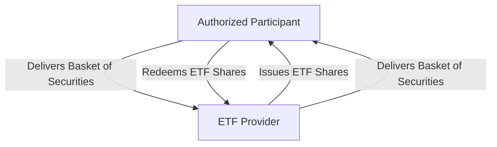

## 19.10 Low Tracking Error

In the realm of Exchange-Traded Funds (ETFs), tracking error is a critical metric that investors use to evaluate the performance of an ETF relative to its benchmark index. Understanding and managing tracking error is essential for both individual investors and financial professionals who aim to optimize investment strategies and achieve desired financial outcomes.

### Understanding Tracking Error

**Tracking Error** is defined as the performance difference between an ETF and its benchmark index. It is typically measured as the standard deviation of the difference between the returns of the ETF and the returns of the benchmark over a specific period. A low tracking error indicates that the ETF closely follows its benchmark, which is often desirable for investors seeking to replicate the index's performance.

#### Importance of Tracking Error

Tracking error is crucial for several reasons:

1. **Performance Evaluation:** It helps investors assess how well an ETF replicates its benchmark index, providing insights into the ETF's effectiveness in achieving its stated investment objective.

2. **Risk Management:** A low tracking error suggests lower deviation from the benchmark, which can be important for risk-averse investors who prefer predictable returns.

3. **Cost Efficiency:** ETFs with low tracking errors are often more cost-effective, as they incur fewer trading costs and management fees, which can erode returns over time.

### Factors Contributing to Tracking Error

Several factors can contribute to tracking error in ETFs:

1. **Management Fees and Expenses:** ETFs charge management fees, which can create a drag on performance relative to the benchmark. Lower fees generally result in a lower tracking error.

2. **Trading Costs:** The costs associated with buying and selling securities to replicate the index can contribute to tracking error. These costs include bid-ask spreads and market impact costs.

3. **Sampling Methods:** Some ETFs use sampling techniques rather than full replication to track an index. This approach can lead to tracking error if the sample does not perfectly mirror the index's performance.

4. **Dividend Reinvestment:** Timing differences in dividend reinvestment can also cause tracking error, especially if the ETF reinvests dividends at different times than the index.

5. **Currency Fluctuations:** For ETFs tracking international indices, currency fluctuations can introduce tracking error if the ETF does not hedge its currency exposure.

### Minimizing Tracking Error: The In-Kind Exchange Process

ETFs employ several strategies to minimize tracking error, one of which is the in-kind exchange process. This process involves the creation and redemption of ETF shares through the exchange of a basket of securities that mirrors the ETF's holdings. Here's how it works:

1. **Creation Units:** Authorized participants (APs) can create new ETF shares by delivering a basket of securities to the ETF provider. This basket typically matches the composition of the ETF's underlying index.

2. **Redemption Units:** Conversely, APs can redeem ETF shares by receiving a basket of securities from the ETF provider. This process helps maintain the ETF's alignment with its benchmark index.

3. **Efficiency and Cost Reduction:** The in-kind exchange process reduces the need for the ETF to buy or sell securities in the open market, thereby minimizing trading costs and reducing tracking error.

### Practical Example: Canadian ETFs

Consider a Canadian ETF that tracks the S&P/TSX Composite Index. The ETF aims to replicate the index's performance by holding a portfolio of Canadian equities. By employing the in-kind exchange process, the ETF can efficiently manage its portfolio to minimize tracking error. This process ensures that the ETF's holdings closely match the index, reducing discrepancies in performance.

### Diagram: In-Kind Exchange Process

Below is a diagram illustrating the in-kind exchange process for ETFs:

### Best Practices for Investors

- **Evaluate Fees:** Choose ETFs with low management fees to reduce the impact on tracking error.
- **Consider Full Replication:** When possible, select ETFs that use full replication rather than sampling to minimize tracking error.
- **Monitor Performance:** Regularly review the ETF's performance relative to its benchmark to ensure it aligns with your investment goals.

### Common Challenges and Solutions

- **Market Volatility:** During periods of high market volatility, tracking error may increase. Investors should be aware of this and consider it when evaluating ETF performance.
- **Currency Risk:** For international ETFs, consider currency-hedged options to mitigate the impact of currency fluctuations on tracking error.

### References and Further Reading

For those interested in exploring tracking error and ETF performance further, consider the following resources:

- **Books:**
  - *"Active Portfolio Management: A Quantitative Approach for Producing Superior Returns and Controlling Risk"* by Richard C. Grinold and Ronald N. Kahn

- **Online Courses:**
  - **Coursera:** [Financial Markets Risk Management](https://www.coursera.org/learn/financial-markets-risk-management)

- **Canadian Financial Regulations:**
  - Visit the [Canadian Securities Administrators (CSA)](https://www.securities-administrators.ca/) for information on ETF regulations and guidelines.

### Conclusion

Understanding and managing tracking error is vital for investors seeking to optimize their ETF investments. By considering factors such as fees, trading costs, and sampling methods, and by leveraging processes like in-kind exchanges, investors can minimize tracking error and enhance their portfolio's performance. As you continue to explore the world of ETFs, remember to apply these insights to your investment strategies and stay informed about the latest developments in the Canadian financial markets.

### **Ready to Test Your Knowledge?**

**Practice 10 Essential CSC Exam Questions to Master Your Certification**



### What is tracking error?

- [x] The performance difference between an ETF and its benchmark index.
- [ ] The total return of an ETF over a period.
- [ ] The volatility of an ETF's returns.
- [ ] The management fee charged by an ETF.

> **Explanation:** Tracking error measures how closely an ETF follows its benchmark index, highlighting performance differences.

### Which factor contributes to tracking error?

- [x] Management fees
- [ ] Dividend yield
- [ ] Market capitalization
- [ ] Interest rates

> **Explanation:** Management fees can create a drag on performance, contributing to tracking error.

### How do ETFs minimize tracking error through the in-kind exchange process?

- [x] By exchanging a basket of securities that mirrors the ETF's holdings
- [ ] By buying and selling securities in the open market
- [ ] By adjusting management fees
- [ ] By changing the ETF's benchmark index

> **Explanation:** The in-kind exchange process involves exchanging a basket of securities, reducing trading costs and tracking error.

### What is a common method used by ETFs to replicate an index?

- [x] Full replication
- [ ] Dividend reinvestment
- [ ] Currency hedging
- [ ] Market timing

> **Explanation:** Full replication involves holding all the securities in the index, minimizing tracking error.

### Which of the following can increase tracking error during high market volatility?

- [x] Market volatility
- [ ] Low management fees
- [ ] High dividend yield
- [ ] Currency hedging

> **Explanation:** High market volatility can lead to increased tracking error due to rapid price changes.

### What is the role of authorized participants in the in-kind exchange process?

- [x] They create and redeem ETF shares by exchanging securities.
- [ ] They set the ETF's management fees.
- [ ] They determine the ETF's benchmark index.
- [ ] They manage the ETF's portfolio.

> **Explanation:** Authorized participants facilitate the creation and redemption of ETF shares through the in-kind exchange process.

### Why might an investor choose an ETF with low tracking error?

- [x] To closely replicate the benchmark index
- [ ] To achieve higher returns than the benchmark
- [x] To reduce risk and increase predictability
- [ ] To avoid paying management fees

> **Explanation:** Low tracking error indicates close replication of the benchmark, reducing risk and increasing predictability.

### What is a potential challenge for ETFs tracking international indices?

- [x] Currency fluctuations
- [ ] High management fees
- [ ] Low dividend yields
- [ ] Small market capitalization

> **Explanation:** Currency fluctuations can introduce tracking error if not hedged.

### How can investors mitigate the impact of currency fluctuations on tracking error?

- [x] By choosing currency-hedged ETFs
- [ ] By selecting ETFs with high dividend yields
- [ ] By investing in domestic ETFs only
- [ ] By avoiding ETFs altogether

> **Explanation:** Currency-hedged ETFs can mitigate the impact of currency fluctuations on tracking error.

### True or False: A high tracking error is desirable for risk-averse investors.

- [ ] True
- [x] False

> **Explanation:** Risk-averse investors typically prefer low tracking error for more predictable returns.


