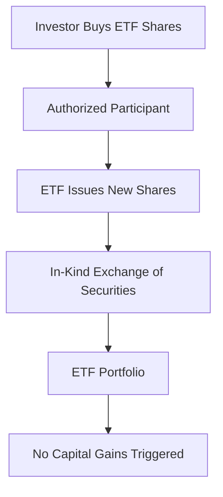

## 19.11 Tax Efficiency

Exchange-Traded Funds (ETFs) have gained popularity among investors for their cost-effectiveness, flexibility, and, notably, their tax efficiency. Understanding how ETFs achieve tax efficiency is crucial for investors looking to maximize their after-tax returns. This section delves into the mechanisms behind ETFs' tax efficiency, compares them with mutual funds, and provides practical insights for investors in the Canadian context.

### How ETFs Achieve Tax Efficiency

#### Low Portfolio Turnover

One of the primary ways ETFs achieve tax efficiency is through low portfolio turnover. Portfolio turnover refers to the frequency with which securities within a fund are bought and sold. High turnover can lead to capital gains distributions, which are taxable events for investors. ETFs typically have lower turnover rates compared to mutual funds because they often track indices, which do not change frequently. This passive management style minimizes the realization of capital gains within the fund.

#### In-Kind Creation/Redemption Process

Another significant factor contributing to the tax efficiency of ETFs is the in-kind creation and redemption process. This mechanism allows ETFs to manage inflows and outflows of capital without triggering taxable events. When new shares of an ETF are created, authorized participants (APs) deliver a basket of securities that mirrors the ETF's portfolio, rather than cash. Similarly, when shares are redeemed, the ETF delivers the underlying securities to the APs. This in-kind exchange minimizes the need to sell securities, thereby avoiding capital gains distributions.

### Impact of Tax-Efficient Strategies on Investor Returns

Tax-efficient strategies employed by ETFs can significantly enhance investor returns. By minimizing capital gains distributions, investors can defer taxes until they sell their ETF shares, potentially benefiting from lower long-term capital gains tax rates. This deferral allows for the compounding of returns on a pre-tax basis, which can substantially increase the value of an investment over time.

### Comparing ETFs' Tax Efficiency with Mutual Funds

While both ETFs and mutual funds offer diversification and professional management, they differ significantly in their tax efficiency. Mutual funds often have higher portfolio turnover due to active management, leading to more frequent capital gains distributions. Additionally, mutual fund investors are subject to capital gains taxes whenever the fund manager sells securities at a profit, regardless of whether the investor has sold their shares.

In contrast, the in-kind creation and redemption process of ETFs helps avoid these taxable events, making them more tax-efficient. This efficiency is particularly beneficial for investors in higher tax brackets or those investing in taxable accounts.

### Glossary

- **In-Kind Exchange:** A process by which securities are exchanged for ETF shares without involving cash transactions. This method helps avoid triggering capital gains taxes.
  
- **Capital Gains Distributions:** Payments made to investors from the profits realized by a fund from selling securities. These distributions are taxable to the investor.

### References and Further Exploration

For those interested in exploring tax-efficient investment strategies further, consider the following resources:

- **Books:**
  - *"Tax-Efficient Investment Strategies for Canada"* by Thomas Kirchhoff

- **Online Resources:**
  - **Canada Revenue Agency (CRA):** [Taxation of ETFs](https://www.canada.ca/en/revenue-agency/services/tax/businesses/topics/sole-proprietorships-partnerships/etf.html)

These resources provide comprehensive insights into the taxation of ETFs and strategies for optimizing tax efficiency in investment portfolios.

### Best Practices and Common Pitfalls

**Best Practices:**
- Consider holding ETFs in tax-advantaged accounts like RRSPs or TFSAs to maximize tax efficiency.
- Regularly review your portfolio to ensure it aligns with your tax strategy and investment goals.

**Common Pitfalls:**
- Ignoring the impact of taxes on investment returns can lead to suboptimal portfolio performance.
- Failing to understand the tax implications of different investment vehicles may result in unexpected tax liabilities.

### Conclusion

Understanding the tax efficiency of ETFs is essential for investors aiming to maximize their after-tax returns. By leveraging low portfolio turnover and the in-kind creation/redemption process, ETFs offer a tax-efficient investment vehicle that can significantly enhance long-term returns. By comparing ETFs with mutual funds and exploring tax-efficient strategies, investors can make informed decisions that align with their financial goals and tax situations.

### **Ready to Test Your Knowledge?**

**Practice 10 Essential CSC Exam Questions to Master Your Certification**



### How do ETFs achieve tax efficiency?

- [x] Through low portfolio turnover and in-kind creation/redemption
- [ ] By frequently trading securities
- [ ] By distributing high dividends
- [ ] By investing only in Canadian stocks

> **Explanation:** ETFs achieve tax efficiency primarily through low portfolio turnover and the in-kind creation/redemption process, which minimizes taxable events.

### What is the impact of low portfolio turnover on ETFs?

- [x] It minimizes capital gains distributions
- [ ] It increases management fees
- [ ] It leads to higher dividend payouts
- [ ] It reduces the number of available shares

> **Explanation:** Low portfolio turnover minimizes capital gains distributions, enhancing tax efficiency for investors.

### How does the in-kind creation/redemption process benefit ETF investors?

- [x] It avoids triggering capital gains taxes
- [ ] It increases the fund's cash reserves
- [ ] It requires frequent trading
- [ ] It limits the fund's investment options

> **Explanation:** The in-kind creation/redemption process allows ETFs to manage inflows and outflows without triggering capital gains taxes, benefiting investors.

### What is a capital gains distribution?

- [x] Payments made to investors from profits realized by a fund from selling securities
- [ ] Interest payments made to bondholders
- [ ] Dividends paid by a company to its shareholders
- [ ] Fees charged by a fund manager

> **Explanation:** Capital gains distributions are payments made to investors from the profits a fund realizes from selling securities.

### How do mutual funds compare to ETFs in terms of tax efficiency?

- [x] Mutual funds often have higher portfolio turnover, leading to more frequent capital gains distributions
- [ ] Mutual funds are always more tax-efficient than ETFs
- [x] ETFs generally have lower portfolio turnover, making them more tax-efficient
- [ ] Mutual funds and ETFs have the same tax efficiency

> **Explanation:** Mutual funds typically have higher portfolio turnover, resulting in more frequent capital gains distributions, whereas ETFs are generally more tax-efficient due to lower turnover.

### What is an in-kind exchange?

- [x] A process by which securities are exchanged for ETF shares without involving cash transactions
- [ ] A method of exchanging currency for commodities
- [ ] A strategy for increasing portfolio turnover
- [ ] A way to increase dividend payouts

> **Explanation:** An in-kind exchange involves exchanging securities for ETF shares without cash transactions, helping avoid capital gains taxes.

### Why might an investor choose to hold ETFs in a tax-advantaged account?

- [x] To maximize tax efficiency
- [ ] To increase portfolio turnover
- [x] To defer taxes on investment gains
- [ ] To reduce management fees

> **Explanation:** Holding ETFs in tax-advantaged accounts like RRSPs or TFSAs can maximize tax efficiency and defer taxes on investment gains.

### What is a common pitfall when investing in ETFs?

- [x] Ignoring the impact of taxes on investment returns
- [ ] Investing only in Canadian stocks
- [ ] Holding ETFs in tax-advantaged accounts
- [ ] Using the in-kind redemption process

> **Explanation:** A common pitfall is ignoring the impact of taxes on investment returns, which can lead to suboptimal portfolio performance.

### What is the benefit of deferring taxes on investment gains?

- [x] It allows for the compounding of returns on a pre-tax basis
- [ ] It increases the fund's cash reserves
- [ ] It reduces the number of available shares
- [ ] It limits the fund's investment options

> **Explanation:** Deferring taxes on investment gains allows for the compounding of returns on a pre-tax basis, potentially increasing the value of an investment over time.

### ETFs are generally more tax-efficient than mutual funds.

- [x] True
- [ ] False

> **Explanation:** ETFs are generally more tax-efficient than mutual funds due to their low portfolio turnover and in-kind creation/redemption process.


