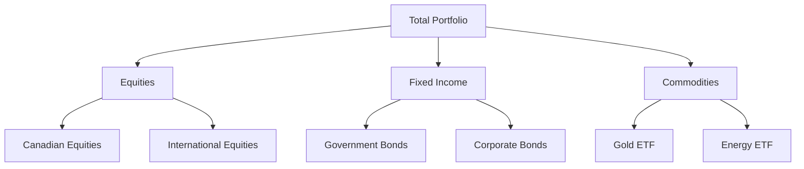

## 19.13 Low Cost Diversification

In the realm of investment, diversification is a fundamental strategy aimed at reducing risk by allocating investments across various financial instruments, industries, and other categories. Exchange-Traded Funds (ETFs) have emerged as a powerful tool for achieving low-cost diversification, providing investors with access to a wide array of asset classes, sectors, and geographies. This section delves into how ETFs facilitate diversified exposure, the benefits of diversification in mitigating unsystematic risk, and offers practical examples of diversified ETFs.

### Understanding Diversification

**Diversification** is the strategy of spreading investments across various assets to reduce exposure to any single asset or risk. By diversifying a portfolio, investors can minimize the impact of poor performance in any one investment, thereby reducing unsystematic risk, which is the risk associated with a specific company or industry.

**Asset Allocation** is the process of dividing a portfolio among different asset categories, such as stocks, bonds, and cash, to optimize risk and return. This strategic allocation is crucial in achieving diversification.

### The Role of ETFs in Diversification

ETFs are investment funds traded on stock exchanges, much like stocks. They hold assets such as stocks, commodities, or bonds and generally operate with an arbitrage mechanism designed to keep trading close to its net asset value, though deviations can occasionally occur. Here’s how ETFs provide diversified exposure:

1. **Broad Market Exposure**: ETFs can track broad market indices, such as the S&P/TSX Composite Index, providing exposure to a wide range of sectors and industries within the Canadian market.

2. **Sector-Specific ETFs**: Investors can choose ETFs that focus on specific sectors, such as technology or healthcare, allowing for targeted diversification within a broader portfolio.

3. **Geographical Diversification**: Global ETFs offer exposure to international markets, enabling investors to diversify beyond domestic borders and tap into growth opportunities in emerging markets.

4. **Asset Class Diversification**: ETFs are available for various asset classes, including equities, fixed income, commodities, and real estate, allowing investors to balance their portfolios according to their risk tolerance and investment goals.

### Benefits of Low-Cost Diversification with ETFs

1. **Cost Efficiency**: ETFs typically have lower expense ratios compared to mutual funds, making them a cost-effective choice for diversification. This is particularly beneficial for long-term investors seeking to minimize fees.

2. **Liquidity and Flexibility**: ETFs are traded on exchanges, providing liquidity and the ability to buy or sell throughout the trading day at market prices. This flexibility is advantageous for active portfolio management.

3. **Tax Efficiency**: Due to their structure, ETFs often generate fewer capital gains distributions compared to mutual funds, offering potential tax advantages for Canadian investors.

4. **Risk Reduction**: By spreading investments across various sectors and geographies, ETFs help reduce unsystematic risk, enhancing the stability of the investment portfolio.

### Examples of Diversified ETFs

1. **iShares Core S&P/TSX Capped Composite Index ETF (XIC)**: This ETF provides exposure to the Canadian equity market by tracking the S&P/TSX Capped Composite Index, offering diversification across multiple sectors.

2. **Vanguard FTSE Canada All Cap Index ETF (VCN)**: VCN offers exposure to a broad range of Canadian equities, including large, mid, and small-cap stocks, ensuring comprehensive market coverage.

3. **BMO MSCI All Country World High Quality Index ETF (ZGQ)**: This ETF provides global diversification by investing in high-quality companies across developed and emerging markets.

4. **Horizons Active Canadian Bond ETF (HAD)**: For fixed income diversification, HAD invests in a diversified portfolio of Canadian bonds, including government and corporate bonds.

### Practical Application: Building a Diversified Portfolio with ETFs

To illustrate the practical application of ETFs in building a diversified portfolio, consider the following asset allocation strategy:

In this example, the portfolio is divided among equities, fixed income, and commodities. Within equities, there is further diversification between Canadian and international stocks. Fixed income is split between government and corporate bonds, while commodities include gold and energy ETFs. This diversified approach helps balance risk and potential returns.

### Best Practices and Common Pitfalls

**Best Practices:**
- Regularly review and rebalance your portfolio to maintain desired asset allocation.
- Consider the correlation between different asset classes to optimize diversification benefits.
- Stay informed about market trends and economic indicators that may impact your investments.

**Common Pitfalls:**
- Over-diversification can dilute potential returns; focus on quality over quantity.
- Ignoring fees and expenses can erode returns over time; choose low-cost ETFs.
- Failing to align investment choices with financial goals and risk tolerance.

### Canadian Financial Regulations and Resources

Investors should be aware of Canadian financial regulations and institutions that govern ETF investments. The Canadian Investment Regulatory Organization (CIRO) oversees the securities industry, ensuring investor protection and market integrity.

For further exploration, consider the following resources:

- **Books:**
  - *"The Bogleheads' Guide to Investing"* by Taylor Larimore, Mel Lindauer, and Michael LeBoeuf

- **Online Resources:**
  - **Morningstar:** [Diversification Strategies](https://www.morningstar.com/lp/diversification-strategies)

These resources provide valuable insights into diversification strategies and investment principles.

### Conclusion

Low-cost diversification through ETFs offers a strategic advantage for investors seeking to optimize their portfolios. By leveraging the diverse range of ETFs available, investors can achieve broad market exposure, reduce unsystematic risk, and enhance their investment outcomes. As you continue your journey in the Canadian financial landscape, remember to apply these principles and strategies to build a resilient and diversified portfolio.

### **Ready to Test Your Knowledge?**

**Practice 10 Essential CSC Exam Questions to Master Your Certification**



### What is diversification?

- [x] The strategy of spreading investments across various assets to reduce exposure to any single asset or risk.
- [ ] The process of investing in a single asset class.
- [ ] The method of concentrating investments in one sector.
- [ ] The practice of investing only in domestic markets.

> **Explanation:** Diversification involves spreading investments across different assets to minimize risk.

### How do ETFs provide diversified exposure?

- [x] By tracking broad market indices.
- [x] By offering sector-specific ETFs.
- [ ] By investing only in a single company.
- [ ] By focusing solely on domestic markets.

> **Explanation:** ETFs can track broad indices and offer sector-specific options, providing diversified exposure.

### What is unsystematic risk?

- [x] The risk associated with a specific company or industry.
- [ ] The risk that affects the entire market.
- [ ] The risk of inflation.
- [ ] The risk of interest rate changes.

> **Explanation:** Unsystematic risk is specific to a company or industry and can be reduced through diversification.

### Which of the following is a benefit of ETFs?

- [x] Cost efficiency
- [ ] High expense ratios
- [ ] Limited trading flexibility
- [ ] High tax liability

> **Explanation:** ETFs are known for their cost efficiency, offering lower expense ratios compared to mutual funds.

### What does asset allocation involve?

- [x] Dividing a portfolio among different asset categories.
- [ ] Investing only in equities.
- [ ] Concentrating investments in one sector.
- [ ] Avoiding international markets.

> **Explanation:** Asset allocation involves dividing a portfolio among various asset categories to balance risk and return.

### Which ETF provides exposure to Canadian equities?

- [x] iShares Core S&P/TSX Capped Composite Index ETF (XIC)
- [ ] BMO MSCI All Country World High Quality Index ETF (ZGQ)
- [ ] Horizons Active Canadian Bond ETF (HAD)
- [ ] Vanguard FTSE Canada All Cap Index ETF (VCN)

> **Explanation:** XIC tracks the S&P/TSX Capped Composite Index, providing exposure to Canadian equities.

### What is a common pitfall in diversification?

- [x] Over-diversification
- [ ] Under-diversification
- [ ] Investing only in international markets
- [ ] Ignoring market trends

> **Explanation:** Over-diversification can dilute potential returns, so it's important to focus on quality investments.

### Which resource offers insights into diversification strategies?

- [x] Morningstar
- [ ] Canadian Investment Regulatory Organization (CIRO)
- [ ] The Bogleheads' Guide to Investing
- [ ] Horizons ETFs

> **Explanation:** Morningstar provides valuable insights into diversification strategies.

### What is a benefit of geographical diversification?

- [x] Exposure to international markets
- [ ] Concentration in domestic markets
- [ ] Increased unsystematic risk
- [ ] Higher fees

> **Explanation:** Geographical diversification provides exposure to international markets, reducing risk.

### True or False: ETFs are traded on exchanges like stocks.

- [x] True
- [ ] False

> **Explanation:** ETFs are traded on stock exchanges, offering liquidity and flexibility similar to stocks.


