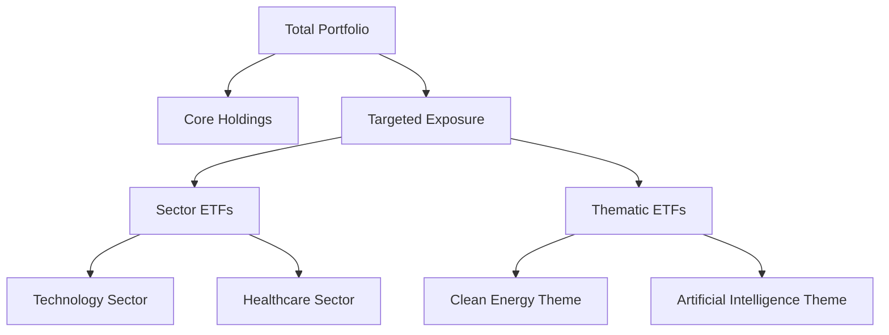

## 19.14 Targeted Exposure

Exchange-Traded Funds (ETFs) have revolutionized the investment landscape by offering investors a versatile tool to gain targeted exposure to specific sectors, regions, or investment themes. This section delves into the mechanics of how ETFs provide such exposure, the benefits they offer, and their role in democratizing access to specialized investment areas.

### Understanding Targeted Exposure Through ETFs

ETFs are investment funds traded on stock exchanges, much like stocks. They hold assets such as stocks, commodities, or bonds and generally operate with an arbitrage mechanism designed to keep trading close to its net asset value, though deviations can occasionally occur. Targeted exposure through ETFs allows investors to focus on specific segments of the market, aligning their portfolios with particular sectors, regions, or themes.

#### Sector ETFs

A **Sector ETF** is designed to track the performance of a specific industry sector. For instance, a technology sector ETF might include stocks from companies like Shopify or BlackBerry, providing investors with exposure to the tech industry's growth potential. Sector ETFs are beneficial for investors who have a strong conviction about the future performance of a particular industry but want to avoid the risks associated with picking individual stocks.

#### Thematic ETFs

**Thematic ETFs** focus on broader investment themes or trends, such as clean energy, artificial intelligence, or cybersecurity. These ETFs allow investors to capitalize on long-term structural changes in the economy. For example, a clean energy ETF might include companies involved in renewable energy production, offering exposure to the growing demand for sustainable energy solutions.

### Benefits of Targeted Exposure

Targeted exposure through ETFs offers several advantages:

1. **Diversification**: By investing in a basket of securities within a specific sector or theme, investors can achieve diversification, reducing the risk associated with individual stock performance.

2. **Cost-Effectiveness**: ETFs typically have lower expense ratios compared to mutual funds, making them a cost-effective option for gaining exposure to specific market segments.

3. **Liquidity and Flexibility**: ETFs are traded on exchanges, providing liquidity and the flexibility to buy or sell shares throughout the trading day at market prices.

4. **Strategic Allocation**: Investors can use targeted ETFs to implement specific strategies, such as overweighting a sector expected to outperform or hedging against potential downturns in other areas.

### Democratizing Access to Specialized Investments

Historically, access to specialized investment areas was often limited to institutional investors due to the complexity and cost involved. ETFs have democratized this access, allowing individual investors to participate in niche markets and investment themes with relative ease.

For example, a Canadian investor interested in the global robotics industry can invest in a thematic ETF focused on robotics and automation, gaining exposure to international companies driving innovation in this field. This accessibility empowers individual investors to align their portfolios with their investment beliefs and goals.

### Practical Examples and Case Studies

#### Canadian Pension Funds and Sector ETFs

Canadian pension funds, such as the Canada Pension Plan Investment Board (CPPIB), often use sector ETFs to gain exposure to specific industries while maintaining a diversified portfolio. For instance, during periods of economic growth, a pension fund might increase its allocation to financial sector ETFs to capitalize on the banking industry's expansion.

#### Major Canadian Banks and Thematic ETFs

Major Canadian banks like RBC and TD offer thematic ETFs to their clients, enabling them to invest in emerging trends. RBC's Vision Funds, for example, include thematic ETFs focused on innovation and sustainability, allowing investors to tap into the growth potential of these transformative sectors.

### Implementing Targeted Exposure in Your Portfolio

To effectively implement targeted exposure in your portfolio, consider the following steps:

1. **Identify Investment Goals**: Determine your investment objectives and risk tolerance. Are you looking to capitalize on a specific sector's growth, or do you want to hedge against potential risks?

2. **Research ETFs**: Conduct thorough research on available ETFs that align with your goals. Consider factors such as the ETF's underlying index, expense ratio, and historical performance.

3. **Diversify**: While targeted exposure can enhance returns, it's essential to maintain a diversified portfolio to mitigate risks.

4. **Monitor and Adjust**: Regularly review your portfolio's performance and adjust your allocations as needed to stay aligned with your investment strategy.

### Visualizing Targeted Exposure

Below is a diagram illustrating how targeted exposure through ETFs can be integrated into a diversified investment portfolio.

### Best Practices and Common Pitfalls

**Best Practices:**

- **Stay Informed**: Keep abreast of market trends and economic indicators that may impact the sectors or themes you are invested in.
- **Use Stop-Loss Orders**: Protect your investments by setting stop-loss orders to limit potential losses.

**Common Pitfalls:**

- **Overconcentration**: Avoid overconcentrating your portfolio in a single sector or theme, which can increase risk.
- **Neglecting Costs**: While ETFs are generally cost-effective, be mindful of trading fees and expense ratios that can erode returns.

### References and Further Exploration

For those interested in deepening their understanding of ETFs and targeted exposure, consider the following resources:

- **Books**: 
  - *"The ETF Book: All You Need to Know About Exchange-Traded Funds"* by Richard A. Ferri

- **Online Resources**:
  - **Investopedia**: [Thematic Investing with ETFs](https://www.investopedia.com/articles/investing/082614/thematic-investing-etfs.asp)

- **Canadian Financial Institutions**: Explore offerings from major Canadian banks and investment firms to understand the range of sector and thematic ETFs available.

### Conclusion

Targeted exposure through ETFs offers a powerful tool for investors seeking to align their portfolios with specific market segments or investment themes. By understanding the benefits and strategies associated with sector and thematic ETFs, investors can enhance their investment approach, capitalize on emerging opportunities, and achieve their financial goals.

### **Ready to Test Your Knowledge?**

**Practice 10 Essential CSC Exam Questions to Master Your Certification**



### What is a Sector ETF?

- [x] An ETF focused on a specific industry sector, such as technology or healthcare.
- [ ] An ETF that invests in a diversified portfolio of global stocks.
- [ ] An ETF that tracks the performance of a country's entire stock market.
- [ ] An ETF that focuses on short-term bonds.

> **Explanation:** A Sector ETF is designed to track the performance of a specific industry sector, providing targeted exposure to that sector.

### What is a Thematic ETF?

- [x] An ETF based on a specific investment theme or trend, such as clean energy or artificial intelligence.
- [ ] An ETF that invests in a broad range of commodities.
- [ ] An ETF that focuses on high-dividend stocks.
- [ ] An ETF that tracks the performance of emerging markets.

> **Explanation:** A Thematic ETF focuses on broader investment themes or trends, allowing investors to capitalize on long-term structural changes in the economy.

### Which of the following is a benefit of targeted exposure through ETFs?

- [x] Diversification
- [ ] Increased trading costs
- [ ] Limited market access
- [ ] Higher management fees

> **Explanation:** Targeted exposure through ETFs offers diversification by investing in a basket of securities within a specific sector or theme.

### How do ETFs democratize access to specialized investments?

- [x] By allowing individual investors to participate in niche markets and investment themes with relative ease.
- [ ] By restricting access to institutional investors only.
- [ ] By increasing the cost of entry for individual investors.
- [ ] By limiting the availability of sector-specific investments.

> **Explanation:** ETFs democratize access by making it easier for individual investors to invest in specialized areas that were previously accessible mainly to institutional investors.

### What is a common pitfall when investing in targeted ETFs?

- [x] Overconcentration in a single sector or theme.
- [ ] Diversifying across multiple sectors.
- [ ] Monitoring market trends.
- [ ] Using stop-loss orders.

> **Explanation:** Overconcentration in a single sector or theme can increase risk, making it a common pitfall when investing in targeted ETFs.

### Which Canadian financial institution is known for offering thematic ETFs?

- [x] RBC
- [ ] Amazon
- [ ] Google
- [ ] Apple

> **Explanation:** RBC offers thematic ETFs, such as those focused on innovation and sustainability, allowing investors to tap into transformative sectors.

### What should investors consider when implementing targeted exposure in their portfolio?

- [x] Identifying investment goals and risk tolerance.
- [ ] Ignoring market trends.
- [ ] Avoiding diversification.
- [ ] Focusing solely on short-term gains.

> **Explanation:** Investors should identify their investment goals and risk tolerance to effectively implement targeted exposure in their portfolio.

### What is a benefit of ETFs being traded on exchanges?

- [x] Liquidity and flexibility to buy or sell shares throughout the trading day.
- [ ] Limited trading hours.
- [ ] Higher transaction costs.
- [ ] Restricted access to institutional investors.

> **Explanation:** ETFs being traded on exchanges provide liquidity and flexibility, allowing investors to buy or sell shares throughout the trading day.

### True or False: ETFs typically have higher expense ratios compared to mutual funds.

- [ ] True
- [x] False

> **Explanation:** ETFs typically have lower expense ratios compared to mutual funds, making them a cost-effective option for investors.


