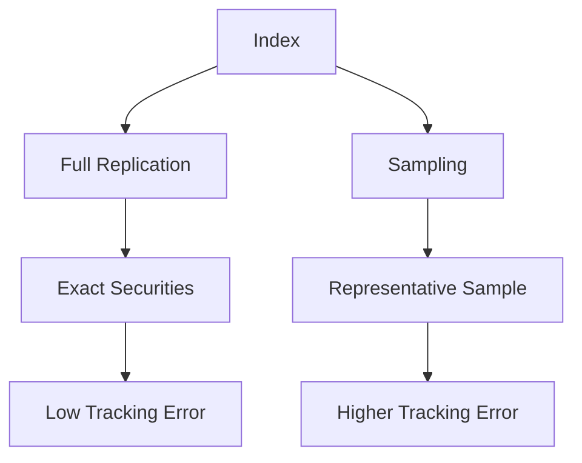

## 19.16 Standard Exchange-Traded Funds

Exchange-Traded Funds (ETFs) have become a cornerstone of modern investment strategies, offering a blend of flexibility, diversification, and cost-effectiveness. Among the various types of ETFs, standard or index-based ETFs are particularly popular due to their straightforward approach to tracking market indices. This section delves into the mechanics of standard ETFs, focusing on the full replication and sampling methods, and provides practical insights into their application within the Canadian financial landscape.

### Understanding Standard (Index-Based) ETFs

Standard ETFs are designed to replicate the performance of a specific index, such as the S&P/TSX 60, which represents the 60 largest companies on the Toronto Stock Exchange. These ETFs aim to mirror the index's returns by holding a portfolio of securities that reflects the index's composition. The two primary methods for achieving this are full replication and sampling.

#### Full Replication

**Full Replication** is an indexing method where the ETF holds all the securities in the index in the exact proportions. This approach ensures that the ETF's performance closely matches the index, as it directly mirrors the index's composition.

**Benefits of Full Replication:**
- **Accuracy:** Provides precise tracking of the index, minimizing tracking error.
- **Transparency:** Investors can easily understand the ETF's holdings, as they directly reflect the index.
- **Predictability:** Changes in the index are directly mirrored in the ETF, offering predictable performance.

**Limitations of Full Replication:**
- **Cost:** Managing a large number of securities can be expensive, especially in indices with many constituents.
- **Liquidity:** Some securities in the index may be illiquid, making them difficult to trade without impacting the market price.

#### Sampling

**Sampling** is an indexing method where the ETF holds a representative sample of securities from the index. This approach is often used when full replication is impractical due to cost or liquidity constraints.

**Benefits of Sampling:**
- **Cost-Effective:** Reduces transaction costs by holding fewer securities.
- **Flexibility:** Allows the ETF manager to optimize the portfolio for liquidity and cost considerations.

**Limitations of Sampling:**
- **Tracking Error:** May result in a higher tracking error compared to full replication, as the ETF does not hold all index securities.
- **Complexity:** Requires sophisticated modeling to ensure the sample accurately represents the index.

### Practical Examples of Standard ETFs

A prominent example of a standard ETF in Canada is the **iShares S&P/TSX 60 Index ETF (XIU)**. This ETF aims to replicate the performance of the S&P/TSX 60 Index, providing investors with exposure to the largest and most liquid companies in Canada. The XIU ETF employs a full replication strategy, holding all 60 securities in the index, which allows it to closely track the index's performance.

#### Case Study: iShares S&P/TSX 60 Index ETF

Consider an investor looking to gain exposure to the Canadian equity market. By investing in the iShares S&P/TSX 60 Index ETF, the investor benefits from:
- **Diversification:** Access to a broad range of sectors, including financials, energy, and materials.
- **Liquidity:** The ETF is highly liquid, allowing for easy entry and exit.
- **Cost Efficiency:** Lower management fees compared to actively managed funds.

### Visualizing ETF Replication Methods

To better understand the differences between full replication and sampling, consider the following diagram illustrating the two methods:

### Best Practices and Common Pitfalls

When investing in standard ETFs, consider the following best practices:
- **Understand the Index:** Ensure you are familiar with the index the ETF tracks and its sector composition.
- **Evaluate Costs:** Compare management fees and other costs associated with the ETF.
- **Monitor Tracking Error:** Regularly assess the ETF's tracking error to ensure it aligns with your investment goals.

Common pitfalls include neglecting to consider the impact of currency fluctuations on international ETFs and failing to diversify beyond a single ETF.

### Canadian Financial Regulations and Resources

Investors should be aware of Canadian financial regulations governing ETFs, such as those enforced by the Canadian Investment Regulatory Organization (CIRO). Additionally, resources like the Canadian Securities Administrators (CSA) provide valuable information on ETF regulations and investor protection.

For further exploration, consider the following resources:
- **Books:**
  - *"The ETF Book: All You Need to Know About Exchange-Traded Funds"* by Richard A. Ferri
- **Online Resources:**
  - **BlackRock:** [ETF Replication Strategies](https://www.blackrock.com/canada/insights/articles/replication-strategies-etf-tracking-innovation)

### Conclusion

Standard ETFs offer a compelling investment option for those seeking market exposure with the benefits of diversification and cost efficiency. By understanding the nuances of full replication and sampling methods, investors can make informed decisions that align with their financial goals. As the Canadian ETF market continues to evolve, staying informed about regulatory changes and market trends will be crucial for successful investing.

### **Ready to Test Your Knowledge?**

**Practice 10 Essential CSC Exam Questions to Master Your Certification**



### What is a standard (index-based) ETF primarily designed to do?

- [x] Replicate the performance of a specific index
- [ ] Outperform a specific index
- [ ] Minimize investment risk
- [ ] Provide guaranteed returns

> **Explanation:** Standard ETFs aim to replicate the performance of a specific index by holding a portfolio of securities that reflects the index's composition.

### Which method involves holding all the securities in the index in the exact proportions?

- [x] Full Replication
- [ ] Sampling
- [ ] Hedging
- [ ] Diversification

> **Explanation:** Full replication involves holding all the securities in the index in the exact proportions to ensure precise tracking.

### What is a primary benefit of the sampling method?

- [x] Cost-Effectiveness
- [ ] Exact Index Tracking
- [ ] Guaranteed Returns
- [ ] High Liquidity

> **Explanation:** Sampling is cost-effective as it reduces transaction costs by holding a representative sample of securities rather than all.

### Which ETF is an example of a standard ETF in Canada?

- [x] iShares S&P/TSX 60 Index ETF
- [ ] Vanguard Total World Stock ETF
- [ ] SPDR S&P 500 ETF
- [ ] Invesco QQQ Trust

> **Explanation:** The iShares S&P/TSX 60 Index ETF is a standard ETF in Canada that replicates the S&P/TSX 60 Index.

### What is a common limitation of full replication?

- [x] High Cost
- [ ] High Tracking Error
- [ ] Lack of Transparency
- [ ] Limited Diversification

> **Explanation:** Full replication can be costly due to the need to manage a large number of securities, especially in indices with many constituents.

### Which method might result in a higher tracking error?

- [x] Sampling
- [ ] Full Replication
- [ ] Hedging
- [ ] Diversification

> **Explanation:** Sampling might result in a higher tracking error because it holds a representative sample rather than all securities in the index.

### What should investors regularly assess in an ETF?

- [x] Tracking Error
- [ ] Guaranteed Returns
- [ ] Dividend Yield
- [ ] Historical Performance

> **Explanation:** Investors should regularly assess the ETF's tracking error to ensure it aligns with their investment goals.

### What is a benefit of investing in the iShares S&P/TSX 60 Index ETF?

- [x] Diversification
- [ ] Guaranteed Returns
- [ ] High Management Fees
- [ ] Limited Liquidity

> **Explanation:** Investing in the iShares S&P/TSX 60 Index ETF provides diversification across various sectors in the Canadian market.

### What is a common pitfall when investing in ETFs?

- [x] Neglecting currency fluctuations
- [ ] Over-diversification
- [ ] High management fees
- [ ] Guaranteed losses

> **Explanation:** A common pitfall is neglecting to consider the impact of currency fluctuations on international ETFs.

### True or False: Full replication always results in lower costs than sampling.

- [ ] True
- [x] False

> **Explanation:** Full replication can be more costly than sampling due to the need to manage a large number of securities.


