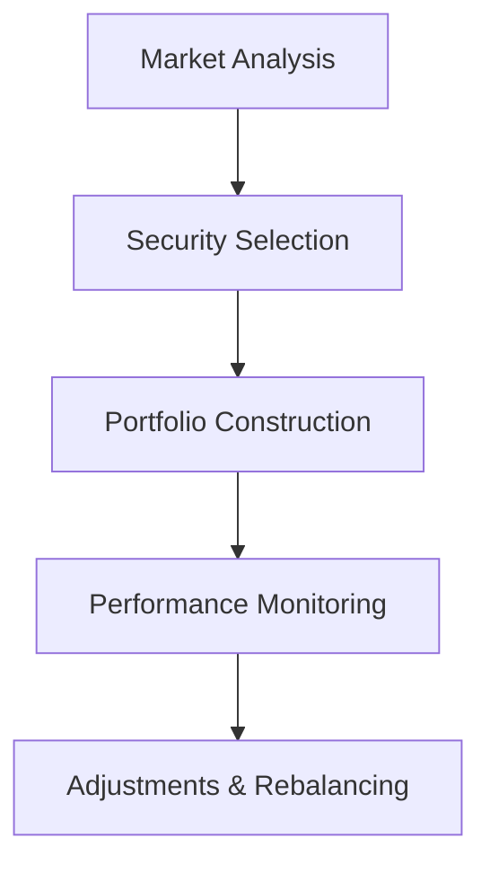

## 19.18 Active Exchange-Traded Funds

Exchange-Traded Funds (ETFs) have become a popular investment vehicle due to their flexibility, cost-effectiveness, and accessibility. Within the ETF universe, actively managed ETFs offer a unique proposition by combining the benefits of traditional ETFs with active management strategies. This section delves into the nuances of actively managed ETFs, their distinct characteristics, and the challenges they face, particularly in the Canadian financial market.

### Understanding Actively Managed ETFs

An **Actively Managed ETF** is a type of ETF where portfolio managers actively make investment decisions with the goal of outperforming a benchmark index. Unlike passive ETFs, which aim to replicate the performance of a specific index, actively managed ETFs leverage the expertise of fund managers to select securities they believe will provide superior returns.

#### Key Differences Between Active and Passive ETFs

1. **Investment Strategy:**
   - **Active ETFs:** Rely on the skill and judgment of portfolio managers to select investments. The goal is to outperform a benchmark index through strategic asset allocation and security selection.
   - **Passive ETFs:** Aim to mirror the performance of a specific index by holding a similar composition of securities. The focus is on minimizing tracking error and maintaining low costs.

2. **Cost Structure:**
   - **Active ETFs:** Typically have higher management fees compared to passive ETFs due to the active involvement of fund managers.
   - **Passive ETFs:** Generally have lower fees as they require less active management and trading.

3. **Performance Goals:**
   - **Active ETFs:** Seek to achieve returns that exceed the benchmark index, often taking on additional risk to do so.
   - **Passive ETFs:** Aim to match the performance of the index, focusing on consistency and predictability.

### Challenges in Managing Active ETFs

Managing an actively managed ETF presents several challenges, particularly in maintaining transparency and minimizing tracking error.

#### Tracking Error

Tracking error refers to the divergence between the performance of the ETF and its benchmark index. In actively managed ETFs, tracking error can be more pronounced due to the discretionary nature of investment decisions. Fund managers must carefully balance the pursuit of excess returns with the risk of deviating significantly from the benchmark.

#### Transparency

Transparency is a hallmark of ETFs, providing investors with insight into the fund's holdings and strategy. However, actively managed ETFs may face challenges in maintaining transparency while protecting proprietary investment strategies. This can lead to less frequent disclosure of holdings compared to passive ETFs, potentially impacting investor confidence.

### Examples of Actively Managed ETFs

In the Canadian market, several actively managed ETFs have gained prominence. One notable example is the **Horizons Active Emerging Markets Dividend ETF (HAJ)**. This ETF focuses on providing exposure to dividend-paying companies in emerging markets, leveraging active management to identify opportunities for growth and income.

### Regulatory Considerations

Actively managed ETFs in Canada are subject to regulations set forth by the Canadian Investment Regulatory Organization (CIRO) and other provincial regulatory bodies. These regulations ensure that ETFs operate transparently and in the best interest of investors.

### Practical Applications and Strategies

Investors considering actively managed ETFs should evaluate their investment goals, risk tolerance, and the expertise of the fund managers. Actively managed ETFs can be a valuable addition to a diversified portfolio, offering potential for enhanced returns through strategic asset allocation.

#### Case Study: Canadian Pension Funds

Canadian pension funds often utilize actively managed ETFs as part of their investment strategy. By leveraging the expertise of fund managers, these funds aim to achieve superior returns while managing risk. This approach allows pension funds to meet their long-term obligations to beneficiaries.

### Visualizing Active ETF Management

Below is a diagram illustrating the flow of decision-making in an actively managed ETF:

### Best Practices and Common Pitfalls

- **Best Practices:**
  - Conduct thorough due diligence on fund managers and their track record.
  - Diversify investments across multiple actively managed ETFs to mitigate risk.
  - Regularly review and adjust investment strategies based on market conditions.

- **Common Pitfalls:**
  - Over-reliance on past performance as an indicator of future success.
  - Ignoring the impact of higher fees on long-term returns.
  - Failing to understand the underlying investment strategy and risks.

### Additional Resources

For those interested in exploring actively managed ETFs further, consider the following resources:

- **Books:**
  - *"Active Portfolio Management: A Quantitative Approach for Producing Superior Returns and Selecting Superior Returns and Controlling Risk"* by Richard C. Grinold and Ronald N. Kahn

- **Online Resources:**
  - **Morningstar:** [Active ETFs](https://www.morningstar.com/articles/active-etf-investing)

These resources provide deeper insights into the strategies and considerations involved in actively managing ETFs.

### Conclusion

Actively managed ETFs offer a compelling investment option for those seeking to outperform market indices through strategic decision-making. By understanding the unique characteristics and challenges of these funds, investors can make informed decisions that align with their financial goals. As the Canadian ETF market continues to evolve, actively managed ETFs will play an increasingly important role in portfolio management.

### **Ready to Test Your Knowledge?**

**Practice 10 Essential CSC Exam Questions to Master Your Certification**



### What is the primary goal of an actively managed ETF?

- [x] To outperform a benchmark index
- [ ] To replicate a benchmark index
- [ ] To minimize management fees
- [ ] To avoid tracking error

> **Explanation:** Actively managed ETFs aim to outperform a benchmark index through strategic investment decisions made by fund managers.

### Which of the following is a key difference between active and passive ETFs?

- [x] Active ETFs rely on fund managers' expertise
- [ ] Passive ETFs have higher management fees
- [ ] Active ETFs aim to match index performance
- [ ] Passive ETFs are less transparent

> **Explanation:** Active ETFs rely on the expertise of fund managers to select investments, whereas passive ETFs aim to replicate an index.

### What is tracking error in the context of ETFs?

- [x] The divergence between the ETF's performance and its benchmark
- [ ] The cost associated with managing the ETF
- [ ] The transparency of the ETF's holdings
- [ ] The risk of investing in the ETF

> **Explanation:** Tracking error refers to the difference between the performance of the ETF and its benchmark index.

### Why might actively managed ETFs face challenges with transparency?

- [x] To protect proprietary investment strategies
- [ ] To reduce management fees
- [ ] To increase tracking error
- [ ] To comply with regulatory requirements

> **Explanation:** Actively managed ETFs may disclose holdings less frequently to protect proprietary investment strategies.

### Which of the following is an example of an actively managed ETF in Canada?

- [x] Horizons Active Emerging Markets Dividend ETF
- [ ] iShares S&P/TSX 60 Index ETF
- [ ] Vanguard FTSE Canada All Cap Index ETF
- [ ] BMO Aggregate Bond Index ETF

> **Explanation:** The Horizons Active Emerging Markets Dividend ETF is an example of an actively managed ETF in Canada.

### What is a common pitfall when investing in actively managed ETFs?

- [x] Over-reliance on past performance
- [ ] Diversifying investments
- [ ] Understanding the investment strategy
- [ ] Conducting due diligence

> **Explanation:** Investors may mistakenly rely too heavily on past performance as an indicator of future success.

### How can investors mitigate risk when investing in actively managed ETFs?

- [x] Diversify investments across multiple ETFs
- [ ] Focus solely on past performance
- [ ] Ignore management fees
- [ ] Avoid reviewing investment strategies

> **Explanation:** Diversifying investments across multiple actively managed ETFs can help mitigate risk.

### What role do Canadian pension funds play in the context of actively managed ETFs?

- [x] They use actively managed ETFs for superior returns
- [ ] They avoid actively managed ETFs due to high fees
- [ ] They focus exclusively on passive ETFs
- [ ] They do not invest in ETFs

> **Explanation:** Canadian pension funds often use actively managed ETFs to achieve superior returns while managing risk.

### Which regulatory body oversees actively managed ETFs in Canada?

- [x] Canadian Investment Regulatory Organization (CIRO)
- [ ] Securities and Exchange Commission (SEC)
- [ ] Financial Conduct Authority (FCA)
- [ ] European Securities and Markets Authority (ESMA)

> **Explanation:** The Canadian Investment Regulatory Organization (CIRO) oversees actively managed ETFs in Canada.

### True or False: Actively managed ETFs typically have lower management fees than passive ETFs.

- [ ] True
- [x] False

> **Explanation:** Actively managed ETFs generally have higher management fees due to the active involvement of fund managers.


