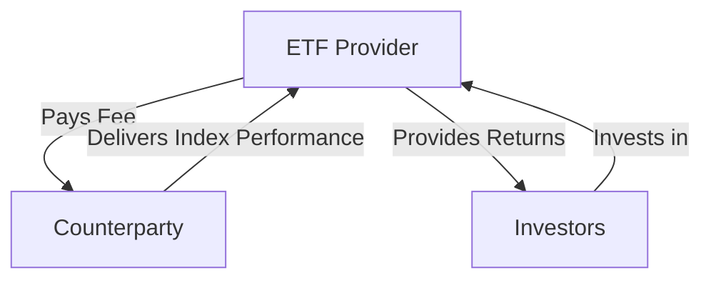

## 19.19 Synthetic Exchange-Traded Funds

Synthetic Exchange-Traded Funds (ETFs) have emerged as a sophisticated financial instrument within the investment landscape, offering unique opportunities and challenges. This section delves into the construction, benefits, and risks of synthetic ETFs, with a specific focus on the Canadian financial context.

### Understanding Synthetic ETFs

Synthetic ETFs are a type of exchange-traded fund that aim to replicate the performance of an index or asset through the use of derivatives, rather than by holding the physical securities of the index. The most common derivative used in synthetic ETFs is a swap.

#### Construction of Synthetic ETFs

The construction of synthetic ETFs involves entering into a swap agreement with a counterparty, typically a financial institution. In this arrangement, the ETF provider agrees to pay the counterparty a fee, and in return, the counterparty agrees to deliver the performance of the index or asset that the ETF aims to replicate.

**Diagram: Construction of a Synthetic ETF Using a Swap**

In this setup, the ETF provider does not need to purchase the actual securities of the index, which can lead to cost savings and increased efficiency, especially in markets where acquiring the underlying assets is difficult or expensive.

### Benefits of Synthetic ETFs

Synthetic ETFs offer several advantages:

1. **Cost Efficiency**: By using swaps, synthetic ETFs can reduce transaction costs associated with buying and selling the underlying securities.

2. **Access to Hard-to-Reach Markets**: Synthetic ETFs can provide exposure to markets or asset classes that are otherwise difficult to access due to regulatory or logistical barriers.

3. **Tracking Accuracy**: The use of swaps can enhance the tracking accuracy of the ETF to its benchmark index, as the swap directly replicates the index performance.

4. **Liquidity**: Synthetic ETFs can offer greater liquidity, as they do not rely on the liquidity of the underlying securities.

### Risks Associated with Synthetic ETFs

Despite their benefits, synthetic ETFs come with inherent risks, primarily due to their reliance on derivatives:

1. **Counterparty Risk**: The most significant risk is counterparty risk, which is the possibility that the counterparty in the swap agreement may default on its obligations. This risk is particularly relevant in volatile market conditions.

2. **Complexity**: The use of derivatives makes synthetic ETFs more complex than traditional ETFs, which can be challenging for investors to fully understand.

3. **Regulatory Risk**: Changes in regulations affecting derivatives markets can impact the operation and viability of synthetic ETFs.

4. **Transparency**: Synthetic ETFs may lack transparency compared to physical ETFs, as investors may not have visibility into the specific derivatives used.

### Examples of Synthetic ETFs

In Canada, synthetic ETFs are less common than their physical counterparts, but they are available for investors seeking specific exposures. For example, a synthetic ETF might be used to gain exposure to international markets where direct investment is restricted or costly.

### Regulatory Considerations and Resources

Investors in Canada should be aware of the regulatory framework governing synthetic ETFs. The Canadian Securities Administrators (CSA) oversee the regulation of ETFs, including synthetic variants, ensuring they meet disclosure and operational standards.

For further exploration, consider the following resources:

- **Books**: *"Options, Futures, and Other Derivatives"* by John C. Hull provides an in-depth understanding of derivatives, including swaps used in synthetic ETFs.

- **Online Resources**: The CFA Institute offers a comprehensive guide on synthetic ETFs, available at [Synthetic ETFs Explained](https://www.cfainstitute.org/en/research/foundation/2019/synthetic-etf).

### Conclusion

Synthetic ETFs represent a powerful tool for investors seeking efficient and cost-effective exposure to various markets. However, they require a thorough understanding of the associated risks, particularly counterparty risk. By leveraging the insights and resources provided, investors can make informed decisions and effectively incorporate synthetic ETFs into their investment strategies.

### **Ready to Test Your Knowledge?**

**Practice 10 Essential CSC Exam Questions to Master Your Certification**



### What is a synthetic ETF primarily constructed with?

- [x] Swaps
- [ ] Bonds
- [ ] Stocks
- [ ] Commodities

> **Explanation:** Synthetic ETFs are primarily constructed using derivatives like swaps to replicate the performance of an index or asset.

### What is the main benefit of using synthetic ETFs?

- [x] Cost efficiency
- [ ] Increased volatility
- [ ] Reduced liquidity
- [ ] Higher transaction costs

> **Explanation:** Synthetic ETFs offer cost efficiency by reducing transaction costs associated with buying and selling underlying securities.

### What is a significant risk associated with synthetic ETFs?

- [x] Counterparty risk
- [ ] Inflation risk
- [ ] Currency risk
- [ ] Political risk

> **Explanation:** Counterparty risk is significant in synthetic ETFs due to the reliance on derivatives and the possibility of the counterparty defaulting.

### Which regulatory body oversees ETFs in Canada?

- [x] Canadian Securities Administrators (CSA)
- [ ] Financial Conduct Authority (FCA)
- [ ] Securities and Exchange Commission (SEC)
- [ ] European Securities and Markets Authority (ESMA)

> **Explanation:** The Canadian Securities Administrators (CSA) oversee the regulation of ETFs in Canada.

### What is a common derivative used in synthetic ETFs?

- [x] Swap
- [ ] Option
- [ ] Future
- [ ] Forward

> **Explanation:** Swaps are the most common derivative used in the construction of synthetic ETFs.

### Why might an investor choose a synthetic ETF over a physical ETF?

- [x] Access to hard-to-reach markets
- [ ] Higher fees
- [ ] Greater complexity
- [ ] Less transparency

> **Explanation:** Synthetic ETFs can provide access to markets or asset classes that are difficult to reach through physical ETFs.

### What is a potential drawback of synthetic ETFs compared to physical ETFs?

- [x] Lack of transparency
- [ ] Lower liquidity
- [ ] Higher transaction costs
- [ ] Reduced tracking accuracy

> **Explanation:** Synthetic ETFs may lack transparency compared to physical ETFs, as investors may not have visibility into the specific derivatives used.

### What type of risk is associated with the possibility of a counterparty defaulting?

- [x] Counterparty risk
- [ ] Market risk
- [ ] Liquidity risk
- [ ] Credit risk

> **Explanation:** Counterparty risk is the risk associated with the possibility of a counterparty defaulting on its obligations.

### How can synthetic ETFs enhance tracking accuracy?

- [x] By using swaps to directly replicate index performance
- [ ] By holding physical securities
- [ ] By increasing transaction costs
- [ ] By reducing liquidity

> **Explanation:** Synthetic ETFs use swaps to directly replicate the performance of an index, enhancing tracking accuracy.

### True or False: Synthetic ETFs are less complex than traditional ETFs.

- [ ] True
- [x] False

> **Explanation:** Synthetic ETFs are more complex than traditional ETFs due to their use of derivatives like swaps.


