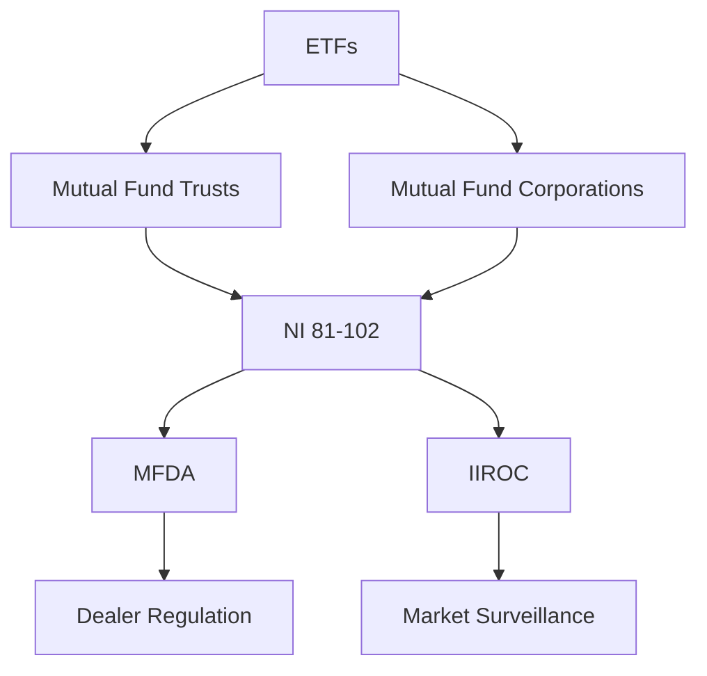

## 19.2 The Regulation and Structure of Exchange-Traded Funds

Exchange-Traded Funds (ETFs) have become a cornerstone of modern investment portfolios, offering a blend of mutual fund diversification and stock-like trading flexibility. In Canada, the regulation and structure of ETFs are governed by a robust framework designed to protect investors and ensure market integrity. This section delves into the regulatory requirements, structural nuances, and the roles of key regulatory bodies in the Canadian ETF landscape.

### Regulatory Requirements for ETFs

ETFs in Canada can be structured as either mutual fund trusts or mutual fund corporations. Each structure has distinct regulatory requirements and implications for investors.

#### Mutual Fund Trusts

Most Canadian ETFs are structured as mutual fund trusts. This structure allows for the flow-through of income to investors, which can be tax-efficient. The regulatory framework for mutual fund trusts is primarily governed by National Instrument 81-102 (NI 81-102), which sets out the operational rules for mutual funds, including ETFs.

#### Mutual Fund Corporations

Some ETFs may be structured as mutual fund corporations. This structure can offer tax advantages, particularly in managing capital gains distributions. However, it is less common than the trust structure. The regulatory requirements for mutual fund corporations are also outlined in NI 81-102.

### National Instruments 81-102 and 81-104

#### National Instrument 81-102 (NI 81-102)

NI 81-102 is the cornerstone regulation for mutual funds, including ETFs, in Canada. It covers a wide range of operational aspects, such as:

- **Investment Restrictions:** Limits on the types of investments that can be held within an ETF to ensure diversification and risk management.
- **Disclosure Requirements:** Mandates comprehensive disclosure to investors, including the ETF's investment objectives, strategies, risks, and performance.
- **Valuation and Pricing:** Guidelines for the fair valuation of ETF units and the calculation of net asset value (NAV).

#### National Instrument 81-104 (NI 81-104)

NI 81-104 specifically addresses ETFs that use commodities and derivatives. It provides additional regulatory oversight for these more complex investment vehicles, ensuring that they are managed prudently and transparently. Key aspects include:

- **Leverage Limits:** Restrictions on the use of leverage to mitigate risk.
- **Derivatives Disclosure:** Enhanced disclosure requirements for ETFs using derivatives to inform investors of potential risks.

### Role of Dealers and Regulatory Bodies

#### Mutual Fund Dealers Association (MFDA)

The MFDA is the self-regulatory organization for mutual fund dealers in Canada. While it primarily oversees mutual fund sales, its regulations indirectly impact ETFs by ensuring that dealers adhere to high standards of conduct and compliance.

#### Investment Industry Regulatory Organization of Canada (IIROC)

IIROC plays a more direct role in the regulation of ETFs. It oversees investment dealers and trading activity on Canadian debt and equity markets. IIROC's responsibilities include:

- **Market Surveillance:** Monitoring trading activity to detect and prevent market manipulation and ensure fair trading practices.
- **Dealer Regulation:** Ensuring that dealers comply with rules regarding the sale and distribution of ETFs, including suitability assessments and disclosure obligations.

### Practical Examples and Case Studies

To illustrate the regulatory framework in action, consider the following examples:

#### Example 1: Canadian Pension Fund Strategy

A Canadian pension fund might use ETFs to gain exposure to international markets while maintaining compliance with NI 81-102. By selecting ETFs that adhere to these regulations, the fund can ensure diversification and manage risk effectively.

#### Example 2: Major Canadian Bank ETF Offering

A major Canadian bank, such as RBC or TD, may offer a suite of ETFs that comply with NI 81-104 for commodities exposure. These ETFs would provide detailed disclosures about their use of derivatives, helping investors make informed decisions.

### Diagrams and Visual Aids

To better understand the structure and regulation of ETFs, consider the following diagram illustrating the relationship between regulatory bodies and ETF structures:

### Best Practices and Common Pitfalls

#### Best Practices

- **Diversification:** Use ETFs to achieve broad market exposure and diversify investment portfolios.
- **Regulatory Compliance:** Ensure that all ETF investments comply with relevant regulations, such as NI 81-102 and NI 81-104.
- **Informed Decision-Making:** Leverage the detailed disclosures provided by ETFs to make informed investment decisions.

#### Common Pitfalls

- **Over-Leverage:** Avoid excessive use of leverage in ETFs, which can amplify losses.
- **Lack of Understanding:** Ensure a thorough understanding of the ETF's investment strategy and risks, particularly for those using derivatives.

### Additional Resources

For further exploration of ETFs and their regulation, consider the following resources:

- **Books:**
  - *"The ETF Book"* by Richard A. Ferri

- **Online Resources:**
  - **IIROC:** [Regulation of ETFs](https://www.iiroc.ca/regulation-and-licensing/etf)

### Summary

Understanding the regulation and structure of ETFs in Canada is crucial for investors and financial professionals. By adhering to the guidelines set out in National Instruments 81-102 and 81-104, and leveraging the oversight of bodies like the MFDA and IIROC, investors can confidently incorporate ETFs into their portfolios. As the ETF market continues to evolve, staying informed about regulatory changes and best practices will be key to successful investing.

### **Ready to Test Your Knowledge?**

**Practice 10 Essential CSC Exam Questions to Master Your Certification**



### What is the primary regulatory instrument governing mutual funds, including ETFs, in Canada?

- [x] National Instrument 81-102
- [ ] National Instrument 81-104
- [ ] National Instrument 81-107
- [ ] National Instrument 81-105

> **Explanation:** National Instrument 81-102 sets out the operational rules for mutual funds, including ETFs, in Canada.

### Which regulatory body oversees investment dealers and trading activity on Canadian markets?

- [ ] MFDA
- [x] IIROC
- [ ] OSC
- [ ] CSA

> **Explanation:** IIROC is responsible for overseeing investment dealers and trading activity on Canadian debt and equity markets.

### What structure allows for the flow-through of income to investors, making it tax-efficient?

- [x] Mutual Fund Trusts
- [ ] Mutual Fund Corporations
- [ ] Hedge Funds
- [ ] Closed-End Funds

> **Explanation:** Mutual fund trusts allow for the flow-through of income to investors, which can be tax-efficient.

### What does NI 81-104 specifically address?

- [ ] Equity investments
- [ ] Fixed income securities
- [x] ETFs using commodities and derivatives
- [ ] Real estate investments

> **Explanation:** NI 81-104 specifically addresses ETFs that use commodities and derivatives.

### Which organization is the self-regulatory body for mutual fund dealers in Canada?

- [ ] IIROC
- [x] MFDA
- [ ] OSC
- [ ] CSA

> **Explanation:** The MFDA is the self-regulatory organization for mutual fund dealers in Canada.

### What is a common pitfall when investing in ETFs?

- [ ] Diversification
- [x] Over-Leverage
- [ ] Regulatory Compliance
- [ ] Informed Decision-Making

> **Explanation:** Over-leverage is a common pitfall as it can amplify losses in ETF investments.

### Which of the following is a best practice when investing in ETFs?

- [x] Diversification
- [ ] Lack of Understanding
- [ ] Over-Leverage
- [ ] Ignoring Disclosures

> **Explanation:** Diversification is a best practice, as it helps achieve broad market exposure and manage risk.

### What is the role of IIROC in the context of ETFs?

- [ ] Setting tax policies
- [ ] Managing fund portfolios
- [x] Market Surveillance
- [ ] Issuing ETFs

> **Explanation:** IIROC is responsible for market surveillance, monitoring trading activity to ensure fair trading practices.

### Which structure is less common for ETFs but offers tax advantages in managing capital gains distributions?

- [ ] Mutual Fund Trusts
- [x] Mutual Fund Corporations
- [ ] Hedge Funds
- [ ] Closed-End Funds

> **Explanation:** Mutual fund corporations are less common but can offer tax advantages in managing capital gains distributions.

### True or False: NI 81-102 covers the use of derivatives in ETFs.

- [ ] True
- [x] False

> **Explanation:** NI 81-104, not NI 81-102, specifically addresses the use of derivatives in ETFs.


