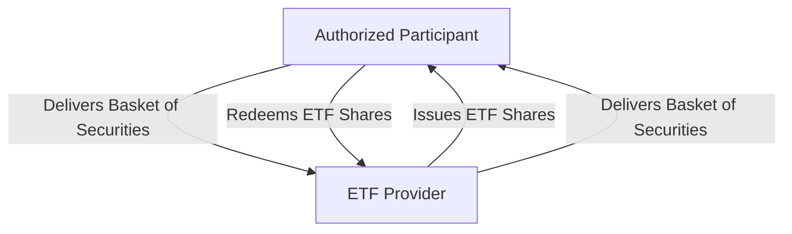

## 19.8 Low Cost

Exchange-Traded Funds (ETFs) have become increasingly popular among Canadian investors due to their cost efficiency compared to traditional mutual funds. This section delves into the reasons behind the lower costs associated with ETFs, focusing on Management Expense Ratios (MERs), the benefits of passive management, and the in-kind creation/redemption process. Understanding these elements can help investors make informed decisions and optimize their investment returns.

### Understanding Management Expense Ratios (MERs)

The Management Expense Ratio (MER) is a critical metric for evaluating the cost of investing in funds. It represents the annual fee that funds or ETFs charge their shareholders for management and operational costs. Typically, ETFs have lower MERs compared to mutual funds. This cost advantage is primarily due to the following reasons:

1. **Passive Management:** Most ETFs are passively managed, meaning they aim to replicate the performance of a specific index rather than actively selecting securities. This approach reduces the need for extensive research and portfolio management, leading to lower management fees.

2. **Economies of Scale:** As ETFs grow in size, they can spread their fixed costs over a larger asset base, further reducing the MER.

3. **Operational Efficiency:** ETFs often have lower operational costs due to their structure and trading mechanisms, which we will explore further in the context of in-kind creation/redemption.

### The Role of Passive Management

Passive management is a cornerstone of the cost efficiency of ETFs. By tracking an index, ETFs avoid the higher costs associated with active management, such as frequent trading and research expenses. This strategy not only reduces costs but also minimizes the risk of human error in stock selection.

#### Example: Canadian Index ETFs

Consider a Canadian index ETF that tracks the S&P/TSX Composite Index. By mirroring the index, the ETF incurs lower management costs than an actively managed mutual fund that attempts to outperform the index. This cost-saving is passed on to investors in the form of lower MERs.

### In-Kind Creation/Redemption Process

The in-kind creation/redemption process is another factor contributing to the low cost of ETFs. This mechanism allows authorized participants to create or redeem ETF shares by exchanging a basket of securities that mirrors the ETF's holdings, rather than cash. This process offers several advantages:

- **Tax Efficiency:** By avoiding the need to sell securities for cash, ETFs can minimize capital gains distributions, which are taxable events for investors.
- **Lower Trading Costs:** The in-kind process reduces the need for buying and selling securities in the open market, thereby lowering transaction costs.

#### Diagram: In-Kind Creation/Redemption Process

Below is a simplified diagram illustrating the in-kind creation/redemption process:

### Impact of ETF Fees on Tracking Error and Investor Returns

While ETFs are designed to closely track their underlying indices, fees can introduce a tracking error, which is the divergence between the ETF's performance and the index it tracks. Lower fees generally result in a smaller tracking error, enhancing the ETF's ability to replicate the index's performance accurately.

#### Case Study: Canadian Pension Funds

Canadian pension funds, such as the Canada Pension Plan Investment Board (CPPIB), often utilize ETFs to gain cost-effective exposure to various asset classes. By selecting ETFs with low MERs, these funds can minimize tracking error and maximize returns for their beneficiaries.

### Best Practices for Investors

- **Compare MERs:** When selecting ETFs, investors should compare MERs across similar funds to ensure they are choosing the most cost-effective option.
- **Consider Total Cost of Ownership:** In addition to MERs, investors should consider other costs, such as trading commissions and bid-ask spreads, to assess the total cost of owning an ETF.
- **Evaluate Tracking Error:** Investors should review an ETF's historical tracking error to understand how closely it follows its benchmark.

### Common Pitfalls and Challenges

- **Ignoring Hidden Costs:** While MERs are a visible cost, investors should be aware of other potential expenses, such as trading fees and tax implications.
- **Overlooking Liquidity:** ETFs with low trading volumes may have wider bid-ask spreads, increasing the cost of trading.

### References and Further Reading

For those interested in exploring the topic further, consider the following resources:

- **Books:**
  - *"Common Sense on Mutual Funds"* by John C. Bogle

- **Online Resources:**
  - **Investopedia:** [ETF Fees](https://www.investopedia.com/terms/e/etf-fees.asp)

- **Canadian Regulatory Bodies:**
  - Canadian Securities Administrators (CSA)
  - Investment Industry Regulatory Organization of Canada (IIROC)

### Conclusion

ETFs offer a cost-effective investment vehicle for Canadian investors, primarily due to their low MERs, passive management strategies, and efficient in-kind creation/redemption processes. By understanding these cost-saving mechanisms, investors can make informed decisions that enhance their portfolio's performance while minimizing expenses. As the ETF market continues to evolve, staying informed about regulatory changes and emerging trends will be crucial for maximizing investment success.

### **Ready to Test Your Knowledge?**

**Practice 10 Essential CSC Exam Questions to Master Your Certification**



### What is the primary reason ETFs have lower MERs compared to mutual funds?

- [x] Passive management
- [ ] Higher trading volumes
- [ ] Active management
- [ ] Frequent trading

> **Explanation:** ETFs are typically passively managed, which reduces management costs compared to actively managed mutual funds.

### What does the in-kind creation/redemption process help minimize?

- [x] Taxable capital gains
- [ ] Management fees
- [ ] Trading volumes
- [ ] Index tracking

> **Explanation:** The in-kind process minimizes taxable capital gains by avoiding the need to sell securities for cash.

### How does passive management contribute to the cost efficiency of ETFs?

- [x] By reducing research and trading costs
- [ ] By increasing trading frequency
- [ ] By actively selecting securities
- [ ] By increasing management fees

> **Explanation:** Passive management reduces costs by eliminating the need for extensive research and frequent trading.

### What is tracking error?

- [x] The divergence between an ETF's performance and its benchmark index
- [ ] The difference between an ETF's bid and ask price
- [ ] The annual fee charged by an ETF
- [ ] The process of creating ETF shares

> **Explanation:** Tracking error measures how closely an ETF follows its benchmark index.

### Which of the following is a benefit of the in-kind creation/redemption process?

- [x] Lower trading costs
- [ ] Higher management fees
- [x] Tax efficiency
- [ ] Increased trading frequency

> **Explanation:** The in-kind process reduces trading costs and enhances tax efficiency by avoiding cash transactions.

### What should investors consider in addition to MERs when evaluating ETFs?

- [x] Total cost of ownership
- [ ] Only the ETF's name
- [ ] The number of shares outstanding
- [ ] The ETF's inception date

> **Explanation:** Investors should consider the total cost of ownership, including trading fees and bid-ask spreads.

### What is a common pitfall when investing in ETFs?

- [x] Ignoring hidden costs
- [ ] Overanalyzing MERs
- [x] Overlooking liquidity
- [ ] Focusing solely on tracking error

> **Explanation:** Investors often overlook hidden costs and liquidity, which can impact the overall cost of investing in ETFs.

### Which Canadian regulatory body oversees ETFs?

- [x] Canadian Securities Administrators (CSA)
- [ ] Canada Revenue Agency (CRA)
- [ ] Canadian Broadcasting Corporation (CBC)
- [ ] Canadian Food Inspection Agency (CFIA)

> **Explanation:** The CSA oversees securities regulation, including ETFs, in Canada.

### How can investors minimize tracking error in their ETF investments?

- [x] By choosing ETFs with low fees
- [ ] By selecting ETFs with high trading volumes
- [ ] By investing in actively managed ETFs
- [ ] By avoiding index funds

> **Explanation:** Low fees help minimize tracking error, allowing ETFs to more closely follow their benchmarks.

### True or False: ETFs are always actively managed.

- [ ] True
- [x] False

> **Explanation:** Most ETFs are passively managed, aiming to replicate the performance of a specific index.


