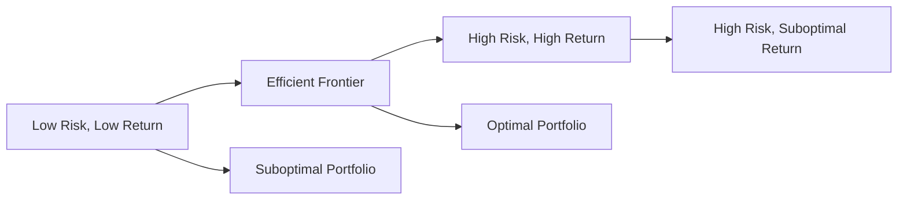

## 20.9 Efficient Frontier

In the realm of investment management, the efficient frontier is a cornerstone concept derived from Modern Portfolio Theory (MPT). This theory, pioneered by Harry Markowitz in the 1950s, revolutionized the way investors think about risk and return. The efficient frontier represents a set of optimal portfolios that offer the highest expected return for a given level of risk or the lowest risk for a given level of expected return. Understanding and applying this concept is crucial for financial professionals aiming to construct portfolios that maximize returns while managing risk effectively.

### Understanding the Efficient Frontier

The efficient frontier is a graphical representation of portfolios that maximize expected return for a given level of risk. It is depicted as a curve on a graph where the x-axis represents risk (standard deviation) and the y-axis represents expected return. Portfolios that lie on the efficient frontier are considered optimal because they provide the best possible return for their level of risk.

#### Key Concepts

- **Risk and Return:** In finance, risk is often measured by the standard deviation of returns, while return is the expected gain from an investment. The efficient frontier helps investors balance these two factors.
- **Diversification:** By combining different asset classes, investors can reduce risk without sacrificing returns. Diversification is a key principle in achieving an efficient portfolio.

### Constructing the Efficient Frontier

To construct the efficient frontier, investors must consider various asset classes, including stocks, bonds, and alternative investments such as real estate and commodities. By analyzing the historical returns and volatilities of these assets, as well as their correlations, investors can determine the optimal asset allocation.

#### The Role of Alternative Investments

Alternative investments, such as hedge funds, private equity, and real assets, can play a significant role in enhancing portfolio efficiency. These assets often have low correlation with traditional investments like stocks and bonds, which means they can reduce overall portfolio risk when included in the asset mix.

**Example:** Consider a Canadian pension fund that traditionally invests in domestic equities and fixed income. By adding alternative investments like infrastructure projects or real estate, the fund can achieve a more diversified portfolio, potentially moving it closer to the efficient frontier.

### Impact of Low Correlation Assets

Adding assets with low correlation to traditional investments can shift the efficient frontier upwards, indicating higher returns for the same level of risk. This is because low correlation assets provide diversification benefits, reducing the overall portfolio volatility.

#### Practical Application

Let's illustrate this with a practical example involving a Canadian investor:

1. **Initial Portfolio:** A portfolio consisting of 60% Canadian equities and 40% Canadian bonds.
2. **Addition of Alternatives:** Introduce a 10% allocation to alternative investments, reducing equities to 50% and bonds to 40%.
3. **Resulting Portfolio:** The new portfolio may exhibit lower volatility and potentially higher returns, moving closer to the efficient frontier.

### Visualizing the Efficient Frontier

Below is a simplified diagram of the efficient frontier:

In this diagram, portfolios on the efficient frontier (B) are optimal, while those below it (E and F) are suboptimal, offering lower returns for their level of risk.

### Best Practices and Common Pitfalls

- **Best Practices:**
  - Regularly rebalance portfolios to maintain the desired asset allocation.
  - Continuously monitor the correlation between assets to ensure diversification benefits.
  - Consider the impact of Canadian tax laws on investment returns, especially when dealing with alternative investments.

- **Common Pitfalls:**
  - Over-reliance on historical data, which may not accurately predict future correlations and returns.
  - Ignoring transaction costs and liquidity issues associated with alternative investments.

### Canadian Context and Regulations

In Canada, financial professionals must adhere to regulations set by the Canadian Investment Regulatory Organization (CIRO) and provincial authorities. Understanding these regulations is crucial when constructing portfolios that include alternative investments.

#### Resources for Further Exploration

- **Frameworks:**
  - [Efficient Frontier Explained](https://www.investopedia.com/terms/e/efficientfrontier.asp)

- **Books:**
  - "Modern Portfolio Theory and Investment Analysis" by Edwin J. Elton, Martin J. Gruber, Stephen J. Brown, and William N. Goetzmann.

- **Online Courses:**
  - [Coursera: Modern Portfolio Theory](https://www.coursera.org/learn/modern-portfolio-theory)

### Conclusion

The efficient frontier is a powerful tool for optimizing investment portfolios. By understanding and applying the principles of Modern Portfolio Theory, investors can construct portfolios that maximize returns for a given level of risk. Incorporating alternative investments and assets with low correlation to traditional investments can further enhance portfolio efficiency, providing Canadian investors with robust strategies for achieving their financial goals.

### **Ready to Test Your Knowledge?**

**Practice 10 Essential CSC Exam Questions to Master Your Certification**



### What is the efficient frontier?

- [x] A set of optimal portfolios that offer the highest expected return for a defined level of risk or the lowest risk for a given level of expected return.
- [ ] A line representing the average return of all possible portfolios.
- [ ] A curve showing the relationship between risk and return for individual stocks.
- [ ] A graph depicting the historical performance of a single asset.

> **Explanation:** The efficient frontier represents the set of optimal portfolios that provide the best possible return for a given level of risk, as defined by Modern Portfolio Theory.

### How does adding low correlation assets affect the efficient frontier?

- [x] It shifts the efficient frontier upwards, indicating higher returns for the same level of risk.
- [ ] It shifts the efficient frontier downwards, indicating lower returns for the same level of risk.
- [ ] It has no effect on the efficient frontier.
- [ ] It increases the risk of the portfolio without affecting returns.

> **Explanation:** Low correlation assets provide diversification benefits, reducing overall portfolio volatility and potentially increasing returns, thus shifting the efficient frontier upwards.

### What is a common pitfall when constructing an efficient portfolio?

- [x] Over-reliance on historical data.
- [ ] Including too many asset classes.
- [ ] Ignoring the efficient frontier.
- [ ] Focusing solely on risk without considering returns.

> **Explanation:** Over-reliance on historical data can lead to inaccurate predictions of future correlations and returns, which is a common pitfall in portfolio construction.

### Which of the following is a benefit of diversification?

- [x] Reduced overall portfolio risk.
- [ ] Increased transaction costs.
- [ ] Higher individual asset risk.
- [ ] Decreased portfolio returns.

> **Explanation:** Diversification reduces overall portfolio risk by spreading investments across various asset classes, which can lower volatility.

### What is the primary goal of Modern Portfolio Theory?

- [x] To maximize portfolio expected return for a given amount of portfolio risk.
- [ ] To minimize transaction costs.
- [x] To minimize risk for a given level of expected return.
- [ ] To focus solely on high-risk, high-return investments.

> **Explanation:** Modern Portfolio Theory aims to maximize returns for a given level of risk or minimize risk for a given level of expected return by optimizing asset allocation.

### Which Canadian regulatory body oversees securities transactions?

- [x] Canadian Investment Regulatory Organization (CIRO)
- [ ] Financial Industry Regulatory Authority (FINRA)
- [ ] Securities and Exchange Commission (SEC)
- [ ] Canadian Securities Administrators (CSA)

> **Explanation:** The Canadian Investment Regulatory Organization (CIRO) oversees securities transactions in Canada, ensuring compliance with regulations.

### What is a key consideration when adding alternative investments to a portfolio?

- [x] Their correlation with traditional investments.
- [ ] Their historical performance.
- [x] Their impact on portfolio liquidity.
- [ ] Their popularity among investors.

> **Explanation:** When adding alternative investments, it's important to consider their correlation with traditional investments and their impact on portfolio liquidity.

### What does the x-axis represent in the efficient frontier graph?

- [x] Risk (standard deviation)
- [ ] Expected return
- [ ] Asset allocation
- [ ] Portfolio weight

> **Explanation:** In the efficient frontier graph, the x-axis represents risk, typically measured by the standard deviation of returns.

### What is the effect of rebalancing a portfolio?

- [x] It maintains the desired asset allocation.
- [ ] It increases portfolio risk.
- [ ] It decreases portfolio returns.
- [ ] It eliminates transaction costs.

> **Explanation:** Rebalancing a portfolio helps maintain the desired asset allocation, ensuring that the portfolio remains aligned with the investor's risk and return objectives.

### True or False: The efficient frontier includes portfolios that are not optimal.

- [ ] True
- [x] False

> **Explanation:** False. The efficient frontier only includes optimal portfolios that offer the best possible return for a given level of risk.


