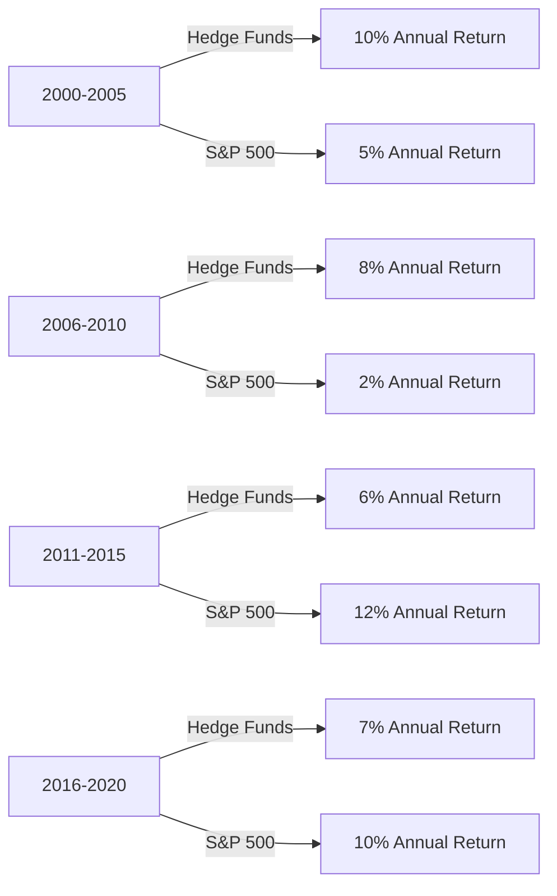

## 20.10 Empirical Evidence

In the realm of finance, empirical evidence plays a crucial role in understanding the performance and benefits of alternative investments compared to traditional ones. This section delves into the historical performance of alternative investments, with a particular focus on hedge funds, and examines their behavior during periods of market stress, such as the 2008 financial crisis and the 2020 pandemic. We will explore the ability of hedge funds to stabilize portfolio Net Asset Values (NAVs) and provide downside protection during extreme market conditions.

### Historical Performance of Alternative Investments

Alternative investments, including hedge funds, private equity, real estate, and commodities, have gained popularity due to their potential for diversification and risk-adjusted returns. Unlike traditional investments such as stocks and bonds, alternative investments often exhibit low correlation with the broader market, offering investors a means to enhance portfolio diversification.

#### Performance Comparison

Historically, alternative investments have demonstrated varying degrees of success compared to traditional investments. For instance, hedge funds have often outperformed during volatile market periods due to their flexible investment strategies, which include long/short positions, leverage, and derivatives. However, their performance can be inconsistent, with some funds underperforming during bull markets.

To illustrate, consider the following performance comparison chart between hedge funds and the S&P 500 index over the past two decades:

### Hedge Funds During Market Stress

Hedge funds are often scrutinized for their performance during market downturns. Their ability to employ diverse strategies allows them to potentially mitigate losses and even profit in declining markets. Two significant periods of market stress, the 2008 financial crisis and the 2020 pandemic, provide valuable insights into hedge fund performance.

#### 2008 Financial Crisis

During the 2008 financial crisis, global markets experienced severe downturns. Hedge funds, on average, outperformed traditional equity markets, with many funds employing strategies that capitalized on market volatility. For example, funds that utilized short selling or invested in distressed assets managed to cushion the impact of the crisis on their portfolios.

#### 2020 Pandemic

The onset of the COVID-19 pandemic in 2020 led to unprecedented market volatility. Hedge funds, once again, demonstrated resilience. While the initial market shock affected all asset classes, many hedge funds quickly adapted by reallocating assets, employing risk management techniques, and leveraging their flexibility to navigate the turbulent environment.

### Portfolio NAV Stabilization and Downside Protection

One of the key advantages of hedge funds is their potential to stabilize portfolio NAVs and provide downside protection. This capability is particularly valuable during extreme market conditions when traditional investments may suffer significant losses.

#### Portfolio NAV Stabilization

Portfolio NAV stabilization refers to the ability of investments to maintain or recover the value of the portfolio’s assets, even during market downturns. Hedge funds achieve this through various strategies, such as:

- **Diversification:** By investing in a wide range of assets, hedge funds reduce the impact of any single asset's poor performance on the overall portfolio.
- **Hedging:** Utilizing derivatives and other financial instruments to offset potential losses in other investments.
- **Active Management:** Continuously adjusting investment positions based on market conditions and emerging opportunities.

#### Downside Protection

Downside protection is a critical aspect of risk management, aimed at minimizing losses during adverse market movements. Hedge funds often employ strategies such as:

- **Short Selling:** Profiting from declining asset prices by selling borrowed securities.
- **Market Neutral Strategies:** Balancing long and short positions to reduce market exposure.
- **Tail Risk Hedging:** Protecting against rare but severe market events through options and other derivatives.

### Canadian Context and Regulations

In Canada, hedge funds and other alternative investments are subject to regulatory oversight to ensure investor protection and market stability. The Canadian Investment Regulatory Organization (CIRO) and provincial regulators play a vital role in setting standards and guidelines for these investments.

Investors interested in alternative investments should familiarize themselves with relevant Canadian regulations and consider consulting with financial advisors to ensure compliance and alignment with their investment goals.

### Additional Resources

For those seeking to deepen their understanding of hedge fund performance and alternative investments, the following resources are recommended:

- **Articles:**
  - [Hedge Funds Performance During Crises](https://www.forbes.com/sites/greatspeculations/2020/03/25/hedge-funds-during-2008-and-covid-19/)

- **Books:**
  - "Inside the House of Money" by Steven Drobny.

These resources provide valuable insights into the strategies and performance of hedge funds during challenging market conditions.

### Conclusion

Empirical evidence highlights the potential benefits of alternative investments, particularly hedge funds, in providing diversification, portfolio NAV stabilization, and downside protection. While these investments offer unique advantages, they also come with risks and complexities that require careful consideration and understanding. By leveraging historical performance data and adhering to regulatory guidelines, investors can make informed decisions to enhance their portfolios and achieve their financial objectives.

### **Ready to Test Your Knowledge?**

**Practice 10 Essential CSC Exam Questions to Master Your Certification**



### Which of the following is a key advantage of hedge funds during market downturns?

- [x] Portfolio NAV stabilization
- [ ] High correlation with traditional markets
- [ ] Guaranteed returns
- [ ] Lack of regulatory oversight

> **Explanation:** Hedge funds are known for their ability to stabilize portfolio NAVs during market downturns through diversification, hedging, and active management strategies.

### What strategy do hedge funds often use to profit from declining asset prices?

- [x] Short selling
- [ ] Buy and hold
- [ ] Dollar-cost averaging
- [ ] Index investing

> **Explanation:** Hedge funds often use short selling to profit from declining asset prices by selling borrowed securities and buying them back at lower prices.

### During which market event did hedge funds demonstrate resilience by quickly adapting their strategies?

- [x] 2020 pandemic
- [ ] Dot-com bubble
- [ ] 1987 stock market crash
- [ ] 1997 Asian financial crisis

> **Explanation:** During the 2020 pandemic, hedge funds demonstrated resilience by quickly adapting their strategies to navigate the turbulent market environment.

### What is the primary goal of downside protection strategies in hedge funds?

- [x] Minimizing losses during adverse market movements
- [ ] Maximizing short-term gains
- [ ] Increasing leverage
- [ ] Enhancing market exposure

> **Explanation:** The primary goal of downside protection strategies in hedge funds is to minimize losses during adverse market movements.

### Which of the following is NOT a strategy used by hedge funds for portfolio NAV stabilization?

- [ ] Diversification
- [ ] Hedging
- [ ] Active management
- [x] Passive indexing

> **Explanation:** Passive indexing is not a strategy used by hedge funds for portfolio NAV stabilization; hedge funds typically use active management, diversification, and hedging.

### What role do Canadian financial regulators play in the context of hedge funds?

- [x] Ensuring investor protection and market stability
- [ ] Providing investment advice
- [ ] Guaranteeing returns
- [ ] Managing hedge fund portfolios

> **Explanation:** Canadian financial regulators ensure investor protection and market stability by setting standards and guidelines for hedge funds and other alternative investments.

### Which book is recommended for further understanding of hedge fund strategies?

- [x] "Inside the House of Money" by Steven Drobny
- [ ] "The Intelligent Investor" by Benjamin Graham
- [ ] "A Random Walk Down Wall Street" by Burton Malkiel
- [ ] "The Little Book of Common Sense Investing" by John C. Bogle

> **Explanation:** "Inside the House of Money" by Steven Drobny is recommended for further understanding of hedge fund strategies and performance.

### What is the significance of low correlation in alternative investments?

- [x] Enhances portfolio diversification
- [ ] Increases market risk
- [ ] Guarantees higher returns
- [ ] Simplifies investment decisions

> **Explanation:** Low correlation in alternative investments enhances portfolio diversification by reducing the impact of market movements on the overall portfolio.

### How did hedge funds perform during the 2008 financial crisis compared to traditional equity markets?

- [x] Outperformed traditional equity markets
- [ ] Underperformed traditional equity markets
- [ ] Matched the performance of traditional equity markets
- [ ] Had no impact on the markets

> **Explanation:** During the 2008 financial crisis, hedge funds, on average, outperformed traditional equity markets by employing strategies that capitalized on market volatility.

### True or False: Hedge funds are subject to regulatory oversight in Canada.

- [x] True
- [ ] False

> **Explanation:** True. Hedge funds are subject to regulatory oversight in Canada to ensure investor protection and market stability.


