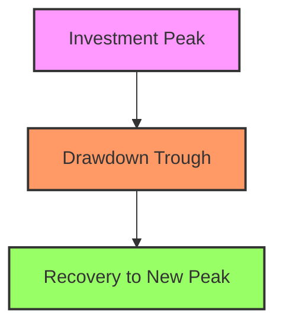

## 20.11 What is Risk?

In the world of finance, risk is an inherent element that investors must navigate to achieve their financial goals. Understanding risk is crucial for making informed investment decisions, whether dealing with traditional assets like stocks and bonds or exploring alternative investments such as hedge funds and private equity. This section delves into the concept of risk, focusing on key measures like volatility and drawdown, and discusses their relevance in the context of Canadian financial markets.

### Understanding Investment Risk

Investment risk refers to the possibility of losing some or all of the original investment. It encompasses various dimensions, including market risk, credit risk, liquidity risk, and operational risk. However, two of the most commonly discussed measures of investment risk are volatility and drawdown.

#### Volatility

**Volatility** is a statistical measure of the dispersion of returns for a given security or market index. It is often quantified by the standard deviation of returns, which indicates how much the price of an asset fluctuates over time. High volatility means that an asset's price can change dramatically over a short period, which can be both an opportunity and a risk for investors.

For example, consider the Toronto Stock Exchange (TSX). During periods of economic uncertainty, the TSX may experience higher volatility, reflecting investors' changing perceptions of risk and return. Understanding volatility helps investors gauge the potential risk associated with an investment and adjust their portfolios accordingly.

#### Drawdown

**Drawdown** refers to the peak-to-trough decline during a specific period for an investment, portfolio, or fund. It is a measure of downside risk, indicating the maximum loss an investor could have experienced before a recovery to a new peak. Drawdowns are particularly relevant for assessing the risk of alternative investments, which may not follow the same patterns as traditional assets.

For instance, a Canadian pension fund investing in alternative assets like real estate or infrastructure might experience a drawdown during an economic downturn. By analyzing historical drawdowns, the fund can better understand the potential risks and prepare strategies to mitigate them.

### The Limitations of Risk Measures

While volatility and drawdown are valuable tools for assessing risk, no single measure can capture the full spectrum of investment risk. Each measure has its limitations:

- **Volatility** does not distinguish between upside and downside movements, treating all fluctuations as risk. This can be misleading for investors who are primarily concerned with downside risk.
- **Drawdown** focuses solely on the downside, ignoring the potential for recovery and long-term growth.

Therefore, investors should use a combination of risk measures to gain a comprehensive understanding of their investment risk. This approach allows for more informed decision-making and better alignment with investment objectives.

### Applying Risk Measures to Investment Strategies

Risk measures are applicable to both traditional and alternative investment strategies. In traditional investments, such as stocks and bonds, volatility and drawdown provide insights into market dynamics and help investors manage their portfolios. For example, a Canadian investor might use volatility to assess the risk of a diversified portfolio of Canadian equities and bonds.

In alternative investments, these measures are equally important. Hedge funds, private equity, and real estate investments often exhibit different risk-return profiles compared to traditional assets. Understanding the volatility and drawdown of these investments helps investors evaluate their suitability within a broader portfolio context.

### Practical Examples and Case Studies

To illustrate the application of risk measures, consider the following examples:

1. **Canadian Pension Fund**: A pension fund may use volatility and drawdown analysis to assess the risk of its equity and fixed-income allocations. By understanding these risks, the fund can adjust its asset allocation to achieve a balance between growth and capital preservation.

2. **RBC's Investment Strategy**: Royal Bank of Canada (RBC) might analyze the volatility of its mutual funds to ensure they align with clients' risk tolerance. By monitoring drawdowns, RBC can identify funds that may require adjustments to mitigate potential losses.

### Visualizing Risk: Diagrams and Charts

To enhance understanding, let's visualize the concept of drawdown using a simple diagram:

In this diagram, the drawdown is represented by the decline from the investment peak to the trough, followed by a recovery to a new peak.

### Best Practices and Common Pitfalls

When managing investment risk, consider the following best practices:

- **Diversification**: Spread investments across different asset classes to reduce exposure to any single risk.
- **Regular Monitoring**: Continuously assess the risk profile of your portfolio and make adjustments as needed.
- **Risk Tolerance Assessment**: Understand your risk tolerance and align your investment strategy accordingly.

Common pitfalls include over-reliance on a single risk measure and failing to account for changes in market conditions. By being aware of these challenges, investors can develop more resilient investment strategies.

### Canadian Financial Regulations and Resources

In Canada, financial regulations play a crucial role in managing investment risk. The Canadian Investment Regulatory Organization (CIRO) and provincial regulators provide guidelines to ensure transparency and protect investors. Familiarity with these regulations is essential for compliance and effective risk management.

For further exploration, consider the following resources:

- **Frameworks**: [Risk Metrics: Volatility and Drawdown](https://www.investopedia.com/terms/v/volatility.asp)
- **Books**: "Against the Gods: The Remarkable Story of Risk" by Peter L. Bernstein.

### Conclusion

Understanding investment risk is fundamental to successful investing. By exploring measures like volatility and drawdown, investors can better navigate the complexities of both traditional and alternative investments. Armed with this knowledge, you can make informed decisions that align with your financial goals and risk tolerance.

### **Ready to Test Your Knowledge?**

**Practice 10 Essential CSC Exam Questions to Master Your Certification**



### What is volatility in the context of investment risk?

- [x] The degree of variation of a trading price series over time, measured by the standard deviation of returns.
- [ ] The maximum observed loss from a peak to a trough of a portfolio.
- [ ] The average return of an investment over a period.
- [ ] The risk of an investment defaulting.

> **Explanation:** Volatility measures the dispersion of returns and is quantified by the standard deviation of returns.

### What does drawdown measure in an investment portfolio?

- [x] The maximum observed loss from a peak to a trough of a portfolio.
- [ ] The average annual return of the portfolio.
- [ ] The volatility of the portfolio.
- [ ] The total return of the portfolio over a period.

> **Explanation:** Drawdown measures the peak-to-trough decline, indicating the maximum loss before a recovery.

### Why is it important to use multiple risk measures?

- [x] Because no single measure captures the full spectrum of investment risk.
- [ ] Because it is required by Canadian regulations.
- [ ] Because it increases the complexity of analysis.
- [ ] Because it reduces the need for diversification.

> **Explanation:** Multiple measures provide a comprehensive understanding of risk, as each has its limitations.

### How does volatility differ from drawdown?

- [x] Volatility measures price fluctuations, while drawdown measures the maximum loss from a peak.
- [ ] Volatility measures the maximum loss, while drawdown measures price fluctuations.
- [ ] Both measure the same aspect of risk.
- [ ] Volatility is only applicable to alternative investments.

> **Explanation:** Volatility focuses on price variation, whereas drawdown focuses on the extent of loss.

### In which type of investment is drawdown analysis particularly relevant?

- [x] Alternative investments
- [ ] Government bonds
- [ ] Savings accounts
- [ ] Term deposits

> **Explanation:** Drawdown is crucial for alternative investments due to their unique risk-return profiles.

### What is a common pitfall in risk management?

- [x] Over-reliance on a single risk measure
- [ ] Diversifying investments
- [ ] Regularly monitoring the portfolio
- [ ] Understanding risk tolerance

> **Explanation:** Relying on one measure can lead to an incomplete understanding of risk.

### Which Canadian institution provides guidelines for managing investment risk?

- [x] Canadian Investment Regulatory Organization (CIRO)
- [ ] Federal Reserve
- [ ] European Central Bank
- [ ] International Monetary Fund

> **Explanation:** CIRO provides guidelines to ensure transparency and protect investors in Canada.

### What is a benefit of diversification in managing investment risk?

- [x] It reduces exposure to any single risk.
- [ ] It guarantees higher returns.
- [ ] It eliminates all investment risks.
- [ ] It simplifies portfolio management.

> **Explanation:** Diversification spreads risk across different assets, reducing exposure to any single risk.

### How can investors align their investment strategy with their risk tolerance?

- [x] By understanding their risk tolerance and adjusting their strategy accordingly.
- [ ] By ignoring market conditions.
- [ ] By focusing solely on high-risk investments.
- [ ] By avoiding diversification.

> **Explanation:** Aligning strategy with risk tolerance ensures investments match the investor's comfort level with risk.

### True or False: Volatility treats all price fluctuations as risk, regardless of direction.

- [x] True
- [ ] False

> **Explanation:** Volatility does not distinguish between upward and downward movements, treating all fluctuations as risk.


