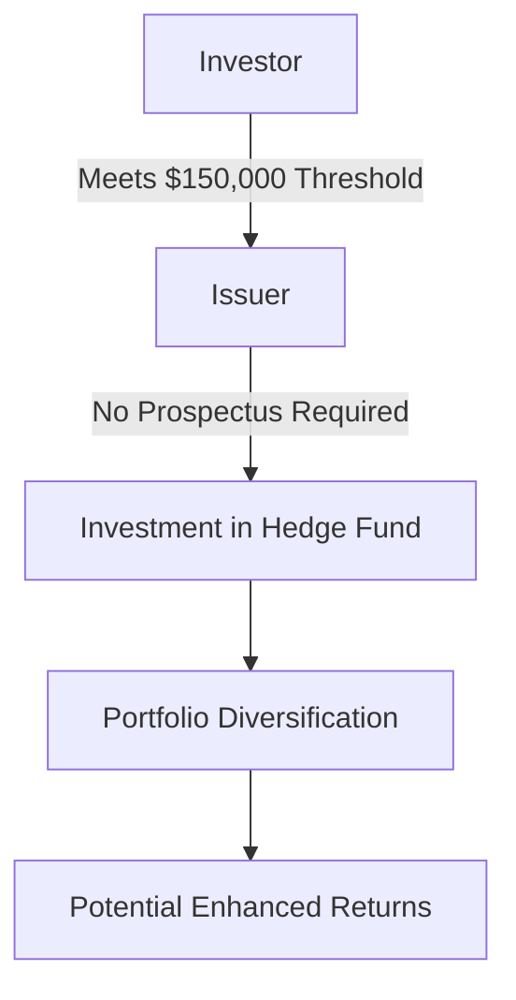

## 20.16 Minimum Investment Exemption

In the realm of Canadian securities regulation, the Minimum Investment Exemption plays a pivotal role in facilitating access to alternative investments, such as hedge funds, for certain investors. This exemption allows the sale of securities without a prospectus, provided specific conditions are met, thereby streamlining the investment process for qualified investors. Understanding the nuances of this exemption is crucial for financial professionals navigating the Canadian investment landscape.

### Understanding the Minimum Investment Exemption

The Minimum Investment Exemption is a regulatory provision that permits the sale of securities, including hedge fund units, to investors without the need for a prospectus. This exemption is outlined in [National Instrument 45-106](https://www.securities-administrators.ca/uploads/r_40645.pdf), which governs prospectus and registration exemptions across Canadian jurisdictions. The primary condition for this exemption is that the investor must make a minimum investment of $150,000.

#### Key Features of the Minimum Investment Exemption

- **Non-Individual Investors:** The exemption is specifically designed for non-individual investors, such as corporations, partnerships, or trusts. This means that individual retail investors are generally not eligible to utilize this exemption.
  
- **Minimum Investment Requirement:** The threshold for the exemption is set at $150,000. This amount must be invested in a single transaction, and the investor must not be induced to invest by any form of leverage or financing provided by the issuer or any related parties.

- **Prospectus-Free Investment:** By meeting the minimum investment requirement, eligible investors can purchase securities without the issuer having to file a prospectus. This reduces the administrative burden and cost for both the issuer and the investor.

### Conditions and Implications

The Minimum Investment Exemption is intended to provide sophisticated investors with greater access to alternative investment opportunities while maintaining a level of investor protection. Here are some conditions and implications associated with this exemption:

- **Sophistication and Risk Tolerance:** The exemption assumes that investors who can commit $150,000 have a certain level of sophistication and risk tolerance. These investors are expected to conduct their own due diligence and understand the risks associated with the investment.

- **Limited Accessibility for Retail Investors:** Since the exemption is not available to individual retail investors, it limits the accessibility of certain high-risk, high-reward investments to a broader audience. This is a protective measure to prevent less experienced investors from exposure to potentially volatile investments.

- **Regulatory Compliance:** Issuers must ensure compliance with the conditions of the exemption to avoid regulatory penalties. This includes verifying the investor's eligibility and ensuring that the investment is not financed through prohibited means.

### Practical Example: Canadian Pension Funds

Consider a Canadian pension fund looking to diversify its portfolio by investing in a hedge fund. By utilizing the Minimum Investment Exemption, the pension fund can invest $150,000 or more in the hedge fund without the need for a prospectus. This allows the pension fund to efficiently allocate capital to alternative investments, potentially enhancing returns while managing risk.

### Diagram: Minimum Investment Exemption Process

Below is a diagram illustrating the process flow of utilizing the Minimum Investment Exemption:

### Best Practices and Common Pitfalls

#### Best Practices

- **Thorough Due Diligence:** Investors should conduct comprehensive due diligence on the investment opportunity, including understanding the fund's strategy, management team, and historical performance.

- **Clear Documentation:** Issuers should maintain clear and accurate documentation to demonstrate compliance with the exemption requirements.

#### Common Pitfalls

- **Misinterpretation of Eligibility:** Investors and issuers must accurately interpret the eligibility criteria to avoid regulatory issues.

- **Inadequate Risk Assessment:** Failing to adequately assess the risks associated with hedge fund investments can lead to significant financial losses.

### Additional Resources

For further exploration of the Minimum Investment Exemption and related topics, consider the following resources:

- **Regulations:**
  - [National Instrument 45-106](https://www.securities-administrators.ca/uploads/r_40645.pdf)

- **Online Articles:**
  - [Understanding Investment Exemptions](https://www.investopedia.com/terms/e/exemption.asp)

### Glossary

- **Minimum Investment Exemption:** Regulatory provision allowing securities to be sold without a prospectus to investors who meet a specified minimum investment threshold.

### Encouragement for Application

Understanding and effectively utilizing the Minimum Investment Exemption can provide significant advantages in accessing alternative investments. Financial professionals should leverage this knowledge to enhance portfolio diversification and optimize investment strategies within the Canadian regulatory framework.

### **Ready to Test Your Knowledge?**

**Practice 10 Essential CSC Exam Questions to Master Your Certification**



### What is the primary purpose of the Minimum Investment Exemption?

- [x] To allow the sale of securities without a prospectus to eligible investors
- [ ] To provide tax benefits to individual investors
- [ ] To increase the liquidity of hedge funds
- [ ] To reduce the minimum investment threshold for retail investors

> **Explanation:** The Minimum Investment Exemption allows securities to be sold without a prospectus to investors who meet the specified minimum investment threshold.

### What is the minimum investment requirement for the exemption across Canadian jurisdictions?

- [x] $150,000
- [ ] $100,000
- [ ] $200,000
- [ ] $250,000

> **Explanation:** The minimum investment requirement for the exemption is set at $150,000 across all Canadian jurisdictions.

### Who is eligible to utilize the Minimum Investment Exemption?

- [x] Non-individual investors such as corporations and trusts
- [ ] Individual retail investors
- [ ] Only Canadian citizens
- [ ] Any investor with a financial advisor

> **Explanation:** The exemption is designed for non-individual investors, such as corporations, partnerships, or trusts.

### What document is not required when utilizing the Minimum Investment Exemption?

- [x] Prospectus
- [ ] Investment Agreement
- [ ] Risk Disclosure Statement
- [ ] Financial Statement

> **Explanation:** A prospectus is not required when utilizing the Minimum Investment Exemption.

### What assumption is made about investors who meet the $150,000 threshold?

- [x] They have a certain level of sophistication and risk tolerance
- [ ] They are guaranteed a return on investment
- [ ] They are eligible for tax deductions
- [ ] They are exempt from all regulatory requirements

> **Explanation:** The exemption assumes that investors who can commit $150,000 have a certain level of sophistication and risk tolerance.

### What is a common pitfall when utilizing the Minimum Investment Exemption?

- [x] Misinterpretation of eligibility criteria
- [ ] Overestimating the investment returns
- [ ] Underestimating the investment amount
- [ ] Failing to diversify the portfolio

> **Explanation:** Misinterpretation of eligibility criteria can lead to regulatory issues.

### What is a best practice for investors utilizing the Minimum Investment Exemption?

- [x] Conducting thorough due diligence
- [ ] Investing in multiple hedge funds simultaneously
- [ ] Relying solely on issuer-provided information
- [ ] Avoiding risk assessment

> **Explanation:** Conducting thorough due diligence is a best practice to ensure informed investment decisions.

### What is the role of National Instrument 45-106 in the context of the Minimum Investment Exemption?

- [x] It governs prospectus and registration exemptions
- [ ] It provides tax guidelines for investors
- [ ] It sets the interest rates for investments
- [ ] It mandates investment in Canadian securities only

> **Explanation:** National Instrument 45-106 governs prospectus and registration exemptions, including the Minimum Investment Exemption.

### True or False: The Minimum Investment Exemption is available to individual retail investors.

- [ ] True
- [x] False

> **Explanation:** The exemption is not available to individual retail investors; it is intended for non-individual investors.

### True or False: The Minimum Investment Exemption reduces the administrative burden for both issuers and investors.

- [x] True
- [ ] False

> **Explanation:** By eliminating the need for a prospectus, the exemption reduces the administrative burden for both issuers and investors.


