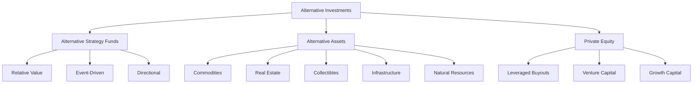

## 20.2 Identify the Main Categories and Sub-Categories that Comprise the Alternative Investment Universe

In the ever-evolving landscape of finance, alternative investments have emerged as a crucial component of diversified portfolios. These investments offer unique opportunities and risks, distinct from traditional asset classes like stocks and bonds. Understanding the main categories and sub-categories of the alternative investment universe is essential for financial professionals and investors aiming to optimize their portfolios.

### Main Categories of Alternative Investments

The alternative investment universe can be broadly categorized into three main areas: alternative strategy funds, alternative assets, and private equity. Each category plays a significant role in enhancing portfolio diversification and potentially improving risk-adjusted returns.

#### 1. Alternative Strategy Funds

Alternative strategy funds employ sophisticated investment strategies to achieve returns that are uncorrelated with traditional markets. These funds are typically managed by experienced professionals who utilize a variety of techniques to exploit market inefficiencies. The sub-categories of alternative strategy funds include:

- **Relative Value Strategies:** These strategies aim to capitalize on price discrepancies between related securities. For example, a fund might simultaneously buy and sell different bonds from the same issuer to profit from interest rate differentials. Relative value strategies often involve complex financial instruments like derivatives.

- **Event-Driven Strategies:** These strategies focus on corporate events such as mergers, acquisitions, bankruptcies, or restructurings. Event-driven funds seek to profit from the anticipated impact of these events on the value of a company's securities. For instance, a merger arbitrage strategy might involve buying the stock of a company being acquired and shorting the stock of the acquiring company.

- **Directional Strategies:** These strategies take positions based on the anticipated direction of market movements. They include long/short equity strategies, where managers buy undervalued stocks and short overvalued ones. Directional strategies can be highly speculative and require a deep understanding of market trends.

#### 2. Alternative Assets

Alternative assets encompass a diverse range of investment opportunities that are not typically found in traditional portfolios. These assets provide unique benefits, such as inflation protection and low correlation with traditional markets. Key types of alternative assets include:

- **Commodities:** These are basic homogenous materials like agricultural products, metals, and energy products. Commodities can serve as a hedge against inflation and currency fluctuations. For example, investing in gold can provide a safe haven during economic uncertainty.

- **Real Estate:** This category includes land and fixed assets such as commercial, industrial, and residential properties. Real estate investments can generate income through rent and offer potential capital appreciation. Canadian Real Estate Investment Trusts (REITs) are popular vehicles for accessing this asset class.

- **Collectibles:** These are rare and unique objects such as fine art, classic automobiles, rare stamps, and coins. Collectibles can offer significant returns but also come with high risks and illiquidity. The market for collectibles is often driven by trends and investor sentiment.

- **Infrastructure:** Investments in infrastructure projects like roads, ports, airports, and water works provide stable cash flows and long-term growth potential. Infrastructure investments are particularly appealing in Canada, where public-private partnerships are common.

- **Natural Resources:** This category includes assets such as timberland and farmland. Investments in natural resources can provide diversification benefits and are often linked to global economic growth.

#### 3. Private Equity

Private equity involves investing in private companies or taking public companies private. It plays a vital role in the alternative investment landscape by providing capital to businesses at various stages of development. Private equity strategies include:

- **Leveraged Buyouts (LBOs):** These involve acquiring a company using a significant amount of borrowed money. The goal is to improve the company's performance and eventually sell it at a profit. LBOs are common in industries with stable cash flows, such as manufacturing and consumer goods.

- **Venture Capital:** This strategy involves financing startups and small businesses with high growth potential. Venture capitalists provide not only capital but also strategic guidance to help companies succeed. The Canadian technology sector has seen significant venture capital investment in recent years.

- **Growth Capital:** This involves investing in relatively mature companies looking for capital to expand or restructure operations. Growth capital can help companies enter new markets, develop new products, or improve operational efficiency.

### Practical Examples and Case Studies

To illustrate the application of these alternative investment categories, consider the following examples:

- **Canadian Pension Funds:** Many Canadian pension funds, such as the Canada Pension Plan Investment Board (CPPIB), allocate a portion of their portfolios to alternative investments. By investing in infrastructure projects and private equity, these funds aim to achieve stable, long-term returns.

- **RBC Global Asset Management:** RBC offers a range of alternative strategy funds that employ relative value and event-driven strategies. These funds are designed to provide diversification benefits and enhance risk-adjusted returns for investors.

- **TD Asset Management:** TD's alternative asset offerings include real estate and infrastructure investments. These assets provide income and growth potential, making them attractive to investors seeking diversification.

### Diagrams and Visual Aids

To better understand the relationships between these categories and sub-categories, consider the following diagram:

### Best Practices and Challenges

When considering alternative investments, it's important to follow best practices and be aware of potential challenges:

- **Diversification:** Ensure that alternative investments complement traditional assets in your portfolio. Diversification can help reduce risk and enhance returns.

- **Due Diligence:** Conduct thorough research and due diligence before investing in alternative assets or funds. Understand the risks, fees, and potential returns associated with each investment.

- **Liquidity:** Be mindful of the liquidity constraints of alternative investments. Many alternative assets, such as real estate and private equity, are illiquid and may require a long-term commitment.

- **Regulatory Compliance:** Stay informed about Canadian regulations governing alternative investments. Compliance with regulatory requirements is essential to avoid legal issues and protect your investments.

### Conclusion

Alternative investments offer a wide array of opportunities for investors seeking diversification and enhanced returns. By understanding the main categories and sub-categories of the alternative investment universe, financial professionals can make informed decisions and effectively integrate these assets into their portfolios. As the financial landscape continues to evolve, staying informed and adaptable is key to success in alternative investing.

## Quiz Time!



### Which of the following is NOT a main category of alternative investments?

- [ ] Alternative Strategy Funds
- [ ] Alternative Assets
- [x] Fixed Income Securities
- [ ] Private Equity

> **Explanation:** Fixed income securities are traditional investments, not part of the alternative investment universe.

### What is a key benefit of including alternative investments in a portfolio?

- [x] Diversification
- [ ] Increased liquidity
- [ ] Guaranteed returns
- [ ] Reduced volatility

> **Explanation:** Alternative investments provide diversification benefits, which can enhance risk-adjusted returns.

### Which strategy involves profiting from corporate events like mergers and acquisitions?

- [ ] Relative Value
- [x] Event-Driven
- [ ] Directional
- [ ] Growth Capital

> **Explanation:** Event-driven strategies focus on profiting from corporate events such as mergers and acquisitions.

### What type of alternative asset includes investments in roads and airports?

- [ ] Commodities
- [ ] Real Estate
- [ ] Collectibles
- [x] Infrastructure

> **Explanation:** Infrastructure investments include projects like roads and airports.

### Which private equity strategy involves financing startups with high growth potential?

- [ ] Leveraged Buyouts
- [x] Venture Capital
- [ ] Growth Capital
- [ ] Event-Driven

> **Explanation:** Venture capital involves financing startups and small businesses with high growth potential.

### What is a common characteristic of collectibles as an investment?

- [ ] High liquidity
- [x] High risk and illiquidity
- [ ] Guaranteed returns
- [ ] Low correlation with inflation

> **Explanation:** Collectibles are often illiquid and come with high risks.

### Which alternative strategy fund sub-category involves taking positions based on market direction?

- [ ] Relative Value
- [ ] Event-Driven
- [x] Directional
- [ ] Infrastructure

> **Explanation:** Directional strategies take positions based on anticipated market movements.

### What is a key consideration when investing in alternative assets?

- [x] Liquidity constraints
- [ ] Guaranteed returns
- [ ] Low fees
- [ ] High correlation with stocks

> **Explanation:** Many alternative assets are illiquid and require a long-term commitment.

### Which of the following is an example of a natural resource investment?

- [ ] Commercial real estate
- [ ] Classic automobiles
- [x] Timberland
- [ ] Corporate bonds

> **Explanation:** Timberland is an example of a natural resource investment.

### True or False: Private equity investments are typically highly liquid.

- [ ] True
- [x] False

> **Explanation:** Private equity investments are typically illiquid and require a long-term commitment.


