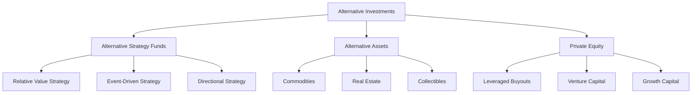

## 20.2 What are Alternative Investments?

In the ever-evolving landscape of finance, alternative investments have emerged as a compelling option for investors seeking diversification beyond traditional asset classes such as equities, bonds, and cash. This section delves into the realm of alternative investments, offering a comprehensive understanding of their nature, classifications, and strategic importance within a diversified portfolio.

### Understanding Alternative Investments

Alternative investments are financial assets that do not fall into the conventional categories of stocks, bonds, or cash. They encompass a wide range of investment opportunities, each with unique characteristics and risk profiles. Unlike traditional investments, alternative investments often involve complex strategies and structures, making them suitable for investors with a higher risk tolerance and a desire for portfolio diversification.

### Classification of Alternative Investments

Alternative investments can be broadly classified into three primary groups: Alternative Strategy Funds, Alternative Assets, and Private Equity. Each category offers distinct opportunities and challenges, catering to different investor needs and objectives.

#### 1. Alternative Strategy Funds

Alternative strategy funds employ sophisticated investment strategies to generate returns. These strategies are often designed to exploit market inefficiencies or capitalize on specific events. The primary strategies include:

- **Relative Value Strategy:** This strategy seeks to profit from pricing discrepancies between related securities. For example, a fund might invest in a pair of stocks within the same industry, betting that the price difference between them will converge over time.

- **Event-Driven Strategy:** Focused on corporate events such as mergers, acquisitions, or restructurings, this strategy aims to capitalize on the price movements that occur as a result of these events. For instance, an investor might buy shares of a company being acquired, anticipating a rise in share price as the acquisition progresses.

- **Directional Strategy:** This strategy involves taking positions based on the expected movement in the price of an asset. It can be long or short, depending on whether the investor expects the asset's price to rise or fall.

#### 2. Alternative Assets

Alternative assets include tangible and intangible assets that provide diversification benefits and potential inflation hedges. Key types of alternative assets are:

- **Commodities:** Physical goods such as gold, oil, and agricultural products. Commodities can serve as a hedge against inflation and currency fluctuations.

- **Real Estate:** Investments in physical properties or real estate investment trusts (REITs). Real estate offers income through rent and potential capital appreciation.

- **Collectibles:** Items such as art, antiques, and rare coins. Collectibles can appreciate in value over time but require specialized knowledge and expertise.

#### 3. Private Equity

Private equity involves investing in private companies, often through leveraged buyouts, venture capital, or growth capital. This category of alternative investments is characterized by:

- **Leveraged Buyouts (LBOs):** Acquiring a company using a significant amount of borrowed money to meet the acquisition cost. The assets of the acquired company often serve as collateral for the loans.

- **Venture Capital:** Providing funding to early-stage, high-potential startups in exchange for equity. Venture capitalists aim to generate substantial returns by nurturing these companies to success.

- **Growth Capital:** Investing in established companies seeking capital to expand or restructure operations. Growth capital investors typically take minority stakes in these companies.

### Non-Standardized Nature of Alternative Investments

The definitions and categories of alternative investments are not standardized, leading to variations in how they are perceived and classified. This non-standardization stems from the diverse nature of alternative investments and the evolving financial landscape. As a result, investors must exercise due diligence and seek professional advice when considering alternative investments.

### Canadian Context and Regulatory Considerations

In Canada, alternative investments are subject to specific regulatory frameworks and guidelines. The Canadian Investment Regulatory Organization (CIRO) and provincial regulatory bodies oversee the compliance and conduct of financial institutions and investment professionals dealing with alternative investments. Investors should familiarize themselves with these regulations to ensure compliance and informed decision-making.

### Practical Examples and Case Studies

To illustrate the application of alternative investments, consider the following examples:

- **Canadian Pension Funds:** Many Canadian pension funds, such as the Canada Pension Plan Investment Board (CPPIB), allocate a portion of their portfolios to alternative investments like real estate and infrastructure to enhance returns and manage risk.

- **Major Canadian Banks:** Institutions like RBC and TD Bank offer alternative investment products, including hedge funds and private equity funds, to their high-net-worth clients, providing access to diversified investment opportunities.

### Diagrams and Visual Aids

To better understand the classification and flow of alternative investments, consider the following diagram:

### Best Practices and Common Challenges

Investors considering alternative investments should adhere to best practices, such as conducting thorough due diligence, understanding the liquidity constraints, and aligning investments with their risk tolerance and financial goals. Common challenges include the complexity of alternative investments, higher fees, and potential regulatory hurdles.

### Additional Resources for Further Exploration

For those interested in exploring alternative investments further, consider the following resources:

- **Frameworks:**
  - [CAMELS Rating System](https://www.investopedia.com/terms/c/camels.asp)

- **Online Courses:**
  - [Coursera: Private Equity and Venture Capital](https://www.coursera.org/learn/private-equity)

- **Articles:**
  - [Types of Alternative Investments](https://www.investopedia.com/articles/investing/092415/types-alternative-investments.asp)

### Encouraging Application and Continuous Learning

As you explore alternative investments, consider how these strategies and assets can be integrated into your own portfolio or business practices. Reflect on the regulatory environment and best practices to ensure informed and compliant investment decisions.

### **Ready to Test Your Knowledge?**

**Practice 10 Essential CSC Exam Questions to Master Your Certification**



### What are alternative investments primarily distinct from?

- [x] Traditional asset classes like equities, bonds, and cash
- [ ] Real estate and commodities
- [ ] Private equity and hedge funds
- [ ] Mutual funds and ETFs

> **Explanation:** Alternative investments are distinct from traditional asset classes such as equities, bonds, and cash.

### Which of the following is NOT a primary group of alternative investments?

- [ ] Alternative Strategy Funds
- [ ] Alternative Assets
- [ ] Private Equity
- [x] Mutual Funds

> **Explanation:** Mutual funds are not considered a primary group of alternative investments.

### What strategy seeks to profit from pricing discrepancies between related securities?

- [x] Relative Value Strategy
- [ ] Event-Driven Strategy
- [ ] Directional Strategy
- [ ] Growth Strategy

> **Explanation:** The Relative Value Strategy aims to profit from pricing discrepancies between related securities.

### Which strategy focuses on capitalizing on corporate events like mergers and acquisitions?

- [ ] Relative Value Strategy
- [x] Event-Driven Strategy
- [ ] Directional Strategy
- [ ] Growth Strategy

> **Explanation:** The Event-Driven Strategy focuses on capitalizing on corporate events such as mergers and acquisitions.

### What are commodities considered as?

- [x] Alternative Assets
- [ ] Alternative Strategy Funds
- [ ] Private Equity
- [ ] Traditional Investments

> **Explanation:** Commodities are considered alternative assets.

### What does private equity primarily involve?

- [x] Investing in private companies
- [ ] Trading public stocks
- [ ] Buying government bonds
- [ ] Investing in mutual funds

> **Explanation:** Private equity primarily involves investing in private companies.

### Which of the following is a type of private equity investment?

- [x] Leveraged Buyouts
- [ ] Commodities
- [ ] Real Estate
- [ ] Collectibles

> **Explanation:** Leveraged Buyouts are a type of private equity investment.

### What is a common challenge associated with alternative investments?

- [x] Complexity and higher fees
- [ ] High liquidity
- [ ] Low risk
- [ ] Standardized definitions

> **Explanation:** Alternative investments are often complex and come with higher fees.

### Which Canadian regulatory body oversees alternative investments?

- [x] Canadian Investment Regulatory Organization (CIRO)
- [ ] Canada Revenue Agency (CRA)
- [ ] Bank of Canada
- [ ] Canadian Securities Administrators (CSA)

> **Explanation:** The Canadian Investment Regulatory Organization (CIRO) oversees alternative investments.

### True or False: Alternative investments are standardized across all financial markets.

- [ ] True
- [x] False

> **Explanation:** Alternative investments are not standardized across all financial markets due to their diverse nature.


