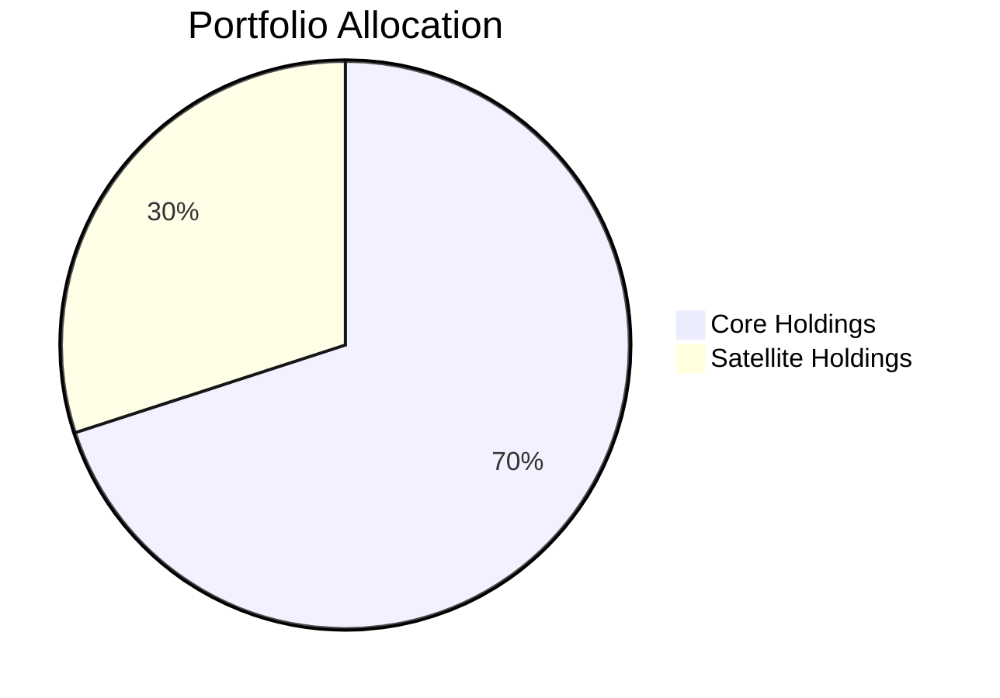

## 20.8.1 Core and Satellite Strategy

The Core and Satellite Strategy is a sophisticated investment approach that combines broad market exposure with targeted growth opportunities. This strategy is particularly effective when utilizing Exchange-Traded Funds (ETFs), which offer flexibility, diversification, and cost-efficiency. In this section, we will delve into the intricacies of this strategy, focusing on identifying core and satellite holdings, constructing a balanced portfolio, and understanding the benefits of this approach.

### Core Holdings Identification

Core holdings form the foundation of a diversified investment portfolio. These are typically broad market ETFs that provide stable returns and are characterized by:

- **Broad Market Exposure:** Core ETFs often track major indices like the S&P/TSX Composite Index, offering exposure to a wide range of sectors and industries.
- **Low Management Expense Ratios (MERs):** Core ETFs are generally passively managed, resulting in lower fees compared to actively managed funds.
- **High Liquidity:** These ETFs are highly liquid, allowing investors to buy and sell shares easily without significantly impacting the market price.

**Example:** The iShares Core S&P/TSX Capped Composite Index ETF (XIC) is a popular core holding for Canadian investors, providing exposure to the Canadian equity market with a low MER.

### Satellite Holdings Selection

Satellite holdings are specialized ETFs that target specific sectors, regions, or investment themes. These ETFs are used to enhance returns and add diversification to the portfolio. Characteristics of satellite holdings include:

- **Targeted Exposure:** Satellite ETFs focus on niche markets or sectors, such as technology, healthcare, or emerging markets.
- **Higher Growth Potential:** These ETFs aim to capture growth opportunities that may not be reflected in broad market indices.
- **Increased Volatility:** Due to their focused nature, satellite ETFs may exhibit higher volatility compared to core holdings.

**Example:** The BMO MSCI Tech & Industrial Innovation Index ETF (ZIN) targets the technology sector, offering potential growth opportunities for investors seeking to capitalize on technological advancements.

### Portfolio Construction

Constructing a portfolio using the Core and Satellite Strategy involves allocating investments between core and satellite ETFs to achieve a balance between stability and growth potential. The allocation depends on the investor's risk tolerance, investment goals, and market outlook.

- **Core Allocation:** Typically, 60-80% of the portfolio is allocated to core ETFs, providing a stable foundation.
- **Satellite Allocation:** The remaining 20-40% is allocated to satellite ETFs, allowing for targeted growth and diversification.

**Diagram: Portfolio Allocation**

### Implementation Examples

To illustrate the Core and Satellite Strategy, consider the following portfolio examples:

1. **Conservative Portfolio:**
   - **Core Holdings (80%):** iShares Core S&P/TSX Capped Composite Index ETF (XIC)
   - **Satellite Holdings (20%):** BMO MSCI Tech & Industrial Innovation Index ETF (ZIN)

2. **Aggressive Portfolio:**
   - **Core Holdings (60%):** iShares Core S&P/TSX Capped Composite Index ETF (XIC)
   - **Satellite Holdings (40%):** BMO MSCI Tech & Industrial Innovation Index ETF (ZIN), iShares MSCI Emerging Markets ETF (XEM)

**Analysis:** The conservative portfolio prioritizes stability with a higher allocation to core holdings, while the aggressive portfolio seeks higher returns with increased exposure to satellite ETFs.

### Benefits of Core and Satellite Strategy

The Core and Satellite Strategy offers several advantages:

- **Diversification:** By combining broad market exposure with targeted investments, this strategy reduces risk while capturing growth opportunities.
- **Cost Efficiency:** Utilizing low-cost core ETFs minimizes expenses, while satellite ETFs provide the potential for higher returns.
- **Flexibility:** Investors can adjust satellite holdings based on market conditions or personal investment goals, allowing for dynamic portfolio management.

### Glossary

- **Core Holdings:** Broad market ETFs that form the foundation of a diversified investment portfolio.
- **Satellite Holdings:** Specialized or sector-specific ETFs used to enhance portfolio returns or target specific investment themes.
- **Diversification:** The practice of spreading investments across various assets to reduce risk.
- **Sector ETF:** An ETF that focuses on a particular industry sector, such as technology or healthcare.

---

## Quiz Time!



### Which characteristic is NOT typical of core holdings?

- [ ] Broad market exposure
- [ ] Low Management Expense Ratios (MERs)
- [ ] High liquidity
- [x] High volatility

> **Explanation:** Core holdings are typically characterized by broad market exposure, low MERs, and high liquidity, but not high volatility.

### What is the primary purpose of satellite holdings in a portfolio?

- [x] To enhance returns and add diversification
- [ ] To provide broad market exposure
- [ ] To reduce portfolio costs
- [ ] To increase liquidity

> **Explanation:** Satellite holdings are used to enhance returns and add diversification by targeting specific sectors or themes.

### In a conservative portfolio using the Core and Satellite Strategy, what is the typical allocation to core holdings?

- [x] 60-80%
- [ ] 20-40%
- [ ] 40-60%
- [ ] 80-100%

> **Explanation:** A conservative portfolio typically allocates 60-80% to core holdings for stability.

### Which ETF would be considered a satellite holding?

- [ ] iShares Core S&P/TSX Capped Composite Index ETF (XIC)
- [x] BMO MSCI Tech & Industrial Innovation Index ETF (ZIN)
- [ ] Vanguard FTSE Canada All Cap Index ETF (VCN)
- [ ] iShares Core Canadian Universe Bond Index ETF (XBB)

> **Explanation:** The BMO MSCI Tech & Industrial Innovation Index ETF (ZIN) is a satellite holding, targeting the technology sector.

### What is a key benefit of the Core and Satellite Strategy?

- [x] It combines stability with targeted growth opportunities
- [ ] It eliminates all investment risks
- [ ] It guarantees high returns
- [ ] It requires no portfolio management

> **Explanation:** The Core and Satellite Strategy combines stability from core holdings with targeted growth opportunities from satellite holdings.

### Which of the following is a characteristic of satellite ETFs?

- [x] Higher growth potential
- [ ] Low volatility
- [ ] Broad market exposure
- [ ] High liquidity

> **Explanation:** Satellite ETFs have higher growth potential due to their focus on specific sectors or themes.

### How can investors adjust their portfolios using the Core and Satellite Strategy?

- [x] By changing satellite holdings based on market conditions
- [ ] By eliminating core holdings
- [ ] By only investing in core ETFs
- [ ] By ignoring market trends

> **Explanation:** Investors can adjust satellite holdings based on market conditions to align with their investment goals.

### What is the role of core holdings in a portfolio?

- [x] To provide a stable foundation
- [ ] To target specific sectors
- [ ] To increase portfolio volatility
- [ ] To focus on emerging markets

> **Explanation:** Core holdings provide a stable foundation for the portfolio with broad market exposure.

### Which of the following is NOT a benefit of using ETFs in the Core and Satellite Strategy?

- [ ] Cost efficiency
- [ ] Flexibility
- [ ] Diversification
- [x] Guaranteed returns

> **Explanation:** While ETFs offer cost efficiency, flexibility, and diversification, they do not guarantee returns.

### True or False: The Core and Satellite Strategy can be adjusted to suit different risk tolerances.

- [x] True
- [ ] False

> **Explanation:** The Core and Satellite Strategy can be tailored to suit different risk tolerances by adjusting the allocation between core and satellite holdings.


