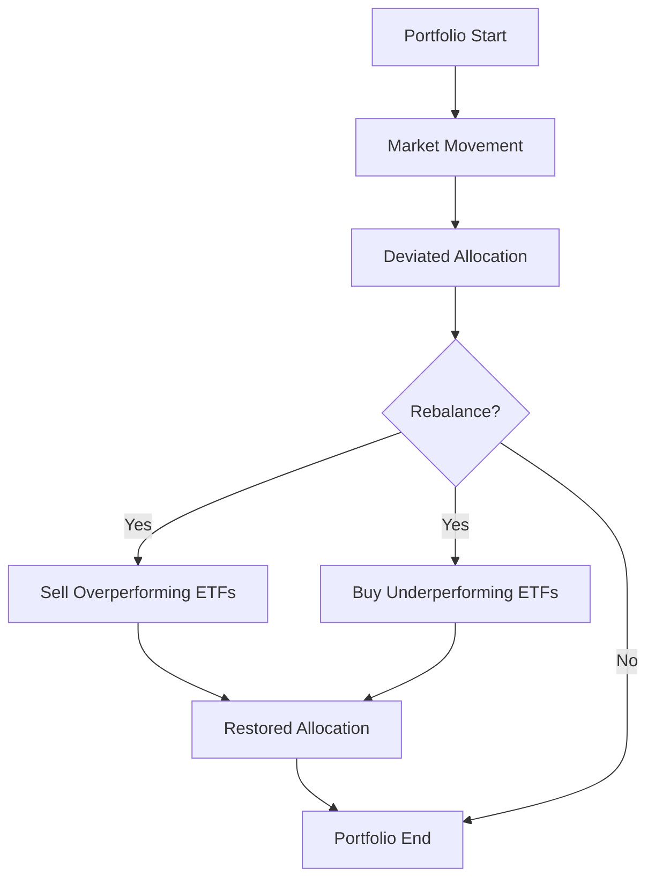

## 20.8.2 Rebalancing

In the dynamic world of investing, maintaining a well-balanced portfolio is crucial for managing risk and achieving long-term financial goals. Rebalancing is a key strategy that ensures your portfolio remains aligned with your target asset allocation, despite market fluctuations. This section delves into the purpose of rebalancing, the role of Exchange-Traded Funds (ETFs) in facilitating this process, various rebalancing strategies, and practical implementation techniques. We will also explore the benefits of using ETFs for rebalancing and provide real-world examples to illustrate these concepts.

### Purpose of Rebalancing

Rebalancing is the process of realigning the proportions of assets in a portfolio to maintain a desired asset allocation. Over time, market movements can cause deviations from your target allocation. For instance, if equities outperform bonds, your portfolio may become equity-heavy, increasing your risk exposure. Rebalancing helps manage this risk by restoring your portfolio to its original allocation, ensuring it aligns with your risk tolerance and investment objectives.

#### Why Rebalancing Matters

1. **Risk Management:** By maintaining your target asset allocation, rebalancing helps manage risk and prevent your portfolio from becoming too concentrated in one asset class.
   
2. **Discipline:** Rebalancing enforces a disciplined investment approach, encouraging investors to buy low and sell high by trimming overperforming assets and adding to underperforming ones.

3. **Long-Term Goals:** Consistent rebalancing supports long-term investment goals by keeping your portfolio aligned with your strategic asset allocation plan.

### Role of ETFs in Rebalancing

ETFs play a pivotal role in efficient and cost-effective portfolio rebalancing. Their liquidity and tradability make them ideal instruments for adjusting portfolio allocations without incurring significant trading costs.

#### Advantages of Using ETFs

- **Liquidity:** ETFs are traded on exchanges like stocks, offering high liquidity and the ability to execute trades quickly.
  
- **Cost-Effectiveness:** ETFs typically have lower expense ratios compared to mutual funds, reducing the cost of rebalancing.

- **Flexibility:** With a wide range of ETFs available, investors can easily adjust their portfolio to reflect changes in market conditions or investment strategies.

### Rebalancing Strategies

Different rebalancing strategies can be employed depending on investment objectives and market conditions. Here are some common approaches:

#### Periodic Rebalancing

Periodic rebalancing involves adjusting your portfolio at regular intervals, such as quarterly or annually. This strategy is straightforward and ensures that your portfolio is reviewed and adjusted consistently.

#### Threshold-Based Rebalancing

Threshold-based rebalancing triggers adjustments when asset allocations deviate beyond predefined thresholds. For example, if an asset class exceeds its target allocation by 5%, the portfolio is rebalanced. This approach is more dynamic and responsive to market movements.

#### Automatic Rebalancing

Some ETFs and investment platforms offer automatic rebalancing features, which adjust your portfolio allocations automatically based on predefined criteria. This can be particularly useful for investors seeking a hands-off approach.

### Implementation Techniques

Implementing rebalancing strategies using ETFs involves several techniques:

#### Selling Overperforming ETFs and Buying Underperforming Ones

To maintain desired allocations, investors can sell ETFs that have appreciated significantly and buy those that have underperformed. This helps restore balance and capitalize on market opportunities.

#### Using Limit Orders

Limit orders allow investors to buy or sell a security at a specific price or better, providing control over the execution price during rebalancing. This can be particularly useful in volatile markets.

### Benefits of ETF-Based Rebalancing

Using ETFs for rebalancing offers several benefits:

- **Lower Trading Costs:** ETFs generally have lower transaction costs compared to other investment vehicles, making rebalancing more cost-effective.

- **Tax Efficiency:** ETFs are often more tax-efficient due to their unique structure, which can minimize capital gains taxes during rebalancing.

- **Ease of Execution:** The continuous trading and real-time pricing of ETFs enhance the rebalancing process, allowing for timely adjustments.

### Examples of Rebalancing with ETFs

Consider a portfolio with a target allocation of 60% equities and 40% bonds. Due to market movements, the allocation shifts to 70% equities and 30% bonds. To rebalance, an investor could sell a portion of equity ETFs and purchase bond ETFs to restore the original allocation.

#### Impact on Portfolio Performance

Regular rebalancing can improve portfolio performance by maintaining a consistent risk profile and taking advantage of market fluctuations. Studies have shown that disciplined rebalancing can enhance returns and reduce volatility over time.

### Glossary

- **Rebalancing:** The process of realigning the proportions of assets in a portfolio to maintain a desired asset allocation.
- **Periodic Rebalancing:** Rebalancing a portfolio at regular intervals, such as quarterly or annually.
- **Threshold-Based Rebalancing:** Rebalancing a portfolio when asset allocations deviate beyond predefined thresholds.
- **Limit Orders:** Orders placed to buy or sell a security at a specific price or better, used to control the execution price during rebalancing.

## Quiz Time!



### What is the primary purpose of rebalancing a portfolio?

- [x] To maintain a target asset allocation
- [ ] To maximize short-term gains
- [ ] To minimize trading activity
- [ ] To increase exposure to high-risk assets

> **Explanation:** Rebalancing is primarily aimed at maintaining a target asset allocation to manage risk and achieve long-term investment goals.

### How do ETFs facilitate efficient rebalancing?

- [x] Through their liquidity and tradability
- [ ] By offering high dividend yields
- [ ] By providing guaranteed returns
- [ ] By minimizing market exposure

> **Explanation:** ETFs facilitate efficient rebalancing due to their liquidity and tradability, allowing for quick and cost-effective adjustments.

### Which rebalancing strategy involves adjusting a portfolio at regular intervals?

- [x] Periodic Rebalancing
- [ ] Threshold-Based Rebalancing
- [ ] Automatic Rebalancing
- [ ] Tactical Rebalancing

> **Explanation:** Periodic rebalancing involves adjusting a portfolio at regular intervals, such as quarterly or annually.

### What is a benefit of using limit orders during rebalancing?

- [x] Control over the execution price
- [ ] Guaranteed execution at market price
- [ ] Increased trading volume
- [ ] Reduced portfolio risk

> **Explanation:** Limit orders provide control over the execution price, allowing investors to specify the price at which they are willing to buy or sell.

### Which of the following is a benefit of ETF-based rebalancing?

- [x] Lower trading costs
- [ ] Guaranteed returns
- [x] Tax efficiency
- [ ] Increased market volatility

> **Explanation:** ETF-based rebalancing offers benefits such as lower trading costs and tax efficiency due to the structure of ETFs.

### What triggers threshold-based rebalancing?

- [x] Deviations beyond predefined thresholds
- [ ] Regular time intervals
- [ ] Changes in interest rates
- [ ] Economic forecasts

> **Explanation:** Threshold-based rebalancing is triggered when asset allocations deviate beyond predefined thresholds.

### How does regular rebalancing impact portfolio performance?

- [x] Enhances returns and reduces volatility
- [ ] Guarantees higher returns
- [x] Maintains a consistent risk profile
- [ ] Increases exposure to high-risk assets

> **Explanation:** Regular rebalancing enhances returns, reduces volatility, and maintains a consistent risk profile.

### What is the role of ETFs in rebalancing?

- [x] Facilitating cost-effective adjustments
- [ ] Providing guaranteed returns
- [ ] Increasing portfolio risk
- [ ] Reducing market exposure

> **Explanation:** ETFs facilitate cost-effective adjustments due to their liquidity and tradability.

### What is automatic rebalancing?

- [x] Adjusting portfolio allocations automatically based on predefined criteria
- [ ] Manually adjusting portfolio allocations at regular intervals
- [ ] Rebalancing only when market conditions change
- [ ] Avoiding rebalancing to minimize trading costs

> **Explanation:** Automatic rebalancing involves adjusting portfolio allocations automatically based on predefined criteria.

### True or False: Rebalancing enforces a disciplined investment approach.

- [x] True
- [ ] False

> **Explanation:** Rebalancing enforces a disciplined investment approach by encouraging investors to buy low and sell high.


