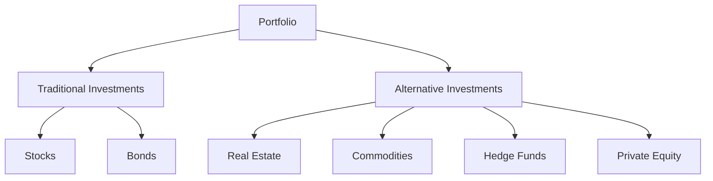

## 20.7 Diversification

Diversification is a fundamental principle in portfolio management, aimed at reducing risk by allocating investments across various financial instruments, industries, and other categories. This strategy is particularly crucial in the context of alternative investments, which can play a significant role in stabilizing a portfolio's performance, especially during periods of market stress.

### The Role of Diversification in Portfolio Management

Diversification involves spreading investments across different asset classes to minimize the impact of any single asset's poor performance on the overall portfolio. The primary goal is to achieve a balance that maximizes returns while minimizing risk. In the Canadian context, diversification is not just about mixing stocks and bonds but also incorporating alternative investments such as real estate, commodities, hedge funds, and private equity.

#### Benefits of Diversification

1. **Risk Reduction**: By investing in a variety of assets, investors can reduce the unsystematic risk associated with individual investments. This is because different asset classes often react differently to the same economic event.

2. **Smoother Returns**: Diversification can lead to more stable returns over time. While some assets may underperform, others may outperform, balancing the overall portfolio performance.

3. **Capital Preservation**: During market downturns, diversified portfolios tend to experience smaller drawdowns compared to non-diversified portfolios.

### Alternative Investments and Portfolio Volatility

Alternative investments are non-traditional assets that can provide diversification benefits beyond those offered by conventional stocks and bonds. They often have low correlation with traditional asset classes, meaning they do not move in tandem with the stock market. This characteristic can significantly lower overall portfolio volatility.

#### Lowering Volatility and Reducing Drawdowns

- **Volatility** is a measure of the dispersion of returns for a given security or market index. High volatility indicates a high degree of risk, as the asset's price can change dramatically over a short period in either direction.

- **Drawdown** refers to the decline from a historical peak in the value of a financial portfolio. Alternative investments can help mitigate drawdowns by providing returns that are not directly tied to the performance of traditional markets.

For instance, during the 2008 financial crisis, many traditional portfolios experienced significant drawdowns. However, portfolios that included alternative investments such as hedge funds or commodities often fared better, as these assets were less affected by the downturn.

### Importance of a Broad Array of Alternative Assets

To achieve effective diversification, it is essential to invest in a broad array of alternative assets. This approach ensures that the portfolio is not overly reliant on any single asset class, thereby enhancing its resilience to market fluctuations.

#### Examples of Alternative Assets

1. **Real Estate**: Offers potential for income generation and capital appreciation, often with low correlation to stock markets.

2. **Commodities**: Include assets like gold and oil, which can act as a hedge against inflation and currency devaluation.

3. **Hedge Funds**: Employ various strategies to achieve positive returns in both rising and falling markets.

4. **Private Equity**: Involves investing in private companies, offering the potential for high returns, albeit with higher risk and lower liquidity.

### Practical Application: Canadian Financial Landscape

In Canada, investors can leverage various financial instruments and regulatory frameworks to diversify their portfolios effectively. For example, Registered Retirement Savings Plans (RRSPs) and Tax-Free Savings Accounts (TFSAs) offer tax advantages that can enhance the benefits of diversification.

#### Case Study: Canadian Pension Funds

Canadian pension funds, such as the Canada Pension Plan Investment Board (CPPIB), have successfully utilized diversification strategies by investing in a mix of domestic and international equities, fixed income, and alternative assets. This approach has helped them achieve stable returns while managing risk effectively.

### Visualizing Diversification

Below is a diagram illustrating a diversified portfolio that includes traditional and alternative investments:

### Best Practices and Common Pitfalls

**Best Practices:**

- **Regular Rebalancing**: Periodically adjust the portfolio to maintain the desired level of diversification.
- **Due Diligence**: Conduct thorough research before investing in alternative assets to understand their risks and potential returns.
- **Professional Advice**: Consider consulting with a financial advisor to tailor a diversification strategy that aligns with your financial goals.

**Common Pitfalls:**

- **Over-Diversification**: Spreading investments too thinly can dilute potential returns.
- **Ignoring Correlations**: Failing to consider the correlation between assets can lead to ineffective diversification.

### Canadian Regulations and Resources

Investors should be aware of Canadian financial regulations and standards that govern portfolio management. The [Canadian Portfolio Management Standards](https://www.investopedia.com/terms/p/portfolio-management.asp) provide guidelines for managing diversified portfolios.

#### Additional Resources

- **Books**: "The Little Book of Common Sense Investing" by John C. Bogle offers insights into effective investment strategies.
- **Online Courses**: [edX: Portfolio Diversification](https://www.edx.org/course/portfolio-diversification) provides a comprehensive overview of diversification techniques.

### Conclusion

Diversification is a powerful tool in portfolio management, offering the potential to enhance returns while mitigating risk. By incorporating a broad array of alternative investments, Canadian investors can achieve a more resilient portfolio capable of withstanding market volatility and economic downturns. As you continue to explore diversification strategies, consider how these principles can be applied to your own investment decisions, keeping in mind the unique opportunities and challenges of the Canadian financial landscape.

### **Ready to Test Your Knowledge?**

**Practice 10 Essential CSC Exam Questions to Master Your Certification**



### What is the primary goal of diversification in portfolio management?

- [x] To maximize returns while minimizing risk
- [ ] To maximize risk while minimizing returns
- [ ] To invest solely in stocks
- [ ] To invest solely in bonds

> **Explanation:** Diversification aims to balance risk and return by spreading investments across various asset classes.

### How can alternative investments reduce portfolio volatility?

- [x] By having low correlation with traditional asset classes
- [ ] By having high correlation with traditional asset classes
- [ ] By being more volatile than stocks
- [ ] By being less volatile than bonds

> **Explanation:** Alternative investments often have low correlation with traditional assets, which helps reduce overall portfolio volatility.

### What is a drawdown?

- [x] The decline from a historical peak in the value of a financial portfolio
- [ ] The increase from a historical low in the value of a financial portfolio
- [ ] The average return of a portfolio over time
- [ ] The volatility measure of a portfolio

> **Explanation:** A drawdown is the decline from a historical peak in the value of a financial portfolio.

### Which of the following is an example of an alternative investment?

- [x] Real Estate
- [ ] Government Bonds
- [ ] Corporate Stocks
- [ ] Savings Accounts

> **Explanation:** Real estate is considered an alternative investment, unlike traditional investments such as stocks and bonds.

### Why is it important to invest in a broad array of alternative assets?

- [x] To enhance portfolio resilience to market fluctuations
- [ ] To concentrate risk in one asset class
- [x] To achieve effective diversification
- [ ] To simplify portfolio management

> **Explanation:** Investing in a broad array of alternative assets enhances diversification and resilience to market fluctuations.

### What is volatility?

- [x] A statistical measure of the dispersion of returns for a given security or market index
- [ ] The average return of a portfolio over time
- [ ] The decline from a historical peak in a portfolio's value
- [ ] The correlation between different asset classes

> **Explanation:** Volatility measures the dispersion of returns, indicating the degree of risk associated with an asset.

### Which Canadian financial tool offers tax advantages that can enhance diversification benefits?

- [x] RRSPs
- [ ] Savings Accounts
- [x] TFSAs
- [ ] Corporate Bonds

> **Explanation:** RRSPs and TFSAs offer tax advantages that can enhance the benefits of diversification.

### What is a common pitfall of diversification?

- [x] Over-Diversification
- [ ] Under-Diversification
- [ ] Investing in only one asset class
- [ ] Ignoring market trends

> **Explanation:** Over-diversification can dilute potential returns by spreading investments too thinly.

### How often should a diversified portfolio be rebalanced?

- [x] Periodically
- [ ] Never
- [ ] Only during market downturns
- [ ] Only during market upturns

> **Explanation:** Regular rebalancing helps maintain the desired level of diversification.

### True or False: Alternative investments always have high correlation with traditional asset classes.

- [ ] True
- [x] False

> **Explanation:** Alternative investments typically have low correlation with traditional asset classes, which is why they are used to diversify portfolios.


