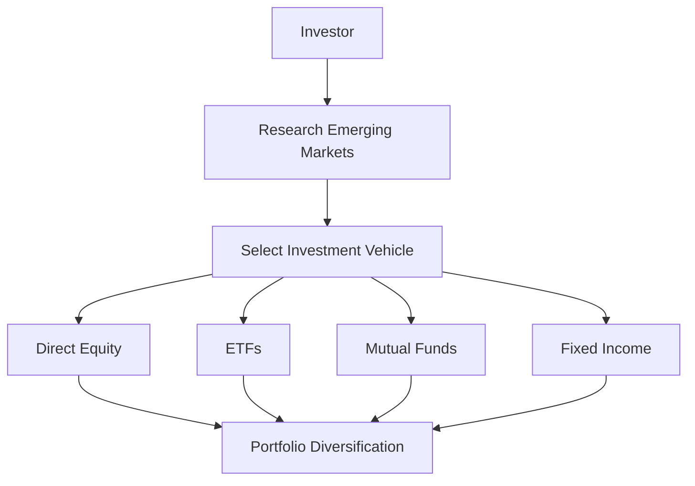

## 21.25 Emerging Markets Strategy

Emerging markets represent a dynamic and rapidly evolving segment of the global economy. These markets, characterized by nations undergoing significant economic growth and industrialization, offer unique opportunities and challenges for investors. In this section, we will delve into the strategies for investing in emerging markets, explore their growth potential, discuss the associated risks, and examine how these strategies can enhance portfolio diversification.

### Understanding Emerging Markets

**Emerging Markets** are nations with social or business activities in the process of rapid growth and industrialization. These countries often exhibit higher economic growth rates compared to developed markets, driven by factors such as increasing consumer demand, urbanization, and industrial expansion. Examples of emerging markets include Brazil, Russia, India, China, and South Africa, collectively known as the BRICS nations.

### Growth Potential of Emerging Markets

Emerging markets offer substantial growth potential due to several factors:

1. **Demographic Trends**: Many emerging markets have young, growing populations that drive consumer demand and labor force expansion.
2. **Urbanization**: Rapid urbanization leads to increased infrastructure development and economic activity.
3. **Technological Adoption**: Emerging markets often leapfrog traditional technologies, adopting new innovations that spur economic growth.
4. **Resource Abundance**: Many emerging markets are rich in natural resources, providing opportunities for export-driven growth.

### Risks Associated with Emerging Markets

While the growth potential is significant, investing in emerging markets comes with unique risks:

1. **Political Instability**: Emerging markets may experience political turmoil, which can impact economic stability and investment returns.
2. **Currency Risk**: Fluctuations in exchange rates can affect the value of investments in emerging markets.
3. **Regulatory Challenges**: Emerging markets may have less developed regulatory frameworks, leading to increased uncertainty.
4. **Market Volatility**: These markets can be more volatile due to lower liquidity and less mature financial systems.

### Enhancing Portfolio Diversification

Investing in emerging markets can enhance portfolio diversification by providing exposure to different economic cycles and growth drivers. This diversification can reduce overall portfolio risk and improve returns over the long term. Canadian investors, in particular, can benefit from diversifying beyond the domestic market, which is heavily weighted towards financials and natural resources.

### Emerging Markets Investment Strategies

1. **Direct Equity Investment**: Investing directly in stocks of companies based in emerging markets. This approach requires thorough research and understanding of local markets.
2. **Exchange-Traded Funds (ETFs)**: ETFs that focus on emerging markets provide diversified exposure to a basket of stocks, reducing individual company risk.
3. **Mutual Funds**: Actively managed mutual funds can offer professional management and diversification across various emerging markets.
4. **Fixed Income**: Investing in bonds issued by emerging market governments or corporations can provide income and diversification benefits.

### Case Study: Canadian Pension Funds and Emerging Markets

Canadian pension funds, such as the Canada Pension Plan Investment Board (CPPIB), have increasingly allocated assets to emerging markets to capture growth opportunities and diversify their portfolios. These funds leverage their long-term investment horizon and expertise to navigate the complexities of emerging markets.

### Practical Example: Analyzing a Portfolio's Asset Allocation

Consider a Canadian investor with a portfolio heavily weighted in domestic equities and fixed income. By allocating a portion of the portfolio to an emerging markets ETF, the investor can achieve greater diversification and potentially enhance returns. This allocation should be carefully considered in the context of the investor's risk tolerance and investment objectives.

### Diagram: Emerging Markets Investment Process

### Best Practices and Common Pitfalls

**Best Practices:**
- Conduct thorough research and due diligence before investing.
- Diversify across multiple emerging markets to mitigate country-specific risks.
- Monitor geopolitical developments and currency fluctuations.

**Common Pitfalls:**
- Overconcentration in a single market or sector.
- Underestimating the impact of political and economic instability.
- Ignoring currency risk and its effect on returns.

### References and Additional Resources

- **Books**: "Emerging Markets For Dummies" by Ann C. Logue
- **Canadian Financial Regulations**: Refer to the Canadian Securities Administrators (CSA) for guidelines on investing in foreign markets.
- **Open-Source Financial Tools**: Utilize platforms like Yahoo Finance and Bloomberg for market data and analysis.

### Encouragement for Application

Investing in emerging markets requires a strategic approach and a willingness to embrace both opportunities and risks. By understanding the unique characteristics of these markets and employing sound investment strategies, Canadian investors can enhance their portfolios and achieve long-term financial goals.

### **Ready to Test Your Knowledge?**

**Practice 10 Essential CSC Exam Questions to Master Your Certification**



### What are emerging markets?

- [x] Nations with social or business activities in the process of rapid growth and industrialization.
- [ ] Developed countries with stable economies.
- [ ] Countries with declining economic growth.
- [ ] Nations with no industrial activities.

> **Explanation:** Emerging markets are characterized by rapid growth and industrialization, unlike developed countries with stable economies.

### Which of the following is a risk associated with emerging markets?

- [x] Political instability
- [ ] High liquidity
- [ ] Stable currency
- [ ] Strong regulatory frameworks

> **Explanation:** Political instability is a common risk in emerging markets, affecting economic stability and investment returns.

### How can emerging markets enhance portfolio diversification?

- [x] By providing exposure to different economic cycles and growth drivers.
- [ ] By concentrating investments in a single market.
- [ ] By reducing exposure to international markets.
- [ ] By focusing solely on domestic equities.

> **Explanation:** Emerging markets offer exposure to different economic cycles, enhancing portfolio diversification.

### What is a common investment vehicle for accessing emerging markets?

- [x] Exchange-Traded Funds (ETFs)
- [ ] Real estate investment trusts (REITs)
- [ ] Domestic bonds
- [ ] Savings accounts

> **Explanation:** ETFs provide diversified exposure to emerging markets, making them a common investment vehicle.

### Which of the following is a best practice when investing in emerging markets?

- [x] Conduct thorough research and due diligence.
- [ ] Concentrate investments in a single emerging market.
- [ ] Ignore currency fluctuations.
- [ ] Avoid monitoring geopolitical developments.

> **Explanation:** Conducting thorough research and due diligence is crucial for successful investing in emerging markets.

### What is a common pitfall when investing in emerging markets?

- [x] Overconcentration in a single market or sector.
- [ ] Diversifying across multiple markets.
- [ ] Monitoring political developments.
- [ ] Hedging currency risk.

> **Explanation:** Overconcentration in a single market or sector increases risk and is a common pitfall.

### Which Canadian institution is known for investing in emerging markets?

- [x] Canada Pension Plan Investment Board (CPPIB)
- [ ] Bank of Canada
- [ ] Canadian Imperial Bank of Commerce (CIBC)
- [ ] Toronto Stock Exchange (TSX)

> **Explanation:** CPPIB is known for allocating assets to emerging markets to capture growth opportunities.

### What is a benefit of investing in emerging market bonds?

- [x] Income and diversification benefits
- [ ] Guaranteed returns
- [ ] No currency risk
- [ ] High liquidity

> **Explanation:** Emerging market bonds provide income and diversification benefits, though they come with risks.

### Which demographic trend supports growth in emerging markets?

- [x] Young, growing populations
- [ ] Aging populations
- [ ] Declining birth rates
- [ ] High unemployment rates

> **Explanation:** Young, growing populations drive consumer demand and economic growth in emerging markets.

### True or False: Emerging markets are characterized by stable political environments.

- [ ] True
- [x] False

> **Explanation:** Emerging markets often experience political instability, which can impact economic stability.


