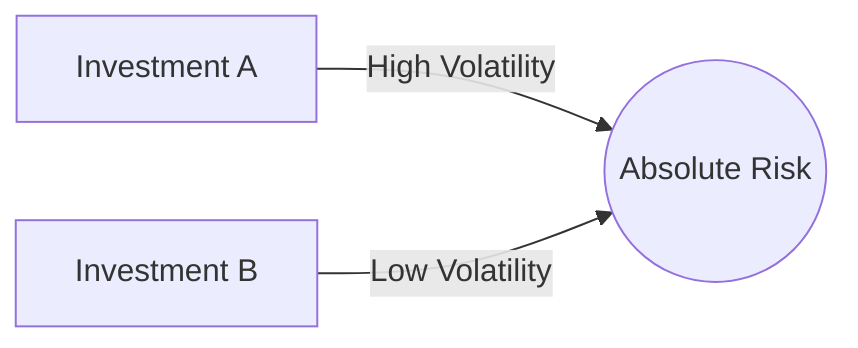

## 21.3.1 Absolute Risk

In the realm of alternative investments, understanding the risk associated with various strategies is crucial for both investors and financial professionals. One of the fundamental concepts in this context is **absolute risk**, which refers to the total volatility or variability of investment returns. This section delves into the definition, importance, and limitations of absolute risk, while also contrasting it with relative risk measures.

### Definition and Importance

**Absolute risk** is a measure of the total variability in the returns of an investment. It encompasses all sources of risk that contribute to the fluctuations in the value of an investment over time. This measure is crucial for investors seeking to understand the overall risk profile of alternative strategy funds, which often involve complex and diverse investment approaches.

Absolute risk is typically quantified using statistical measures such as standard deviation or variance. These metrics provide a numerical representation of how much an investment's returns can deviate from its average return over a given period. In the context of alternative investments, which may include hedge funds, private equity, or real estate, absolute risk helps investors gauge the potential for both gains and losses.

#### Practical Example: Canadian Pension Funds

Consider a Canadian pension fund that invests in a diversified portfolio of alternative assets, including hedge funds and private equity. By assessing the absolute risk of each component, the fund managers can better understand the overall risk exposure of the portfolio. This understanding allows them to make informed decisions about asset allocation and risk management strategies.

### Comparison with Relative Risk

While absolute risk provides a comprehensive view of an investment's volatility, it is essential to compare it with **relative risk** measures to gain a more nuanced understanding of risk.

**Relative risk** focuses on the variability of returns in relation to a benchmark or market index. It helps investors assess how an investment performs compared to the broader market. For instance, the beta coefficient is a common relative risk measure that indicates how much an investment's returns move in relation to the market.

#### Key Differences

- **Scope:** Absolute risk considers all sources of variability in returns, while relative risk focuses on deviations from a benchmark.
- **Application:** Absolute risk is useful for understanding the standalone risk of an investment, whereas relative risk is valuable for comparing performance against market standards.

### Limitations of Absolute Risk

Despite its importance, absolute risk has certain limitations that investors should be aware of:

1. **Lack of Directional Insight:** Absolute risk does not distinguish between favorable and unfavorable volatility. It treats all deviations from the mean equally, whether they result in gains or losses.

2. **Contextual Limitations:** Without a benchmark, absolute risk does not provide context for evaluating whether the level of risk is appropriate or excessive for a given investment strategy.

3. **Complexity in Interpretation:** For complex alternative investments, interpreting absolute risk can be challenging without considering other risk measures and qualitative factors.

### Glossary

- **Absolute Risk:** The total volatility or variability of investment returns without distinguishing between upside and downside.

### Visual Representation

To better understand the concept of absolute risk, consider the following diagram illustrating the variability of returns for two hypothetical investments:

In this diagram, Investment A exhibits high volatility, indicating a higher absolute risk compared to Investment B, which shows lower volatility.

### Best Practices and Considerations

- **Diversification:** To manage absolute risk, investors should consider diversifying their portfolios across different asset classes and strategies.
- **Risk Assessment Tools:** Utilize statistical tools and software to calculate and monitor absolute risk metrics regularly.
- **Holistic Approach:** Combine absolute risk analysis with other risk measures, such as relative risk and downside risk, for a comprehensive risk assessment.

### Conclusion

Understanding absolute risk is essential for evaluating the total volatility of alternative investments. While it provides valuable insights into the overall risk profile, it should be used in conjunction with other risk measures to make informed investment decisions. By recognizing its limitations and integrating it into a broader risk management strategy, investors can better navigate the complexities of alternative investments.

## Quiz Time!



### What does absolute risk measure in an investment?

- [x] Total volatility or variability of investment returns
- [ ] Only downside risk
- [ ] Risk relative to a benchmark
- [ ] Only upside potential

> **Explanation:** Absolute risk measures the total volatility or variability of investment returns, encompassing all sources of risk.

### How does absolute risk differ from relative risk?

- [x] Absolute risk considers all sources of variability, while relative risk focuses on deviations from a benchmark.
- [ ] Absolute risk only measures downside risk, while relative risk measures upside potential.
- [ ] Absolute risk is used for short-term investments, while relative risk is for long-term investments.
- [ ] Absolute risk is less important than relative risk.

> **Explanation:** Absolute risk considers all sources of variability in returns, whereas relative risk measures deviations from a benchmark or market index.

### What is a limitation of absolute risk?

- [x] It does not distinguish between favorable and unfavorable volatility.
- [ ] It only measures risk in relation to a benchmark.
- [ ] It is only applicable to equity investments.
- [ ] It provides directional insight into market trends.

> **Explanation:** Absolute risk does not distinguish between favorable and unfavorable volatility, treating all deviations equally.

### Which statistical measure is commonly used to quantify absolute risk?

- [x] Standard deviation
- [ ] Beta coefficient
- [ ] Alpha
- [ ] Sharpe ratio

> **Explanation:** Standard deviation is a common statistical measure used to quantify absolute risk by assessing the variability of returns.

### Why is absolute risk important for alternative strategy funds?

- [x] It helps understand the overall risk profile of complex investment strategies.
- [ ] It only measures risk in relation to traditional investments.
- [ ] It is the only risk measure needed for investment decisions.
- [ ] It focuses solely on downside risk.

> **Explanation:** Absolute risk is important for understanding the overall risk profile of complex investment strategies, such as those in alternative strategy funds.

### What is a common practice to manage absolute risk in a portfolio?

- [x] Diversification across different asset classes and strategies
- [ ] Investing only in high-risk assets
- [ ] Ignoring risk measures altogether
- [ ] Focusing solely on relative risk

> **Explanation:** Diversification across different asset classes and strategies is a common practice to manage absolute risk in a portfolio.

### Which of the following is NOT a characteristic of absolute risk?

- [ ] Total variability of returns
- [x] Comparison to a market benchmark
- [ ] Lack of directional insight
- [ ] Use of standard deviation as a measure

> **Explanation:** Absolute risk does not involve comparison to a market benchmark; this is a characteristic of relative risk.

### What does a high absolute risk indicate about an investment?

- [x] High volatility in returns
- [ ] Low potential for gains
- [ ] Guaranteed losses
- [ ] Stable returns

> **Explanation:** A high absolute risk indicates high volatility in returns, meaning the investment's value can fluctuate significantly.

### True or False: Absolute risk provides context for evaluating whether the level of risk is appropriate for a given strategy.

- [ ] True
- [x] False

> **Explanation:** False. Absolute risk does not provide context for evaluating whether the level of risk is appropriate; it requires additional measures for context.

### Which investment is likely to have a higher absolute risk?

- [x] A hedge fund with diverse strategies
- [ ] A government bond
- [ ] A savings account
- [ ] A fixed annuity

> **Explanation:** A hedge fund with diverse strategies is likely to have a higher absolute risk due to the complexity and variability of its investments.


