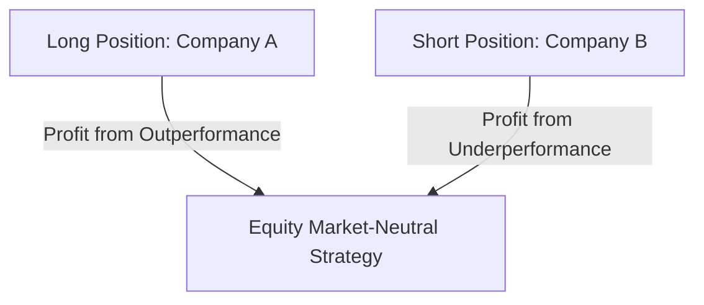

## 21.3 Relative Value Strategies

Relative value strategies are a sophisticated approach within the realm of alternative investments, designed to exploit pricing inefficiencies between related securities. These strategies are particularly appealing to investors seeking to achieve returns that are independent of market direction, focusing instead on the relative pricing of securities. In this section, we will delve into the core concepts of relative value strategies, explore specific tactics such as equity market-neutral strategies, convertible arbitrage, and fixed-income arbitrage, and provide practical examples within the Canadian financial context.

### Understanding Relative Value Strategies

At their core, relative value strategies aim to capitalize on the price discrepancies between related financial instruments. These strategies are predicated on the belief that such discrepancies are temporary and will eventually correct, allowing investors to profit from the convergence of prices. Unlike directional strategies that depend on market movements, relative value strategies focus on the relative performance of securities, making them an attractive option for risk-averse investors.

### Key Relative Value Strategies

#### Equity Market-Neutral Strategies

Equity market-neutral strategies are designed to eliminate market risk by maintaining balanced long and short positions. The objective is to profit from the relative performance of stocks, irrespective of overall market movements. This is achieved by carefully selecting stocks that are expected to outperform (long positions) and underperform (short positions) relative to each other.

**Example:** Consider a Canadian hedge fund that identifies two companies in the same industry, Company A and Company B. The fund manager believes that Company A is undervalued while Company B is overvalued. By taking a long position in Company A and a short position in Company B, the fund can potentially profit from the relative performance of these stocks, regardless of the broader market trend.

**Mermaid Diagram:**

#### Convertible Arbitrage

Convertible arbitrage involves buying convertible securities, such as bonds or preferred stocks, and hedging with short positions in the underlying stock. The goal is to exploit the pricing inefficiencies between the convertible security and the stock, profiting from the conversion feature while minimizing risk.

**Example:** A Canadian investor purchases convertible bonds issued by a major bank, such as RBC, while simultaneously shorting the bank's common stock. If the bond's conversion feature is undervalued relative to the stock, the investor can profit from the eventual alignment of these prices.

**Glossary:**
- **Convertible Securities:** Bonds or preferred stocks that can be converted into a predetermined number of the company’s equity shares.
- **Arbitrage:** The simultaneous purchase and sale of an asset to profit from an imbalance in price.

#### Fixed-Income Arbitrage

Fixed-income arbitrage seeks to profit from pricing discrepancies in fixed-income securities. This strategy involves taking long and short positions in bonds or other fixed-income instruments to exploit differences in yield spreads, interest rates, or credit ratings.

**Example:** A Canadian pension fund identifies a mispricing between government bonds and corporate bonds. By taking a long position in undervalued corporate bonds and a short position in overvalued government bonds, the fund aims to profit from the convergence of yield spreads.

### Practical Considerations and Challenges

While relative value strategies offer the potential for attractive returns, they also come with inherent challenges. Identifying genuine pricing inefficiencies requires sophisticated analytical tools and a deep understanding of market dynamics. Additionally, these strategies often involve significant leverage, which can amplify both gains and losses.

**Common Pitfalls:**
- **Over-reliance on Models:** Relying too heavily on quantitative models without considering market sentiment or external factors can lead to unexpected losses.
- **Liquidity Risks:** Some relative value strategies involve illiquid securities, which can pose challenges in executing trades efficiently.

### Best Practices for Implementing Relative Value Strategies

1. **Thorough Research:** Conduct comprehensive research and analysis to identify genuine pricing inefficiencies.
2. **Risk Management:** Implement robust risk management practices to mitigate potential losses, including setting stop-loss limits and diversifying positions.
3. **Regulatory Compliance:** Ensure compliance with Canadian financial regulations, leveraging resources such as the Investment Funds Institute of Canada (IFIC) for guidance.

### Canadian Financial Regulations and Resources

Investors in Canada must adhere to specific regulations and guidelines when implementing relative value strategies. The Investment Funds Institute of Canada (IFIC) provides valuable resources and insights into best practices for managing investment funds. For more information, visit the [IFIC website](https://www.ific.ca/en).

### Conclusion

Relative value strategies offer a compelling approach for investors seeking to exploit pricing inefficiencies in the Canadian financial markets. By focusing on the relative performance of securities, these strategies provide an opportunity for risk-adjusted returns that are independent of market direction. However, successful implementation requires a deep understanding of market dynamics, rigorous research, and effective risk management.

### **Ready to Test Your Knowledge?**

**Practice 10 Essential CSC Exam Questions to Master Your Certification**



### What is the primary objective of relative value strategies?

- [x] To exploit pricing inefficiencies between related securities
- [ ] To maximize returns through high-risk investments
- [ ] To invest solely in government bonds
- [ ] To focus on long-term capital appreciation

> **Explanation:** Relative value strategies aim to exploit pricing inefficiencies between related securities, seeking profit from the convergence of prices.

### Which strategy involves maintaining balanced long and short positions to eliminate market risk?

- [x] Equity Market-Neutral Strategies
- [ ] Convertible Arbitrage
- [ ] Fixed-Income Arbitrage
- [ ] Growth Investing

> **Explanation:** Equity market-neutral strategies aim to eliminate market risk by maintaining balanced long and short positions.

### What does convertible arbitrage involve?

- [x] Buying convertible securities and hedging with short positions in the underlying stock
- [ ] Investing in high-yield bonds
- [ ] Shorting government bonds
- [ ] Buying and holding stocks for the long term

> **Explanation:** Convertible arbitrage involves buying convertible securities and hedging with short positions in the underlying stock to exploit pricing inefficiencies.

### What is a key risk associated with relative value strategies?

- [x] Liquidity risks
- [ ] Guaranteed losses
- [ ] Lack of diversification
- [ ] High transaction costs

> **Explanation:** Liquidity risks can pose challenges in executing trades efficiently, especially in illiquid securities.

### Which Canadian institution provides resources for managing investment funds?

- [x] Investment Funds Institute of Canada (IFIC)
- [ ] Bank of Canada
- [ ] Canada Revenue Agency
- [ ] Toronto Stock Exchange

> **Explanation:** The Investment Funds Institute of Canada (IFIC) provides valuable resources and insights into managing investment funds.

### What is a convertible security?

- [x] A bond or preferred stock that can be converted into a predetermined number of the company’s equity shares
- [ ] A type of mutual fund
- [ ] A government bond
- [ ] A high-yield savings account

> **Explanation:** Convertible securities are bonds or preferred stocks that can be converted into a predetermined number of the company’s equity shares.

### What is arbitrage?

- [x] The simultaneous purchase and sale of an asset to profit from an imbalance in price
- [ ] A long-term investment strategy
- [ ] A method of diversifying a portfolio
- [ ] A type of fixed-income security

> **Explanation:** Arbitrage involves the simultaneous purchase and sale of an asset to profit from an imbalance in price.

### Which strategy seeks to profit from pricing discrepancies in fixed-income securities?

- [x] Fixed-Income Arbitrage
- [ ] Equity Market-Neutral Strategies
- [ ] Convertible Arbitrage
- [ ] Value Investing

> **Explanation:** Fixed-income arbitrage seeks to profit from pricing discrepancies in fixed-income securities.

### What is a common pitfall of relative value strategies?

- [x] Over-reliance on models
- [ ] Investing in only one asset class
- [ ] Ignoring market trends
- [ ] Lack of regulatory compliance

> **Explanation:** Over-reliance on quantitative models without considering market sentiment or external factors can lead to unexpected losses.

### True or False: Relative value strategies depend on overall market movements for success.

- [ ] True
- [x] False

> **Explanation:** Relative value strategies focus on the relative performance of securities, making them independent of overall market movements.


