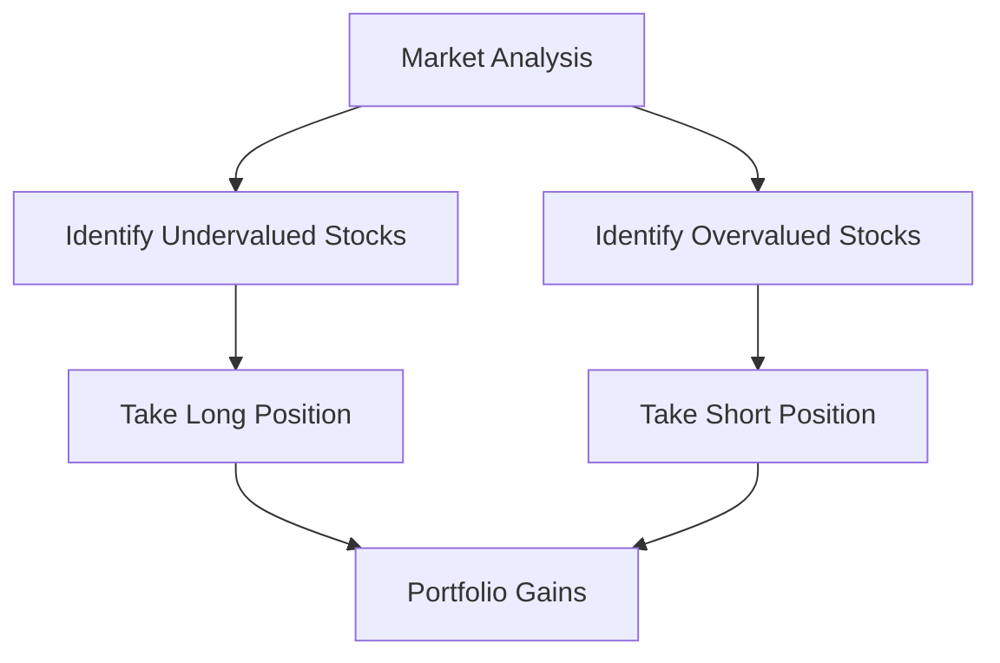

## 21.5 Directional Strategies

Directional strategies are a cornerstone of alternative investment approaches, allowing investors to capitalize on anticipated movements in market prices. These strategies are particularly appealing because they offer the potential for significant returns by taking advantage of market inefficiencies and trends. In this section, we will delve into various directional strategies, each with its unique approach and application within the financial markets, particularly in the Canadian context.

### Understanding Directional Strategies

Directional strategies involve taking positions based on the expected direction of market prices. Investors using these strategies aim to profit from the rise or fall of asset prices. The core idea is to predict market movements accurately and position investments accordingly. These strategies can be applied across various asset classes, including equities, bonds, commodities, and currencies.

### Key Directional Strategies

#### Long/Short Equity Strategy

The long/short equity strategy is a popular hedge fund strategy that involves taking long positions in stocks that are expected to increase in value and short positions in stocks that are expected to decrease in value. This strategy seeks to exploit market inefficiencies by identifying mispriced securities.

- **Long Position:** Involves buying a security with the expectation that its price will rise. For example, an investor might purchase shares of a Canadian technology company that is poised for growth due to innovative products or favorable market conditions.
  
- **Short Position:** Involves selling a security with the expectation that its price will fall. This could involve shorting shares of a Canadian retail company facing declining sales and increased competition.

The long/short equity strategy can be particularly effective in volatile markets, as it allows investors to hedge against market downturns while still capitalizing on upward trends.

#### Global Macro Strategy

Global macro strategies involve making investment decisions based on macroeconomic trends and global events. These strategies consider factors such as interest rates, currency fluctuations, geopolitical events, and economic indicators.

For instance, a global macro investor might anticipate a rise in Canadian interest rates due to strong economic growth and position their portfolio to benefit from this trend. This could involve investing in Canadian bonds or equities that are likely to perform well in a rising interest rate environment.

#### Emerging Markets Strategy

Emerging markets strategies focus on investing in securities from developing economies. These markets often offer higher growth potential compared to developed markets, but they also come with increased risks, such as political instability and currency volatility.

Investors might look to countries like Brazil, India, or China for opportunities, but it's essential to consider the unique challenges and regulatory environments of these markets. Canadian investors can access emerging markets through mutual funds or exchange-traded funds (ETFs) that focus on these regions.

#### Dedicated Short Bias Strategy

A dedicated short bias strategy involves maintaining a net short position in the market, aiming to profit from declines in asset prices. This strategy is inherently bearish and can be used to hedge against market downturns or capitalize on overvalued securities.

For example, an investor might short Canadian real estate stocks if they anticipate a housing market correction. This strategy requires careful analysis and timing, as markets generally trend upwards over the long term.

#### Managed Futures Strategy

Managed futures strategies involve trading futures contracts to capitalize on price trends across various asset classes, including commodities, currencies, and interest rates. These strategies are often systematic and rely on quantitative models to identify and exploit trends.

Managed futures can provide diversification benefits to a portfolio, as they often have low correlation with traditional asset classes like stocks and bonds. Canadian investors can access managed futures through funds that specialize in this strategy.

### Practical Examples and Case Studies

To illustrate these strategies, consider the following examples:

- **Long/Short Equity:** A Canadian hedge fund identifies an undervalued mining company with strong growth prospects and takes a long position. Simultaneously, it shorts an overvalued energy company facing regulatory challenges.

- **Global Macro:** An investor anticipates a strengthening Canadian dollar due to rising oil prices and invests in Canadian exporters that benefit from a stronger currency.

- **Emerging Markets:** A Canadian pension fund allocates a portion of its portfolio to an emerging markets ETF, seeking higher returns from rapidly growing economies.

- **Dedicated Short Bias:** An investor shorts Canadian retail stocks, expecting a downturn due to changing consumer preferences and increased e-commerce competition.

- **Managed Futures:** A Canadian investment firm uses a managed futures strategy to trade commodity futures, capitalizing on trends in oil and gold prices.

### Diagrams and Visual Aids

To better understand the flow and relationships in directional strategies, consider the following diagram illustrating the long/short equity strategy:

### Best Practices and Challenges

**Best Practices:**

- Conduct thorough market research and analysis to identify trends and mispriced securities.
- Diversify investments across different asset classes and regions to mitigate risks.
- Stay informed about global economic events and their potential impact on markets.

**Common Challenges:**

- Accurately predicting market movements can be difficult, leading to potential losses.
- Emerging markets can be volatile and subject to sudden regulatory changes.
- Short selling involves risks, including unlimited losses if the market moves against the position.

### Canadian Financial Regulations and Resources

Canadian investors should be aware of the regulatory environment governing these strategies. The Canadian Investment Regulatory Organization (CIRO) oversees securities trading and investment activities in Canada. Investors can also explore resources such as the [Chicago Mercantile Exchange (CME) on Managed Futures](https://www.cmegroup.com) for additional insights into managed futures strategies.

### Conclusion

Directional strategies offer a dynamic approach to investing, allowing investors to capitalize on market trends and inefficiencies. By understanding and applying these strategies, Canadian investors can enhance their portfolios and potentially achieve higher returns. However, it's crucial to remain vigilant and informed about market conditions and regulatory changes.

### **Ready to Test Your Knowledge?**

**Practice 10 Essential CSC Exam Questions to Master Your Certification**



### What is a directional strategy?

- [x] A strategy that bets on the anticipated movement of market prices.
- [ ] A strategy that focuses solely on dividend income.
- [ ] A strategy that only invests in government bonds.
- [ ] A strategy that avoids all forms of risk.

> **Explanation:** Directional strategies involve taking positions based on the expected direction of market prices, aiming to profit from price movements.

### Which strategy involves taking long positions in undervalued stocks and short positions in overvalued stocks?

- [x] Long/Short Equity Strategy
- [ ] Global Macro Strategy
- [ ] Emerging Markets Strategy
- [ ] Managed Futures Strategy

> **Explanation:** The long/short equity strategy involves taking long positions in undervalued stocks and short positions in overvalued stocks to exploit market inefficiencies.

### What does a global macro strategy focus on?

- [x] Macroeconomic trends affecting global markets.
- [ ] Investing exclusively in Canadian equities.
- [ ] Shorting only technology stocks.
- [ ] Trading only in commodities.

> **Explanation:** Global macro strategies involve making investment decisions based on macroeconomic trends and global events.

### Which strategy maintains a net short position in the market?

- [x] Dedicated Short Bias Strategy
- [ ] Long/Short Equity Strategy
- [ ] Emerging Markets Strategy
- [ ] Global Macro Strategy

> **Explanation:** A dedicated short bias strategy involves maintaining a net short position in the market to profit from declines in asset prices.

### What is a key characteristic of emerging markets strategies?

- [x] Investing in securities from developing economies.
- [ ] Focusing only on developed markets.
- [ ] Avoiding all forms of currency risk.
- [ ] Investing solely in fixed-income securities.

> **Explanation:** Emerging markets strategies focus on investing in securities from developing economies, offering higher growth potential but also increased risks.

### What is a managed futures strategy?

- [x] Trading futures contracts to capitalize on price trends.
- [ ] Investing only in real estate.
- [ ] Focusing exclusively on Canadian stocks.
- [ ] Avoiding all forms of leverage.

> **Explanation:** Managed futures strategies involve trading futures contracts to capitalize on price trends across various asset classes.

### Which strategy is inherently bearish?

- [x] Dedicated Short Bias Strategy
- [ ] Long/Short Equity Strategy
- [ ] Global Macro Strategy
- [ ] Emerging Markets Strategy

> **Explanation:** A dedicated short bias strategy is inherently bearish, aiming to profit from declines in asset prices.

### What is a long position?

- [x] Buying a security with the expectation that its price will rise.
- [ ] Selling a security with the expectation that its price will fall.
- [ ] Holding a security indefinitely.
- [ ] Avoiding all forms of risk.

> **Explanation:** A long position involves buying a security with the expectation that its price will rise.

### What is a short position?

- [x] Selling a security with the expectation that its price will fall.
- [ ] Buying a security with the expectation that its price will rise.
- [ ] Holding a security indefinitely.
- [ ] Avoiding all forms of risk.

> **Explanation:** A short position involves selling a security with the expectation that its price will fall.

### Directional strategies can be applied across various asset classes.

- [x] True
- [ ] False

> **Explanation:** Directional strategies can be applied across various asset classes, including equities, bonds, commodities, and currencies.


