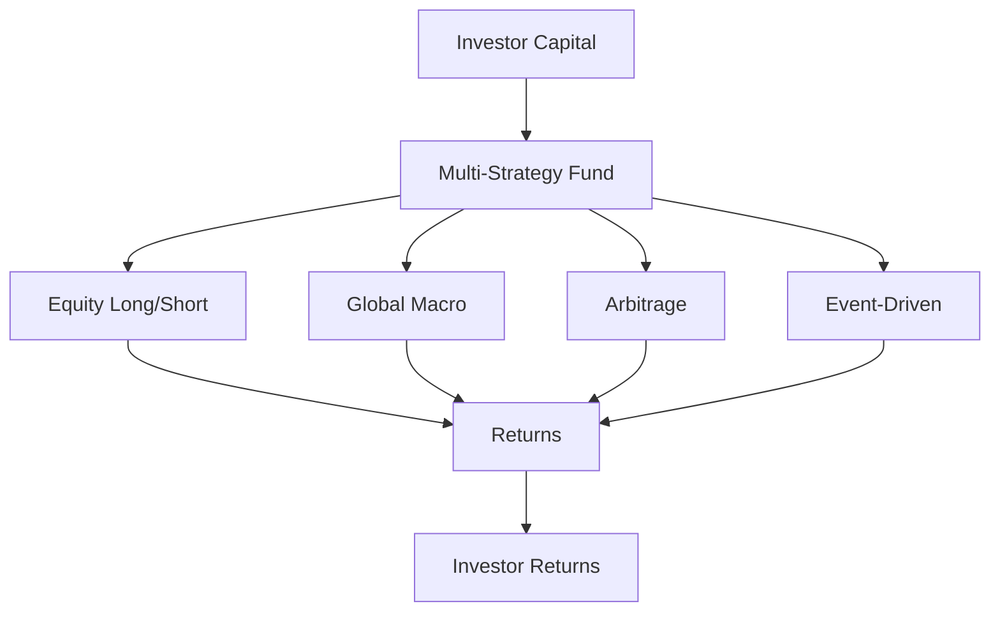

## 21.6 Multi-Strategy Funds

In the ever-evolving landscape of investment opportunities, multi-strategy funds have emerged as a versatile tool for investors seeking to balance risk and return. These funds are designed to harness the strengths of various investment strategies within a single fund, offering a unique approach to portfolio management. This section delves into the mechanics of multi-strategy funds, their benefits, and how they compare to fund-of-funds, with a particular focus on the Canadian financial context.

### Understanding Multi-Strategy Funds

**Multi-Strategy Fund**: A multi-strategy fund is an investment vehicle that employs a variety of investment strategies to achieve its objectives. By diversifying across multiple strategies, these funds aim to reduce risk and enhance returns, making them an attractive option for investors seeking a balanced approach.

Multi-strategy funds typically incorporate a range of investment techniques, such as:

- **Equity Long/Short**: Involves taking long positions in undervalued stocks while shorting overvalued ones.
- **Global Macro**: Focuses on large-scale economic and political trends to make investment decisions.
- **Arbitrage**: Exploits price discrepancies between related securities.
- **Event-Driven**: Capitalizes on corporate events like mergers, acquisitions, or bankruptcies.

By integrating these diverse strategies, multi-strategy funds can adapt to changing market conditions and mitigate the impact of adverse events on a single strategy.

### Multi-Strategy Funds vs. Fund-of-Funds

While multi-strategy funds and fund-of-funds (FOF) both offer diversification, they differ significantly in their structure and management.

**Fund-of-Funds (FOF)**: A fund-of-funds invests in a portfolio of other investment funds rather than directly in individual securities. This approach provides diversification across different fund managers and investment styles.

#### Key Differences:

1. **Management**:
   - Multi-strategy funds are typically managed by a single investment team that coordinates multiple strategies within the same fund.
   - Fund-of-funds involve multiple fund managers, each responsible for their respective funds within the portfolio.

2. **Fee Structures**:
   - Multi-strategy funds often have a single layer of fees, which may include management and performance fees.
   - Fund-of-funds generally incur two layers of fees: one for the overarching fund and another for each underlying fund, potentially leading to higher overall costs.

3. **Flexibility**:
   - Multi-strategy funds offer greater flexibility in reallocating capital among strategies as market conditions change.
   - Fund-of-funds may face constraints due to the need to manage relationships with multiple external fund managers.

### Benefits of Diversification

Diversification is a cornerstone of investment strategy, and multi-strategy funds exemplify this principle by spreading risk across various investment approaches. The benefits include:

- **Risk Reduction**: By not relying on a single strategy, multi-strategy funds can buffer against poor performance in any one area.
- **Enhanced Returns**: The ability to capitalize on diverse market opportunities can lead to more consistent returns over time.
- **Adaptability**: Multi-strategy funds can swiftly adjust their allocations in response to market shifts, maintaining a dynamic investment posture.

### Canadian Context and Regulations

In Canada, multi-strategy funds are subject to regulatory oversight by the Canadian Investment Regulatory Organization (CIRO) and provincial securities commissions. These bodies ensure that funds adhere to standards of transparency, risk management, and investor protection.

Investors should be aware of the specific regulations governing multi-strategy funds in Canada, including disclosure requirements and restrictions on certain investment practices. Consulting resources such as the CIRO website and provincial securities commission publications can provide valuable insights into compliance and best practices.

### Practical Example: Canadian Pension Funds

Canadian pension funds, such as the Canada Pension Plan Investment Board (CPPIB), often employ multi-strategy approaches to manage their vast portfolios. By diversifying across asset classes and investment strategies, these funds aim to achieve stable, long-term growth while managing risk.

For instance, CPPIB may allocate capital to equity long/short strategies, real estate investments, and infrastructure projects, balancing the potential for high returns with the need for stability and risk mitigation.

### Diagrams and Visuals

To better understand the structure and benefits of multi-strategy funds, consider the following diagram illustrating the flow of capital within a multi-strategy fund:

This diagram highlights how investor capital is allocated across various strategies, each contributing to the overall returns of the fund.

### Best Practices and Challenges

**Best Practices**:
- **Due Diligence**: Thoroughly research the fund's strategies, management team, and historical performance.
- **Regulatory Compliance**: Ensure the fund complies with Canadian regulations and standards.
- **Risk Assessment**: Evaluate the fund's risk management practices and diversification strategies.

**Common Challenges**:
- **Complexity**: Understanding the interplay of multiple strategies can be challenging for investors.
- **Fee Structures**: Be mindful of the potential for high fees, particularly in fund-of-funds.

### Additional Resources

For those interested in exploring multi-strategy funds further, consider the following resources:

- **Books**: "All About Multi-Strategy Hedge Funds" by Ian D. Gow provides an in-depth look at the mechanics and benefits of these funds.
- **Online Courses**: Platforms like Coursera and edX offer courses on investment strategies and risk management.
- **Regulatory Websites**: Visit the CIRO and provincial securities commission websites for up-to-date regulatory information.

### Conclusion

Multi-strategy funds offer a compelling option for investors seeking diversification and risk management. By combining various investment strategies within a single fund, they provide a dynamic approach to navigating the complexities of financial markets. As with any investment, due diligence and an understanding of the regulatory landscape are crucial to making informed decisions.

### **Ready to Test Your Knowledge?**

**Practice 10 Essential CSC Exam Questions to Master Your Certification**



### What is a multi-strategy fund?

- [x] A fund that employs multiple investment strategies to achieve its objectives.
- [ ] A fund that invests only in equities.
- [ ] A fund that focuses on a single investment strategy.
- [ ] A fund that invests in real estate only.

> **Explanation:** A multi-strategy fund uses various investment strategies to diversify and manage risk.

### How do multi-strategy funds differ from fund-of-funds in terms of management?

- [x] Multi-strategy funds are managed by a single investment team.
- [ ] Multi-strategy funds involve multiple external fund managers.
- [ ] Fund-of-funds are managed by a single investment team.
- [ ] Both are managed by multiple external fund managers.

> **Explanation:** Multi-strategy funds are typically managed by one team coordinating various strategies, while fund-of-funds involve multiple managers.

### What is a key benefit of diversification in multi-strategy funds?

- [x] Risk reduction and enhanced returns.
- [ ] Increased complexity.
- [ ] Higher fees.
- [ ] Limited flexibility.

> **Explanation:** Diversification helps reduce risk and can enhance returns by spreading investments across different strategies.

### What regulatory body oversees multi-strategy funds in Canada?

- [x] Canadian Investment Regulatory Organization (CIRO).
- [ ] Securities and Exchange Commission (SEC).
- [ ] Financial Conduct Authority (FCA).
- [ ] European Securities and Markets Authority (ESMA).

> **Explanation:** CIRO, along with provincial securities commissions, oversees multi-strategy funds in Canada.

### What is a common challenge associated with multi-strategy funds?

- [x] Complexity in understanding multiple strategies.
- [ ] Lack of diversification.
- [ ] Single-layer fee structure.
- [ ] Limited investment options.

> **Explanation:** The complexity of managing and understanding multiple strategies can be challenging for investors.

### Which of the following is NOT a typical strategy used in multi-strategy funds?

- [ ] Equity Long/Short
- [ ] Global Macro
- [ ] Arbitrage
- [x] Real Estate Only

> **Explanation:** While real estate can be part of a strategy, multi-strategy funds typically use a combination of financial market strategies.

### How do multi-strategy funds enhance adaptability?

- [x] By reallocating capital among strategies as market conditions change.
- [ ] By maintaining a fixed allocation to each strategy.
- [ ] By focusing on a single market.
- [ ] By investing only in Canadian securities.

> **Explanation:** Multi-strategy funds can adjust allocations to respond to market changes, enhancing adaptability.

### What is a potential downside of fund-of-funds compared to multi-strategy funds?

- [x] Higher overall fees due to multiple layers.
- [ ] Single-layer fee structure.
- [ ] Limited diversification.
- [ ] Lack of professional management.

> **Explanation:** Fund-of-funds often have higher fees due to fees at both the fund and underlying fund levels.

### Which book provides an in-depth look at multi-strategy hedge funds?

- [x] "All About Multi-Strategy Hedge Funds" by Ian D. Gow
- [ ] "The Intelligent Investor" by Benjamin Graham
- [ ] "A Random Walk Down Wall Street" by Burton Malkiel
- [ ] "Security Analysis" by Benjamin Graham and David Dodd

> **Explanation:** Ian D. Gow's book focuses specifically on multi-strategy hedge funds.

### True or False: Multi-strategy funds can only invest in Canadian securities.

- [ ] True
- [x] False

> **Explanation:** Multi-strategy funds can invest globally, not just in Canadian securities, to achieve diversification.


