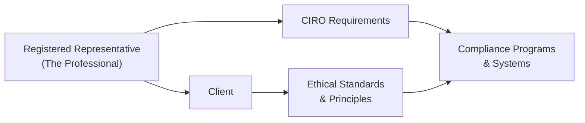

## 1.1 Standards of Conduct and Ethics

Standards of Conduct and Ethics in the securities industry—how do I even begin to explain how important these are? Well, it’s like the foundation upon which the whole financial services building stands. If the foundation is shaky, nothing else will hold up in the long run. Sometimes, when people think of “ethics,” they imagine committees of suited professionals debating esoteric points of philosophy. But in reality, ethics has a huge impact on everyday tasks: from how you handle client information to how you respond when a colleague starts cracking jokes about “looking the other way” on compliance duties. Let’s explore this vital topic in detail.

In this section, we’ll highlight what “ethical standards” truly mean, why they matter in the ever-evolving Canadian marketplace, and how you can integrate them into your daily routine as a registered representative. We’ll also delve into some personal stories (yes, I’ve got a few), real-life examples, and diagrams to keep things interesting. Let’s go step by step.

---

### Why Standards of Conduct and Ethics Matter

I remember once, early in my career—actually, I think it might have been my second day at a brokerage firm—I was overwhelmed by the sheer volume of compliance manuals spread across my desk. My supervisor looked at me and said, “Listen, all these rules and guidelines basically boil down to: Do right by your clients, and don’t be sneaky about it.” At the time, it seemed oversimplified. But you know what? With years of experience, that statement continues to resonate.  

Ethical standards are, essentially, our moral compasses in a high-stakes environment where money, trust, and decisions converge. And in finance, trust is everything. Nobody wants to do business with someone who’s going to mislead them, put their interests second, or violate their privacy. Whether you’re dealing with small retail investors or large institutional clients, a genuine commitment to integrity, fairness, diligence, and honesty is what keeps the industry credible.  

Moreover, these standards are not just “nice to have.” They’re mandated by regulators like the Canadian Investment Regulatory Organization (CIRO), which replaced the historical structures of the Mutual Fund Dealers Association of Canada (MFDA) and the Investment Industry Regulatory Organization of Canada (IIROC). Bottom line? If you don’t abide by them, you’re not just risking personal moral guilt; you’re risking your license, your firm’s reputation, and potentially the broader stability of the markets.

---

### Core Ethical Principles

The securities industry is loaded with rules, but four overarching ethical principles typically guide professionals. Let’s define them a bit:

• Integrity  
• Transparency  
• Fairness  
• Responsibility  

Sure, there are many others—like due diligence, confidentiality, and loyalty—but these four are a good starting point. Let’s look at these in more detail:

1) **Integrity**  
   Integrity means being honest and morally upright, even when no one’s looking. It involves sticking to your values and the industry’s codes of conduct, particularly when times get tough. If, for instance, a client asks for advice on a complex product that might generate a higher commission for you but is not suitable for them, how do you respond? Integrity is that little voice that says, “Put the client’s best interests first, or you’ll regret it.”

2) **Transparency**  
   Transparency is all about openness in communication—leaving no room for misunderstandings or hidden agendas. Full disclosure of fees, risks, returns, conflicts of interest, or other relevant information is paramount. For you as a registered rep, it might be as simple as saying, “Yes, there’s a 1% commission on this trade,” instead of burying that tidbit in the fine print. Over time, consistent transparency fosters deeper trust with your clients.

3) **Fairness**  
   Being fair means giving everyone their due. It’s ensuring that clients are treated equally, that you don’t show any favoritism, and that you avoid manipulative tactics. For instance, encouraging an elderly retiree to invest in very high-risk speculative stocks just to chase higher fees is not fair—it’s exploitative. Fairness goes hand in hand with suitability, a concept we explore in Chapter 6 (Product Due Diligence, Recommendations, and Advice). You want your recommendations to align with your client’s risk tolerance and financial objectives.

4) **Responsibility**  
   Responsibility encompasses being accountable for your actions (and sometimes your inactions). If you make a mistake—perhaps you forgot to relay crucial market updates to your client—you can’t just shrug and say, “Oh well, guess the market got away from me.” You need to own up, correct the error, and mitigate any potential damage. In many firms, “ownership” is heavily emphasized in compliance training sessions.

---

### Ethical Requirements Under CIRO Rules

Now, how does all this tie in with the official rules? CIRO, which streamlined the regulations from its historical predecessor organizations (MFDA and IIROC), spells out specific ethical guidelines in easily accessible rulebooks and bulletins (see [CIRO Official Website](https://www.ciro.ca)). Neglecting these standards can lead to penalties, suspensions, or even the revocation of your registration. In severe cases, you might face civil lawsuits or criminal charges.

#### Key CIRO Guidelines

• **Best Interests of Clients**  
  Acting in the best interests of clients is more than a tagline; it’s a legal requirement. You must provide suitable investment advice, ensure transparency about fees and conflicts, and handle each account with diligence.  

• **Confidentiality**  
  It’s not optional. Client information must be kept confidential and only shared with authorized personnel or regulators when required. One slip in disclosing personal data can cost you dearly—both financially and in lost client trust.  

• **Avoiding Conflicts of Interest**  
  You must identify, disclose, and manage any conflict of interest that might influence how you advise or transact on behalf of your clients. For example, if your firm has a financial stake in a product you’re recommending, you must be very clear and open about that.  

• **Accurate and Timely Information**  
  You should never mislead your client or hide material facts. Providing updated, relevant, and comprehensible information is fundamental to sound decision-making.  

---

### Ethical Dilemmas and Practical Examples

Ethical dilemmas are rarely about obvious wrong vs. right. Often, they manifest in complex forms: maybe your best friend is applying for a job at your firm, and you’re on the hiring team; or your largest client is pressuring you to share some insider tidbit they gleaned from a friend at a biotech startup. These real-world situations test your moral resolve.

Let’s consider two quick examples:

1) **Front-Running**  
   Suppose you learn that your firm plans to initiate a huge trade in a particular stock, which will likely push the price up. You might be tempted to buy shares personally before the firm’s larger trade executes. But that’s front-running—a violation of fair market practices and your duty to act in the best interest of clients. It’s also considered illegal insider trading if the information is material and non-public.

2) **Misrepresentation and its Fallout**  
   Let’s say your team touts an “innovative new product” as guaranteed to generate above-market returns. A client invests her life savings solely on that pitch, ignoring other sensible diversification strategies. Later, she loses money because the product was riskier than advertised. You could face claims of negligence, misrepresentation, or even fraud, depending on the specifics.  

---

### The Role of Compliance Systems

So, how do professionals maintain these high standards day-in, day-out? Compliance programs and systems are the backbone here. Firms are required to have:

• **Documented Policies and Procedures**  
  This might include how to onboard clients, how to handle complaints, how to escalate issues, and more.  

• **Training and Ongoing Education**  
  Professionals get mandatory training sessions about new technologies, changing regulations, and best practices in ethics.  

• **Monitoring and Auditing**  
  Regular internal audits and oversight help detect issues early. Session logs, trade blotters, client communications—a well-oiled compliance machine checks all of these to ensure no corner is overlooked.  

• **Culture of Ethics**  
  A compliance system works best if it’s woven into the firm’s culture. If the top brass is unethical, no manual or training session is going to magically fix that.  

---

### Mermaid Diagram: Ethical Conduct Ecosystem

Below is a simplified Mermaid diagram illustrating the flow of responsibilities and influences among key players:

- A["Registered Representative  (The Professional)"]: You, the industry professional, are in direct contact with clients.  
- B["Client"]: The client relies on your expertise and ethical judgment.  
- C["CIRO Requirements"]: CIRO sets rules and guidelines to enforce ethics and fairness.  
- D["Ethical Standards  & Principles"]: Broader moral guidelines that apply to the industry.  
- E["Compliance Programs  & Systems"]: The internal frameworks that ensure everyone follows the rules.  

Notice how everything is interconnected. Ethical standards guide both your day-to-day actions and the development of compliance frameworks. CIRO’s requirements influence how firms craft policies, which in turn shape how you interact with clients. The client’s trust and well-being remain at the center.

---

### Consequences of Violations

Let’s be blunt: messing up in this realm has serious ramificiations. Violating ethical standards isn't just a slap on the wrist. It could mean:

1. **Regulatory Penalties and Fines**  
   Regulators like CIRO can impose hefty fines. In some egregious cases, these fines can reach millions of dollars, especially if multiple investors are harmed.

2. **Suspension or Revocation**  
   Your registration or license to practice can be suspended or even permanently revoked. That’s career-ending in many cases.

3. **Legal Consequences**  
   Clients may sue for damages due to negligence or fraud. And if criminal wrongdoing (like insider trading) is proven, there can be prison time involved.

4. **Reputational Damage**  
   Word gets out. Once trust is gone, it’s an uphill battle to rebuild your reputation.  

5. **Impact on the Industry and Market**  
   Collective unethical behavior can erode public confidence in the entire financial market, leading to regulatory crackdowns and decreased investor participation.

---

### Maintaining an Ethical Mindset

So, how do you keep up your ethical game? Here are a few techniques:

• **Reflect on Your Values**  
  Is your goal purely financial gain, or do you genuinely care about helping others make sound investments? Aligning your day-to-day decisions with personal and professional values strengthens ethical resolve.  

• **Stay Informed**  
  Keep track of new regulations, guidelines, and best practices. For example, CIRO updates are posted on its site. The Canadian Securities Administrators (CSA) also coordinates among provincial regulators to align rules.  

• **Seek Guidance**  
  If you find yourself in a grey area, consult compliance officers, mentors, or legal counsel. Don’t just guess or assume.  

• **Create Ethical Habits**  
  Make it a habit to read disclaimers and policy updates carefully, double-check product disclosures, and verify the accuracy of marketing materials. A consistent routine helps minimize the risk of error.  

• **Foster a Supportive Team Environment**  
  Engage in open discussions with colleagues. If you see potential ethical pitfalls, speak up. Often, problems are best prevented by collective awareness.

---

### Real-World Scenario: Balancing Commission vs. Client Interests

Imagine you have a client named Sarah, a hardworking single mother of two. She wants to make sure her portfolio grows steadily but can’t afford massive risks. You notice that one of the new funds on your firm’s platform—an emerging market bond fund—offers a higher commission than some well-established balanced funds. However, it’s also a bit riskier, with currency and geopolitical uncertainties.  

What do you do?  

• **Option A**: Pitch the new emerging market bond fund and earn a higher fee.  
• **Option B**: Suggest a more conservative (yet lower-commission) balanced fund that aligns better with Sarah’s risk tolerance.  

Clearly, Option B appears more aligned with your duty to act in Sarah’s best interest, especially given her life situation. While Option A might pad your short-term earnings, it sacrifices ethical obligations and could jeopardize Sarah’s financial security. Honesty, fairness, and responsibility all point you to Option B in this scenario.

---

### Connection with Other Chapters

Ethics doesn’t exist in a vacuum. In Chapter 1.2 (Integrating Ethics with Industry Rules), you’ll see how these moral principles are interwoven with the rules and regulations that govern the Canadian securities industry. Meanwhile, Chapter 2 (Ethical Decision Making) dives deeper into the art of navigating ethical dilemmas, which is a skill unto itself.

Keep these cross references in mind:

• Chapter 2 expands on the process for resolving ethical gray areas.  
• Chapter 3: The Canadian Regulatory Framework introduces the bigger legal environment in which these ethics function.  
• Chapter 6: Product Due Diligence covers how you can ethically recommend suitable financial products.

---

### Glossary

• **Ethics**: Moral principles that govern a person's behavior.  
• **Integrity**: Sticking to moral and ethical guidelines, being honest and consistent in one’s actions and decisions.  
• **Conflict of Interest**: A situation in which personal interests or relationships could interfere (or appear to interfere) with your professional responsibilities.  
• **Transparency**: Openness and clarity in communication, decision-making, and disclosure.  
• **Compliance**: Adherence to laws, regulations, guidelines, and internal policies to ensure ethical and legal conduct.  
• **CIRO**: Canadian Investment Regulatory Organization, the national SRO overseeing investment dealers, mutual fund dealers, and marketplaces in Canada.  
• **Insider Trading**: Illegal trading based on material, non-public information.  
• **Misrepresentation**: Providing false, misleading, or incomplete information.

---

### Additional References

Below are some must-have resources to continue your journey:

• **CIRO Rules and Guidelines**: [CIRO Official Website](https://www.ciro.ca)  
• **Canadian Securities Administrators (CSA)**: Central coordination of provincial and territorial regulators, [CSA Official Website](https://www.securities-administrators.ca)  
• **Investment Industry Association of Canada (IIAC)**: [IIAC Official Website](https://iiac.ca)  
• **Book**: “Ethics for the Investment Professional” by CFA Institute, available at [CFA Institute](https://www.cfainstitute.org)  
• **Online Course**: “Ethical Decision Making for Investment Professionals” by CFA Institute, see [CFA Institute Ethics Course](https://www.cfainstitute.org/en/ethics-standards/ethics-course)

---

Anyway, at this point, you might realize how fundamental these standards are to the entire industry and, in fact, to your own professional success. Keeping your nose clean ethically isn’t a burden; it’s an insurance policy against the pitfalls of professional misconduct, and it’s part of building a truly rewarding career. As you tackle the rest of this chapter—and the ones that follow—remember that these principles form the bedrock. Honor them, practice them daily, and I promise you’ll set yourself up for both personal and professional growth.

## Quiz: Standards of Conduct and Ethics



### What is the primary goal of ethical standards in the Canadian securities industry?

- [ ] To maximize short-term profits for firms
- [ ] To compete globally with other markets
- [x] To protect client interests and maintain public trust
- [ ] To prioritize regulatory fines over client success

> **Explanation:** Ethical standards focus on acting with integrity and fairness, safeguarding client assets, and preserving confidence in the industry.

### Which principle emphasizes openness and clarity in communication and disclosure?

- [ ] Fairness
- [ ] Integrity
- [x] Transparency
- [ ] Responsibility

> **Explanation:** Transparency is the principle that ensures full disclosure of relevant information, eliminating confusion or hidden agendas.

### Why is it important to adhere to CIRO’s specific rules and guidelines?

- [x] Neglecting them can lead to violations, including fines and suspension.
- [ ] The rules only apply to high-net-worth clients.
- [ ] They are voluntary recommendations for marketing.
- [ ] They were developed solely to unify marketing campaigns.

> **Explanation:** CIRO rules are legally binding. Violating them can lead to regulatory penalties or loss of registration.

### Which of the following is an example of unethical conduct?

- [ ] Disclosing material fees to a client
- [ ] Encouraging suitable investments aligned with a client’s risk profile
- [x] Providing misleading information about investment risks
- [ ] Maintaining up-to-date client records

> **Explanation:** Misrepresentation or hiding important facts is considered unethical conduct under securities regulations.

### What is the primary function of compliance programs in broker-dealer firms?

- [x] Ensuring adherence to regulations, ethical standards, and internal policies
- [ ] Maximizing marketing reach and acquiring more clients
- [x] Performing regular audits and monitoring activities
- [ ] Creating overhead to dissuade new entrants

> **Explanation:** Compliance programs ensure that industry professionals follow rules and maintain ethical conduct. Monitoring and auditing are part of these robust systems.

### Which statement best describes the concept of conflict of interest?

- [x] A professional’s personal interest differs from the client’s best interest
- [ ] A professional always being transparent about fees
- [ ] A firm’s inability to attract qualified advisors
- [ ] A regulator’s neutral stance on violations

> **Explanation:** A conflict of interest arises when a personal or financial interest can unduly influence—or appear to influence—professional judgment.

### Which of the following best illustrates integrity?

- [x] Advising a client about risks even if it may reduce your commission
- [ ] Encouraging clients to chase high returns without disclosure
- [x] Correcting an unintentional error that favored your firm
- [ ] Ignoring red flags to meet your quarterly sales target

> **Explanation:** Integrity means honest acts and decisions that prioritize doing right by the client and correcting mistakes promptly.

### What is an advantage of maintaining transparency with clients?

- [ ] Clients are more likely to invest in high-risk products
- [ ] Regulators overlook smaller compliance errors
- [x] It fosters deeper trust and long-lasting relationships
- [ ] It speeds up all administrative tasks

> **Explanation:** Being open and honest with clients builds trust, a vital element in the advisor-client relationship.

### Which of the following is a consequence of unethical behavior in the securities industry?

- [ ] Automatic promotion to a senior role
- [ ] Guaranteed immunity from civil litigation
- [ ] Expedited licensing process
- [x] Significant damage to reputation and career

> **Explanation:** Unethical behavior can lead to fines, suspensions, legal liabilities, and severe damage to one’s professional image.

### Acting in the best interests of clients means:

- [x] Prioritizing the client’s welfare above personal gain
- [ ] Selling products with the highest commission
- [ ] Protecting the firm’s proprietary data at all costs
- [ ] Delegating all decisions to a senior manager

> **Explanation:** The foundational obligation for a registered representative is to make recommendations that align with the client’s needs, risk profile, and objectives.


