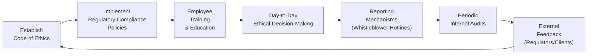

## 1.2 Integrating Ethics with Industry Rules

Ethics can sometimes feel like a lofty, abstract concept—like something that belongs in a philosophy classroom rather than a bustling financial firm. Yet, in the Canadian securities industry, ethics are not just a matter of personal conscience. They also intersect directly with a very real set of rules and regulations overseen by authorities like the Canadian Investment Regulatory Organization (CIRO) and the Canadian Securities Administrators (CSA). Aligning ethical principles with these industry rules helps ensure we’re not only “doing the right thing” but also meeting the expectations laid out by regulators, our employers, and society at large.

Don’t be surprised if you occasionally catch yourself thinking, “Well, the rules say we can do it, so that means it’s ethical—right?” Actually, not always. Ethical principles often extend beyond legal or regulatory requirements, covering the gray areas that explicit rules may not address. This is precisely why understanding the dynamic interplay of ethics and rules is so crucial. Below, we’ll explore how these pieces fit together, why it matters, and, hopefully, show you that applying ethical guidelines can be just as practical and clear-cut as following a compliance checklist.

---

## Understanding the Connection Between Ethics and Industry Rules

Let’s start with a little anecdote: I remember my first day working at a brokerage firm, overhearing colleagues talk about “compliance.” To me at the time, that word sounded like it might be code for “tedious paperwork.” But as I discovered, compliance was not simply about forms and signatures; it was about carrying out our duties in a way that reflected both the moral and regulatory standards to which securities professionals are held. That was the first time I realized that the letter of the law can only go so far—ultimately, I had to be guided by personal judgment too.

In Canada, securities legislation is administered at the provincial and territorial level, but the overall framework is harmonized through bodies such as the CSA. CIRO, our national self-regulatory organization that came into existence after consolidating the functions of IIROC and the MFDA (both now defunct), sets additional standards for investment dealers and mutual fund dealers. These rules are quite specific in some respects—for instance, setting reporting guidelines or specifying how margin accounts should be administered. However, the day-to-day ethical application of these rules often requires a personal—and organizational—sense of right and wrong.  

### Rule vs. Principle

• A rule is typically a binding directive. You either comply or you don’t. For example, a rule might state that all client complaints must be acknowledged within a certain time frame.  
• A principle, by contrast, is broader. It could be something like treating clients with fairness, honesty, and integrity.  

When new situations emerge—like investing in novel asset classes or adapting to new cybersecurity challenges—strict enforcement of existing regulations may not always be enough. Ethical principles guide you when the rules haven’t yet caught up with real-world developments. In short, ethics fill the gaps rules cannot anticipate.

---

## Why Ethics Matter: A Big-Picture View

You might be doing everything “by the book,” but if you’re ignoring how your actions impact clients, colleagues, and the broader financial marketplace, you risk creating ethical blind spots. These pitfalls can harm trust and transparency—two pillars on which the financial industry stands.

• Trust: Clients entrust their life savings, retirement funds, and kids’ education nest eggs to people they believe will manage them responsibly. Ethical lapses destroy that trust in a heartbeat.  
• Transparency: Regulatory frameworks demand thorough and transparent reporting. When you approach transparency with an ethical mindset, you voluntarily disclose important facts, rather than doing the bare minimum.  

At the end of the day, a firm that integrates ethics with rules fosters an environment where moral courage thrives. And as it turns out, moral courage—combined with regulatory compliance—can be a competitive advantage, thanks in no small part to the goodwill and reputation benefits it brings.

---

## Building a Culture That Aligns Organization Values with Regulations

Ethics are much easier to “do” when they’re woven into the company’s everyday conversation, rather than relegated to a once-a-year training session. A company culture that integrates ethics and industry rules relies on shared values, consistent messaging, and leadership that models ethical behavior from the top down.

### The Importance of a Code of Ethics

A Code of Ethics (sometimes called a Code of Conduct) is a formal document outlining the values, principles, and expected behaviors within an organization. But a dusty manual on the office shelf won't do much good if employees don’t consult it or if it isn’t updated regularly. Instead, the Code should be a living document, frequently discussed in team meetings, training sessions, and real-life case study reviews.

Key elements of a strong Code of Ethics:

• Clear Values and Principles: The code should articulate fundamentals like integrity, respect, accountability, and fairness.  
• Concrete Examples: Offer tangible examples of ethical decisions employees might face, like responding to conflicts of interest or reporting suspicious trades.  
• Consequences for Violations: Outline the ramifications—whether they’re internal discipline or regulatory penalties—for breaking the code or failing to meet legal obligations.  
• Continuous Reassessment: Keep pace with changing regulations and industry norms by updating the code as needed.

---

## The Role of Training and Education

Ethical behavior doesn’t automatically click for everyone the moment they’re hired. This is where training programs (both formal and informal) play an essential role. When you combine ethics training with regulatory education, employees begin to see these two elements as interconnected rather than separate.

### Interactive Learning Approaches

• Case Studies: Real or hypothetical scenarios illustrate ethical dilemmas so employees can practice constructive problem-solving.  
• Role-Playing: Simulating an ethical crisis can reveal what individuals might do—or fail to do—in the heat of the moment.  
• Group Dialogues: Encouraging open discussions around moral or regulatory issues fosters a sense of shared responsibility and communal learning.  

Practical, hands-on experience examining the interplay between ethics and rules is far more impactful than simply memorizing codes or reading bulletins. Folks learn best by doing!

---

## Encouraging Ethical Decision-Making and Reporting Mechanisms

Sure, you might have a robust Code of Ethics, but how do you actively encourage employees to uphold and enforce it? One approach is to build safe, well-defined channels for raising concerns about unethical or noncompliant activities.

### Whistleblower Policies and Protections

• Anonymity, where possible: Offering anonymous reporting channels (like telephone hotlines or secure online forms) fosters a sense of security.  
• Clear, Swift Follow-Up: Let employees know how their reports are being addressed—what steps are being taken, and roughly how long it might take.  
• Zero Tolerance for Retaliation: Make it a point that any form of reprisal against whistleblowers is itself an ethical violation punishable by the organization.  

By creating a culture in which individuals feel safe to voice concerns, you encourage not only adherence to industry rules but also thoughtful introspection on whether those rules and actual practices align with ethical values.

---

## Real-World Example: An Ethical Dilemma in Account Management

Let’s imagine a scenario: A Registered Representative (RR) has a longtime client who is nearing retirement. The client wants to invest in higher-risk products to “make up for lost time,” even though that lumps them into a precarious position, given their short investment horizon and risk tolerance. Legally, the rep might be able to accommodate the client if they sign off on the necessary risk disclosures—after all, the forms exist to confirm the client acknowledges the potential downsides.

But ethically, should the RR proceed? A purely rules-focused approach might say, “The forms check out, so we’re good.” An ethically integrated approach means the RR recognizes that this investment strategy conflicts with the principle of suitability. While the rules do require an assessment of suitability, it’s ultimately an ethical stance to go beyond minimal compliance, patiently explaining all risks and suggesting more balanced alternatives. The difference is often subtle but can be life-changing for the client.

---

## Checks and Balances: Assessments and Audits

Organizations that take ethics seriously want to be sure their efforts are working. One way to do that is through periodic audits and assessments, which allow leadership to gauge how well the theoretical frameworks hold up in real life.

### What Gets Monitored?

• Internal Surveys: Anonymous questionnaires can reveal if employees feel pressured into unethical behaviors or if they have unanswered compliance questions.  
• Compliance Records: Are employees completing required training on time? Are they reporting conflicts of interest?  
• External Feedback: Regulators, clients, and independent third-party auditors can provide valuable insights on whether a firm is truly aligning with recognized standards or if it’s merely “checking boxes.”

### The Feedback Loop

Implementation of an ethical framework is seldom perfect on the first try. Firms that gather feedback—both formally (via audits) and informally (through everyday interactions)—can make iterative improvements. For instance, say your employees continuously mention confusion around what qualifies as an unacceptable gift or perk from vendors; that’s a cue to revise policy guidelines and clarify them with real-life examples.

---

## A Visual Overview of Ethical Integration

Below is a Mermaid diagram illustrating how ethics and industry rules interface at every stage of the organizational process, from setting policies to conducting periodic audits. It’s meant to show that ethics is not a separate add-on, but something that runs through every aspect of a financial practice.

In the above visualization, you can see how the process flows continuously. Establishing a Code of Ethics undergirds everything, from creating policies to day-to-day conduct. Systematic reporting mechanisms feed into audits, leading to ongoing improvements—ultimately circling back to refine and reinforce the Code of Ethics and associated compliance frameworks.

---

## Common Pitfalls and How to Overcome Them

Integrating ethics with industry rules sounds straightforward, but there are plenty of challenges. Below are a few typical stumbling blocks, along with strategies to get past them.

| Pitfall                         | Description                                                                         | Strategy                                                                      |
|--------------------------------|-------------------------------------------------------------------------------------|-------------------------------------------------------------------------------|
| Overreliance on Rules          | Tendency to view compliance as purely “box-checking,” ignoring ethical nuances.      | Highlight ethical decision-making in all training and leadership communications. |
| Lack of Leadership ‘Buy-In’     | Senior management not consistently modeling ethical behavior.                        | Make ethics part of senior leadership’s performance metrics and accountability. |
| Fear of Retaliation            | Employees may be afraid to speak up about concerns or potential violations.          | Institute robust whistleblower protections and clear non-retaliation policies.   |
| Outdated Codes of Ethics       | Policies that don’t reflect new technologies or evolving market conditions.          | Conduct periodic policy reviews, especially when new products or practices emerge. |
| Ineffective Training Methods    | Training that is entirely lecture-based, failing to engage employees in real-world scenarios. | Incorporate interactive learning: role-playing, group discussions, scenario workshops. |

---

## Building an Ethical Roadmap: Step-by-Step

Integrating ethics with industry rules might feel like a tall order. But it can be tackled in manageable steps:

1. **Formalize Ethical Values:** Start with a thorough Code of Ethics that’s recognized and endorsed by senior management.  
2. **Align Policies and Procedures:** Make sure your procurement policies, conflict-of-interest guidelines, and day-to-day workflow instructions sync up with that code.  
3. **Offer Robust Training and Ongoing Education:** Don’t rely on a once-a-year webinar. Think about interactive sessions, small coaching circles, or even mentorship programs.  
4. **Establish Transparent Reporting Mechanisms:** Provide anonymous channels for employees to raise concerns and ensure that any tips are acted upon promptly.  
5. **Assess and Refine:** Regularly audit your ethical program. Gather feedback from employees, clients, and regulators. Tweak what’s not working.

---

## Tying It All Together: Ethical Integration in the Canadian Context

In Canada’s financial sector, moral principles aren’t merely “nice to have.” They’re indispensable to sustaining trust, preventing fraud, and safeguarding the welfare of investors. CIRO’s Code of Conduct and Ethics (found on the [CIRO Official Website](https://www.ciro.ca)) underscores integrity, accountability, and client-first practices. Meanwhile, the Canadian Securities Administrators (CSA) [Official Website](https://www.securities-administrators.ca) offers insights into the overarching regulatory framework that shapes how firms operate.

Aligning your firm’s values with these directives not only aids in meeting compliance targets but also enhances reputational capital—fostering a sense of pride among employees, and confidence among clients. 

**References for Further Exploration**  
• CIRO Code of Conduct and Ethics: [CIRO Official Website](https://www.ciro.ca)  
• Canadian Securities Administrators (CSA) Regulatory Framework: [CSA Official Website](https://www.securities-administrators.ca)  
• “Business Ethics: Decision Making for Personal Integrity & Social Responsibility” by Laura P. Hartman, Joseph DesJardins, and Chris MacDonald, available at [McGraw-Hill Education](https://www.mheducation.ca)  
• Online Course: “Ethics in Finance” by the University of Toronto, at [Coursera](https://www.coursera.org/learn/ethics-in-finance)  

---

## Practical Takeaways

• Recognize that rules alone can’t cover every scenario—ethical principles fill the gaps.  
• Keep your Code of Ethics current, relevant, and highly visible within your organization.  
• Provide real-world, scenario-based training so participants can practice resolving ethical dilemmas.  
• Foster a speak-up culture with robust whistleblower protections and zero tolerance for retaliation.  
• Don’t rest on your laurels. Keep improving the ethical environment through audits, feedback, and updated policies.  

---

So, ethics and industry rules aren’t just two separate tracks you shuffle between. Instead, they form a single, interlocking system where each supports and reinforces the other. By responsibly blending ethical judgment with a firm understanding of the Canadian securities market’s regulatory mandates, you help ensure that decisions and activities stand the test of scrutiny—both legal and moral.

If you find yourself facing a challenge that the rulebook only half covers, remember: ethics is often your guiding north star. It can show you how to apply the “spirit” of the law rather than just the letter, ensuring financial professionals, clients, and the broader community can trust the integrity of our markets and the people who operate in them.

---

## Test Your Knowledge: Integrating Ethics and Compliance in Canadian Securities



### Which statement best describes the relationship between ethical principles and industry regulations?

- [ ] Regulations are always broader than ethical principles.
- [ ] Ethical principles only come into play when regulations don’t exist.
- [x] Ethical principles often extend beyond the scope of regulations.
- [ ] Industry regulations eliminate the need for ethical considerations.

> **Explanation:** Ethical principles provide a broader framework that goes beyond legal minimums, guiding professionals in areas not always covered by explicit regulations.

### What is the primary purpose of a Whistleblower Policy?

- [ ] To punish employees who break company rules.
- [x] To create a secure channel for reporting unethical or illegal behavior.
- [ ] To replace official compliance training programs.
- [ ] To force employees to disclose personal information.

> **Explanation:** A Whistleblower Policy exists to protect and encourage individuals to report misconduct without fear of retaliation, ensuring ethical breaches are addressed swiftly.

### How can an organization ensure employees fully internalize its Code of Ethics?

- [x] By regularly updating the Code and using interactive, scenario-based training.
- [ ] By emailing it to all staff once a year with no further follow-up.
- [ ] By memorizing the entire document word for word.
- [ ] By only involving the compliance department in drafting it.

> **Explanation:** Ongoing education, transparent communication, and real-life case studies are crucial for helping employees truly absorb and apply ethical standards in their work.

### Why might an organization conduct internal surveys and audits about ethics?

- [ ] To replace interactions with regulators.
- [ ] To delegate accountability to junior staff.
- [ ] To reduce the number of training sessions required.
- [x] To evaluate how effectively ethical principles are being practiced and to identify improvement areas.

> **Explanation:** Internal surveys and audits provide snapshots of actual employee behavior and attitudes, highlighting any gaps between policy and practice.

### What key element should be included in a Code of Ethics to encourage compliance and accountability?

- [x] Clear consequences for ethical violations and regulatory non-compliance.
- [ ] Restricted focus on client-facing staff only.
- [x] Detailed examples of ethical dilemmas.
- [ ] Only one or two broad statements about integrity.

> **Explanation:** In addition to broad principles of integrity and honesty, the Code should spell out specific actions, examples, and potential repercussions to make it actionable.

### Which scenario best illustrates integrating ethics with industry rules?

- [x] Advising a client against high-risk products they request because it conflicts with their stated risk tolerance.
- [ ] Ignoring the conflict of interest rules if a client insists on an investment.
- [ ] Following the internal compliance checklist only when monitored by management.
- [ ] Offering complex products without disclosing associated fees and risks.

> **Explanation:** Even when the rules allow a certain action, the ethical perspective may direct a financial professional to protect the client’s best interests above all else.

### What is a recommended best practice for promoting a speak-up culture within firms?

- [x] Providing multiple, anonymous reporting channels for employees.
- [ ] Ensuring whistleblowers handle the investigation themselves.
- [x] Implementing strict non-retaliation policies.
- [ ] Discouraging reporting of smaller ethical breaches.

> **Explanation:** Employees must feel safe when they report unethical activity, and having anonymous channels plus explicit non-retaliation policies helps foster a transparent environment.

### How can continuous feedback loops enhance ethical conduct?

- [x] By detecting policy gaps and misguided practices early, allowing for timely improvements.
- [ ] By automatically eliminating the need for regulatory oversight.
- [ ] By discouraging employee participation in compliance programs.
- [ ] By focusing solely on meeting quarterly financial targets.

> **Explanation:** Feedback channels, whether from internal audits or external regulators, provide insights that can refine and strengthen ethical policies, ensuring they remain practical and up to date.

### What is a common benefit of aligning ethical principles with regulatory compliance in financial services?

- [x] Improved trust from clients and the public.
- [ ] Immediate exemption from all regulatory audits.
- [ ] Zero chance of legal disputes.
- [ ] The ability to charge higher fees by default.

> **Explanation:** Although ethical alignment doesn’t grant immunity from legal challenges, it significantly boosts trust and can enhance a firm’s reputation, benefiting both clients and the industry.

### In Canada, CIRO’s focus on creating a harmonized approach to regulation implies:

- [x] True
- [ ] False

> **Explanation:** CIRO was formed by amalgamating IIROC and MFDA, and now oversees investment dealers and mutual fund dealers under one umbrella, helping create cohesive national standards.


