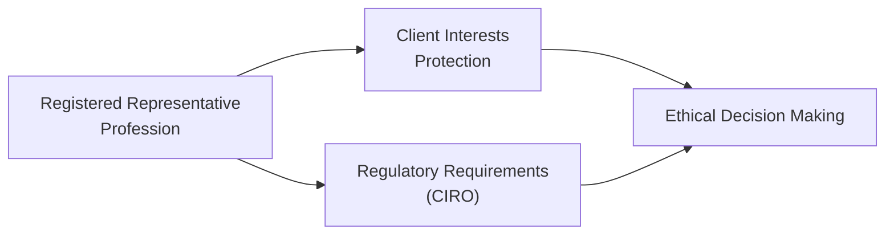

## 1.3 Rules of Thumb to Guide the Conduct of Registered Representatives

Imagine you’re starting your first week as a newly registered representative in Canada’s bustling securities industry. You’ve spent months—maybe years—preparing for this role. You’ve read about the regulatory framework, pored over various codes of conduct, and practiced how to communicate with clients. But, as you talk to real people with real financial concerns, you notice that the reality is often more nuanced than the textbooks let on. In fact, when faced with everyday choices—like how to recommend a product or handle a client’s private information—it helps to have a few guiding principles in your back pocket.

Below, we’ll explore key rules of thumb that Registered Representatives (RRs) can use on the job. These aren’t meant to replace official regulations—such as those from the Canadian Investment Regulatory Organization (CIRO)—but instead, provide a friendly and practical layer of real-world insight. Whenever you’re unsure, you should always consult the appropriate laws, CIRO rules, and your firm’s compliance department. Still, these basic guidelines may help you steer your day-to-day activities in manageable and ethical ways.

Before we jump into each principle, let’s briefly remind ourselves: On January 1, 2023, the Mutual Fund Dealers Association of Canada (MFDA) and the Investment Industry Regulatory Organization of Canada (IIROC) were amalgamated into CIRO, which now oversees investment dealers, mutual fund dealers, and market integrity. All references to MFDA or IIROC are strictly historical—CIRO is your go-to regulatory body here in 2025. 

Let’s get started.

Putting the Client First  
--------------------------------
One of the most critical principles for any Registered Representative is prioritizing the client’s best interests over all else. Sure, this might sound like a motherhood statement—of course we should put clients first! But in practice, it can get tricky. You might, for instance, have a product your firm is promoting. Your immediate thought might be, “Hey, if I sell this product, I’ll reach my targets more quickly,” or maybe there’s an added bonus in place. Well, that’s the moment to pause and think: “Is this truly the best option for my client, or am I trying to meet a sales target?”  

One personal anecdote: Early in my career, a friend of mine encountered a client who was super-enthusiastic about a particular stock. The client heard about it from a neighbor and expected a huge upswing. My friend realized this stock was riskier than the client understood. After thorough research, it became clear that it just wasn’t suitable for that client’s financial goals or tolerance for risk—and that’s exactly what she explained to the client. Even though she felt a little hesitation about potentially upsetting them, she stayed focused on the golden rule: the client’s best interest. Ultimately, the client respected her caution, and that relationship grew stronger.  

This principle ties neatly into “suitability.” Suitability means that all recommendations and advice should align precisely with the client’s financial goals, risk tolerance, and objectives. As you’ll see throughout the Conduct and Practices Handbook Course (CPH®), tailoring a recommendation is far more valuable than just following an internal quota.

Transparency and Honesty  
--------------------------------
Being transparent might sound like a no-brainer, but how often have you heard stories of hidden fees or undisclosed conflicts of interest? In finance, trust is currency. Being honest—from disclosing fees and commission structures to clarifying the potential risks—can help preserve that trust.  

Clients are also more financially informed these days. They can jump online and do some serious research about their investments, or they might watch YouTube videos about market trends. The days of “The advisor knows best, and that’s it” are gone. Because of that, it’s wise to encourage your clients to ask questions—lots of questions. And it’s your responsibility to give candid, easy-to-understand answers. If you’re open, you’ll stand out as a trusted guide in an industry that can otherwise feel opaque.  

Sometimes, you’ll come across conflicts of interest—maybe your firm offers an in-house product with special perks. Don’t bury that behind legal jargon. Instead, be up front. Chapter 2 of this book addresses ethical decision-making in more detail, providing strategies for identifying conflicts and examining how to manage them. If in doubt, keep your communication lines open with compliance staff at your firm or refer to CIRO’s detailed guidelines.

Due Diligence in Practice  
--------------------------------
Due Diligence is the act of thoroughly researching and evaluating potential investments for suitability. It’s that deep dive into how a product works—its structure, fees, liquidity, and risk exposure—before you pass along a recommendation to your clients. If you’re considering a new derivative product or a newly launched mutual fund, for example, you don’t just rely on a sales brochure. You roll up your sleeves, read the statements, examine the historical performance, and measure it up against the client’s profile.

Picture this scenario: You have a client who’s nearing retirement in five to seven years. They’re more risk-averse. It may not be wise to recommend illiquid private securities that lock up capital for a decade—no matter how tempting the yield may seem. That’s precisely where your due diligence kicks in. Your thorough evaluation should confirm or refute whether this recommendation fits the client’s risk profile.  

CIRO has extensive resources on due diligence, including bulletins and notices about how to carry out product assessments. You can find them at [CIRO Official Website](https://www.ciro.ca). Chapter 6 on Product Due Diligence goes deeper into how to systematically analyze different securities (section 6.2 is particularly relevant).

Privacy and Confidentiality  
--------------------------------
Let’s be honest: we live in a time when data breaches make headlines almost weekly. Keeping sensitive client information secure is not just an ethical duty—it’s a legal obligation. There are strong privacy laws and regulations in Canada, enforced in part by the Office of the Privacy Commissioner of Canada ([Privacy Commissioner Official Website](https://www.priv.gc.ca)).  

Registered Representatives often gather personal data like addresses, income information, net worth details, etc. This kind of data is a gold mine for identity thieves. So, it’s vital to store client information in secure, encrypted systems and limit who has access to it. If you need to share client data (for example, with a back-office system or a third-party service provider), always get explicit consent from your client and follow your firm’s privacy protocols.  

If you like real-world analogies, think of client data as you would your own lockbox filled with personal keepsakes—treat it with utmost care. If your firm offers data protection training, do it. If you find new cybersecurity tools that can better secure client info, propose using them.

Avoiding or Disclosing Conflicts of Interest  
--------------------------------
Sometimes, conflicts of interests arise even when we do everything we can to avoid them. Maybe your spouse works at a company you’re recommending, or your firm is underwriting a new issue that you’re also suggesting to your clients. The best approach for conflicts of interest is to avoid them where possible. When you can’t, you must disclose them clearly to your client.  

One idea is to have a conflict-of-interest checklist you run through whenever you propose an investment. This might include questions like:
• Does my firm or do I personally have a financial stake in this product?  
• Do I have any personal relationships that could cloud my judgment?  
• Is there any promotional campaign in place that might bias my recommendation?  

If the answer to any of these is “yes,” you must be straightforward with your client and comply with your firm’s conflict-of-interest policy. Always keep in mind that your client’s best interests come first.

The Value of Continuous Professional Development  
--------------------------------
If you’ve been through the Canadian Securities Course (CSC®) or other licensing exams, you might feel like you’ve got enough credentials for a lifetime. But guess what? Things change—sometimes quickly—in the world of finance. New products appear, regulations are updated, and markets shift in unexpected ways.  

Continuing education is not just about meeting regulatory requirements. It’s about refining your craft and delivering better advice. Think of it like learning a language: if you stop practicing, you get rusty. That’s why so many industry professionals attend conferences, complete advanced courses offered by CSI, or read widely about market trends. There’s always something new and interesting out there.  

Check out “Professional Ethics for Financial Advisors” at [CSI Global Education](https://www.csi.ca) for a deeper look into ethical frameworks. If you’re curious about deeper reading, consider “The Advisor's Guide to Financial Planning” by Harold Evensky, which covers topics like portfolio construction, financial planning strategy, and advanced retirement methodologies.

Documentation: A Vital Part of Compliance  
--------------------------------
You’ve probably heard the phrase, “If you didn’t write it down, it didn’t happen.” Documentation is your friend—yes, it’s sometimes tedious, but it will protect both you and your client. By recording the rationale behind your investment recommendations, risk disclosures, and client instructions, you create a paper (or digital) trail that can resolve misunderstandings down the line.  

For instance, if a client complains that they weren’t informed about certain risks, your records should show exactly when and how you discussed those risks with them. Or, if your client claims you never asked about their financial goals, but you have a thoroughly updated new account application form (NAAF) on file, it can help clarify the situation.  

You’ll find in Chapter 5 (sections 5.1 to 5.5) that opening accounts properly, maintaining accurate KYC (Know Your Client) data, and updating information regularly are paramount to good documentation practices.

Practical Examples of Ethical Conduct  
--------------------------------
• Case of the Overlooked Risk  
  Let’s say you have a client who wants to purchase a high-yield bond to elevate their portfolio’s returns. You suspect the default risk is substantial. You must do your due diligence first. Then, if you confirm it’s indeed a high-risk proposition, be transparent. If after all the disclaimers and education the client still wants to proceed, that’s fine—as long as you confirm they fully understand the risks. Document everything: the conversation, the disclaimers, the reasons behind the recommendation (or caution), and the client’s acknowledgment.  

• Case of the Inadvertent Conflict  
  Suppose your firm just launched a new proprietary fund with top-notch marketing materials touting great returns. You’re tempted to push it because, well, it’s the “house product” and it might bring in additional leverage or recognition within your firm. Before suggesting it universally, ask: Is it truly suitable for each client? Do you have a hidden conflict because your compensation might be better if you sell that fund? Transparency, disclosure, and objectivity are key if you choose to recommend it.  

• Case of the Family Connection  
  You have an uncle who’s a CFO at a company planning a major corporate event. You’re not exactly an insider, but you have some non-public information about that event. You suspect the company’s stock might get a boost soon. Clearly, this is inside information territory—or at least close enough to be suspicious. Tread carefully. Ultimately, trading or letting someone else trade on that material non-public information is illegal. The best route is to steer clear, and if you’re uncertain, talk to your firm’s compliance officer.

Common Pitfalls and Challenges  
--------------------------------
• Overconfidence Bias  
  Sometimes, after a few wins, you might assume your hunches are always correct. That’s dangerous. Always double-check your instincts with actual data, established research, and suitable rationale.

• Shortcuts on Documentation  
  It’s tempting to skip thorough documentation. But if something goes wrong (or if there’s a routine audit), you’ll be grateful you took the time to record the details properly.

• Failure to Update Client Profiles  
  People’s lives change—new marriages, divorces, promotions, job losses, big inheritances. If you’re not asking clients for updates on their financial situations, your recommendations might become unsuitable.

• Understating Fees or Risks  
  Understating fees or playing down risks can lead to big problems. All it takes is one event—like a market downturn—for clients to retrospectively accuse you of hiding details.

Strategies for Overcoming These Challenges  
--------------------------------
• Build Checklists  
  Create a standard checklist that covers everything from client risk tolerance to conflict-of-interest declarations. Having this in writing can help you stay consistent, especially during busy times.

• Invest in Technology  
  Many open-source or low-cost customer relationship management (CRM) systems help you track client conversations, tasks, and compliance-related items. Tools like these keep you organized and ensure you don’t miss any crucial steps.

• Lean on the Team  
  When in doubt, talk to your peers, mentors, or compliance officers. Sometimes, a second set of eyes can spot potential issues that you’ve overlooked. 

• Regular Education  
  Sign yourself up for refresher courses. Whether it’s a short webinar on new CIRO guidelines or an advanced financial planning program, continuous learning is essential. 

Here’s a small flowchart representation of how these rules of thumb connect Registered Representatives, client interest, regulatory requirements, and ethical decision-making:

In real life, these elements are rarely linear but rather operate simultaneously. Still, seeing them in a simple diagram can be handy. The big takeaway: your role is central in linking all these elements, with everything culminating in ethical decision-making that safeguards your clients’ well-being.

Some Helpful References  
--------------------------------
• CIRO Guidance on Suitability and Due Diligence for the most current, official frameworks:  
  [CIRO Official Website](https://www.ciro.ca)  

• Office of the Privacy Commissioner of Canada for legal obligations concerning data privacy:  
  [Privacy Commissioner Official Website](https://www.priv.gc.ca)  

• “The Advisor's Guide to Financial Planning” by Harold Evensky, available at [Amazon](https://www.amazon.ca), for broader strategies on financial planning.  

• “Professional Ethics for Financial Advisors” by CSI, available at [CSI Global Education](https://www.csi.ca), if you want an in-depth look at ethical dilemmas and frameworks.

Final Thoughts  
--------------------------------
Ethics isn’t just a theoretical subject; it’s woven into your day-to-day choices. Whether it’s choosing between two similar funds or explaining a fee structure that could cause “sticker shock,” these little interactions shape how your clients trust and rely on you. If you abide by these rules of thumb—focusing on best interest, transparency, diligence, confidentiality, conflict disclosures, ongoing professional development, and meticulous documentation—you’ll be well-positioned to navigate the complexities of our profession with confidence and integrity.  

Remember, it’s easy to get caught up in the daily grind—juggling phone calls, analyzing portfolio performance, and meeting sales targets. But pausing to think, “Am I doing what’s best for my client?” can make the difference between being a good advisor and being an outstanding one.  

And if you ever need more guidance, turn to the resources in the rest of the Conduct and Practices Handbook Course (CPH®). For instance, Chapter 2 goes into ethics and decision-making processes, while Chapter 3 covers the broader regulatory framework. By weaving together these principles with the official guidelines, you’ll be set to deliver solid advice that respects both the spirit and the letter of Canadian securities regulation.  

So, good luck—stay curious, stay honest, and keep doing your best for your clients.  

## Master Your Ethics: Rules of Thumb for Registered Representatives Quiz



### Which principle best captures the essence of prioritizing a client’s financial well-being? 
- [ ] Ensuring your firm’s profit margin first 
- [x] Always putting clients’ interests above your own 
- [ ] Promoting only in-house products
- [ ] Matching the sales quota set by your firm

> **Explanation:** One of the foundational guidelines for Registered Representatives is to ensure that clients’ interests and needs take precedence over everything else, including personal or firm interests.

### What is a key advantage of thorough and accurate documentation in a client file? 
- [x] It provides evidence of compliance and proper disclosure.
- [ ] It reduces the amount of continuing education an RR must complete.
- [ ] It eliminates the need for product due diligence.
- [ ] It is only required if requested by the client.

> **Explanation:** Documentation is crucial in demonstrating that you’ve met regulatory requirements and have communicated effectively with your client. It offers a clear record if a dispute or regulatory inquiry arises.

### When a Registered Representative cannot fully avoid a conflict of interest, what is the next best step? 
- [ ] Hide the conflict as long as it does not harm the client
- [x] Disclose the conflict clearly to the client and take steps to mitigate it
- [ ] Ignore firm policies if the conflict is small
- [ ] Accept the conflict if it leads to better commissions

> **Explanation:** If a conflict of interest cannot be avoided, transparency and mitigation strategies are mandatory to maintain trust and meet regulatory standards.

### Which of the following describes “Suitability”? 
- [ ] Ensuring a client invests only in risk-free instruments
- [x] Matching investment products and strategies to the client’s risk tolerance and objectives
- [ ] Maximizing the RRs commission
- [ ] Recommending only the investments your colleagues are using

> **Explanation:** Suitability revolves around ensuring that every recommendation aligns with the client’s personal financial goals, time horizon, and risk profile, rather than generic or high-commission products.

### Which action demonstrates an RR exercising proper due diligence? 
- [x] Researching and evaluating the investment’s fees, risks, and structure in detail
- [ ] Relying on marketing brochures for product information
- [x] Comparing it to alternative products to ensure suitability
- [ ] Quick scanning a product’s promotional webpage

> **Explanation:** Due diligence involves deep research into all relevant aspects of a product, comparing it with possible alternatives, and making a recommendation based on the client’s best interests.

### How can Registered Representatives mitigate the risk of disclosing sensitive client data? 
- [x] By using secure communication channels and obtaining client consent before sharing information
- [ ] By posting client data in a shareholders’ meeting for transparency
- [ ] By storing all data on an unencrypted personal device
- [ ] By only reciting data verbally over the phone

> **Explanation:** Canadian privacy laws require that client data be handled with utmost care, including encryption, consent, and strict access controls.

### Which of these is the best reason for an RR to continue professional development? 
- [x] To keep up with evolving regulations and industry trends
- [ ] To meet minimal job requirements only once
- [x] To refine advisory skills, staying informed about new products and best practices
- [ ] To market one’s qualification to the general public without actual improvement

> **Explanation:** The industry is dynamic. Ongoing education is essential for keeping up with regulatory changes, evolving products, and ensuring you provide high-quality advice to clients.

### What is a main concern with short-selling confidential client information?  
- [x] Violating privacy regulations and risking severe legal and ethical consequences
- [ ] Increasing client trust by revealing your candor
- [ ] Enhancing the revenue from alternative third parties
- [ ] Fulfilling marketing obligations mandated by the SRO

> **Explanation:** Client confidentiality is paramount. Violating it can lead to serious consequences, including legal penalties, regulatory sanctions, and loss of client trust.

### Why is it critical for RRs to regularly update a client’s Know Your Client (KYC) data? 
- [x] Clients’ goals and circumstances can evolve, affecting suitability of advice 
- [ ] It only helps in internal office activities and does not impact the client 
- [ ] Regulators do not require updates more than once 
- [ ] It is optional but recommended

> **Explanation:** Life changes such as job transitions, inheritances, or family additions can significantly impact financial needs and risk tolerance, necessitating updated KYC data for accurate recommendations.

### A Registered Representative who prioritizes sales targets over client needs is: 
- [x] Violating fundamental ethical standards. 
- [ ] Acting properly if it increases firm profits. 
- [ ] Encouraged by privacy regulations. 
- [ ] In full compliance with CIRO guidelines.

> **Explanation:** Putting firm sales targets ahead of client needs undermines client best interest standards. Ethical principles require the RR to maintain a client-centric approach.


