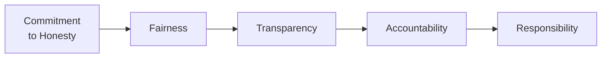
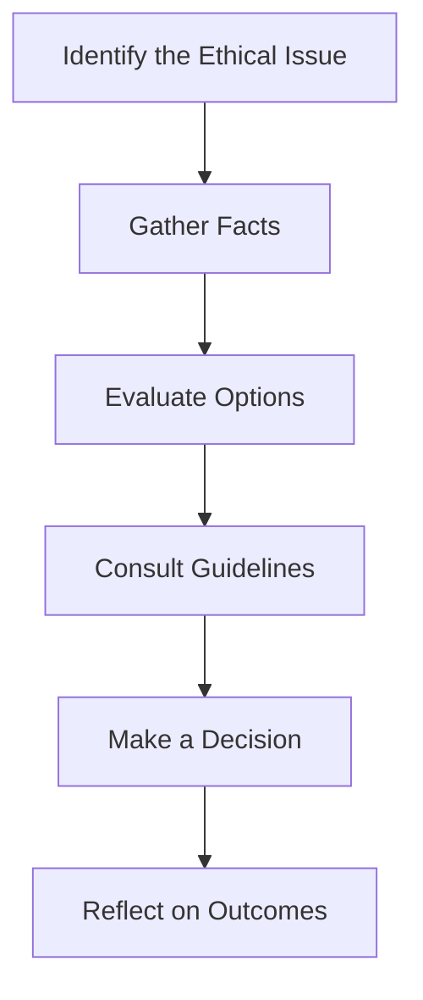

## 2.1 Overview of Ethics

It’s funny how sometimes we talk about ethics as though it’s some abstract, lofty concept when, in reality, it’s the moral wiring that helps us navigate daily decisions—especially when nobody’s looking or when the law seems unclear. In the financial industry, ethics is more than a nice idea. It’s a crucial cornerstone of trust, stability, and long-term success. Let’s face it: If clients can’t trust their financial professionals, entire markets can unravel. So, whether you’re just starting out or you’ve been in the game for years, understanding ethics isn’t just a “nice to have”—it’s an absolute essential.

Below, we’ll dive into what ethics is all about, why it matters, and even share some personal anecdotes (well, sort of “personal,” as these experiences are widely shared by professionals) to make these concepts feel a little more real. We’ll also explore the regulatory expectations, particularly in the Canadian landscape, and how the Canadian Investment Regulatory Organization (CIRO) sets standards for ethical behavior in our industry. Let’s get started.

## What Do We Mean by Ethics in Finance?

At its simplest, ethics is all about guiding principles and standards of behavior, especially in those fuzzy situations where laws or regulations aren’t super clear. Sure, there are plenty of black-and-white legal rules. But ethics fills the gap when the law falls silent.

In finance, ethical behavior has a direct bearing on how clients, regulators, and the public view the industry. If you’ve followed any big financial scandals in the past few decades, you probably noticed that many fiascos weren’t necessarily about people breaking explicit laws right away. Often, they started with small, ethically questionable decisions that spiraled into bigger and bigger problems. That’s why, in this industry, ethics is often our primary line of defense, ensuring we approach our responsibilities with honesty, fairness, transparency, accountability, and responsibility.

## Why Ethical Conduct Is Vital

• Maintaining Public Trust: Trust is everything in finance. If clients think their advisors are dishonest, or if the public believes dealers or firms are manipulative or reckless, confidence plummets. And without confidence, the financial system simply can’t operate smoothly.

• Protecting Investor Interests: Ethical standards ensure that client interests remain front and center. Whether it’s disclosing a fee structure in plain language or recommending products that align with a client’s risk tolerance, an ethical approach puts the client’s needs first.

• Market Integrity: Fair and honest behavior maintains efficient markets. Investors are more likely to participate if they believe markets are transparent and free from manipulative practices.

• Regulatory Compliance: While ethics and legal regulations aren’t identical, they often overlap. Following a strong ethical compass usually keeps you in line with rules issued by organizations like CIRO. And if you’re building something that’s truly ethical, it’s far less likely you’ll be at odds with regulatory requirements.

• Long-Term Sustainability: Ethical firms and professionals are more stable over the long haul. Those who repeatedly dodge ethical considerations tend to face scandals, massive fines, or even criminal charges—a sure recipe for business collapse.

## Principles that Shape Ethical Conduct

It’s one thing to proclaim “be ethical,” but it’s quite another to figure out how to do it in the real world. Most ethics codes boil down to a handful of core values:

- Honesty  
- Fairness  
- Transparency  
- Accountability  
- Responsibility  

Let’s visualize these principles as interlinked steps in a flow, illustrating how each principle supports the next:

In this diagram:  
• A["Commitment  to Honesty"] highlights the need for truthfulness in all representations, from marketing materials to client interactions.  
• B["Fairness"] underscores even-handed treatment of all clients and other market participants.  
• C["Transparency"] emphasizes clarity in disclosures, so clients aren’t left guessing about fees, risks, or conflicts of interest.  
• D["Accountability"] keeps professionals and firms answerable for the outcomes of their decisions and actions.  
• E["Responsibility"] reminds everyone that we have a duty not just to our own bottom line but also to clients, the broader market, and societal well-being.

## Real-World Example: Handling a Conflict of Interest

Imagine you’re a new registered representative at a firm. A product issuer offers you a very attractive commission if you recommend their product. However, you realize that the product might not be the best fit for certain clients. Now, there’s no direct law that says “You can never sell a product with a nicer commission structure,” but your ethical compass (and your professional standards) tells you that you should act in the client’s best interest, not your wallet’s. So how do you proceed?

• You evaluate the product thoroughly—its risks, costs, and suitability for each client.  
• You disclose the commission structure to clients, ensuring they understand how you’re compensated.  
• You recommend the product only to those clients for whom it fits their objectives, risk tolerance, and overall financial plan.

By handling the situation transparently and responsibly, you nurture trust. Even if you lose a quick sale in the short term, you build long-term credibility.

## Historical Context: From MFDA and IIROC to CIRO

Historically, Canada had two main self-regulatory bodies: the Mutual Fund Dealers Association of Canada (MFDA) and the Investment Industry Regulatory Organization of Canada (IIROC). As of January 1, 2023, they amalgamated to form the new Canadian Investment Regulatory Organization (CIRO). Now, CIRO is the single self-regulatory body overseeing investment dealers and mutual fund dealers across the nation. This amalgamation simplified the regulatory environment and reinforced a consistent set of ethical and conduct standards for all industry participants.  

If you come across references to “MFDA” or “IIROC,” remember these are historical references. They no longer exist as separate entities today (2025). CIRO oversees everything from registration requirements to the enforcement of conduct rules—always with a strong emphasis on ethics. 

## The Relationship Between Ethics and Regulation

Sometimes, people get confused about the difference between following ethical standards and simply obeying the law. Law sets the minimum required behavior; ethics sets a higher, aspirational standard. If a certain course of action is legal but questionable from an ethical standpoint, you might still face repercussions—like losing client trust.

In the financial industry, regulations and ethics often overlap. For instance, a regulation might require you to disclose potential conflicts of interest in a New Account Application Form (NAAF). An ethical approach goes further by proactively discussing how that conflict could impact the client and offering alternative products that might serve them better.

## Ethical Decision-Making Beyond the Law

Here’s a personal story. Well, “personal” in the sense that it’s common among financial professionals. Early in my career, I sometimes found it tempting to hold back certain negative details about a product I felt obliged to push. Nothing illegal in that. But I realized that in the long run, honesty pays dividends (no pun intended!). Clients valued my forthrightness, and I got more referrals—way better than skimming over the negative details to rush a quick sale. That’s the essence of ethics in action: it may not always be the easiest path, but it’s almost always the path that builds respect and trust.

## Codified Ethics in the Financial Industry

Most professional associations and regulatory bodies have codes of conduct that codify ethical expectations beyond what the legal framework mandates. Examples include:

• CIRO Rules and guidance  
• CFA Institute Code of Ethics and Standards of Professional Conduct  
• Organizational policies unique to each firm  

These codes typically highlight the same themes: always act in the client’s best interest, maintain professional competence, respect confidentiality, and avoid or disclose conflicts of interest. If you ever find yourself in an ethical gray area, referencing an established code of ethics can be super helpful.

## Ethical Training and Ongoing Development

We all know humans can forget or lose sight of things in the hustle of daily life, right? That’s why continuous ethics training is key. Having an annual refresher or mandatory ethics courses ensures you stay updated on evolving standards. Rules do change. Society changes. And so do the expectations of clients and regulators.

In Canada, CIRO encourages (and in some contexts, requires) ongoing professional development in ethics. On a global scale, organizations like the CFA Institute and other professional bodies offer courses that keep you on top of ethical best practices. For instance:

• “Ethical Decision-Making for Investment Professionals” by CFA Institute  
• Local workshops hosted by your firm or provincial securities commissions  

These resources often include interactive case studies, which can be eye-opening. Sometimes, those hypothetical examples can feel uncomfortably close to real situations you’ve seen or might soon face.

## Accountability and Responsibility: Being Answerable for Your Actions

No matter how well-designed your firm’s compliance program is, ethics starts with the individual. Accountability means not just owning up when something goes wrong but also having the mindset that your decisions ripple through the firm, your clients, and the broader market. This sense of responsibility typically involves:

• Properly documenting trades and client conversations  
• Reporting any suspicious or illegal activity  
• Communicating promptly and honestly with clients about significant changes in their investments  

One major example is the anti-money laundering (AML) and anti-terrorist financing regulations covered in Chapter 3 of this book. Ethics compels us to speak up if we notice irregularities—even if it means inconveniencing a big client. Ethical action might feel uncomfortable at first, but accountability is what keeps markets clean and participants safe.

## Consequences of Ethical Breaches

If you’re thinking, “Well, as long as I’m not breaking the law, I’m fine,” think again. Ethical breaches can cost you big time:

• Regulatory Sanctions: CIRO can suspend or revoke your registration.  
• Fines and Legal Liabilities: You could face penalties that dwarf any commissions you might have earned unethically.  
• Reputational Damage: In finance, trust is currency. Once you lose it, it’s incredibly hard to earn back.  
• Client Loss: When clients feel betrayed, they walk away. And they usually tell their friends—or the press.  

No professional wakes up hoping to be part of a regulatory hearing or a mainstream headline about financial wrongdoing. Yet many who end up there often started with smaller ethical lapses that built up over time.

## How Ethics Fosters a Sustainable Financial System

The financial industry thrives on reliability and predictability. After all, we’re dealing with people’s life savings, their retirement dreams, or even corporate capital that funds innovation. When professionals collectively uphold high ethical standards:

• Investors have confidence to invest  
• Firms can focus on true value creation rather than damage control  
• Markets function more smoothly  
• Society benefits from a more stable economy  

Call me overly optimistic, but I believe a strong ethical culture is a big reason many financial institutions have thrived for decades (or even centuries). Sure, there’s always been wrongdoing, but the institutions that prioritize ethics tend to bounce back more robustly and maintain enduring client relationships.

## Building a Culture of Ethics

Creating an ethical culture within an organization starts at the top but is reinforced by everyone. Senior leadership sets the tone—if they consistently demonstrate ethical conduct, it trickles down through the ranks.

• Clear Policies: Written guidelines on acceptable behaviors and reporting mechanisms.  
• Open Communication: Employees should feel safe raising concerns without fear of retaliation.  
• Positive Reinforcement: Recognize and reward ethical behavior, not just big sales numbers.  

In simpler terms: organizations that celebrate honest mistakes and swiftly address fraudulent activities make it clear they take ethics seriously. 

## Ongoing Evolution of Ethical Standards

Ethical standards do not remain static. What’s considered acceptable today might be frowned upon tomorrow as societal values shift and new technologies appear, creating fresh dilemmas. For instance, with the rise of fintech, issues like data privacy, cybersecurity (see Chapter 4), and algorithmic discrimination can come into play. Staying alert to cultural and technological shifts will help you navigate these emerging challenges ethically.

## Best Practices for Ethical Decision-Making

• Gather All Relevant Facts: Never assume you have all the info. Investigate thoroughly.  
• Weigh Stakeholder Interests: Who’s affected by your decision? Clients, shareholders, employees, the general public?  
• Consult Your Firm’s Code: Good guidance is often baked into your company’s policies or professional association’s standards.  
• Seek Advice: Talk to peers, mentors, or your compliance department if you’re unsure.  
• Reflect on Long-Term Consequences: A short-term workaround might lead to bigger headaches down the line.  
• Document Your Process: Especially if it’s a tricky case. This helps you review your decision and show regulators you proceeded in good faith.  

## Simple Decision Framework

One tool that many professionals find handy is a short, simple flow:

Following this framework can help you slow down and think carefully before choosing a path of action. Even a brief pause to reflect can prevent impulsive decisions you’ll regret later.

## Future Outlook: The Ever-Growing Importance of Ethics

It used to be that ethics was an afterthought—something you’d mention in passing during new hire orientation. But, oh boy, times have changed. Rapid globalization, evolving investor expectations, and the rise of powerful new technologies mean the industry’s ethical landscape is more complex and challenging than ever. And guess what? That is precisely why ethics is so crucial. A well-grounded ethical framework isn’t just about avoiding trouble; it’s about seizing opportunities to build genuine relationships in an era where trust can be fleeting.

## Glossary

• **Ethics:** Principles and standards that guide behavior and decision-making, particularly in situations where laws or regulations may not provide clear guidance.  
• **Integrity:** Adherence to moral and ethical principles, demonstrating honesty and fairness in professional conduct.  
• **Transparency:** Openness and clarity in communication, disclosure, and decision-making processes.  
• **Accountability:** Taking responsibility for one’s actions and decisions, including accepting consequences and addressing issues proactively.  
• **Conflict of Interest:** A situation where personal or organizational interests may interfere with professional judgment or responsibilities.

## References and Resources

• Canadian Investment Regulatory Organization (CIRO) Rules and Regulations:  
  [CIRO Official Website](https://www.ciro.ca)  

• CFA Institute Code of Ethics and Standards of Professional Conduct:  
  [CFA Institute Ethics](https://www.cfainstitute.org/en/ethics-standards)  

• Boatright, John R. “Ethics in Finance.” Wiley, latest edition.  

• Online Course: “Ethical Decision-Making for Investment Professionals” by the CFA Institute:  
  [Course Link](https://www.cfainstitute.org/en/programs/professional-learning/ethics)  

Remember, ethics isn’t just a bunch of theoretical bullet points: it’s genuinely the backbone of professional integrity and client trust. Let’s keep that spirit of openness, honesty, and steadfastness at the heart of all we do.

---

## Test Your Ethical Knowledge: Finance and Integrity Skills Quiz



### In the financial industry, why is it imperative to maintain strong ethical standards in addition to complying with laws?

- [x] Because laws may not cover every scenario where ethical considerations are important.
- [ ] Because ethics has more severe penalties than the law.
- [ ] Because regulators will punish minor oversights harshly.
- [ ] Because clients expect illegal conduct to occur.

> **Explanation:** Ethical considerations often go beyond legal requirements, ensuring trust, transparency, and a client-first approach even where laws may be silent or ambiguous.

### Which principle is MOST closely associated with disclosing information in clear and understandable language?

- [ ] Integrity
- [ ] Fairness
- [x] Transparency
- [ ] Accountability

> **Explanation:** Transparency is all about openness and clarity in communication, making sure stakeholders understand what’s going on without hidden agendas.

### A financial professional encounters a product that yields high commissions but is only marginally suitable for most clients. Which ethical consideration takes precedence?

- [x] Acting in the client’s best interest
- [ ] Maximizing personal gain
- [ ] Avoiding all new products to stay safe
- [ ] Delegating the decision to a colleague

> **Explanation:** Ethical behavior dictates that financial professionals should prioritize their clients’ interests over personal financial incentives.

### If a professional sees a potential conflict of interest in recommending a specific product, the best course of action is to:

- [x] Disclose the conflict and discuss its implications with the client
- [ ] Hide the conflict to not disrupt a sale  
- [ ] Dismiss the conflict as irrelevant  
- [ ] Automatically recommend a competitor’s product

> **Explanation:** Fair disclosure and an explanation of how the conflict might affect the client is vital to maintaining honesty and trust.

### All of the following are potential consequences of ethical breaches EXCEPT:

- [x] Observing increased market confidence
- [ ] Damage to professional reputation
- [x] Facing regulatory sanctions
- [x] Loss of client trust

> **Explanation:** Ethical breaches reduce market confidence rather than increase it, and they can also lead to sanctions, reputational harm, and client defection.

### Ethical decision-making involves carefully evaluating the interests of:

- [x] Clients, the firm, and potentially the broader market
- [ ] Only the firm’s profit margins
- [ ] Solely the compliance department
- [ ] Just the most vocal clients

> **Explanation:** Responsible professionals weigh how their decisions affect clients, their firms, and the broader financial system.

### Which of the following BEST describes the difference between ethics and the law?

- [ ] They are essentially identical in the financial industry
- [x] Law sets a minimum standard, while ethics aspires to higher ideals
- [ ] Ethics is optional, whereas laws are mandatory
- [ ] Ethics applies only to upper management

> **Explanation:** While legal requirements form the baseline, ethical standards often demand a greater degree of fairness and transparency.

### In Canada, the new self-regulatory organization overseeing both investment dealers and mutual fund dealers is:

- [x] CIRO
- [ ] MFDA
- [ ] IIROC
- [ ] CIPF

> **Explanation:** Effective January 1, 2023, the MFDA and IIROC amalgamated into the Canadian Investment Regulatory Organization (CIRO). MFDA and IIROC no longer exist as separate entities.

### What is the main benefit of having formal codes of ethics in the financial industry?

- [x] They provide clear guidance for behavior when the law does not.
- [ ] They guarantee no wrongdoing will ever occur.
- [ ] They replace all legal requirements.
- [ ] They focus primarily on marketing practices.

> **Explanation:** Codes of ethics guide professionals in situations where regulations might be silent, ensuring decisions that build trust and uphold integrity.

### Ethics training in the financial industry is important mainly because:

- [x] Standards evolve, and professionals must remain informed
- [ ] It’s required only once at the beginning of a career
- [ ] Regulators use it to avoid teaching soft skills
- [ ] It’s optional and has no real impact on professional practice

> **Explanation:** As markets, technologies, and societal expectations change, continuous ethics training ensures financial professionals stay updated on evolving standards.


