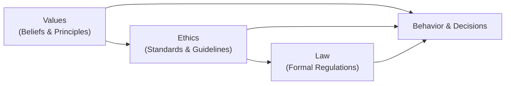

## 2.2 The Relationships Between Values, Ethics, and the Law

When you’re navigating the world of financial services, especially here in Canada, you’ve got three distinct but interconnected factors guiding your professional conduct: (1) your personal and organizational values, (2) ethics that turn those values into actionable choices, and (3) the law, which sets enforceable standards for everyone. Now, that might sound a bit abstract, so let’s break it down in a (somewhat) informal way.

Sometimes, I think back to when I was a brand-new Registered Representative, feeling overwhelmed by the difference between “doing the right thing” and just “doing things right.” Laws and regulations made sense—if you break a rule, you face penalties. Ethics? Uh, that felt a bit fuzzier—like it might hinge on personal beliefs. And values? Well, those were the beliefs we’d each bring to work, formed from our upbringing, culture, personal experiences, and so on. But it didn’t take long to realize how powerfully they all blend together when we handle real client money and real client dreams.

Below we’ll explore the interplay between values, ethics, and the law, with a few practical examples and a diagram or two. We’ll also mention best practices, challenges, and how you can address sticky gray areas in your day-to-day financial work.

---

### Core Definitions and Why They Matter

Before diving into the relationships, let’s clarify a few definitions to ensure consistency with the rest of your Conduct and Practices Handbook Course (CPH®):

• Values: These are your fundamental beliefs. They might include honesty, respect, privacy, responsibility, and fairness. Organizations also have values, often published as “vision and mission statements” or “brand promises.”

• Ethics: This is how you put values into action. Ethics involves guidelines or standards you follow to ensure that your decisions match your beliefs. Within the context of financial services, ethics involves fairness in client dealings, transparency in communications, and so on.

• Law: These are formal, codified rules from government or recognized regulatory bodies—like the Canadian Investment Regulatory Organization (CIRO) in today’s environment. Laws prescribe minimum standards and carry legal consequences if you violate them.

• Compliance: This entails adhering to these laws, regulations, and professional standards. If you deviate, there can be disciplinary action, financial penalties, or even a revocation of your registration.

• Ethical Judgment: This is that critical thinking process where you ask yourself, “Okay, the law says this is acceptable, but is it the ‘right’ thing to do?” It’s the ability to weigh conflicting factors (often in gray areas) and arrive at an ethical course of action.

---

### The Relationship in a Nutshell

It’s easy to assume that if you follow the law, you’re being ethical. But that’s not always true. Sometimes laws haven’t caught up with new technology or new market behaviors; sometimes they’re simply silent on certain scenarios. Meanwhile, ethics typically nudges us to do more than the bare minimum. Just because something is legal doesn’t mean it’s ethical.

And, well, we can also see the reverse. There could be situations where you’re trying to do something ethically admirable, but the law imposes constraints—maybe revealing certain client details is illegal or violates privacy regulations, no matter how helpful it might seem in a pinch. So we can’t ignore either side. We need both law and ethics, guided by our personal and organizational values, to ensure that we’re not just “ticking boxes” but truly safeguarding client interests and preserving market integrity.

The interplay between values, ethics, and the law can be visualized in a simple diagram:

In this diagram:  
• Values feed into ethics, shaping the principles we incorporate into codes of conduct.  
• Ethics influences how we interpret laws and regulations or fill gaps where no clear rules exist.  
• The law sets minimum standards and can override certain personal or organizational practices by making them enforceable or illegal if not met.  
• Ultimately, all three factors flow into our day-to-day actions, whether advising a client on an appropriate investment strategy or deciding how to handle a potential conflict of interest.

---

### Values: Foundational Beliefs That Guide Behavior

Our personal values often come from life experiences, mentors, education, and even culture. Organizations like CIRO (the Canadian Investment Regulatory Organization) or large investment dealers typically have a set of shared values—like protecting investor interests. For example:

• Integrity: “I do the right thing even if nobody’s looking.”  
• Accountability: “If I mess up, I’ll own it.”  
• Respect: “I’ll treat others the way I want to be treated.”

Financial professionals also have specific baseline values set out in codes of conduct. Historically, the Investment Industry Regulatory Organization of Canada (IIROC) and the Mutual Fund Dealers Association of Canada (MFDA) had separate, albeit similar, codes of conduct. Since their amalgamation into CIRO, we have a single, national self-regulatory body. The same fundamental values remain in place: protect the client, ensure fair markets, and uphold professional responsibility.

---

### Ethics: Translating Values into Action

It’s one thing to say, “I value honesty.” But how do you actually apply honesty in a financial advisory scenario?

Let’s say you’re working with a client who is about to make a rather large, high-risk purchase in a sector you personally find too volatile. The law might allow you to fulfill that order—if it’s a self-directed order and there are no other compliance flags. But your ethics might tell you, “I should really ensure they know about all the risks here and confirm that it fits their risk tolerance.” Ethically, you might go above the minimum requirement. You might advise them more thoroughly, even though it’s technically not required by any specific rule—because transparency and caring for your client’s financial well-being is your ethical standard.

Ethics can also help you navigate situations where the law is silent or brand-new technology (like cryptocurrency or advanced derivatives) is emerging. Maybe the national regulation is still in draft form. If your firm’s or your personal values prioritize consumer protection, you’d apply a stricter standard of disclosure or caution than what’s legally mandated—at least until the law catches up.

---

### The Law: Formal Regulations That Set Minimum Standards

In Canada, securities markets are regulated by provinces and territories—coordinated through the Canadian Securities Administrators (CSA). We also have CIRO overseeing investment dealers, mutual fund dealers, and trading activity on debt and equity marketplaces. The law generally spells out what you must do—register, maintain accurate records, disclose conflicts of interest, and protect the privacy of clients, among many other rules. 

Non-compliance can yield disciplinary measures—fines, suspensions, or even permanent bans from the industry. And if there’s criminal wrongdoing (like fraud or insider trading), you can also face serious criminal charges.

But here’s a key point: the law is typically limited to explicit rules that you can either comply with or break. Ethical behavior goes a step beyond, asserting that you should also act in ways that promote fairness, sustain trust, and protect stakeholders—even when the law doesn’t explicitly say so. In other words, the law is just the floor; it’s not the ceiling.

---

### Aligning Values, Ethics, and the Law in Practice

To see how all of these come together in real life, let’s imagine a scenario:

• You work at a mid-size brokerage firm. A large client wants to buy into a newly offered IPO. The corporate issuer isn’t breaking any laws, but you suspect the public disclosures are incomplete. Perhaps they’re borderline legal but quite confusing in practice.  

• From a purely legal standpoint, if the deal is approved by the securities regulator and the required prospectus is filed, you could technically proceed. 

• From an ethical standpoint—especially if your values emphasize honesty and due diligence—you might investigate the underlying fundamentals. You might raise some red flags internally, or at least share concerns with the client. You want to go beyond basic compliance because your values emphasize a duty of care that includes safeguarding clients from potential misrepresentations.

• Your decision could lead you to advise the client more conservatively than the legal minimum. Or your firm may choose to impose stricter due diligence steps than the law requires, simply because it’s “the right thing to do” from an ethical perspective.

Here, the law sets the baseline. The IPO meets all disclosure requirements, so legally it’s an acceptable investment. Ethics, however, drives you to provide more guidance—ensuring the client truly understands the product’s risks and the potential for a misrepresentation. In this way, your values (like honesty and client protection) inform an ethical approach that surpasses the law’s minimum.

---

### Common Pitfalls and Strategies to Overcome Them

1. **Over-Reliance on Legal Compliance**  
   Pitfall: Some professionals assume that if they’ve dotted every “i” and crossed every “t” in the compliance rulebook, they’re off the hook.  
   Strategy: Ask yourself if your client’s best interest is truly served. Reflect on whether your advice aligns with broader ethical obligations, not just legal ones.

2. **Conflict of Interest Blindness**  
   Pitfall: Conflicts of interest go unnoticed or are trivialized, like recommending financial products from a firm where you have personal ties, or ignoring known drawbacks because of potential bonuses.  
   Strategy: Formalize a conflict of interest policy. Disclose all relevant information to clients. If you can’t reasonably mitigate the conflict, recuse yourself or involve a neutral third party.

3. **Pressure from Superiors or Peers**  
   Pitfall: Workplace culture might push you to hit certain sales targets in ways that, while legal, might be ethically questionable.  
   Strategy: Document your process, escalate concerns to compliance officers, or consult a mentor. Remember that your professional integrity is vital—no short-term gain is worth sacrificing your principles, especially in an industry built on trust.

4. **Ambiguity in New Products or Technology**  
   Pitfall: Rapid changes in markets (like crypto assets) can leave professionals unsure, potentially leading to decisions that may be legal but ethically shaky.  
   Strategy: Seek clarity from regulators (CSA or CIRO updates). If guidelines aren’t there yet, rely on fundamental ethical principles: diligence, transparency, and client protection.

---

### The Role of Ethical Judgment 

You might ask, “So how do I decide what’s right when I’m stuck between a rule that says ‘Yes’ and my conscience that says ‘Wait, maybe not’?” That’s where ethical judgment comes in. It’s essentially a decision-making framework, guided by your values, your industry’s code of ethics, and the law.

• **Identify the Issue:** Is there a conflict of interest, a questionable disclosure, or a potential unfair advantage to you or your firm?  
• **Evaluate Stakeholder Impact:** Who could be hurt? The client, the market, your colleagues, or even your firm’s reputation?  
• **Review Legal Requirements and Industry Standards:** Are there existing rules or guidelines (CIRO notices, provincial securities regulations, or recognized best practices) that address this scenario?  
• **Consult an Ethical Reference Point:** This could be a written code of ethics, guidance from a mentor, or your own personal values.  
• **Make a Decision:** If the law is silent, abide by the principle that fosters client well-being and market integrity. Provide extra disclosure, reduce possible harms, or—even better—both.  
• **Document and Reflect:** Keep notes on your process if possible, so you (and your firm) can learn from it.

In short, ethical judgment isn’t automatic. It requires active, ongoing effort, a bit of humility, and sometimes a willingness to ask for help.

---

### Real-World Example: Managing a Vulnerable Client Situation

Imagine you have a client in their late 70s who has become forgetful, repeating instructions or mixing up investment goals. The law states that as their Registered Representative, you need to follow their instructions, provided they’re legally competent. But your ethics might kick in—this client may be cognitively declining, and they might not fully understand the long-term impact of certain riskier trades.

In such a scenario:  
• Legally, you might accept the order if they meet basic capacity criteria.  
• Ethically, you might slow down the process, involve a trusted contact person (if the client has one on record), document your concerns, and consider a protective route that ensures they’re not exploiting themselves through misunderstanding.  
• Values push you to treat your client with respect and compassion, not just as a source of commissions or fees.

Eventually, your firm’s policies—often shaped by ethical standards—could provide guidance on how to proceed. The law won’t always detail the “how,” but your ethical stance will lead you to do more than the bare minimum.

---

### Continuous Evolution: Ethical and Legal Developments

Something to keep in mind is that values and ethics can evolve over time, just as the law does. Look at how quickly regulators had to adapt to complex derivatives, cryptocurrency, integrated financial planning, and cross-border digital trading platforms. Ethical guidelines also shift as society’s expectations change—like the growing emphasis on Environmental, Social, and Governance (ESG) factors in investing.

To remain on top of things:  
• Stay current with CIRO notices, CSA bulletins, and any provincial or territorial securities regulatory updates.  
• Regularly attend ethics workshops or webinars.  
• Engage in discussions with peers and mentors to keep refining your ethical judgment.  
• Reflect on your personal values and any tension points you encounter in daily practice.

---

### Conclusion

Values, ethics, and the law form an interconnected structure that guides the conduct of financial professionals in Canada. Values supply the heart and soul of professional behavior, ethics turns that into tangible standards, and the law underpins it all with enforceable regulations. By understanding this synergy, you’re better equipped to navigate the complexities of modern financial markets and represent your clients’ best interests.

Even if you’re “just” obeying the law, that’s not enough to guarantee true professionalism and public trust. Ethical considerations typically go beyond the legal minimum and ensure that client welfare, market fairness, and societal well-being remain at the center of what you do. After all, in an industry rooted in trust, your integrity is as important as the balance sheets you manage.

---

### Best Practices & Key Takeaways

• Use the law as your baseline, not your end goal.  
• Let core values (honesty, integrity, respect) guide your interpretation and application of rules.  
• Remember that ethical judgments often exceed minimum compliance thresholds.  
• Keep an open dialogue with colleagues, compliance officers, and mentors about challenging or gray-area cases.  
• Document your decision-making processes for accountability and continuous learning.  
• Periodically revisit your ethics training and stay informed about regulatory developments.

---

### References and Resources

• [Canadian Securities Administrators (CSA) Official Website](https://www.securities-administrators.ca)  
• Book: “Business Ethics: Decision Making for Personal Integrity & Social Responsibility” by Laura Hartman, Joseph DesJardins, and Chris MacDonald  
• Online Course: [“Business Ethics and Corporate Social Responsibility” by Coursera](https://www.coursera.org/learn/business-ethics)

---

## Quiz: Values, Ethics, and the Law in Canadian Financial Services



### Which statement best describes the relationship among values, ethics, and the law?

- [x] Values shape ethics, and ethics often go beyond legal requirements.
- [ ] The law always covers all ethical considerations.  
- [ ] Ethics completely replaces the need for legal rules.  
- [ ] Values are unrelated to ethics and legal compliance.

> **Explanation:** Values serve as the foundation for our behavior, ethics provide a framework to put those values into action, and the law stipulates the minimum required standard. Ethics often exceeds the legal baseline.

### Which of the following is an example of ethical behavior exceeding legal requirements?

- [x] Conducting a deeper risk disclosure for a new product, even if the law has no specific regulations for it.  
- [ ] Fully adhering to existing Know-Your-Client (KYC) rules.  
- [ ] Registering with the appropriate provincial securities regulator.  
- [ ] Fulfilling all margin requirements set by CIRO.

> **Explanation:** Providing extra risk disclosure, especially when the law does not explicitly require it, is a clear case of your ethics going above and beyond.

### According to the text, why might simply following the law not guarantee ethical conduct?

- [x] The law may be silent on certain emerging issues, requiring ethical judgment.  
- [ ] Laws always prescribe the highest ethical standards.  
- [ ] Ethical standards are typically lower than legal requirements.  
- [ ] Laws and ethics are unrelated concepts.

> **Explanation:** There are times when laws are silent or insufficient, so using ethical judgment is crucial to uphold fairness, transparency, and integrity.

### How does the concept of “ethical judgment” help financial professionals?

- [x] It provides a way to evaluate situations that are not fully addressed by the law.  
- [ ] It replaces the need for legal advisers.  
- [ ] It always reduces regulatory requirements.  
- [ ] It is only relevant if you breach the law.

> **Explanation:** Ethical judgment helps navigate gray areas or complex scenarios not explicitly covered by regulations.

### Which of the following describes a situation where a professional might go beyond mere legal compliance?

- [x] Warning a client about high-volatility risks not yet regulated by law.  
- [ ] Filing only the mandated forms to open a new client account.  
- [x] Providing extra oversight for a vulnerable client even though capacity determinations have been legally met.  
- [ ] Submitting tax forms by the required deadline.

> **Explanation:** Both warning clients about emerging risks and offering enhanced protections to a potentially vulnerable client demonstrate ethical behavior beyond basic legal obligations.

### What is one key advantage of aligning personal values with professional ethics?

- [x] It helps ensure consistent decision-making that supports client well-being.  
- [ ] It automatically eliminates all conflicts of interest.  
- [ ] It replaces the need for regulatory compliance.  
- [ ] It is required by every provincial securities commission.

> **Explanation:** When personal values align with professional ethics, decisions tend to be more consistent and in the best interests of clients and stakeholders.

### Which of these examples showcases “compliance” but not necessarily “ethical behavior”?

- [x] Filing all required forms but failing to disclose a personal conflict of interest that is legally not mandated yet.  
- [ ] Assisting a client in understanding the risks of a highly complex product.  
- [x] Meeting the letter of the law but ignoring the spirit of recommended best practices.  
- [ ] Seeking advice from compliance officers when uncertain about a new regulation.

> **Explanation:** One can adhere to minimal legal standards yet fall short of higher ethical obligations, such as disclosing potential conflicts of interest or following recommended best practices.

### Why is it important for financial professionals to remain adaptable in their ethical standards?

- [x] Markets and regulations evolve over time, requiring continuous learning and ethical adaptation.  
- [ ] Once learned, ethics rarely change, so adaptability is unimportant.  
- [ ] Laws remain static, so adaptability has no value.  
- [ ] Most ethical principles are seasonal and unregulated.

> **Explanation:** As markets, technologies, and societal expectations shift, professionals must continuously refine their ethical standards to remain relevant and fair.

### What best describes how ethics fills gaps where the law is silent?

- [x] Ethics provides guidance for decision-making even when no specific legal rule applies.  
- [ ] Ethics mandates that all laws are irrelevant.  
- [ ] The law must always be ignored if ethics provides alternative instructions.  
- [ ] There are no gaps in the law that ethics can fill.

> **Explanation:** Ethics steps in to offer a moral compass when the law doesn’t explicitly address an issue—ensuring decisions align with broader principles like fairness and integrity.

### True or False: Values, ethics, and the law are interconnected such that adhering to all legal requirements automatically guarantees you are being fully ethical in your professional conduct.

- [x] True  
- [ ] False

> **Explanation:** It is true they are interconnected, but keep in mind: meeting legal requirements alone doesn’t necessarily guarantee complete ethical compliance. Ethics typically goes further in protecting clients and ensuring trust.


